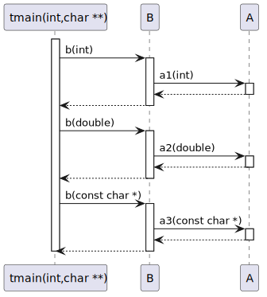
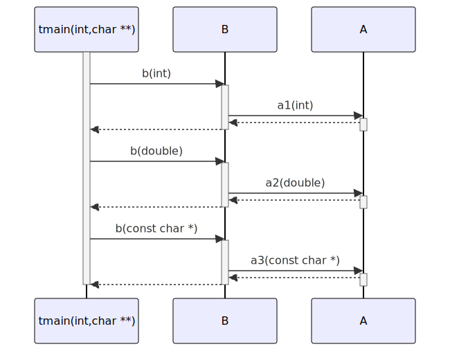

# t20013 - Function and method arguments in sequence diagrams test case
## Config
```yaml
diagrams:
  t20013_sequence:
    type: sequence
    glob:
      - t20013.cc
    include:
      namespaces:
        - clanguml::t20013
    using_namespace: clanguml::t20013
    from:
      - function: "clanguml::t20013::tmain(int,char **)"
```
## Source code
File `tests/t20013/t20013.cc`
```cpp
namespace clanguml {
namespace t20013 {

struct A {
    int a1(int i) { return i; }
    double a2(double d) { return d; }
    const char *a3(const char *s) { return s; }
};

struct B {
    int b(int i) { return a.a1(i); }
    double b(double d) { return a.a2(d); }
    const char *b(const char *s) { return a.a3(s); }

    A a;
};

void tmain(int argc, char **argv)
{
    B b;

    b.b(1);
    b.b(2.0);
    b.b("three");
}
}
}
```
## Generated PlantUML diagrams

## Generated Mermaid diagrams

## Generated JSON models
```json
{
  "diagram_type": "sequence",
  "name": "t20013_sequence",
  "participants": [
    {
      "display_name": "tmain(int,char **)",
      "full_name": "clanguml::t20013::tmain(int,char **)",
      "id": "4178748481553335618",
      "name": "tmain",
      "namespace": "clanguml::t20013",
      "source_location": {
        "column": 6,
        "file": "t20013.cc",
        "line": 18,
        "translation_unit": "t20013.cc"
      },
      "type": "function"
    },
    {
      "activities": [
        {
          "display_name": "b(int)",
          "full_name": "clanguml::t20013::B::b(int)",
          "id": "9018715398573620229",
          "name": "b",
          "namespace": "clanguml::t20013",
          "source_location": {
            "column": 9,
            "file": "t20013.cc",
            "line": 11,
            "translation_unit": "t20013.cc"
          },
          "type": "method"
        },
        {
          "display_name": "b(double)",
          "full_name": "clanguml::t20013::B::b(double)",
          "id": "1434738279215912735",
          "name": "b",
          "namespace": "clanguml::t20013",
          "source_location": {
            "column": 12,
            "file": "t20013.cc",
            "line": 12,
            "translation_unit": "t20013.cc"
          },
          "type": "method"
        },
        {
          "display_name": "b(const char *)",
          "full_name": "clanguml::t20013::B::b(const char *)",
          "id": "2447265854361794121",
          "name": "b",
          "namespace": "clanguml::t20013",
          "source_location": {
            "column": 17,
            "file": "t20013.cc",
            "line": 13,
            "translation_unit": "t20013.cc"
          },
          "type": "method"
        }
      ],
      "display_name": "B",
      "full_name": "clanguml::t20013::B",
      "id": "17492936139248271057",
      "name": "B",
      "namespace": "clanguml::t20013",
      "source_location": {
        "column": 8,
        "file": "t20013.cc",
        "line": 10,
        "translation_unit": "t20013.cc"
      },
      "type": "class"
    },
    {
      "activities": [
        {
          "display_name": "a1(int)",
          "full_name": "clanguml::t20013::A::a1(int)",
          "id": "11440740565671458040",
          "name": "a1",
          "namespace": "clanguml::t20013",
          "source_location": {
            "column": 9,
            "file": "t20013.cc",
            "line": 5,
            "translation_unit": "t20013.cc"
          },
          "type": "method"
        },
        {
          "display_name": "a2(double)",
          "full_name": "clanguml::t20013::A::a2(double)",
          "id": "12793853731519212831",
          "name": "a2",
          "namespace": "clanguml::t20013",
          "source_location": {
            "column": 12,
            "file": "t20013.cc",
            "line": 6,
            "translation_unit": "t20013.cc"
          },
          "type": "method"
        },
        {
          "display_name": "a3(const char *)",
          "full_name": "clanguml::t20013::A::a3(const char *)",
          "id": "7553679364904894366",
          "name": "a3",
          "namespace": "clanguml::t20013",
          "source_location": {
            "column": 17,
            "file": "t20013.cc",
            "line": 7,
            "translation_unit": "t20013.cc"
          },
          "type": "method"
        }
      ],
      "display_name": "A",
      "full_name": "clanguml::t20013::A",
      "id": "10936296246357791705",
      "name": "A",
      "namespace": "clanguml::t20013",
      "source_location": {
        "column": 8,
        "file": "t20013.cc",
        "line": 4,
        "translation_unit": "t20013.cc"
      },
      "type": "class"
    }
  ],
  "sequences": [
    {
      "from": {
        "id": "4178748481553335618",
        "location": "clanguml::t20013::tmain(int,char **)"
      },
      "messages": [
        {
          "from": {
            "activity_id": "4178748481553335618",
            "participant_id": "4178748481553335618"
          },
          "name": "b(int)",
          "return_type": "int",
          "scope": "normal",
          "source_location": {
            "column": 5,
            "file": "t20013.cc",
            "line": 22,
            "translation_unit": "t20013.cc"
          },
          "to": {
            "activity_id": "9018715398573620229",
            "participant_id": "17492936139248271057"
          },
          "type": "message"
        },
        {
          "from": {
            "activity_id": "9018715398573620229",
            "participant_id": "17492936139248271057"
          },
          "name": "a1(int)",
          "return_type": "int",
          "scope": "normal",
          "source_location": {
            "column": 27,
            "file": "t20013.cc",
            "line": 11,
            "translation_unit": "t20013.cc"
          },
          "to": {
            "activity_id": "11440740565671458040",
            "participant_id": "10936296246357791705"
          },
          "type": "message"
        },
        {
          "from": {
            "activity_id": "11440740565671458040",
            "participant_id": "10936296246357791705"
          },
          "name": "",
          "return_type": "int",
          "scope": "normal",
          "source_location": {
            "column": 21,
            "file": "t20013.cc",
            "line": 5,
            "translation_unit": "t20013.cc"
          },
          "to": {
            "activity_id": "9018715398573620229",
            "participant_id": "17492936139248271057"
          },
          "type": "return"
        },
        {
          "from": {
            "activity_id": "9018715398573620229",
            "participant_id": "17492936139248271057"
          },
          "name": "",
          "return_type": "int",
          "scope": "normal",
          "source_location": {
            "column": 20,
            "file": "t20013.cc",
            "line": 11,
            "translation_unit": "t20013.cc"
          },
          "to": {
            "activity_id": "4178748481553335618",
            "participant_id": "4178748481553335618"
          },
          "type": "return"
        },
        {
          "from": {
            "activity_id": "4178748481553335618",
            "participant_id": "4178748481553335618"
          },
          "name": "b(double)",
          "return_type": "double",
          "scope": "normal",
          "source_location": {
            "column": 5,
            "file": "t20013.cc",
            "line": 23,
            "translation_unit": "t20013.cc"
          },
          "to": {
            "activity_id": "1434738279215912735",
            "participant_id": "17492936139248271057"
          },
          "type": "message"
        },
        {
          "from": {
            "activity_id": "1434738279215912735",
            "participant_id": "17492936139248271057"
          },
          "name": "a2(double)",
          "return_type": "double",
          "scope": "normal",
          "source_location": {
            "column": 33,
            "file": "t20013.cc",
            "line": 12,
            "translation_unit": "t20013.cc"
          },
          "to": {
            "activity_id": "12793853731519212831",
            "participant_id": "10936296246357791705"
          },
          "type": "message"
        },
        {
          "from": {
            "activity_id": "12793853731519212831",
            "participant_id": "10936296246357791705"
          },
          "name": "",
          "return_type": "double",
          "scope": "normal",
          "source_location": {
            "column": 27,
            "file": "t20013.cc",
            "line": 6,
            "translation_unit": "t20013.cc"
          },
          "to": {
            "activity_id": "1434738279215912735",
            "participant_id": "17492936139248271057"
          },
          "type": "return"
        },
        {
          "from": {
            "activity_id": "1434738279215912735",
            "participant_id": "17492936139248271057"
          },
          "name": "",
          "return_type": "double",
          "scope": "normal",
          "source_location": {
            "column": 26,
            "file": "t20013.cc",
            "line": 12,
            "translation_unit": "t20013.cc"
          },
          "to": {
            "activity_id": "4178748481553335618",
            "participant_id": "4178748481553335618"
          },
          "type": "return"
        },
        {
          "from": {
            "activity_id": "4178748481553335618",
            "participant_id": "4178748481553335618"
          },
          "name": "b(const char *)",
          "return_type": "const char *",
          "scope": "normal",
          "source_location": {
            "column": 5,
            "file": "t20013.cc",
            "line": 24,
            "translation_unit": "t20013.cc"
          },
          "to": {
            "activity_id": "2447265854361794121",
            "participant_id": "17492936139248271057"
          },
          "type": "message"
        },
        {
          "from": {
            "activity_id": "2447265854361794121",
            "participant_id": "17492936139248271057"
          },
          "name": "a3(const char *)",
          "return_type": "const char *",
          "scope": "normal",
          "source_location": {
            "column": 43,
            "file": "t20013.cc",
            "line": 13,
            "translation_unit": "t20013.cc"
          },
          "to": {
            "activity_id": "7553679364904894366",
            "participant_id": "10936296246357791705"
          },
          "type": "message"
        },
        {
          "from": {
            "activity_id": "7553679364904894366",
            "participant_id": "10936296246357791705"
          },
          "name": "",
          "return_type": "const char *",
          "scope": "normal",
          "source_location": {
            "column": 37,
            "file": "t20013.cc",
            "line": 7,
            "translation_unit": "t20013.cc"
          },
          "to": {
            "activity_id": "2447265854361794121",
            "participant_id": "17492936139248271057"
          },
          "type": "return"
        },
        {
          "from": {
            "activity_id": "2447265854361794121",
            "participant_id": "17492936139248271057"
          },
          "name": "",
          "return_type": "const char *",
          "scope": "normal",
          "source_location": {
            "column": 36,
            "file": "t20013.cc",
            "line": 13,
            "translation_unit": "t20013.cc"
          },
          "to": {
            "activity_id": "4178748481553335618",
            "participant_id": "4178748481553335618"
          },
          "type": "return"
        }
      ]
    }
  ],
  "using_namespace": "clanguml::t20013"
}
```
## Generated GraphML models
