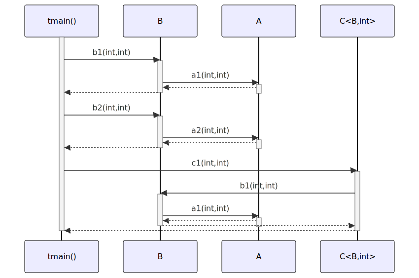

# t20014 - Multiple translation units sequence diagram test case
## Config
```yaml
diagrams:
  t20014_sequence:
    type: sequence
    glob:
      - t20014.cc
      - t20014_c.cc
      - t20014_b.cc
      - t20014_a.cc
    include:
      namespaces:
        - clanguml::t20014
    using_namespace: clanguml::t20014
    from:
      - function: "clanguml::t20014::tmain()"
```
## Source code
File `tests/t20014/t20014_a.cc`
```cpp
#include "include/t20014_a.h"
namespace clanguml {
namespace t20014 {

int A::a1(int i, int j) { return i + j; }

int A::a2(int i, int j) { return i - j; }

}
}
```
File `tests/t20014/t20014_b.cc`
```cpp
#include "include/t20014_b.h"
namespace clanguml {
namespace t20014 {

int B::b1(int i, int j) { return a_.a1(i, j); }

int B::b2(int i, int j) { return a_.a2(i, j); }

}
}
```
File `tests/t20014/t20014.cc`
```cpp
#include "include/t20014.h"
#include "include/t20014_b.h"
#include "include/t20014_c.h"

namespace clanguml {
namespace t20014 {

void log(const char *msg) { }

int tmain()
{
    B b;
    C<B, int> c;

    b.b1(0, 1);
    b.b2(1, 2);

    c.c1(2, 3);

    return 0;
}
}
}
```
File `tests/t20014/t20014_c.cc`
```cpp
#include "include/t20014_c.h"

namespace clanguml {
namespace t20014 {

}
}
```
File `tests/t20014/include/t20014.h`
```cpp
#pragma once

namespace clanguml {
namespace t20014 {

int tmain();

}
}
```
File `tests/t20014/include/t20014_b.h`
```cpp
#pragma once

#include "t20014_a.h"

namespace clanguml {
namespace t20014 {

struct B {
    int b1(int i, int);
    int b2(int i, int);

    A a_;
};

}
}
```
File `tests/t20014/include/t20014_c.h`
```cpp
#pragma once

namespace clanguml {
namespace t20014 {

template <typename T, typename F> struct C {
    F c1(F i, F j) { return c_.b1(i, j); }

    F c2(F i, F j) { return c_.b2(i, j); }

    T c_;
};

}
}
```
File `tests/t20014/include/t20014_a.h`
```cpp
#pragma once

namespace clanguml {
namespace t20014 {

struct A {
    int a1(int i, int j);
    int a2(int i, int j);
};

}
}
```
## Generated PlantUML diagrams

## Generated Mermaid diagrams

## Generated JSON models
```json
{
  "diagram_type": "sequence",
  "name": "t20014_sequence",
  "participants": [
    {
      "display_name": "tmain()",
      "full_name": "clanguml::t20014::tmain()",
      "id": "4099494646551370002",
      "name": "tmain",
      "namespace": "clanguml::t20014",
      "source_location": {
        "column": 5,
        "file": "t20014.cc",
        "line": 10,
        "translation_unit": "t20014.cc"
      },
      "type": "function"
    },
    {
      "activities": [
        {
          "display_name": "b1(int,int)",
          "full_name": "clanguml::t20014::B::b1(int,int)",
          "id": "10013068573692627454",
          "name": "b1",
          "namespace": "clanguml::t20014",
          "source_location": {
            "column": 9,
            "file": "include/t20014_b.h",
            "line": 9,
            "translation_unit": "t20014.cc"
          },
          "type": "method"
        },
        {
          "display_name": "b2(int,int)",
          "full_name": "clanguml::t20014::B::b2(int,int)",
          "id": "6142647733715039933",
          "name": "b2",
          "namespace": "clanguml::t20014",
          "source_location": {
            "column": 9,
            "file": "include/t20014_b.h",
            "line": 10,
            "translation_unit": "t20014.cc"
          },
          "type": "method"
        }
      ],
      "display_name": "B",
      "full_name": "clanguml::t20014::B",
      "id": "12301072610366943830",
      "name": "B",
      "namespace": "clanguml::t20014",
      "source_location": {
        "column": 8,
        "file": "include/t20014_b.h",
        "line": 8,
        "translation_unit": "t20014.cc"
      },
      "type": "class"
    },
    {
      "activities": [
        {
          "display_name": "a1(int,int)",
          "full_name": "clanguml::t20014::A::a1(int,int)",
          "id": "14029463584885676935",
          "name": "a1",
          "namespace": "clanguml::t20014",
          "source_location": {
            "column": 9,
            "file": "include/t20014_a.h",
            "line": 7,
            "translation_unit": "t20014.cc"
          },
          "type": "method"
        },
        {
          "display_name": "a2(int,int)",
          "full_name": "clanguml::t20014::A::a2(int,int)",
          "id": "15547896709391301559",
          "name": "a2",
          "namespace": "clanguml::t20014",
          "source_location": {
            "column": 9,
            "file": "include/t20014_a.h",
            "line": 8,
            "translation_unit": "t20014.cc"
          },
          "type": "method"
        }
      ],
      "display_name": "A",
      "full_name": "clanguml::t20014::A",
      "id": "12037651326050670722",
      "name": "A",
      "namespace": "clanguml::t20014",
      "source_location": {
        "column": 8,
        "file": "include/t20014_a.h",
        "line": 6,
        "translation_unit": "t20014.cc"
      },
      "type": "class"
    },
    {
      "activities": [
        {
          "display_name": "c1(int,int)",
          "full_name": "clanguml::t20014::C<clanguml::t20014::B,int>::c1(int,int)",
          "id": "3260472307220511850",
          "name": "c1",
          "namespace": "clanguml::t20014::C<clanguml::t20014",
          "source_location": {
            "column": 7,
            "file": "include/t20014_c.h",
            "line": 7,
            "translation_unit": "t20014.cc"
          },
          "type": "method"
        }
      ],
      "display_name": "C<B,int>",
      "full_name": "clanguml::t20014::C<clanguml::t20014::B,int>",
      "id": "4005698438856395483",
      "name": "C",
      "namespace": "clanguml::t20014",
      "source_location": {
        "column": 42,
        "file": "include/t20014_c.h",
        "line": 6,
        "translation_unit": "t20014.cc"
      },
      "type": "class"
    }
  ],
  "sequences": [
    {
      "messages": [
        {
          "from": {
            "activity_id": "4099494646551370002",
            "participant_id": "4099494646551370002"
          },
          "name": "b1(int,int)",
          "return_type": "int",
          "scope": "normal",
          "source_location": {
            "column": 5,
            "file": "t20014.cc",
            "line": 15,
            "translation_unit": "t20014.cc"
          },
          "to": {
            "activity_id": "10013068573692627454",
            "participant_id": "12301072610366943830"
          },
          "type": "message"
        },
        {
          "from": {
            "activity_id": "10013068573692627454",
            "participant_id": "12301072610366943830"
          },
          "name": "a1(int,int)",
          "return_type": "int",
          "scope": "normal",
          "source_location": {
            "column": 34,
            "file": "t20014_b.cc",
            "line": 5,
            "translation_unit": "t20014_b.cc"
          },
          "to": {
            "activity_id": "14029463584885676935",
            "participant_id": "12037651326050670722"
          },
          "type": "message"
        },
        {
          "from": {
            "activity_id": "4099494646551370002",
            "participant_id": "4099494646551370002"
          },
          "name": "b2(int,int)",
          "return_type": "int",
          "scope": "normal",
          "source_location": {
            "column": 5,
            "file": "t20014.cc",
            "line": 16,
            "translation_unit": "t20014.cc"
          },
          "to": {
            "activity_id": "6142647733715039933",
            "participant_id": "12301072610366943830"
          },
          "type": "message"
        },
        {
          "from": {
            "activity_id": "6142647733715039933",
            "participant_id": "12301072610366943830"
          },
          "name": "a2(int,int)",
          "return_type": "int",
          "scope": "normal",
          "source_location": {
            "column": 34,
            "file": "t20014_b.cc",
            "line": 7,
            "translation_unit": "t20014_b.cc"
          },
          "to": {
            "activity_id": "15547896709391301559",
            "participant_id": "12037651326050670722"
          },
          "type": "message"
        },
        {
          "from": {
            "activity_id": "4099494646551370002",
            "participant_id": "4099494646551370002"
          },
          "name": "c1(int,int)",
          "return_type": "int",
          "scope": "normal",
          "source_location": {
            "column": 5,
            "file": "t20014.cc",
            "line": 18,
            "translation_unit": "t20014.cc"
          },
          "to": {
            "activity_id": "3260472307220511850",
            "participant_id": "4005698438856395483"
          },
          "type": "message"
        },
        {
          "from": {
            "activity_id": "3260472307220511850",
            "participant_id": "4005698438856395483"
          },
          "name": "b1(int,int)",
          "return_type": "int",
          "scope": "normal",
          "source_location": {
            "column": 29,
            "file": "include/t20014_c.h",
            "line": 7,
            "translation_unit": "t20014.cc"
          },
          "to": {
            "activity_id": "10013068573692627454",
            "participant_id": "12301072610366943830"
          },
          "type": "message"
        },
        {
          "from": {
            "activity_id": "10013068573692627454",
            "participant_id": "12301072610366943830"
          },
          "name": "a1(int,int)",
          "return_type": "int",
          "scope": "normal",
          "source_location": {
            "column": 34,
            "file": "t20014_b.cc",
            "line": 5,
            "translation_unit": "t20014_b.cc"
          },
          "to": {
            "activity_id": "14029463584885676935",
            "participant_id": "12037651326050670722"
          },
          "type": "message"
        }
      ],
      "start_from": {
        "id": "4099494646551370002",
        "location": "clanguml::t20014::tmain()"
      }
    }
  ],
  "using_namespace": "clanguml::t20014"
}
```
