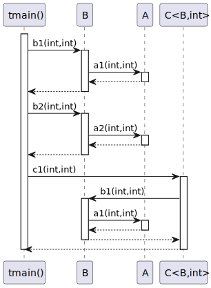

# t20014 - Multiple translation units sequence diagram test case
## Config
```yaml
compilation_database_dir: ..
output_directory: puml
diagrams:
  t20014_sequence:
    type: sequence
    glob:
      - ../../tests/t20014/t20014.cc
      - ../../tests/t20014/t20014_c.cc
      - ../../tests/t20014/t20014_b.cc
      - ../../tests/t20014/t20014_a.cc
    include:
      namespaces:
        - clanguml::t20014
    using_namespace:
      - clanguml::t20014
    start_from:
      - function: "clanguml::t20014::tmain()"
```
## Source code
File t20014.cc
```cpp
#include "include/t20014.h"
#include "include/t20014_b.h"
#include "include/t20014_c.h"

namespace clanguml {
namespace t20014 {

void log(const char *msg) { }

int tmain()
{
    B b;
    C<B, int> c;

    b.b1(0, 1);
    b.b2(1, 2);

    c.c1(2, 3);

    return 0;
}
}
}
```
File t20014_a.cc
```cpp
#include "include/t20014_a.h"
namespace clanguml {
namespace t20014 {

int A::a1(int i, int j) { return i + j; }

int A::a2(int i, int j) { return i - j; }

}
}
```
File t20014_b.cc
```cpp
#include "include/t20014_b.h"
namespace clanguml {
namespace t20014 {

int B::b1(int i, int j) { return a_.a1(i, j); }

int B::b2(int i, int j) { return a_.a2(i, j); }

}
}
```
File t20014_c.cc
```cpp
#include "include/t20014_c.h"

namespace clanguml {
namespace t20014 {

}
}
```
## Generated UML diagrams

## Generated JSON models
```json
{
  "diagram_type": "sequence",
  "metadata": {
    "clang_uml_version": "0.3.7-49-g3bd8f7f",
    "llvm_version": "Ubuntu clang version 15.0.6",
    "schema_version": 1
  },
  "name": "t20014_sequence",
  "participants": [
    {
      "id": "512436830818921250",
      "name": "clanguml::t20014::tmain()",
      "source_location": {
        "column": 5,
        "file": "../../tests/t20014/t20014.cc",
        "line": 10,
        "translation_unit": "../../tests/t20014/t20014.cc"
      },
      "type": "function"
    },
    {
      "id": "1537634076295867978",
      "name": "clanguml::t20014::B",
      "source_location": {
        "column": 8,
        "file": "../../tests/t20014/include/t20014_b.h",
        "line": 8,
        "translation_unit": "../../tests/t20014/t20014.cc"
      },
      "type": "class"
    },
    {
      "id": "1504706415756333840",
      "name": "clanguml::t20014::A",
      "source_location": {
        "column": 8,
        "file": "../../tests/t20014/include/t20014_a.h",
        "line": 6,
        "translation_unit": "../../tests/t20014/t20014.cc"
      },
      "type": "class"
    },
    {
      "id": "500712304857049435",
      "name": "clanguml::t20014::C<clanguml::t20014::B,int>",
      "source_location": {
        "column": 42,
        "file": "../../tests/t20014/include/t20014_c.h",
        "line": 6,
        "translation_unit": "../../tests/t20014/t20014.cc"
      },
      "type": "class"
    }
  ],
  "sequences": [
    {
      "messages": [
        {
          "from": {
            "activity_id": "512436830818921250",
            "activity_name": "clanguml::t20014::tmain()",
            "participant_id": "512436830818921250",
            "participant_name": "clanguml::t20014::tmain()"
          },
          "name": "b1(int,int)",
          "return_type": "int",
          "scope": "normal",
          "source_location": {
            "column": 5,
            "file": "../../tests/t20014/t20014.cc",
            "line": 15,
            "translation_unit": "../../tests/t20014/t20014.cc"
          },
          "to": {
            "activity_id": "1251633571711578431",
            "activity_name": "clanguml::t20014::B::b1(int,int)",
            "participant_id": "1537634076295867978"
          },
          "type": "message"
        },
        {
          "from": {
            "activity_id": "1251633571711578431",
            "activity_name": "clanguml::t20014::B::b1(int,int)",
            "participant_id": "1537634076295867978"
          },
          "name": "a1(int,int)",
          "return_type": "int",
          "scope": "normal",
          "source_location": {
            "column": 34,
            "file": "../../tests/t20014/t20014_b.cc",
            "line": 5,
            "translation_unit": "../../tests/t20014/t20014_b.cc"
          },
          "to": {
            "activity_id": "1753682948110709616",
            "activity_name": "clanguml::t20014::A::a1(int,int)",
            "participant_id": "1504706415756333840"
          },
          "type": "message"
        },
        {
          "from": {
            "activity_id": "512436830818921250",
            "activity_name": "clanguml::t20014::tmain()",
            "participant_id": "512436830818921250",
            "participant_name": "clanguml::t20014::tmain()"
          },
          "name": "b2(int,int)",
          "return_type": "int",
          "scope": "normal",
          "source_location": {
            "column": 5,
            "file": "../../tests/t20014/t20014.cc",
            "line": 16,
            "translation_unit": "../../tests/t20014/t20014.cc"
          },
          "to": {
            "activity_id": "767830966714379991",
            "activity_name": "clanguml::t20014::B::b2(int,int)",
            "participant_id": "1537634076295867978"
          },
          "type": "message"
        },
        {
          "from": {
            "activity_id": "767830966714379991",
            "activity_name": "clanguml::t20014::B::b2(int,int)",
            "participant_id": "1537634076295867978"
          },
          "name": "a2(int,int)",
          "return_type": "int",
          "scope": "normal",
          "source_location": {
            "column": 34,
            "file": "../../tests/t20014/t20014_b.cc",
            "line": 7,
            "translation_unit": "../../tests/t20014/t20014_b.cc"
          },
          "to": {
            "activity_id": "1943487088673912694",
            "activity_name": "clanguml::t20014::A::a2(int,int)",
            "participant_id": "1504706415756333840"
          },
          "type": "message"
        },
        {
          "from": {
            "activity_id": "512436830818921250",
            "activity_name": "clanguml::t20014::tmain()",
            "participant_id": "512436830818921250",
            "participant_name": "clanguml::t20014::tmain()"
          },
          "name": "c1(int,int)",
          "return_type": "int",
          "scope": "normal",
          "source_location": {
            "column": 5,
            "file": "../../tests/t20014/t20014.cc",
            "line": 18,
            "translation_unit": "../../tests/t20014/t20014.cc"
          },
          "to": {
            "activity_id": "407559038402563981",
            "activity_name": "clanguml::t20014::C<clanguml::t20014::B,int>::c1(int,int)",
            "participant_id": "500712304857049435"
          },
          "type": "message"
        },
        {
          "from": {
            "activity_id": "407559038402563981",
            "activity_name": "clanguml::t20014::C<clanguml::t20014::B,int>::c1(int,int)",
            "participant_id": "500712304857049435"
          },
          "name": "b1(int,int)",
          "return_type": "int",
          "scope": "normal",
          "source_location": {
            "column": 29,
            "file": "../../tests/t20014/include/t20014_c.h",
            "line": 7,
            "translation_unit": "../../tests/t20014/t20014.cc"
          },
          "to": {
            "activity_id": "1251633571711578431",
            "activity_name": "clanguml::t20014::B::b1(int,int)",
            "participant_id": "1537634076295867978"
          },
          "type": "message"
        }
      ],
      "start_from": {
        "id": 512436830818921250,
        "location": "clanguml::t20014::tmain()"
      }
    }
  ],
  "using_namespace": "clanguml::t20014"
}
```
