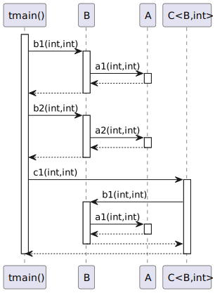

# t20014 - Multiple translation units sequence diagram test case
## Config
```yaml
compilation_database_dir: ..
output_directory: puml
diagrams:
  t20014_sequence:
    type: sequence
    glob:
      - ../../tests/t20014/t20014.cc
      - ../../tests/t20014/t20014_c.cc
      - ../../tests/t20014/t20014_b.cc
      - ../../tests/t20014/t20014_a.cc
    include:
      namespaces:
        - clanguml::t20014
    using_namespace:
      - clanguml::t20014
    start_from:
      - function: "clanguml::t20014::tmain()"
```
## Source code
File t20014_b.cc
```cpp
#include "include/t20014_b.h"
namespace clanguml {
namespace t20014 {

int B::b1(int i, int j) { return a_.a1(i, j); }

int B::b2(int i, int j) { return a_.a2(i, j); }

}
}
```
File t20014_c.cc
```cpp
#include "include/t20014_c.h"

namespace clanguml {
namespace t20014 {

//template <typename T, typename F> F C<T, F>::c1(F i, F j)
//{
//    return c_.b1(i, j);
//}
//
//template <typename T, typename F> F C<T, F>::c2(F i, F j)
//{
//    return c_.b2(i, j);
//}

}
}
```
File t20014.cc
```cpp
#include "include/t20014.h"
#include "include/t20014_b.h"
#include "include/t20014_c.h"

namespace clanguml {
namespace t20014 {

void log(const char *msg) { }

int tmain()
{
    B b;
    C<B, int> c;

    b.b1(0, 1);
    b.b2(1, 2);

    c.c1(2, 3);

    return 0;
}
}
}
```
File t20014_a.cc
```cpp
#include "include/t20014_a.h"
namespace clanguml {
namespace t20014 {

int A::a1(int i, int j) { return i + j; }

int A::a2(int i, int j) { return i - j; }

}
}
```
## Generated UML diagrams

