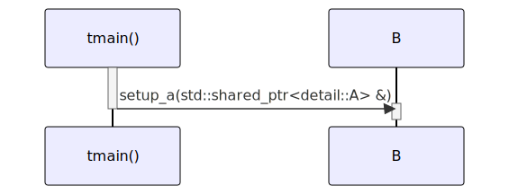

# t20015 - Class exclusion by namespace in sequence diagram test case
## Config
```yaml
compilation_database_dir: ..
output_directory: diagrams
diagrams:
  t20015_sequence:
    type: sequence
    glob:
      - ../../tests/t20015/t20015.cc
    include:
      namespaces:
        - clanguml::t20015
    exclude:
      namespaces:
        - clanguml::t20015::detail
    using_namespace:
      - clanguml::t20015
    from:
      - function: "clanguml::t20015::tmain()"
```
## Source code
File t20015.cc
```cpp
#include <memory>
#include <optional>

namespace clanguml {
namespace t20015 {

namespace detail {
class A {
public:
    void set_x(int x) { x_ = x; }
    void set_y(int y) { y_ = y; }
    void set_z(int z) { z_ = z; }

private:
    int x_;
    int y_;
    int z_;
};
}

class B {
public:
    void setup_a(std::shared_ptr<detail::A> &a)
    {
        a->set_x(1);
        a.get()->set_y(2);
        (*a).set_z(3);
    }
};

void tmain()
{
    auto a = std::make_shared<detail::A>();

    B b;

    b.setup_a(a);
}
}
}
```
## Generated PlantUML diagrams

## Generated Mermaid diagrams

## Generated JSON models
```json
{
  "diagram_type": "sequence",
  "metadata": {
    "clang_uml_version": "0.4.1-11-g39d3e1f",
    "llvm_version": "Ubuntu clang version 16.0.6 (++20230710042027+7cbf1a259152-1~exp1~20230710162048.105)",
    "schema_version": 1
  },
  "name": "t20015_sequence",
  "participants": [
    {
      "id": "1011496551872082945",
      "name": "clanguml::t20015::tmain()",
      "source_location": {
        "column": 6,
        "file": "../../tests/t20015/t20015.cc",
        "line": 31,
        "translation_unit": "../../tests/t20015/t20015.cc"
      },
      "type": "function"
    },
    {
      "id": "1302656676783358645",
      "name": "clanguml::t20015::B",
      "source_location": {
        "column": 7,
        "file": "../../tests/t20015/t20015.cc",
        "line": 21,
        "translation_unit": "../../tests/t20015/t20015.cc"
      },
      "type": "class"
    }
  ],
  "sequences": [
    {
      "messages": [
        {
          "from": {
            "activity_id": "1011496551872082945",
            "activity_name": "clanguml::t20015::tmain()",
            "participant_id": "1011496551872082945",
            "participant_name": "clanguml::t20015::tmain()"
          },
          "name": "setup_a(std::shared_ptr<detail::A> &)",
          "return_type": "void",
          "scope": "normal",
          "source_location": {
            "column": 5,
            "file": "../../tests/t20015/t20015.cc",
            "line": 37,
            "translation_unit": "../../tests/t20015/t20015.cc"
          },
          "to": {
            "activity_id": "431575772398797060",
            "activity_name": "clanguml::t20015::B::setup_a(std::shared_ptr<detail::A> &)",
            "participant_id": "1302656676783358645"
          },
          "type": "message"
        }
      ],
      "start_from": {
        "id": 1011496551872082945,
        "location": "clanguml::t20015::tmain()"
      }
    }
  ],
  "using_namespace": "clanguml::t20015"
}
```
