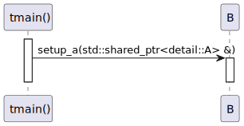

# t20015 - Class exclusion by namespace in sequence diagram test case
## Config
```yaml
compilation_database_dir: ..
output_directory: puml
diagrams:
  t20015_sequence:
    type: sequence
    glob:
      - ../../tests/t20015/t20015.cc
    include:
      namespaces:
        - clanguml::t20015
    exclude:
      namespaces:
        - clanguml::t20015::detail
    using_namespace:
      - clanguml::t20015
    start_from:
      - function: "clanguml::t20015::tmain()"
```
## Source code
File t20015.cc
```cpp
#include <memory>
#include <optional>

namespace clanguml {
namespace t20015 {

namespace detail {
class A {
public:
    void set_x(int x) { x_ = x; }
    void set_y(int y) { y_ = y; }
    void set_z(int z) { z_ = z; }

private:
    int x_;
    int y_;
    int z_;
};
}

class B {
public:
    void setup_a(std::shared_ptr<detail::A> &a)
    {
        a->set_x(1);
        a.get()->set_y(2);
        (*a).set_z(3);
    }
};

void tmain()
{
    auto a = std::make_shared<detail::A>();

    B b;

    b.setup_a(a);
}
}
}
```
## Generated UML diagrams

