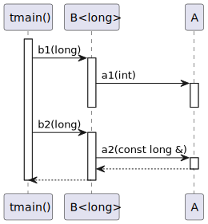
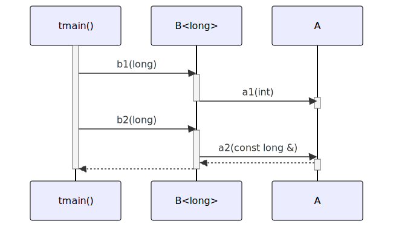

# t20016 - Template method specialization sequence diagram test case
## Config
```yaml
diagrams:
  t20016_sequence:
    type: sequence
    glob:
      - t20016.cc
    include:
      namespaces:
        - clanguml::t20016
    using_namespace: clanguml::t20016
    from:
      - function: "clanguml::t20016::tmain()"
```
## Source code
File `tests/t20016/t20016.cc`
```cpp
namespace clanguml {
namespace t20016 {
struct A {
    void a1(int a) { }
    template <typename T> T a2(const T &a) { return a; }
};

template <typename T> struct B {
    void b1(T b) { a_.a1(1); }

    template <typename F> F b2(T t) { return a_.a2(t); }

    A a_;
};

void tmain()
{
    B<long> b;

    b.b1(1);

    b.b2<int>(2);
}
}
}
```
## Generated PlantUML diagrams

## Generated Mermaid diagrams

## Generated JSON models
```json
{
  "diagram_type": "sequence",
  "name": "t20016_sequence",
  "participants": [
    {
      "display_name": "tmain()",
      "full_name": "clanguml::t20016::tmain()",
      "id": "1912662358651926712",
      "name": "tmain",
      "namespace": "clanguml::t20016",
      "source_location": {
        "column": 6,
        "file": "t20016.cc",
        "line": 16,
        "translation_unit": "t20016.cc"
      },
      "type": "function"
    },
    {
      "activities": [
        {
          "display_name": "b1(long)",
          "full_name": "clanguml::t20016::B<long>::b1(long)",
          "id": "2064264710178722261",
          "name": "b1",
          "namespace": "",
          "source_location": {
            "column": 10,
            "file": "t20016.cc",
            "line": 9,
            "translation_unit": "t20016.cc"
          },
          "type": "method"
        },
        {
          "display_name": "b2(long)",
          "full_name": "clanguml::t20016::B<long>::b2(long)",
          "id": "203381140188081853",
          "name": "b2",
          "namespace": "",
          "source_location": {
            "column": 29,
            "file": "t20016.cc",
            "line": 11,
            "translation_unit": "t20016.cc"
          },
          "type": "method"
        }
      ],
      "display_name": "B<long>",
      "full_name": "clanguml::t20016::B<long>",
      "id": "1688340912643326666",
      "name": "B",
      "namespace": "clanguml::t20016",
      "source_location": {
        "column": 30,
        "file": "t20016.cc",
        "line": 8,
        "translation_unit": "t20016.cc"
      },
      "type": "class"
    },
    {
      "activities": [
        {
          "display_name": "a1(int)",
          "full_name": "clanguml::t20016::A::a1(int)",
          "id": "1198371121423942542",
          "name": "a1",
          "namespace": "",
          "source_location": {
            "column": 10,
            "file": "t20016.cc",
            "line": 4,
            "translation_unit": "t20016.cc"
          },
          "type": "method"
        },
        {
          "display_name": "a2(const long &)",
          "full_name": "clanguml::t20016::A::a2(const long &)",
          "id": "1208784669530380166",
          "name": "a2",
          "namespace": "",
          "source_location": {
            "column": 29,
            "file": "t20016.cc",
            "line": 5,
            "translation_unit": "t20016.cc"
          },
          "type": "method"
        }
      ],
      "display_name": "A",
      "full_name": "clanguml::t20016::A",
      "id": "1351242594275053195",
      "name": "A",
      "namespace": "clanguml::t20016",
      "source_location": {
        "column": 8,
        "file": "t20016.cc",
        "line": 3,
        "translation_unit": "t20016.cc"
      },
      "type": "class"
    }
  ],
  "sequences": [
    {
      "messages": [
        {
          "from": {
            "activity_id": "1912662358651926712",
            "participant_id": "1912662358651926712"
          },
          "name": "b1(long)",
          "return_type": "void",
          "scope": "normal",
          "source_location": {
            "column": 5,
            "file": "t20016.cc",
            "line": 20,
            "translation_unit": "t20016.cc"
          },
          "to": {
            "activity_id": "2064264710178722261",
            "participant_id": "1688340912643326666"
          },
          "type": "message"
        },
        {
          "from": {
            "activity_id": "2064264710178722261",
            "participant_id": "1688340912643326666"
          },
          "name": "a1(int)",
          "return_type": "void",
          "scope": "normal",
          "source_location": {
            "column": 20,
            "file": "t20016.cc",
            "line": 9,
            "translation_unit": "t20016.cc"
          },
          "to": {
            "activity_id": "1198371121423942542",
            "participant_id": "1351242594275053195"
          },
          "type": "message"
        },
        {
          "from": {
            "activity_id": "1912662358651926712",
            "participant_id": "1912662358651926712"
          },
          "name": "b2(long)",
          "return_type": "F",
          "scope": "normal",
          "source_location": {
            "column": 5,
            "file": "t20016.cc",
            "line": 22,
            "translation_unit": "t20016.cc"
          },
          "to": {
            "activity_id": "203381140188081853",
            "participant_id": "1688340912643326666"
          },
          "type": "message"
        },
        {
          "from": {
            "activity_id": "203381140188081853",
            "participant_id": "1688340912643326666"
          },
          "name": "a2(const long &)",
          "return_type": "long",
          "scope": "normal",
          "source_location": {
            "column": 46,
            "file": "t20016.cc",
            "line": 11,
            "translation_unit": "t20016.cc"
          },
          "to": {
            "activity_id": "1208784669530380166",
            "participant_id": "1351242594275053195"
          },
          "type": "message"
        }
      ],
      "start_from": {
        "id": 1912662358651926712,
        "location": "clanguml::t20016::tmain()"
      }
    }
  ],
  "using_namespace": "clanguml::t20016"
}
```
