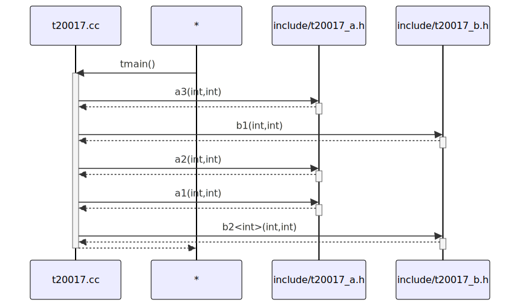

# t20017 - Test case for combine_free_functions_into_file_participants option
## Config
```yaml
diagrams:
  t20017_sequence:
    type: sequence
    combine_free_functions_into_file_participants: true
    glob:
      - t20017.cc
    include:
      namespaces:
        - clanguml::t20017
      paths:
        - .
    using_namespace:
      - clanguml::t20017
    from:
      - function: "clanguml::t20017::tmain()"
```
## Source code
File `tests/t20017/t20017_b.cc`
```cpp
#include "include/t20017_b.h"

namespace clanguml {
namespace t20017 {
int b1(int x, int y) { return x - y; }
}
}
```
File `tests/t20017/t20017.cc`
```cpp
#include "include/t20017_a.h"
#include "include/t20017_b.h"

namespace clanguml {
namespace t20017 {
int tmain() { return b2(a1(a2(a3(1, 2), b1(3, 4)), 5), 6); }
}
}
```
File `tests/t20017/include/t20017_a.h`
```cpp
#pragma once

namespace clanguml {
namespace t20017 {
int a1(int x, int y) { return x + y; }
int a2(int x, int y) { return x - y; }
int a3(int x, int y) { return x * y; }
}
}
```
File `tests/t20017/include/t20017_b.h`
```cpp
#pragma once

namespace clanguml {
namespace t20017 {
int b1(int x, int y);

template <typename T> T b2(T x, T y) { return x / y; }
}
}
```
## Generated PlantUML diagrams

## Generated Mermaid diagrams

## Generated JSON models
```json
{
  "diagram_type": "sequence",
  "name": "t20017_sequence",
  "participants": [
    {
      "activities": [
        {
          "display_name": "tmain()",
          "full_name": "clanguml::t20017::tmain()",
          "id": "1484746432546296115",
          "name": "tmain",
          "namespace": "clanguml::t20017",
          "source_location": {
            "column": 5,
            "file": "t20017.cc",
            "line": 6,
            "translation_unit": "t20017.cc"
          },
          "type": "function"
        }
      ],
      "display_name": "t20017.cc",
      "full_name": "clanguml::t20017::tmain()",
      "id": "294332401323799021",
      "name": "t20017.cc",
      "namespace": "clanguml::t20017",
      "type": "file"
    },
    {
      "activities": [
        {
          "display_name": "a3(int,int)",
          "full_name": "clanguml::t20017::a3(int,int)",
          "id": "1681392050252260928",
          "name": "a3",
          "namespace": "clanguml::t20017",
          "source_location": {
            "column": 5,
            "file": "include/t20017_a.h",
            "line": 7,
            "translation_unit": "t20017.cc"
          },
          "type": "function"
        },
        {
          "display_name": "a2(int,int)",
          "full_name": "clanguml::t20017::a2(int,int)",
          "id": "291553542743365259",
          "name": "a2",
          "namespace": "clanguml::t20017",
          "source_location": {
            "column": 5,
            "file": "include/t20017_a.h",
            "line": 6,
            "translation_unit": "t20017.cc"
          },
          "type": "function"
        },
        {
          "display_name": "a1(int,int)",
          "full_name": "clanguml::t20017::a1(int,int)",
          "id": "113759676939330212",
          "name": "a1",
          "namespace": "clanguml::t20017",
          "source_location": {
            "column": 5,
            "file": "include/t20017_a.h",
            "line": 5,
            "translation_unit": "t20017.cc"
          },
          "type": "function"
        }
      ],
      "display_name": "include/t20017_a.h",
      "full_name": "clanguml::t20017::a3(int,int)",
      "id": "1591222867263639510",
      "name": "t20017_a.h",
      "namespace": "clanguml::t20017",
      "type": "file"
    },
    {
      "activities": [
        {
          "display_name": "b1(int,int)",
          "full_name": "clanguml::t20017::b1(int,int)",
          "id": "1714277838806105702",
          "name": "b1",
          "namespace": "clanguml::t20017",
          "source_location": {
            "column": 5,
            "file": "include/t20017_b.h",
            "line": 5,
            "translation_unit": "t20017.cc"
          },
          "type": "function"
        },
        {
          "display_name": "b2<int>(int,int)",
          "full_name": "clanguml::t20017::b2<int>(int,int)",
          "id": "775081116464505528",
          "name": "b2",
          "namespace": "clanguml::t20017",
          "source_location": {
            "column": 25,
            "file": "include/t20017_b.h",
            "line": 7,
            "translation_unit": "t20017.cc"
          },
          "type": "function_template"
        }
      ],
      "display_name": "include/t20017_b.h",
      "full_name": "clanguml::t20017::b1(int,int)",
      "id": "1113611539183189365",
      "name": "t20017_b.h",
      "namespace": "clanguml::t20017",
      "type": "file"
    }
  ],
  "sequences": [
    {
      "messages": [
        {
          "from": {
            "activity_id": "1484746432546296115",
            "participant_id": "294332401323799021"
          },
          "name": "a3(int,int)",
          "return_type": "int",
          "scope": "normal",
          "source_location": {
            "column": 31,
            "file": "t20017.cc",
            "line": 6,
            "translation_unit": "t20017.cc"
          },
          "to": {
            "activity_id": "1681392050252260928",
            "participant_id": "1591222867263639510"
          },
          "type": "message"
        },
        {
          "from": {
            "activity_id": "1484746432546296115",
            "participant_id": "294332401323799021"
          },
          "name": "b1(int,int)",
          "return_type": "int",
          "scope": "normal",
          "source_location": {
            "column": 41,
            "file": "t20017.cc",
            "line": 6,
            "translation_unit": "t20017.cc"
          },
          "to": {
            "activity_id": "1714277838806105702",
            "participant_id": "1113611539183189365"
          },
          "type": "message"
        },
        {
          "from": {
            "activity_id": "1484746432546296115",
            "participant_id": "294332401323799021"
          },
          "name": "a2(int,int)",
          "return_type": "int",
          "scope": "normal",
          "source_location": {
            "column": 28,
            "file": "t20017.cc",
            "line": 6,
            "translation_unit": "t20017.cc"
          },
          "to": {
            "activity_id": "291553542743365259",
            "participant_id": "1591222867263639510"
          },
          "type": "message"
        },
        {
          "from": {
            "activity_id": "1484746432546296115",
            "participant_id": "294332401323799021"
          },
          "name": "a1(int,int)",
          "return_type": "int",
          "scope": "normal",
          "source_location": {
            "column": 25,
            "file": "t20017.cc",
            "line": 6,
            "translation_unit": "t20017.cc"
          },
          "to": {
            "activity_id": "113759676939330212",
            "participant_id": "1591222867263639510"
          },
          "type": "message"
        },
        {
          "from": {
            "activity_id": "1484746432546296115",
            "participant_id": "294332401323799021"
          },
          "name": "b2<int>(int,int)",
          "return_type": "",
          "scope": "normal",
          "source_location": {
            "column": 22,
            "file": "t20017.cc",
            "line": 6,
            "translation_unit": "t20017.cc"
          },
          "to": {
            "activity_id": "775081116464505528",
            "participant_id": "1113611539183189365"
          },
          "type": "message"
        }
      ],
      "return_type": "int",
      "start_from": {
        "id": 1484746432546296115,
        "location": "clanguml::t20017::tmain()"
      }
    }
  ],
  "using_namespace": "clanguml::t20017"
}
```
