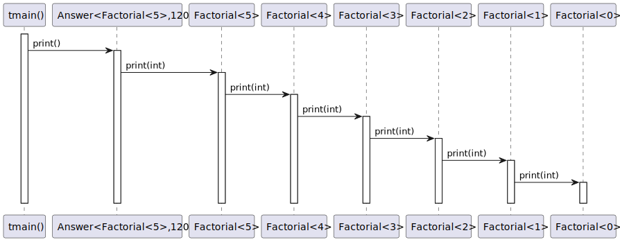
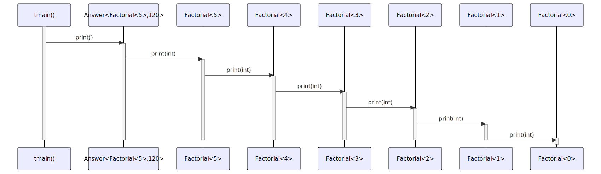

# t20018 - Recursive template sequence diagram test case
## Config
```yaml
diagrams:
  t20018_sequence:
    type: sequence
    glob:
      - t20018.cc
    include:
      namespaces:
        - clanguml::t20018
    using_namespace: clanguml::t20018
    from:
      - function: "clanguml::t20018::tmain()"
```
## Source code
File `tests/t20018/t20018.cc`
```cpp
#include <iostream>

namespace clanguml {
namespace t20018 {

template <int N> struct Factorial {
    static const int value = N * Factorial<N - 1>::value;

    static void print(int answer) { Factorial<N - 1>::print(answer); }
};

template <> struct Factorial<0> {
    static const int value = 1;

    static void print(int answer)
    {
        std::cout << "The answer is " << answer << "\n";
    }
};

template <typename T, int N = T::value> struct Answer {
    static void print() { T::print(N); }
};

void tmain() { Answer<Factorial<5>>::print(); }
}
}
```
## Generated PlantUML diagrams

## Generated Mermaid diagrams

## Generated JSON models
```json
{
  "diagram_type": "sequence",
  "name": "t20018_sequence",
  "participants": [
    {
      "display_name": "tmain()",
      "full_name": "clanguml::t20018::tmain()",
      "id": "227581758025403815",
      "name": "tmain",
      "namespace": "clanguml::t20018",
      "source_location": {
        "column": 6,
        "file": "t20018.cc",
        "line": 25,
        "translation_unit": "t20018.cc"
      },
      "type": "function"
    },
    {
      "activities": [
        {
          "display_name": "print()",
          "full_name": "clanguml::t20018::Answer<clanguml::t20018::Factorial<5>,120>::print()",
          "id": "1185770766239304952",
          "name": "print",
          "namespace": "",
          "source_location": {
            "column": 17,
            "file": "t20018.cc",
            "line": 22,
            "translation_unit": "t20018.cc"
          },
          "type": "method"
        }
      ],
      "display_name": "Answer<Factorial<5>,120>",
      "full_name": "clanguml::t20018::Answer<clanguml::t20018::Factorial<5>,120>",
      "id": "1163521725351533502",
      "name": "Answer",
      "namespace": "clanguml::t20018",
      "source_location": {
        "column": 48,
        "file": "t20018.cc",
        "line": 21,
        "translation_unit": "t20018.cc"
      },
      "type": "class"
    },
    {
      "activities": [
        {
          "display_name": "print(int)",
          "full_name": "clanguml::t20018::Factorial<5>::print(int)",
          "id": "833100888453299461",
          "name": "print",
          "namespace": "",
          "source_location": {
            "column": 17,
            "file": "t20018.cc",
            "line": 9,
            "translation_unit": "t20018.cc"
          },
          "type": "method"
        }
      ],
      "display_name": "Factorial<5>",
      "full_name": "clanguml::t20018::Factorial<5>",
      "id": "1482779373563849921",
      "name": "Factorial",
      "namespace": "clanguml::t20018",
      "source_location": {
        "column": 25,
        "file": "t20018.cc",
        "line": 6,
        "translation_unit": "t20018.cc"
      },
      "type": "class"
    },
    {
      "activities": [
        {
          "display_name": "print(int)",
          "full_name": "clanguml::t20018::Factorial<4>::print(int)",
          "id": "1782586643813991247",
          "name": "print",
          "namespace": "",
          "source_location": {
            "column": 17,
            "file": "t20018.cc",
            "line": 9,
            "translation_unit": "t20018.cc"
          },
          "type": "method"
        }
      ],
      "display_name": "Factorial<4>",
      "full_name": "clanguml::t20018::Factorial<4>",
      "id": "52416404065514823",
      "name": "Factorial",
      "namespace": "clanguml::t20018",
      "source_location": {
        "column": 25,
        "file": "t20018.cc",
        "line": 6,
        "translation_unit": "t20018.cc"
      },
      "type": "class"
    },
    {
      "activities": [
        {
          "display_name": "print(int)",
          "full_name": "clanguml::t20018::Factorial<3>::print(int)",
          "id": "1238078028595736678",
          "name": "print",
          "namespace": "",
          "source_location": {
            "column": 17,
            "file": "t20018.cc",
            "line": 9,
            "translation_unit": "t20018.cc"
          },
          "type": "method"
        }
      ],
      "display_name": "Factorial<3>",
      "full_name": "clanguml::t20018::Factorial<3>",
      "id": "1658728078296100018",
      "name": "Factorial",
      "namespace": "clanguml::t20018",
      "source_location": {
        "column": 25,
        "file": "t20018.cc",
        "line": 6,
        "translation_unit": "t20018.cc"
      },
      "type": "class"
    },
    {
      "activities": [
        {
          "display_name": "print(int)",
          "full_name": "clanguml::t20018::Factorial<2>::print(int)",
          "id": "2163270950475476780",
          "name": "print",
          "namespace": "",
          "source_location": {
            "column": 17,
            "file": "t20018.cc",
            "line": 9,
            "translation_unit": "t20018.cc"
          },
          "type": "method"
        }
      ],
      "display_name": "Factorial<2>",
      "full_name": "clanguml::t20018::Factorial<2>",
      "id": "969903469166760124",
      "name": "Factorial",
      "namespace": "clanguml::t20018",
      "source_location": {
        "column": 25,
        "file": "t20018.cc",
        "line": 6,
        "translation_unit": "t20018.cc"
      },
      "type": "class"
    },
    {
      "activities": [
        {
          "display_name": "print(int)",
          "full_name": "clanguml::t20018::Factorial<1>::print(int)",
          "id": "501166016325937670",
          "name": "print",
          "namespace": "",
          "source_location": {
            "column": 17,
            "file": "t20018.cc",
            "line": 9,
            "translation_unit": "t20018.cc"
          },
          "type": "method"
        }
      ],
      "display_name": "Factorial<1>",
      "full_name": "clanguml::t20018::Factorial<1>",
      "id": "2032621198190600516",
      "name": "Factorial",
      "namespace": "clanguml::t20018",
      "source_location": {
        "column": 25,
        "file": "t20018.cc",
        "line": 6,
        "translation_unit": "t20018.cc"
      },
      "type": "class"
    },
    {
      "activities": [
        {
          "display_name": "print(int)",
          "full_name": "clanguml::t20018::Factorial<0>::print(int)",
          "id": "577232827352391544",
          "name": "print",
          "namespace": "",
          "source_location": {
            "column": 17,
            "file": "t20018.cc",
            "line": 15,
            "translation_unit": "t20018.cc"
          },
          "type": "method"
        }
      ],
      "display_name": "Factorial<0>",
      "full_name": "clanguml::t20018::Factorial<0>",
      "id": "1581865799666386458",
      "name": "Factorial",
      "namespace": "clanguml::t20018",
      "source_location": {
        "column": 20,
        "file": "t20018.cc",
        "line": 12,
        "translation_unit": "t20018.cc"
      },
      "type": "class"
    }
  ],
  "sequences": [
    {
      "messages": [
        {
          "from": {
            "activity_id": "227581758025403815",
            "participant_id": "227581758025403815"
          },
          "name": "print()",
          "return_type": "void",
          "scope": "normal",
          "source_location": {
            "column": 16,
            "file": "t20018.cc",
            "line": 25,
            "translation_unit": "t20018.cc"
          },
          "to": {
            "activity_id": "1185770766239304952",
            "participant_id": "1163521725351533502"
          },
          "type": "message"
        },
        {
          "from": {
            "activity_id": "1185770766239304952",
            "participant_id": "1163521725351533502"
          },
          "name": "print(int)",
          "return_type": "void",
          "scope": "normal",
          "source_location": {
            "column": 27,
            "file": "t20018.cc",
            "line": 22,
            "translation_unit": "t20018.cc"
          },
          "to": {
            "activity_id": "833100888453299461",
            "participant_id": "1482779373563849921"
          },
          "type": "message"
        },
        {
          "from": {
            "activity_id": "833100888453299461",
            "participant_id": "1482779373563849921"
          },
          "name": "print(int)",
          "return_type": "void",
          "scope": "normal",
          "source_location": {
            "column": 37,
            "file": "t20018.cc",
            "line": 9,
            "translation_unit": "t20018.cc"
          },
          "to": {
            "activity_id": "1782586643813991247",
            "participant_id": "52416404065514823"
          },
          "type": "message"
        },
        {
          "from": {
            "activity_id": "1782586643813991247",
            "participant_id": "52416404065514823"
          },
          "name": "print(int)",
          "return_type": "void",
          "scope": "normal",
          "source_location": {
            "column": 37,
            "file": "t20018.cc",
            "line": 9,
            "translation_unit": "t20018.cc"
          },
          "to": {
            "activity_id": "1238078028595736678",
            "participant_id": "1658728078296100018"
          },
          "type": "message"
        },
        {
          "from": {
            "activity_id": "1238078028595736678",
            "participant_id": "1658728078296100018"
          },
          "name": "print(int)",
          "return_type": "void",
          "scope": "normal",
          "source_location": {
            "column": 37,
            "file": "t20018.cc",
            "line": 9,
            "translation_unit": "t20018.cc"
          },
          "to": {
            "activity_id": "2163270950475476780",
            "participant_id": "969903469166760124"
          },
          "type": "message"
        },
        {
          "from": {
            "activity_id": "2163270950475476780",
            "participant_id": "969903469166760124"
          },
          "name": "print(int)",
          "return_type": "void",
          "scope": "normal",
          "source_location": {
            "column": 37,
            "file": "t20018.cc",
            "line": 9,
            "translation_unit": "t20018.cc"
          },
          "to": {
            "activity_id": "501166016325937670",
            "participant_id": "2032621198190600516"
          },
          "type": "message"
        },
        {
          "from": {
            "activity_id": "501166016325937670",
            "participant_id": "2032621198190600516"
          },
          "name": "print(int)",
          "return_type": "void",
          "scope": "normal",
          "source_location": {
            "column": 37,
            "file": "t20018.cc",
            "line": 9,
            "translation_unit": "t20018.cc"
          },
          "to": {
            "activity_id": "577232827352391544",
            "participant_id": "1581865799666386458"
          },
          "type": "message"
        }
      ],
      "start_from": {
        "id": 227581758025403815,
        "location": "clanguml::t20018::tmain()"
      }
    }
  ],
  "using_namespace": "clanguml::t20018"
}
```
