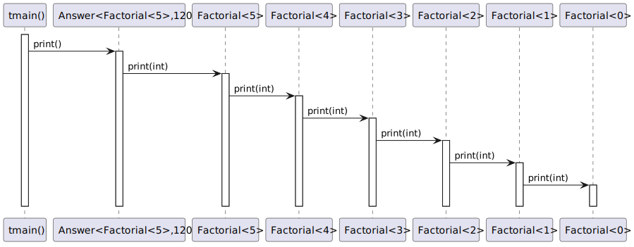
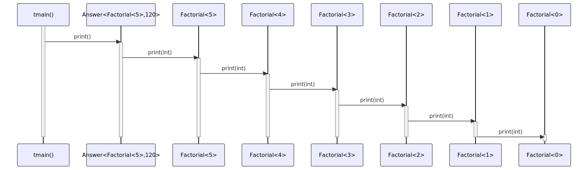

# t20018 - Recursive template sequence diagram test case
## Config
```yaml
diagrams:
  t20018_sequence:
    type: sequence
    glob:
      - t20018.cc
    include:
      namespaces:
        - clanguml::t20018
    using_namespace: clanguml::t20018
    from:
      - function: "clanguml::t20018::tmain()"
```
## Source code
File `tests/t20018/t20018.cc`
```cpp
#include <iostream>

namespace clanguml {
namespace t20018 {

template <int N> struct Factorial {
    static const int value = N * Factorial<N - 1>::value;

    static void print(int answer) { Factorial<N - 1>::print(answer); }
};

template <> struct Factorial<0> {
    static const int value = 1;

    static void print(int answer)
    {
        std::cout << "The answer is " << answer << "\n";
    }
};

template <typename T, int N = T::value> struct Answer {
    static void print() { T::print(N); }
};

void tmain() { Answer<Factorial<5>>::print(); }
}
}
```
## Generated PlantUML diagrams

## Generated Mermaid diagrams

## Generated JSON models
```json
{
  "diagram_type": "sequence",
  "name": "t20018_sequence",
  "participants": [
    {
      "display_name": "tmain()",
      "full_name": "clanguml::t20018::tmain()",
      "id": "13541713203140637275",
      "name": "tmain",
      "namespace": "clanguml::t20018",
      "source_location": {
        "column": 6,
        "file": "t20018.cc",
        "line": 25,
        "translation_unit": "t20018.cc"
      },
      "type": "function"
    },
    {
      "activities": [
        {
          "display_name": "print()",
          "full_name": "clanguml::t20018::Answer<clanguml::t20018::Factorial<5>,120>::print()",
          "id": "9241909840381903664",
          "name": "print",
          "namespace": "clanguml::t20018::Answer<clanguml::t20018",
          "source_location": {
            "column": 17,
            "file": "t20018.cc",
            "line": 22,
            "translation_unit": "t20018.cc"
          },
          "type": "method"
        }
      ],
      "display_name": "Answer<Factorial<5>,120>",
      "full_name": "clanguml::t20018::Answer<clanguml::t20018::Factorial<5>,120>",
      "id": "9974384032448996891",
      "name": "Answer",
      "namespace": "clanguml::t20018",
      "source_location": {
        "column": 48,
        "file": "t20018.cc",
        "line": 21,
        "translation_unit": "t20018.cc"
      },
      "type": "class"
    },
    {
      "activities": [
        {
          "display_name": "print(int)",
          "full_name": "clanguml::t20018::Factorial<5>::print(int)",
          "id": "18257273008491722675",
          "name": "print",
          "namespace": "clanguml::t20018",
          "source_location": {
            "column": 17,
            "file": "t20018.cc",
            "line": 9,
            "translation_unit": "t20018.cc"
          },
          "type": "method"
        }
      ],
      "display_name": "Factorial<5>",
      "full_name": "clanguml::t20018::Factorial<5>",
      "id": "14470348070131105152",
      "name": "Factorial",
      "namespace": "clanguml::t20018",
      "source_location": {
        "column": 25,
        "file": "t20018.cc",
        "line": 6,
        "translation_unit": "t20018.cc"
      },
      "type": "class"
    },
    {
      "activities": [
        {
          "display_name": "print(int)",
          "full_name": "clanguml::t20018::Factorial<4>::print(int)",
          "id": "17811067393080067500",
          "name": "print",
          "namespace": "clanguml::t20018",
          "source_location": {
            "column": 17,
            "file": "t20018.cc",
            "line": 9,
            "translation_unit": "t20018.cc"
          },
          "type": "method"
        }
      ],
      "display_name": "Factorial<4>",
      "full_name": "clanguml::t20018::Factorial<4>",
      "id": "15923558380730687307",
      "name": "Factorial",
      "namespace": "clanguml::t20018",
      "source_location": {
        "column": 25,
        "file": "t20018.cc",
        "line": 6,
        "translation_unit": "t20018.cc"
      },
      "type": "class"
    },
    {
      "activities": [
        {
          "display_name": "print(int)",
          "full_name": "clanguml::t20018::Factorial<3>::print(int)",
          "id": "16236077526884417863",
          "name": "print",
          "namespace": "clanguml::t20018",
          "source_location": {
            "column": 17,
            "file": "t20018.cc",
            "line": 9,
            "translation_unit": "t20018.cc"
          },
          "type": "method"
        }
      ],
      "display_name": "Factorial<3>",
      "full_name": "clanguml::t20018::Factorial<3>",
      "id": "9626949398905800989",
      "name": "Factorial",
      "namespace": "clanguml::t20018",
      "source_location": {
        "column": 25,
        "file": "t20018.cc",
        "line": 6,
        "translation_unit": "t20018.cc"
      },
      "type": "class"
    },
    {
      "activities": [
        {
          "display_name": "print(int)",
          "full_name": "clanguml::t20018::Factorial<2>::print(int)",
          "id": "13226101898667616677",
          "name": "print",
          "namespace": "clanguml::t20018",
          "source_location": {
            "column": 17,
            "file": "t20018.cc",
            "line": 9,
            "translation_unit": "t20018.cc"
          },
          "type": "method"
        }
      ],
      "display_name": "Factorial<2>",
      "full_name": "clanguml::t20018::Factorial<2>",
      "id": "12686412387984414310",
      "name": "Factorial",
      "namespace": "clanguml::t20018",
      "source_location": {
        "column": 25,
        "file": "t20018.cc",
        "line": 6,
        "translation_unit": "t20018.cc"
      },
      "type": "class"
    },
    {
      "activities": [
        {
          "display_name": "print(int)",
          "full_name": "clanguml::t20018::Factorial<1>::print(int)",
          "id": "12751042174529573518",
          "name": "print",
          "namespace": "clanguml::t20018",
          "source_location": {
            "column": 17,
            "file": "t20018.cc",
            "line": 9,
            "translation_unit": "t20018.cc"
          },
          "type": "method"
        }
      ],
      "display_name": "Factorial<1>",
      "full_name": "clanguml::t20018::Factorial<1>",
      "id": "2344415787796910968",
      "name": "Factorial",
      "namespace": "clanguml::t20018",
      "source_location": {
        "column": 25,
        "file": "t20018.cc",
        "line": 6,
        "translation_unit": "t20018.cc"
      },
      "type": "class"
    },
    {
      "activities": [
        {
          "display_name": "print(int)",
          "full_name": "clanguml::t20018::Factorial<0>::print(int)",
          "id": "13013523191877225721",
          "name": "print",
          "namespace": "clanguml::t20018",
          "source_location": {
            "column": 17,
            "file": "t20018.cc",
            "line": 15,
            "translation_unit": "t20018.cc"
          },
          "type": "method"
        }
      ],
      "display_name": "Factorial<0>",
      "full_name": "clanguml::t20018::Factorial<0>",
      "id": "12957705056319589666",
      "name": "Factorial",
      "namespace": "clanguml::t20018",
      "source_location": {
        "column": 20,
        "file": "t20018.cc",
        "line": 12,
        "translation_unit": "t20018.cc"
      },
      "type": "class"
    }
  ],
  "sequences": [
    {
      "from": {
        "id": "13541713203140637275",
        "location": "clanguml::t20018::tmain()"
      },
      "messages": [
        {
          "from": {
            "activity_id": "13541713203140637275",
            "participant_id": "13541713203140637275"
          },
          "name": "print()",
          "return_type": "void",
          "scope": "normal",
          "source_location": {
            "column": 16,
            "file": "t20018.cc",
            "line": 25,
            "translation_unit": "t20018.cc"
          },
          "to": {
            "activity_id": "9241909840381903664",
            "participant_id": "9974384032448996891"
          },
          "type": "message"
        },
        {
          "from": {
            "activity_id": "9241909840381903664",
            "participant_id": "9974384032448996891"
          },
          "name": "print(int)",
          "return_type": "void",
          "scope": "normal",
          "source_location": {
            "column": 27,
            "file": "t20018.cc",
            "line": 22,
            "translation_unit": "t20018.cc"
          },
          "to": {
            "activity_id": "18257273008491722675",
            "participant_id": "14470348070131105152"
          },
          "type": "message"
        },
        {
          "from": {
            "activity_id": "18257273008491722675",
            "participant_id": "14470348070131105152"
          },
          "name": "print(int)",
          "return_type": "void",
          "scope": "normal",
          "source_location": {
            "column": 37,
            "file": "t20018.cc",
            "line": 9,
            "translation_unit": "t20018.cc"
          },
          "to": {
            "activity_id": "17811067393080067500",
            "participant_id": "15923558380730687307"
          },
          "type": "message"
        },
        {
          "from": {
            "activity_id": "17811067393080067500",
            "participant_id": "15923558380730687307"
          },
          "name": "print(int)",
          "return_type": "void",
          "scope": "normal",
          "source_location": {
            "column": 37,
            "file": "t20018.cc",
            "line": 9,
            "translation_unit": "t20018.cc"
          },
          "to": {
            "activity_id": "16236077526884417863",
            "participant_id": "9626949398905800989"
          },
          "type": "message"
        },
        {
          "from": {
            "activity_id": "16236077526884417863",
            "participant_id": "9626949398905800989"
          },
          "name": "print(int)",
          "return_type": "void",
          "scope": "normal",
          "source_location": {
            "column": 37,
            "file": "t20018.cc",
            "line": 9,
            "translation_unit": "t20018.cc"
          },
          "to": {
            "activity_id": "13226101898667616677",
            "participant_id": "12686412387984414310"
          },
          "type": "message"
        },
        {
          "from": {
            "activity_id": "13226101898667616677",
            "participant_id": "12686412387984414310"
          },
          "name": "print(int)",
          "return_type": "void",
          "scope": "normal",
          "source_location": {
            "column": 37,
            "file": "t20018.cc",
            "line": 9,
            "translation_unit": "t20018.cc"
          },
          "to": {
            "activity_id": "12751042174529573518",
            "participant_id": "2344415787796910968"
          },
          "type": "message"
        },
        {
          "from": {
            "activity_id": "12751042174529573518",
            "participant_id": "2344415787796910968"
          },
          "name": "print(int)",
          "return_type": "void",
          "scope": "normal",
          "source_location": {
            "column": 37,
            "file": "t20018.cc",
            "line": 9,
            "translation_unit": "t20018.cc"
          },
          "to": {
            "activity_id": "13013523191877225721",
            "participant_id": "12957705056319589666"
          },
          "type": "message"
        }
      ]
    }
  ],
  "using_namespace": "clanguml::t20018"
}
```
## Generated GraphML models
