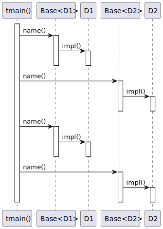
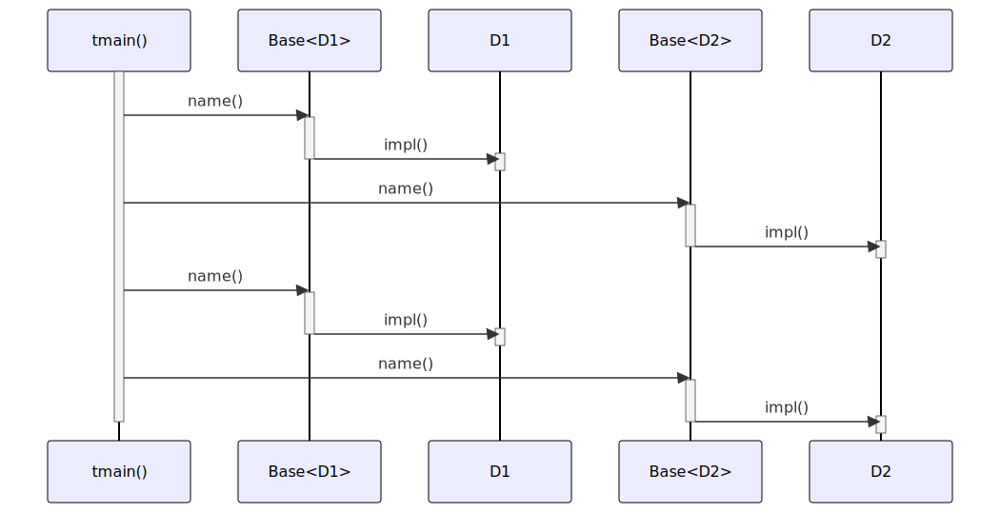

# t20019 - Curiously Recurring Template Pattern sequence diagram test case
## Config
```yaml
diagrams:
  t20019_sequence:
    type: sequence
    glob:
      - t20019.cc
    include:
      namespaces:
        - clanguml::t20019
    using_namespace: clanguml::t20019
    from:
      - function: "clanguml::t20019::tmain()"
```
## Source code
File `tests/t20019/t20019.cc`
```cpp
#include <cstdio>

namespace clanguml {
namespace t20019 {

// From https://en.cppreference.com/w/cpp/language/crtp

template <class Derived> struct Base {
    void name() { (static_cast<Derived *>(this))->impl(); }
};

struct D1 : public Base<D1> {
    void impl() { std::puts("D1::impl()"); }
};

struct D2 : public Base<D2> {
    void impl() { std::puts("D2::impl()"); }
};

void tmain()
{
    Base<D1> b1;
    b1.name();
    Base<D2> b2;
    b2.name();

    D1 d1;
    d1.name();
    D2 d2;
    d2.name();
}

}
}
```
## Generated PlantUML diagrams

## Generated Mermaid diagrams

## Generated JSON models
```json
{
  "diagram_type": "sequence",
  "name": "t20019_sequence",
  "participants": [
    {
      "display_name": "tmain()",
      "full_name": "clanguml::t20019::tmain()",
      "id": "375304196268652861",
      "name": "tmain",
      "namespace": "clanguml::t20019",
      "source_location": {
        "column": 6,
        "file": "t20019.cc",
        "line": 20,
        "translation_unit": "t20019.cc"
      },
      "type": "function"
    },
    {
      "activities": [
        {
          "display_name": "name()",
          "full_name": "clanguml::t20019::Base<clanguml::t20019::D1>::name()",
          "id": "1038853547136467401",
          "name": "name",
          "namespace": "",
          "source_location": {
            "column": 10,
            "file": "t20019.cc",
            "line": 9,
            "translation_unit": "t20019.cc"
          },
          "type": "method"
        }
      ],
      "display_name": "Base<D1>",
      "full_name": "clanguml::t20019::Base<clanguml::t20019::D1>",
      "id": "381327373934972004",
      "name": "Base",
      "namespace": "clanguml::t20019",
      "source_location": {
        "column": 33,
        "file": "t20019.cc",
        "line": 8,
        "translation_unit": "t20019.cc"
      },
      "type": "class"
    },
    {
      "activities": [
        {
          "display_name": "impl()",
          "full_name": "clanguml::t20019::D1::impl()",
          "id": "603969604599968603",
          "name": "impl",
          "namespace": "",
          "source_location": {
            "column": 10,
            "file": "t20019.cc",
            "line": 13,
            "translation_unit": "t20019.cc"
          },
          "type": "method"
        }
      ],
      "display_name": "D1",
      "full_name": "clanguml::t20019::D1",
      "id": "1282259011856139592",
      "name": "D1",
      "namespace": "clanguml::t20019",
      "source_location": {
        "column": 8,
        "file": "t20019.cc",
        "line": 12,
        "translation_unit": "t20019.cc"
      },
      "type": "class"
    },
    {
      "activities": [
        {
          "display_name": "name()",
          "full_name": "clanguml::t20019::Base<clanguml::t20019::D2>::name()",
          "id": "1918672956676175365",
          "name": "name",
          "namespace": "",
          "source_location": {
            "column": 10,
            "file": "t20019.cc",
            "line": 9,
            "translation_unit": "t20019.cc"
          },
          "type": "method"
        }
      ],
      "display_name": "Base<D2>",
      "full_name": "clanguml::t20019::Base<clanguml::t20019::D2>",
      "id": "1659477498076328530",
      "name": "Base",
      "namespace": "clanguml::t20019",
      "source_location": {
        "column": 33,
        "file": "t20019.cc",
        "line": 8,
        "translation_unit": "t20019.cc"
      },
      "type": "class"
    },
    {
      "activities": [
        {
          "display_name": "impl()",
          "full_name": "clanguml::t20019::D2::impl()",
          "id": "861400435979772695",
          "name": "impl",
          "namespace": "",
          "source_location": {
            "column": 10,
            "file": "t20019.cc",
            "line": 17,
            "translation_unit": "t20019.cc"
          },
          "type": "method"
        }
      ],
      "display_name": "D2",
      "full_name": "clanguml::t20019::D2",
      "id": "1307471723138212117",
      "name": "D2",
      "namespace": "clanguml::t20019",
      "source_location": {
        "column": 8,
        "file": "t20019.cc",
        "line": 16,
        "translation_unit": "t20019.cc"
      },
      "type": "class"
    }
  ],
  "sequences": [
    {
      "messages": [
        {
          "from": {
            "activity_id": "375304196268652861",
            "participant_id": "375304196268652861"
          },
          "name": "name()",
          "return_type": "void",
          "scope": "normal",
          "source_location": {
            "column": 5,
            "file": "t20019.cc",
            "line": 23,
            "translation_unit": "t20019.cc"
          },
          "to": {
            "activity_id": "1038853547136467401",
            "participant_id": "381327373934972004"
          },
          "type": "message"
        },
        {
          "from": {
            "activity_id": "1038853547136467401",
            "participant_id": "381327373934972004"
          },
          "name": "impl()",
          "return_type": "void",
          "scope": "normal",
          "source_location": {
            "column": 19,
            "file": "t20019.cc",
            "line": 9,
            "translation_unit": "t20019.cc"
          },
          "to": {
            "activity_id": "603969604599968603",
            "participant_id": "1282259011856139592"
          },
          "type": "message"
        },
        {
          "from": {
            "activity_id": "375304196268652861",
            "participant_id": "375304196268652861"
          },
          "name": "name()",
          "return_type": "void",
          "scope": "normal",
          "source_location": {
            "column": 5,
            "file": "t20019.cc",
            "line": 25,
            "translation_unit": "t20019.cc"
          },
          "to": {
            "activity_id": "1918672956676175365",
            "participant_id": "1659477498076328530"
          },
          "type": "message"
        },
        {
          "from": {
            "activity_id": "1918672956676175365",
            "participant_id": "1659477498076328530"
          },
          "name": "impl()",
          "return_type": "void",
          "scope": "normal",
          "source_location": {
            "column": 19,
            "file": "t20019.cc",
            "line": 9,
            "translation_unit": "t20019.cc"
          },
          "to": {
            "activity_id": "861400435979772695",
            "participant_id": "1307471723138212117"
          },
          "type": "message"
        },
        {
          "from": {
            "activity_id": "375304196268652861",
            "participant_id": "375304196268652861"
          },
          "name": "name()",
          "return_type": "void",
          "scope": "normal",
          "source_location": {
            "column": 5,
            "file": "t20019.cc",
            "line": 28,
            "translation_unit": "t20019.cc"
          },
          "to": {
            "activity_id": "1038853547136467401",
            "participant_id": "381327373934972004"
          },
          "type": "message"
        },
        {
          "from": {
            "activity_id": "1038853547136467401",
            "participant_id": "381327373934972004"
          },
          "name": "impl()",
          "return_type": "void",
          "scope": "normal",
          "source_location": {
            "column": 19,
            "file": "t20019.cc",
            "line": 9,
            "translation_unit": "t20019.cc"
          },
          "to": {
            "activity_id": "603969604599968603",
            "participant_id": "1282259011856139592"
          },
          "type": "message"
        },
        {
          "from": {
            "activity_id": "375304196268652861",
            "participant_id": "375304196268652861"
          },
          "name": "name()",
          "return_type": "void",
          "scope": "normal",
          "source_location": {
            "column": 5,
            "file": "t20019.cc",
            "line": 30,
            "translation_unit": "t20019.cc"
          },
          "to": {
            "activity_id": "1918672956676175365",
            "participant_id": "1659477498076328530"
          },
          "type": "message"
        },
        {
          "from": {
            "activity_id": "1918672956676175365",
            "participant_id": "1659477498076328530"
          },
          "name": "impl()",
          "return_type": "void",
          "scope": "normal",
          "source_location": {
            "column": 19,
            "file": "t20019.cc",
            "line": 9,
            "translation_unit": "t20019.cc"
          },
          "to": {
            "activity_id": "861400435979772695",
            "participant_id": "1307471723138212117"
          },
          "type": "message"
        }
      ],
      "start_from": {
        "id": 375304196268652861,
        "location": "clanguml::t20019::tmain()"
      }
    }
  ],
  "using_namespace": "clanguml::t20019"
}
```
