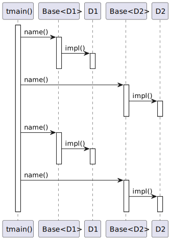

# t20019 - Curiously Recurring Template Pattern sequence diagram test case
## Config
```yaml
compilation_database_dir: ..
output_directory: puml
diagrams:
  t20019_sequence:
    type: sequence
    glob:
      - ../../tests/t20019/t20019.cc
    include:
      namespaces:
        - clanguml::t20019
    using_namespace:
      - clanguml::t20019
    start_from:
      - function: "clanguml::t20019::tmain()"
```
## Source code
File t20019.cc
```cpp
#include <cstdio>

namespace clanguml {
namespace t20019 {

// From https://en.cppreference.com/w/cpp/language/crtp

template <class Derived> struct Base {
    void name() { (static_cast<Derived *>(this))->impl(); }
};

struct D1 : public Base<D1> {
    void impl() { std::puts("D1::impl()"); }
};

struct D2 : public Base<D2> {
    void impl() { std::puts("D2::impl()"); }
};

void tmain()
{
    Base<D1> b1;
    b1.name();
    Base<D2> b2;
    b2.name();

    D1 d1;
    d1.name();
    D2 d2;
    d2.name();
}

}
}
```
## Generated UML diagrams

## Generated JSON models
```json
{
  "diagram_type": "sequence",
  "name": "t20019_sequence",
  "participants": [
    {
      "id": "375304196268652861",
      "name": "clanguml::t20019::tmain()",
      "source_location": {
        "file": "../../tests/t20019/t20019.cc",
        "line": 20
      },
      "type": "function"
    },
    {
      "id": "381327373934972004",
      "name": "clanguml::t20019::Base<clanguml::t20019::D1>",
      "source_location": {
        "file": "../../tests/t20019/t20019.cc",
        "line": 8
      },
      "type": "class"
    },
    {
      "id": "1282259011856139592",
      "name": "clanguml::t20019::D1",
      "source_location": {
        "file": "../../tests/t20019/t20019.cc",
        "line": 12
      },
      "type": "class"
    },
    {
      "id": "1659477498076328530",
      "name": "clanguml::t20019::Base<clanguml::t20019::D2>",
      "source_location": {
        "file": "../../tests/t20019/t20019.cc",
        "line": 8
      },
      "type": "class"
    },
    {
      "id": "1307471723138212117",
      "name": "clanguml::t20019::D2",
      "source_location": {
        "file": "../../tests/t20019/t20019.cc",
        "line": 16
      },
      "type": "class"
    }
  ],
  "sequences": [
    {
      "messages": [
        {
          "from": {
            "activity_id": "375304196268652861",
            "activity_name": "clanguml::t20019::tmain()",
            "participant_id": "375304196268652861",
            "participant_name": "clanguml::t20019::tmain()"
          },
          "name": "name()",
          "return_type": "void",
          "scope": "normal",
          "source_location": {
            "file": "../../tests/t20019/t20019.cc",
            "line": 23
          },
          "to": {
            "activity_id": "1038853547136467401",
            "activity_name": "clanguml::t20019::Base<clanguml::t20019::D1>::name()",
            "participant_id": "381327373934972004"
          },
          "type": "message"
        },
        {
          "from": {
            "activity_id": "1038853547136467401",
            "activity_name": "clanguml::t20019::Base<clanguml::t20019::D1>::name()",
            "participant_id": "381327373934972004"
          },
          "name": "impl()",
          "return_type": "void",
          "scope": "normal",
          "source_location": {
            "file": "../../tests/t20019/t20019.cc",
            "line": 9
          },
          "to": {
            "activity_id": "603969604599968603",
            "activity_name": "clanguml::t20019::D1::impl()",
            "participant_id": "1282259011856139592"
          },
          "type": "message"
        },
        {
          "from": {
            "activity_id": "375304196268652861",
            "activity_name": "clanguml::t20019::tmain()",
            "participant_id": "375304196268652861",
            "participant_name": "clanguml::t20019::tmain()"
          },
          "name": "name()",
          "return_type": "void",
          "scope": "normal",
          "source_location": {
            "file": "../../tests/t20019/t20019.cc",
            "line": 25
          },
          "to": {
            "activity_id": "1918672956676175365",
            "activity_name": "clanguml::t20019::Base<clanguml::t20019::D2>::name()",
            "participant_id": "1659477498076328530"
          },
          "type": "message"
        },
        {
          "from": {
            "activity_id": "1918672956676175365",
            "activity_name": "clanguml::t20019::Base<clanguml::t20019::D2>::name()",
            "participant_id": "1659477498076328530"
          },
          "name": "impl()",
          "return_type": "void",
          "scope": "normal",
          "source_location": {
            "file": "../../tests/t20019/t20019.cc",
            "line": 9
          },
          "to": {
            "activity_id": "861400435979772695",
            "activity_name": "clanguml::t20019::D2::impl()",
            "participant_id": "1307471723138212117"
          },
          "type": "message"
        },
        {
          "from": {
            "activity_id": "375304196268652861",
            "activity_name": "clanguml::t20019::tmain()",
            "participant_id": "375304196268652861",
            "participant_name": "clanguml::t20019::tmain()"
          },
          "name": "name()",
          "return_type": "void",
          "scope": "normal",
          "source_location": {
            "file": "../../tests/t20019/t20019.cc",
            "line": 28
          },
          "to": {
            "activity_id": "1038853547136467401",
            "activity_name": "clanguml::t20019::Base<clanguml::t20019::D1>::name()",
            "participant_id": "381327373934972004"
          },
          "type": "message"
        },
        {
          "from": {
            "activity_id": "375304196268652861",
            "activity_name": "clanguml::t20019::tmain()",
            "participant_id": "375304196268652861",
            "participant_name": "clanguml::t20019::tmain()"
          },
          "name": "name()",
          "return_type": "void",
          "scope": "normal",
          "source_location": {
            "file": "../../tests/t20019/t20019.cc",
            "line": 30
          },
          "to": {
            "activity_id": "1918672956676175365",
            "activity_name": "clanguml::t20019::Base<clanguml::t20019::D2>::name()",
            "participant_id": "1659477498076328530"
          },
          "type": "message"
        }
      ],
      "start_from": {
        "id": 375304196268652861,
        "location": "clanguml::t20019::tmain()"
      }
    }
  ],
  "using_namespace": "clanguml::t20019"
}
```
