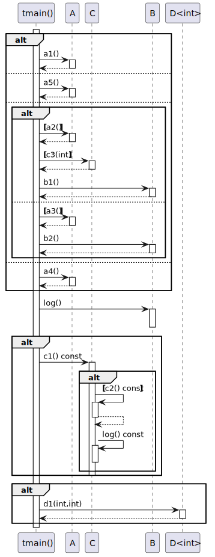
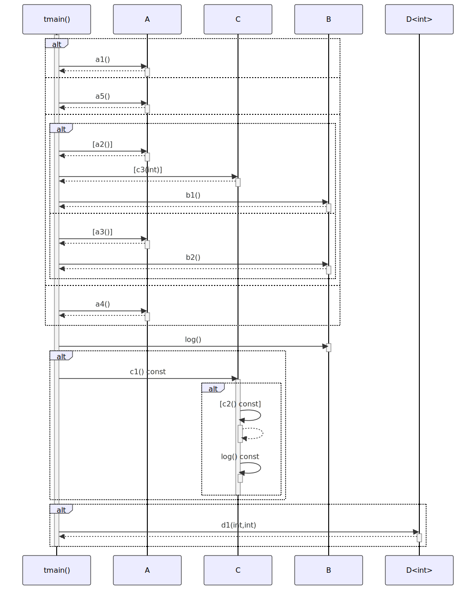

# t20020 - If statement sequence diagram test case
## Config
```yaml
diagrams:
  t20020_sequence:
    type: sequence
    glob:
      - t20020.cc
    include:
      namespaces:
        - clanguml::t20020
    using_namespace: clanguml::t20020
    from:
      - function: "clanguml::t20020::tmain()"
```
## Source code
File `tests/t20020/t20020.cc`
```cpp
#include <cmath>
#include <cstdint>

namespace clanguml {
namespace t20020 {
struct A {
    int a1() { return 0; }
    int a2() { return 1; }
    int a3() { return 2; }
    int a4() { return 3; }
    int a5() { return 4; }
};

struct B {
    void log() { }

    int b1() { return 3; }
    int b2() { return 4; }
};

struct C {
    void log() const { }

    void c1() const
    {
        if (c2())
            log();
    }

    bool c2() const { return true; }

    int c3(int x) { return x * 2; }
};

template <typename T> struct D {

    T d1(T x, T y) { return x + y; }
};

int tmain()
{
    A a;
    B b;
    C c;
    D<int> d;

    int result{0};

    if (reinterpret_cast<uint64_t>(&a) % 100 == 0ULL) {
        result = a.a1();
    }
    else if (reinterpret_cast<uint64_t>(&a) % 100 == 42ULL) {
        result = a.a5();
    }
    else if (reinterpret_cast<uint64_t>(&a) % 64 == 0ULL) {
        if (c.c3(a.a2()) > 2)
            result = b.b1();
        else if (a.a3() % 2)
            result = b.b2();
        else
            result = 0;
    }
    else {
        result = a.a4();
    }

    b.log();

    if (true)
        c.c1();

    if (true)
        d.d1(1, 1);

    // This if/else should not be included in the diagram at all
    // as the calls to std will be excluded by the diagram filters
    if (result != 2) {
        result = std::exp(result);
    }
    else if (result == 3) {
        result = 4;
    }
    else {
        result = std::exp(result + 1);
    }

    return result;
}
}
}
```
## Generated PlantUML diagrams

## Generated Mermaid diagrams

## Generated JSON models
```json
{
  "diagram_type": "sequence",
  "name": "t20020_sequence",
  "participants": [
    {
      "display_name": "tmain()",
      "full_name": "clanguml::t20020::tmain()",
      "id": "16146819176335709829",
      "name": "tmain",
      "namespace": "clanguml::t20020",
      "source_location": {
        "column": 5,
        "file": "t20020.cc",
        "line": 40,
        "translation_unit": "t20020.cc"
      },
      "type": "function"
    },
    {
      "activities": [
        {
          "display_name": "a1()",
          "full_name": "clanguml::t20020::A::a1()",
          "id": "16775290942108598841",
          "name": "a1",
          "namespace": "clanguml::t20020",
          "source_location": {
            "column": 9,
            "file": "t20020.cc",
            "line": 7,
            "translation_unit": "t20020.cc"
          },
          "type": "method"
        },
        {
          "display_name": "a5()",
          "full_name": "clanguml::t20020::A::a5()",
          "id": "7335608040362946110",
          "name": "a5",
          "namespace": "clanguml::t20020",
          "source_location": {
            "column": 9,
            "file": "t20020.cc",
            "line": 11,
            "translation_unit": "t20020.cc"
          },
          "type": "method"
        },
        {
          "display_name": "a2()",
          "full_name": "clanguml::t20020::A::a2()",
          "id": "4964521201252927074",
          "name": "a2",
          "namespace": "clanguml::t20020",
          "source_location": {
            "column": 9,
            "file": "t20020.cc",
            "line": 8,
            "translation_unit": "t20020.cc"
          },
          "type": "method"
        },
        {
          "display_name": "a3()",
          "full_name": "clanguml::t20020::A::a3()",
          "id": "3290602559800576789",
          "name": "a3",
          "namespace": "clanguml::t20020",
          "source_location": {
            "column": 9,
            "file": "t20020.cc",
            "line": 9,
            "translation_unit": "t20020.cc"
          },
          "type": "method"
        },
        {
          "display_name": "a4()",
          "full_name": "clanguml::t20020::A::a4()",
          "id": "12156456466425311183",
          "name": "a4",
          "namespace": "clanguml::t20020",
          "source_location": {
            "column": 9,
            "file": "t20020.cc",
            "line": 10,
            "translation_unit": "t20020.cc"
          },
          "type": "method"
        }
      ],
      "display_name": "A",
      "full_name": "clanguml::t20020::A",
      "id": "14373440985859320202",
      "name": "A",
      "namespace": "clanguml::t20020",
      "source_location": {
        "column": 8,
        "file": "t20020.cc",
        "line": 6,
        "translation_unit": "t20020.cc"
      },
      "type": "class"
    },
    {
      "activities": [
        {
          "display_name": "c3(int)",
          "full_name": "clanguml::t20020::C::c3(int)",
          "id": "5795942780535422380",
          "name": "c3",
          "namespace": "clanguml::t20020",
          "source_location": {
            "column": 9,
            "file": "t20020.cc",
            "line": 32,
            "translation_unit": "t20020.cc"
          },
          "type": "method"
        },
        {
          "display_name": "c1() const",
          "full_name": "clanguml::t20020::C::c1() const",
          "id": "2626919628201873890",
          "name": "c1",
          "namespace": "clanguml::t20020",
          "source_location": {
            "column": 10,
            "file": "t20020.cc",
            "line": 24,
            "translation_unit": "t20020.cc"
          },
          "type": "method"
        },
        {
          "display_name": "c2() const",
          "full_name": "clanguml::t20020::C::c2() const",
          "id": "12206405072295394620",
          "name": "c2",
          "namespace": "clanguml::t20020",
          "source_location": {
            "column": 10,
            "file": "t20020.cc",
            "line": 30,
            "translation_unit": "t20020.cc"
          },
          "type": "method"
        },
        {
          "display_name": "log() const",
          "full_name": "clanguml::t20020::C::log() const",
          "id": "4034233227040265905",
          "name": "log",
          "namespace": "clanguml::t20020",
          "source_location": {
            "column": 10,
            "file": "t20020.cc",
            "line": 22,
            "translation_unit": "t20020.cc"
          },
          "type": "method"
        }
      ],
      "display_name": "C",
      "full_name": "clanguml::t20020::C",
      "id": "10171725378642328026",
      "name": "C",
      "namespace": "clanguml::t20020",
      "source_location": {
        "column": 8,
        "file": "t20020.cc",
        "line": 21,
        "translation_unit": "t20020.cc"
      },
      "type": "class"
    },
    {
      "activities": [
        {
          "display_name": "b1()",
          "full_name": "clanguml::t20020::B::b1()",
          "id": "10442149399658662530",
          "name": "b1",
          "namespace": "clanguml::t20020",
          "source_location": {
            "column": 9,
            "file": "t20020.cc",
            "line": 17,
            "translation_unit": "t20020.cc"
          },
          "type": "method"
        },
        {
          "display_name": "b2()",
          "full_name": "clanguml::t20020::B::b2()",
          "id": "16414269261105951605",
          "name": "b2",
          "namespace": "clanguml::t20020",
          "source_location": {
            "column": 9,
            "file": "t20020.cc",
            "line": 18,
            "translation_unit": "t20020.cc"
          },
          "type": "method"
        },
        {
          "display_name": "log()",
          "full_name": "clanguml::t20020::B::log()",
          "id": "132246474442004179",
          "name": "log",
          "namespace": "clanguml::t20020",
          "source_location": {
            "column": 10,
            "file": "t20020.cc",
            "line": 15,
            "translation_unit": "t20020.cc"
          },
          "type": "method"
        }
      ],
      "display_name": "B",
      "full_name": "clanguml::t20020::B",
      "id": "12209943702147997039",
      "name": "B",
      "namespace": "clanguml::t20020",
      "source_location": {
        "column": 8,
        "file": "t20020.cc",
        "line": 14,
        "translation_unit": "t20020.cc"
      },
      "type": "class"
    },
    {
      "activities": [
        {
          "display_name": "d1(int,int)",
          "full_name": "clanguml::t20020::D<int>::d1(int,int)",
          "id": "9850236605416303918",
          "name": "d1",
          "namespace": "clanguml::t20020",
          "source_location": {
            "column": 7,
            "file": "t20020.cc",
            "line": 37,
            "translation_unit": "t20020.cc"
          },
          "type": "method"
        }
      ],
      "display_name": "D<int>",
      "full_name": "clanguml::t20020::D<int>",
      "id": "8964768984363284766",
      "name": "D",
      "namespace": "clanguml::t20020",
      "source_location": {
        "column": 30,
        "file": "t20020.cc",
        "line": 35,
        "translation_unit": "t20020.cc"
      },
      "type": "class"
    }
  ],
  "sequences": [
    {
      "from": {
        "id": "16146819176335709829",
        "location": "clanguml::t20020::tmain()"
      },
      "messages": [
        {
          "activity_id": "16146819176335709829",
          "branches": [
            {
              "messages": [
                {
                  "from": {
                    "activity_id": "16146819176335709829",
                    "participant_id": "16146819176335709829"
                  },
                  "name": "a1()",
                  "return_type": "int",
                  "scope": "normal",
                  "source_location": {
                    "column": 18,
                    "file": "t20020.cc",
                    "line": 50,
                    "translation_unit": "t20020.cc"
                  },
                  "to": {
                    "activity_id": "16775290942108598841",
                    "participant_id": "14373440985859320202"
                  },
                  "type": "message"
                },
                {
                  "from": {
                    "activity_id": "16775290942108598841",
                    "participant_id": "14373440985859320202"
                  },
                  "name": "",
                  "return_type": "int",
                  "scope": "normal",
                  "source_location": {
                    "column": 16,
                    "file": "t20020.cc",
                    "line": 7,
                    "translation_unit": "t20020.cc"
                  },
                  "to": {
                    "activity_id": "16146819176335709829",
                    "participant_id": "16146819176335709829"
                  },
                  "type": "return"
                }
              ],
              "type": "consequent"
            },
            {
              "messages": [
                {
                  "from": {
                    "activity_id": "16146819176335709829",
                    "participant_id": "16146819176335709829"
                  },
                  "name": "a5()",
                  "return_type": "int",
                  "scope": "normal",
                  "source_location": {
                    "column": 18,
                    "file": "t20020.cc",
                    "line": 53,
                    "translation_unit": "t20020.cc"
                  },
                  "to": {
                    "activity_id": "7335608040362946110",
                    "participant_id": "14373440985859320202"
                  },
                  "type": "message"
                },
                {
                  "from": {
                    "activity_id": "7335608040362946110",
                    "participant_id": "14373440985859320202"
                  },
                  "name": "",
                  "return_type": "int",
                  "scope": "normal",
                  "source_location": {
                    "column": 16,
                    "file": "t20020.cc",
                    "line": 11,
                    "translation_unit": "t20020.cc"
                  },
                  "to": {
                    "activity_id": "16146819176335709829",
                    "participant_id": "16146819176335709829"
                  },
                  "type": "return"
                }
              ],
              "type": "alternative"
            },
            {
              "messages": [
                {
                  "activity_id": "16146819176335709829",
                  "branches": [
                    {
                      "messages": [
                        {
                          "from": {
                            "activity_id": "16146819176335709829",
                            "participant_id": "16146819176335709829"
                          },
                          "name": "a2()",
                          "return_type": "int",
                          "scope": "condition",
                          "source_location": {
                            "column": 18,
                            "file": "t20020.cc",
                            "line": 56,
                            "translation_unit": "t20020.cc"
                          },
                          "to": {
                            "activity_id": "4964521201252927074",
                            "participant_id": "14373440985859320202"
                          },
                          "type": "message"
                        },
                        {
                          "from": {
                            "activity_id": "4964521201252927074",
                            "participant_id": "14373440985859320202"
                          },
                          "name": "",
                          "return_type": "int",
                          "scope": "normal",
                          "source_location": {
                            "column": 16,
                            "file": "t20020.cc",
                            "line": 8,
                            "translation_unit": "t20020.cc"
                          },
                          "to": {
                            "activity_id": "16146819176335709829",
                            "participant_id": "16146819176335709829"
                          },
                          "type": "return"
                        },
                        {
                          "from": {
                            "activity_id": "16146819176335709829",
                            "participant_id": "16146819176335709829"
                          },
                          "name": "c3(int)",
                          "return_type": "int",
                          "scope": "condition",
                          "source_location": {
                            "column": 13,
                            "file": "t20020.cc",
                            "line": 56,
                            "translation_unit": "t20020.cc"
                          },
                          "to": {
                            "activity_id": "5795942780535422380",
                            "participant_id": "10171725378642328026"
                          },
                          "type": "message"
                        },
                        {
                          "from": {
                            "activity_id": "5795942780535422380",
                            "participant_id": "10171725378642328026"
                          },
                          "name": "",
                          "return_type": "int",
                          "scope": "normal",
                          "source_location": {
                            "column": 21,
                            "file": "t20020.cc",
                            "line": 32,
                            "translation_unit": "t20020.cc"
                          },
                          "to": {
                            "activity_id": "16146819176335709829",
                            "participant_id": "16146819176335709829"
                          },
                          "type": "return"
                        },
                        {
                          "from": {
                            "activity_id": "16146819176335709829",
                            "participant_id": "16146819176335709829"
                          },
                          "name": "b1()",
                          "return_type": "int",
                          "scope": "normal",
                          "source_location": {
                            "column": 22,
                            "file": "t20020.cc",
                            "line": 57,
                            "translation_unit": "t20020.cc"
                          },
                          "to": {
                            "activity_id": "10442149399658662530",
                            "participant_id": "12209943702147997039"
                          },
                          "type": "message"
                        },
                        {
                          "from": {
                            "activity_id": "10442149399658662530",
                            "participant_id": "12209943702147997039"
                          },
                          "name": "",
                          "return_type": "int",
                          "scope": "normal",
                          "source_location": {
                            "column": 16,
                            "file": "t20020.cc",
                            "line": 17,
                            "translation_unit": "t20020.cc"
                          },
                          "to": {
                            "activity_id": "16146819176335709829",
                            "participant_id": "16146819176335709829"
                          },
                          "type": "return"
                        }
                      ],
                      "type": "consequent"
                    },
                    {
                      "messages": [
                        {
                          "from": {
                            "activity_id": "16146819176335709829",
                            "participant_id": "16146819176335709829"
                          },
                          "name": "a3()",
                          "return_type": "int",
                          "scope": "condition",
                          "source_location": {
                            "column": 18,
                            "file": "t20020.cc",
                            "line": 58,
                            "translation_unit": "t20020.cc"
                          },
                          "to": {
                            "activity_id": "3290602559800576789",
                            "participant_id": "14373440985859320202"
                          },
                          "type": "message"
                        },
                        {
                          "from": {
                            "activity_id": "3290602559800576789",
                            "participant_id": "14373440985859320202"
                          },
                          "name": "",
                          "return_type": "int",
                          "scope": "normal",
                          "source_location": {
                            "column": 16,
                            "file": "t20020.cc",
                            "line": 9,
                            "translation_unit": "t20020.cc"
                          },
                          "to": {
                            "activity_id": "16146819176335709829",
                            "participant_id": "16146819176335709829"
                          },
                          "type": "return"
                        },
                        {
                          "from": {
                            "activity_id": "16146819176335709829",
                            "participant_id": "16146819176335709829"
                          },
                          "name": "b2()",
                          "return_type": "int",
                          "scope": "normal",
                          "source_location": {
                            "column": 22,
                            "file": "t20020.cc",
                            "line": 59,
                            "translation_unit": "t20020.cc"
                          },
                          "to": {
                            "activity_id": "16414269261105951605",
                            "participant_id": "12209943702147997039"
                          },
                          "type": "message"
                        },
                        {
                          "from": {
                            "activity_id": "16414269261105951605",
                            "participant_id": "12209943702147997039"
                          },
                          "name": "",
                          "return_type": "int",
                          "scope": "normal",
                          "source_location": {
                            "column": 16,
                            "file": "t20020.cc",
                            "line": 18,
                            "translation_unit": "t20020.cc"
                          },
                          "to": {
                            "activity_id": "16146819176335709829",
                            "participant_id": "16146819176335709829"
                          },
                          "type": "return"
                        }
                      ],
                      "type": "alternative"
                    }
                  ],
                  "name": "if",
                  "type": "alt"
                }
              ],
              "type": "alternative"
            },
            {
              "messages": [
                {
                  "from": {
                    "activity_id": "16146819176335709829",
                    "participant_id": "16146819176335709829"
                  },
                  "name": "a4()",
                  "return_type": "int",
                  "scope": "normal",
                  "source_location": {
                    "column": 18,
                    "file": "t20020.cc",
                    "line": 64,
                    "translation_unit": "t20020.cc"
                  },
                  "to": {
                    "activity_id": "12156456466425311183",
                    "participant_id": "14373440985859320202"
                  },
                  "type": "message"
                },
                {
                  "from": {
                    "activity_id": "12156456466425311183",
                    "participant_id": "14373440985859320202"
                  },
                  "name": "",
                  "return_type": "int",
                  "scope": "normal",
                  "source_location": {
                    "column": 16,
                    "file": "t20020.cc",
                    "line": 10,
                    "translation_unit": "t20020.cc"
                  },
                  "to": {
                    "activity_id": "16146819176335709829",
                    "participant_id": "16146819176335709829"
                  },
                  "type": "return"
                }
              ],
              "type": "alternative"
            }
          ],
          "name": "if",
          "type": "alt"
        },
        {
          "from": {
            "activity_id": "16146819176335709829",
            "participant_id": "16146819176335709829"
          },
          "name": "log()",
          "return_type": "void",
          "scope": "normal",
          "source_location": {
            "column": 5,
            "file": "t20020.cc",
            "line": 67,
            "translation_unit": "t20020.cc"
          },
          "to": {
            "activity_id": "132246474442004179",
            "participant_id": "12209943702147997039"
          },
          "type": "message"
        },
        {
          "activity_id": "16146819176335709829",
          "branches": [
            {
              "messages": [
                {
                  "from": {
                    "activity_id": "16146819176335709829",
                    "participant_id": "16146819176335709829"
                  },
                  "name": "c1() const",
                  "return_type": "void",
                  "scope": "normal",
                  "source_location": {
                    "column": 9,
                    "file": "t20020.cc",
                    "line": 70,
                    "translation_unit": "t20020.cc"
                  },
                  "to": {
                    "activity_id": "2626919628201873890",
                    "participant_id": "10171725378642328026"
                  },
                  "type": "message"
                },
                {
                  "activity_id": "2626919628201873890",
                  "branches": [
                    {
                      "messages": [
                        {
                          "from": {
                            "activity_id": "2626919628201873890",
                            "participant_id": "10171725378642328026"
                          },
                          "name": "c2() const",
                          "return_type": "bool",
                          "scope": "condition",
                          "source_location": {
                            "column": 13,
                            "file": "t20020.cc",
                            "line": 26,
                            "translation_unit": "t20020.cc"
                          },
                          "to": {
                            "activity_id": "12206405072295394620",
                            "participant_id": "10171725378642328026"
                          },
                          "type": "message"
                        },
                        {
                          "from": {
                            "activity_id": "12206405072295394620",
                            "participant_id": "10171725378642328026"
                          },
                          "name": "",
                          "return_type": "_Bool",
                          "scope": "normal",
                          "source_location": {
                            "column": 23,
                            "file": "t20020.cc",
                            "line": 30,
                            "translation_unit": "t20020.cc"
                          },
                          "to": {
                            "activity_id": "2626919628201873890",
                            "participant_id": "10171725378642328026"
                          },
                          "type": "return"
                        },
                        {
                          "from": {
                            "activity_id": "2626919628201873890",
                            "participant_id": "10171725378642328026"
                          },
                          "name": "log() const",
                          "return_type": "void",
                          "scope": "normal",
                          "source_location": {
                            "column": 13,
                            "file": "t20020.cc",
                            "line": 27,
                            "translation_unit": "t20020.cc"
                          },
                          "to": {
                            "activity_id": "4034233227040265905",
                            "participant_id": "10171725378642328026"
                          },
                          "type": "message"
                        }
                      ],
                      "type": "consequent"
                    }
                  ],
                  "name": "if",
                  "type": "alt"
                }
              ],
              "type": "consequent"
            }
          ],
          "name": "if",
          "type": "alt"
        },
        {
          "activity_id": "16146819176335709829",
          "branches": [
            {
              "messages": [
                {
                  "from": {
                    "activity_id": "16146819176335709829",
                    "participant_id": "16146819176335709829"
                  },
                  "name": "d1(int,int)",
                  "return_type": "int",
                  "scope": "normal",
                  "source_location": {
                    "column": 9,
                    "file": "t20020.cc",
                    "line": 73,
                    "translation_unit": "t20020.cc"
                  },
                  "to": {
                    "activity_id": "9850236605416303918",
                    "participant_id": "8964768984363284766"
                  },
                  "type": "message"
                },
                {
                  "from": {
                    "activity_id": "9850236605416303918",
                    "participant_id": "8964768984363284766"
                  },
                  "name": "",
                  "return_type": "int",
                  "scope": "normal",
                  "source_location": {
                    "column": 22,
                    "file": "t20020.cc",
                    "line": 37,
                    "translation_unit": "t20020.cc"
                  },
                  "to": {
                    "activity_id": "16146819176335709829",
                    "participant_id": "16146819176335709829"
                  },
                  "type": "return"
                }
              ],
              "type": "consequent"
            }
          ],
          "name": "if",
          "type": "alt"
        }
      ]
    }
  ],
  "using_namespace": "clanguml::t20020"
}
```
## Generated GraphML models
