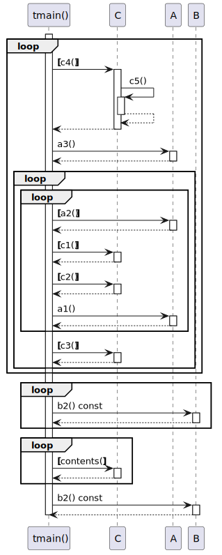
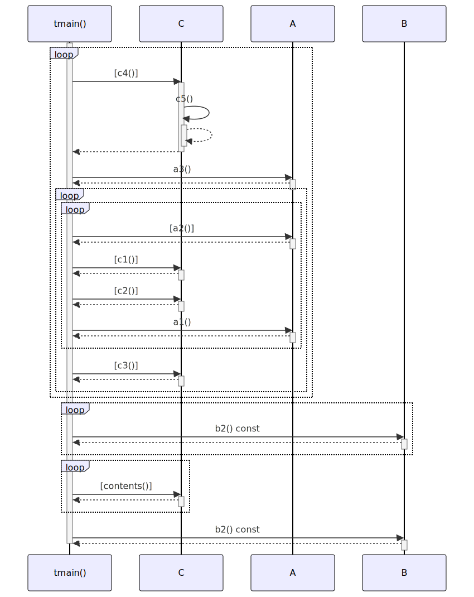

# t20021 - Loop statements sequence diagram test case
## Config
```yaml
diagrams:
  t20021_sequence:
    type: sequence
    glob:
      - t20021.cc
    include:
      namespaces:
        - clanguml::t20021
    using_namespace: clanguml::t20021
    from:
      - function: "clanguml::t20021::tmain()"
```
## Source code
File `tests/t20021/t20021.cc`
```cpp
#include <vector>

namespace clanguml {
namespace t20021 {
struct A {
    int a1() { return 0; }
    int a2() { return 1; }
    int a3() { return 2; }
};

struct B {
    void log() { }

    int b1() const { return 3; }
    int b2() const { return 4; }
};

struct C {
    int c1() { return 1; }
    int c2() { return 2; }
    int c3() { return 3; }
    int c4() { return c5(); }
    int c5() { return 5; }

    std::vector<int> &contents() { return contents_; }

    std::vector<int> contents_;
};

int tmain()
{
    A a;
    std::vector<B> b;
    C c;

    int i = 10;
    while (i -= c.c4()) {
        int j = a.a3();
        do {
            for (int l = a.a2(); l > c.c1(); l -= c.c2())
                a.a1();
        } while (j -= c.c3());
    }

    int result = 0;
    for (const auto &bi : b) {
        result += bi.b2();
    }

    for (const auto &ci : c.contents()) {
        result += ci;
    }

    return b.front().b2() + result;
}
}
}
```
## Generated PlantUML diagrams

## Generated Mermaid diagrams

## Generated JSON models
```json
{
  "diagram_type": "sequence",
  "name": "t20021_sequence",
  "participants": [
    {
      "display_name": "tmain()",
      "full_name": "clanguml::t20021::tmain()",
      "id": "12448449669310848639",
      "name": "tmain",
      "namespace": "clanguml::t20021",
      "source_location": {
        "column": 5,
        "file": "t20021.cc",
        "line": 30,
        "translation_unit": "t20021.cc"
      },
      "type": "function"
    },
    {
      "activities": [
        {
          "display_name": "c4()",
          "full_name": "clanguml::t20021::C::c4()",
          "id": "13009883787553112643",
          "name": "c4",
          "namespace": "clanguml::t20021",
          "source_location": {
            "column": 9,
            "file": "t20021.cc",
            "line": 22,
            "translation_unit": "t20021.cc"
          },
          "type": "method"
        },
        {
          "display_name": "c5()",
          "full_name": "clanguml::t20021::C::c5()",
          "id": "12233751195157806411",
          "name": "c5",
          "namespace": "clanguml::t20021",
          "source_location": {
            "column": 9,
            "file": "t20021.cc",
            "line": 23,
            "translation_unit": "t20021.cc"
          },
          "type": "method"
        },
        {
          "display_name": "c1()",
          "full_name": "clanguml::t20021::C::c1()",
          "id": "7955115275054034823",
          "name": "c1",
          "namespace": "clanguml::t20021",
          "source_location": {
            "column": 9,
            "file": "t20021.cc",
            "line": 19,
            "translation_unit": "t20021.cc"
          },
          "type": "method"
        },
        {
          "display_name": "c2()",
          "full_name": "clanguml::t20021::C::c2()",
          "id": "12989709263139938898",
          "name": "c2",
          "namespace": "clanguml::t20021",
          "source_location": {
            "column": 9,
            "file": "t20021.cc",
            "line": 20,
            "translation_unit": "t20021.cc"
          },
          "type": "method"
        },
        {
          "display_name": "c3()",
          "full_name": "clanguml::t20021::C::c3()",
          "id": "5242803683984861467",
          "name": "c3",
          "namespace": "clanguml::t20021",
          "source_location": {
            "column": 9,
            "file": "t20021.cc",
            "line": 21,
            "translation_unit": "t20021.cc"
          },
          "type": "method"
        },
        {
          "display_name": "contents()",
          "full_name": "clanguml::t20021::C::contents()",
          "id": "7225232336241831904",
          "name": "contents",
          "namespace": "clanguml::t20021",
          "source_location": {
            "column": 23,
            "file": "t20021.cc",
            "line": 25,
            "translation_unit": "t20021.cc"
          },
          "type": "method"
        }
      ],
      "display_name": "C",
      "full_name": "clanguml::t20021::C",
      "id": "14638440345497919671",
      "name": "C",
      "namespace": "clanguml::t20021",
      "source_location": {
        "column": 8,
        "file": "t20021.cc",
        "line": 18,
        "translation_unit": "t20021.cc"
      },
      "type": "class"
    },
    {
      "activities": [
        {
          "display_name": "a3()",
          "full_name": "clanguml::t20021::A::a3()",
          "id": "9584228205451532143",
          "name": "a3",
          "namespace": "clanguml::t20021",
          "source_location": {
            "column": 9,
            "file": "t20021.cc",
            "line": 8,
            "translation_unit": "t20021.cc"
          },
          "type": "method"
        },
        {
          "display_name": "a2()",
          "full_name": "clanguml::t20021::A::a2()",
          "id": "10040950114312037777",
          "name": "a2",
          "namespace": "clanguml::t20021",
          "source_location": {
            "column": 9,
            "file": "t20021.cc",
            "line": 7,
            "translation_unit": "t20021.cc"
          },
          "type": "method"
        },
        {
          "display_name": "a1()",
          "full_name": "clanguml::t20021::A::a1()",
          "id": "15535914443927404292",
          "name": "a1",
          "namespace": "clanguml::t20021",
          "source_location": {
            "column": 9,
            "file": "t20021.cc",
            "line": 6,
            "translation_unit": "t20021.cc"
          },
          "type": "method"
        }
      ],
      "display_name": "A",
      "full_name": "clanguml::t20021::A",
      "id": "2707409638290927508",
      "name": "A",
      "namespace": "clanguml::t20021",
      "source_location": {
        "column": 8,
        "file": "t20021.cc",
        "line": 5,
        "translation_unit": "t20021.cc"
      },
      "type": "class"
    },
    {
      "activities": [
        {
          "display_name": "b2() const",
          "full_name": "clanguml::t20021::B::b2() const",
          "id": "2701094115765678834",
          "name": "b2",
          "namespace": "clanguml::t20021",
          "source_location": {
            "column": 9,
            "file": "t20021.cc",
            "line": 15,
            "translation_unit": "t20021.cc"
          },
          "type": "method"
        }
      ],
      "display_name": "B",
      "full_name": "clanguml::t20021::B",
      "id": "3922739783329984278",
      "name": "B",
      "namespace": "clanguml::t20021",
      "source_location": {
        "column": 8,
        "file": "t20021.cc",
        "line": 11,
        "translation_unit": "t20021.cc"
      },
      "type": "class"
    }
  ],
  "sequences": [
    {
      "from": {
        "id": "12448449669310848639",
        "location": "clanguml::t20021::tmain()"
      },
      "messages": [
        {
          "activity_id": "12448449669310848639",
          "messages": [
            {
              "from": {
                "activity_id": "12448449669310848639",
                "participant_id": "12448449669310848639"
              },
              "name": "c4()",
              "return_type": "int",
              "scope": "condition",
              "source_location": {
                "column": 17,
                "file": "t20021.cc",
                "line": 37,
                "translation_unit": "t20021.cc"
              },
              "to": {
                "activity_id": "13009883787553112643",
                "participant_id": "14638440345497919671"
              },
              "type": "message"
            },
            {
              "from": {
                "activity_id": "13009883787553112643",
                "participant_id": "14638440345497919671"
              },
              "name": "c5()",
              "return_type": "int",
              "scope": "normal",
              "source_location": {
                "column": 23,
                "file": "t20021.cc",
                "line": 22,
                "translation_unit": "t20021.cc"
              },
              "to": {
                "activity_id": "12233751195157806411",
                "participant_id": "14638440345497919671"
              },
              "type": "message"
            },
            {
              "from": {
                "activity_id": "12233751195157806411",
                "participant_id": "14638440345497919671"
              },
              "name": "",
              "return_type": "int",
              "scope": "normal",
              "source_location": {
                "column": 16,
                "file": "t20021.cc",
                "line": 23,
                "translation_unit": "t20021.cc"
              },
              "to": {
                "activity_id": "13009883787553112643",
                "participant_id": "14638440345497919671"
              },
              "type": "return"
            },
            {
              "from": {
                "activity_id": "13009883787553112643",
                "participant_id": "14638440345497919671"
              },
              "name": "",
              "return_type": "int",
              "scope": "normal",
              "source_location": {
                "column": 16,
                "file": "t20021.cc",
                "line": 22,
                "translation_unit": "t20021.cc"
              },
              "to": {
                "activity_id": "12448449669310848639",
                "participant_id": "12448449669310848639"
              },
              "type": "return"
            },
            {
              "from": {
                "activity_id": "12448449669310848639",
                "participant_id": "12448449669310848639"
              },
              "name": "a3()",
              "return_type": "int",
              "scope": "normal",
              "source_location": {
                "column": 17,
                "file": "t20021.cc",
                "line": 38,
                "translation_unit": "t20021.cc"
              },
              "to": {
                "activity_id": "9584228205451532143",
                "participant_id": "2707409638290927508"
              },
              "type": "message"
            },
            {
              "from": {
                "activity_id": "9584228205451532143",
                "participant_id": "2707409638290927508"
              },
              "name": "",
              "return_type": "int",
              "scope": "normal",
              "source_location": {
                "column": 16,
                "file": "t20021.cc",
                "line": 8,
                "translation_unit": "t20021.cc"
              },
              "to": {
                "activity_id": "12448449669310848639",
                "participant_id": "12448449669310848639"
              },
              "type": "return"
            },
            {
              "activity_id": "12448449669310848639",
              "messages": [
                {
                  "activity_id": "12448449669310848639",
                  "messages": [
                    {
                      "from": {
                        "activity_id": "12448449669310848639",
                        "participant_id": "12448449669310848639"
                      },
                      "name": "a2()",
                      "return_type": "int",
                      "scope": "condition",
                      "source_location": {
                        "column": 26,
                        "file": "t20021.cc",
                        "line": 40,
                        "translation_unit": "t20021.cc"
                      },
                      "to": {
                        "activity_id": "10040950114312037777",
                        "participant_id": "2707409638290927508"
                      },
                      "type": "message"
                    },
                    {
                      "from": {
                        "activity_id": "10040950114312037777",
                        "participant_id": "2707409638290927508"
                      },
                      "name": "",
                      "return_type": "int",
                      "scope": "normal",
                      "source_location": {
                        "column": 16,
                        "file": "t20021.cc",
                        "line": 7,
                        "translation_unit": "t20021.cc"
                      },
                      "to": {
                        "activity_id": "12448449669310848639",
                        "participant_id": "12448449669310848639"
                      },
                      "type": "return"
                    },
                    {
                      "from": {
                        "activity_id": "12448449669310848639",
                        "participant_id": "12448449669310848639"
                      },
                      "name": "c1()",
                      "return_type": "int",
                      "scope": "condition",
                      "source_location": {
                        "column": 38,
                        "file": "t20021.cc",
                        "line": 40,
                        "translation_unit": "t20021.cc"
                      },
                      "to": {
                        "activity_id": "7955115275054034823",
                        "participant_id": "14638440345497919671"
                      },
                      "type": "message"
                    },
                    {
                      "from": {
                        "activity_id": "7955115275054034823",
                        "participant_id": "14638440345497919671"
                      },
                      "name": "",
                      "return_type": "int",
                      "scope": "normal",
                      "source_location": {
                        "column": 16,
                        "file": "t20021.cc",
                        "line": 19,
                        "translation_unit": "t20021.cc"
                      },
                      "to": {
                        "activity_id": "12448449669310848639",
                        "participant_id": "12448449669310848639"
                      },
                      "type": "return"
                    },
                    {
                      "from": {
                        "activity_id": "12448449669310848639",
                        "participant_id": "12448449669310848639"
                      },
                      "name": "c2()",
                      "return_type": "int",
                      "scope": "condition",
                      "source_location": {
                        "column": 51,
                        "file": "t20021.cc",
                        "line": 40,
                        "translation_unit": "t20021.cc"
                      },
                      "to": {
                        "activity_id": "12989709263139938898",
                        "participant_id": "14638440345497919671"
                      },
                      "type": "message"
                    },
                    {
                      "from": {
                        "activity_id": "12989709263139938898",
                        "participant_id": "14638440345497919671"
                      },
                      "name": "",
                      "return_type": "int",
                      "scope": "normal",
                      "source_location": {
                        "column": 16,
                        "file": "t20021.cc",
                        "line": 20,
                        "translation_unit": "t20021.cc"
                      },
                      "to": {
                        "activity_id": "12448449669310848639",
                        "participant_id": "12448449669310848639"
                      },
                      "type": "return"
                    },
                    {
                      "from": {
                        "activity_id": "12448449669310848639",
                        "participant_id": "12448449669310848639"
                      },
                      "name": "a1()",
                      "return_type": "int",
                      "scope": "normal",
                      "source_location": {
                        "column": 17,
                        "file": "t20021.cc",
                        "line": 41,
                        "translation_unit": "t20021.cc"
                      },
                      "to": {
                        "activity_id": "15535914443927404292",
                        "participant_id": "2707409638290927508"
                      },
                      "type": "message"
                    },
                    {
                      "from": {
                        "activity_id": "15535914443927404292",
                        "participant_id": "2707409638290927508"
                      },
                      "name": "",
                      "return_type": "int",
                      "scope": "normal",
                      "source_location": {
                        "column": 16,
                        "file": "t20021.cc",
                        "line": 6,
                        "translation_unit": "t20021.cc"
                      },
                      "to": {
                        "activity_id": "12448449669310848639",
                        "participant_id": "12448449669310848639"
                      },
                      "type": "return"
                    }
                  ],
                  "name": "for",
                  "type": "loop"
                },
                {
                  "from": {
                    "activity_id": "12448449669310848639",
                    "participant_id": "12448449669310848639"
                  },
                  "name": "c3()",
                  "return_type": "int",
                  "scope": "condition",
                  "source_location": {
                    "column": 23,
                    "file": "t20021.cc",
                    "line": 42,
                    "translation_unit": "t20021.cc"
                  },
                  "to": {
                    "activity_id": "5242803683984861467",
                    "participant_id": "14638440345497919671"
                  },
                  "type": "message"
                },
                {
                  "from": {
                    "activity_id": "5242803683984861467",
                    "participant_id": "14638440345497919671"
                  },
                  "name": "",
                  "return_type": "int",
                  "scope": "normal",
                  "source_location": {
                    "column": 16,
                    "file": "t20021.cc",
                    "line": 21,
                    "translation_unit": "t20021.cc"
                  },
                  "to": {
                    "activity_id": "12448449669310848639",
                    "participant_id": "12448449669310848639"
                  },
                  "type": "return"
                }
              ],
              "name": "do",
              "type": "loop"
            }
          ],
          "name": "while",
          "type": "loop"
        },
        {
          "activity_id": "12448449669310848639",
          "messages": [
            {
              "from": {
                "activity_id": "12448449669310848639",
                "participant_id": "12448449669310848639"
              },
              "name": "b2() const",
              "return_type": "int",
              "scope": "normal",
              "source_location": {
                "column": 19,
                "file": "t20021.cc",
                "line": 47,
                "translation_unit": "t20021.cc"
              },
              "to": {
                "activity_id": "2701094115765678834",
                "participant_id": "3922739783329984278"
              },
              "type": "message"
            },
            {
              "from": {
                "activity_id": "2701094115765678834",
                "participant_id": "3922739783329984278"
              },
              "name": "",
              "return_type": "int",
              "scope": "normal",
              "source_location": {
                "column": 22,
                "file": "t20021.cc",
                "line": 15,
                "translation_unit": "t20021.cc"
              },
              "to": {
                "activity_id": "12448449669310848639",
                "participant_id": "12448449669310848639"
              },
              "type": "return"
            }
          ],
          "name": "for",
          "type": "loop"
        },
        {
          "activity_id": "12448449669310848639",
          "messages": [
            {
              "from": {
                "activity_id": "12448449669310848639",
                "participant_id": "12448449669310848639"
              },
              "name": "contents()",
              "return_type": "std::vector<int> &",
              "scope": "condition",
              "source_location": {
                "column": 27,
                "file": "t20021.cc",
                "line": 50,
                "translation_unit": "t20021.cc"
              },
              "to": {
                "activity_id": "7225232336241831904",
                "participant_id": "14638440345497919671"
              },
              "type": "message"
            },
            {
              "from": {
                "activity_id": "7225232336241831904",
                "participant_id": "14638440345497919671"
              },
              "name": "",
              "return_type": "std::vector<int> &",
              "scope": "normal",
              "source_location": {
                "column": 36,
                "file": "t20021.cc",
                "line": 25,
                "translation_unit": "t20021.cc"
              },
              "to": {
                "activity_id": "12448449669310848639",
                "participant_id": "12448449669310848639"
              },
              "type": "return"
            }
          ],
          "name": "for",
          "type": "loop"
        },
        {
          "from": {
            "activity_id": "12448449669310848639",
            "participant_id": "12448449669310848639"
          },
          "name": "b2() const",
          "return_type": "int",
          "scope": "normal",
          "source_location": {
            "column": 12,
            "file": "t20021.cc",
            "line": 54,
            "translation_unit": "t20021.cc"
          },
          "to": {
            "activity_id": "2701094115765678834",
            "participant_id": "3922739783329984278"
          },
          "type": "message"
        },
        {
          "from": {
            "activity_id": "2701094115765678834",
            "participant_id": "3922739783329984278"
          },
          "name": "",
          "return_type": "int",
          "scope": "normal",
          "source_location": {
            "column": 22,
            "file": "t20021.cc",
            "line": 15,
            "translation_unit": "t20021.cc"
          },
          "to": {
            "activity_id": "12448449669310848639",
            "participant_id": "12448449669310848639"
          },
          "type": "return"
        }
      ]
    }
  ],
  "using_namespace": "clanguml::t20021"
}
```
## Generated GraphML models
