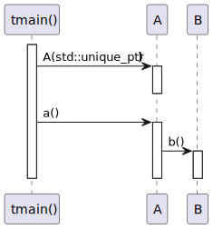
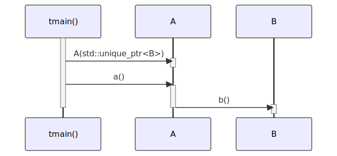

# t20022 - Forward class declaration sequence diagram test case
## Config
```yaml
diagrams:
  t20022_sequence:
    type: sequence
    glob:
      - t20022.cc
    include:
      namespaces:
        - clanguml::t20022
    using_namespace: clanguml::t20022
    from:
      - function: "clanguml::t20022::tmain()"
```
## Source code
File `tests/t20022/t20022.cc`
```cpp
#include <memory>

namespace clanguml {
namespace t20022 {
class B;

class A {
public:
    A(std::unique_ptr<B> b);

    void a();

    std::unique_ptr<B> b_;
};

class B {
public:
    void b() { }
};

A::A(std::unique_ptr<B> b)
    : b_{std::move(b)}
{
}

void A::a() { b_->b(); }

int tmain()
{
    A a{std::make_unique<B>()};

    a.a();

    return 0;
}
}
}
```
## Generated PlantUML diagrams

## Generated Mermaid diagrams

## Generated JSON models
```json
{
  "diagram_type": "sequence",
  "name": "t20022_sequence",
  "participants": [
    {
      "display_name": "tmain()",
      "full_name": "clanguml::t20022::tmain()",
      "id": "1374011101998494743",
      "name": "tmain",
      "namespace": "clanguml::t20022",
      "source_location": {
        "column": 5,
        "file": "t20022.cc",
        "line": 28,
        "translation_unit": "t20022.cc"
      },
      "type": "function"
    },
    {
      "activities": [
        {
          "display_name": "A(std::unique_ptr<B>)",
          "full_name": "clanguml::t20022::A::A(std::unique_ptr<B>)",
          "id": "1226569306557207632",
          "name": "A",
          "namespace": "",
          "source_location": {
            "column": 4,
            "file": "t20022.cc",
            "line": 21,
            "translation_unit": "t20022.cc"
          },
          "type": "method"
        },
        {
          "display_name": "a()",
          "full_name": "clanguml::t20022::A::a()",
          "id": "1158824701633811441",
          "name": "a",
          "namespace": "",
          "source_location": {
            "column": 9,
            "file": "t20022.cc",
            "line": 26,
            "translation_unit": "t20022.cc"
          },
          "type": "method"
        }
      ],
      "display_name": "A",
      "full_name": "clanguml::t20022::A",
      "id": "1535467498096081224",
      "name": "A",
      "namespace": "clanguml::t20022",
      "source_location": {
        "column": 7,
        "file": "t20022.cc",
        "line": 7,
        "translation_unit": "t20022.cc"
      },
      "type": "class"
    },
    {
      "activities": [
        {
          "display_name": "b()",
          "full_name": "clanguml::t20022::B::b()",
          "id": "2114222968575993291",
          "name": "b",
          "namespace": "",
          "source_location": {
            "column": 10,
            "file": "t20022.cc",
            "line": 18,
            "translation_unit": "t20022.cc"
          },
          "type": "method"
        }
      ],
      "display_name": "B",
      "full_name": "clanguml::t20022::B",
      "id": "1316821731069034940",
      "name": "B",
      "namespace": "clanguml::t20022",
      "source_location": {
        "column": 7,
        "file": "t20022.cc",
        "line": 16,
        "translation_unit": "t20022.cc"
      },
      "type": "class"
    }
  ],
  "sequences": [
    {
      "messages": [
        {
          "from": {
            "activity_id": "1374011101998494743",
            "participant_id": "1374011101998494743"
          },
          "name": "A(std::unique_ptr<B>)",
          "return_type": "void",
          "scope": "normal",
          "source_location": {
            "column": 7,
            "file": "t20022.cc",
            "line": 30,
            "translation_unit": "t20022.cc"
          },
          "to": {
            "activity_id": "1226569306557207632",
            "participant_id": "1535467498096081224"
          },
          "type": "message"
        },
        {
          "from": {
            "activity_id": "1374011101998494743",
            "participant_id": "1374011101998494743"
          },
          "name": "a()",
          "return_type": "void",
          "scope": "normal",
          "source_location": {
            "column": 5,
            "file": "t20022.cc",
            "line": 32,
            "translation_unit": "t20022.cc"
          },
          "to": {
            "activity_id": "1158824701633811441",
            "participant_id": "1535467498096081224"
          },
          "type": "message"
        },
        {
          "from": {
            "activity_id": "1158824701633811441",
            "participant_id": "1535467498096081224"
          },
          "name": "b()",
          "return_type": "void",
          "scope": "normal",
          "source_location": {
            "column": 15,
            "file": "t20022.cc",
            "line": 26,
            "translation_unit": "t20022.cc"
          },
          "to": {
            "activity_id": "2114222968575993291",
            "participant_id": "1316821731069034940"
          },
          "type": "message"
        }
      ],
      "start_from": {
        "id": 1374011101998494743,
        "location": "clanguml::t20022::tmain()"
      }
    }
  ],
  "using_namespace": "clanguml::t20022"
}
```
