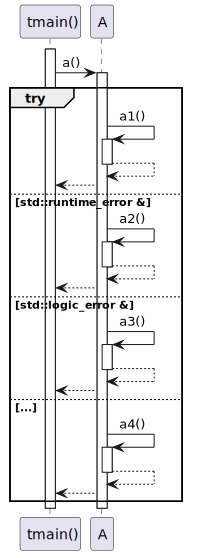
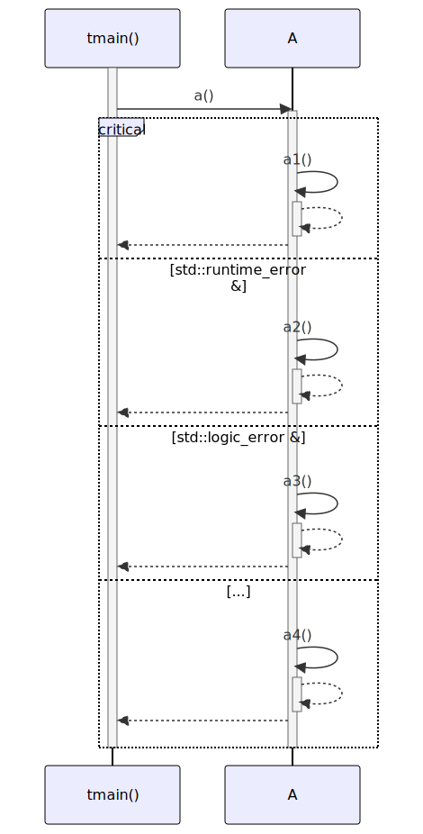

# t20023 - Try/catch statement sequence diagram test case
## Config
```yaml
diagrams:
  t20023_sequence:
    type: sequence
    glob:
      - t20023.cc
    include:
      namespaces:
        - clanguml::t20023
    using_namespace: clanguml::t20023
    from:
      - function: "clanguml::t20023::tmain()"
```
## Source code
File `tests/t20023/t20023.cc`
```cpp
#include <stdexcept>

namespace clanguml {
namespace t20023 {

struct A {
    int a1() { return 1; }
    int a2() { return 2; }
    int a3() { return 3; }
    int a4() { return 3; }

    int a()
    {
        try {
            return a1();
        }
        catch (std::runtime_error &) {
            return a2();
        }
        catch (std::logic_error &) {
            return a3();
        }
        catch (...) {
            return a4();
        }
    }
};

int tmain()
{
    A a;

    int result{};

    result = a.a();

    return result;
}
}
}
```
## Generated PlantUML diagrams

## Generated Mermaid diagrams

## Generated JSON models
```json
{
  "diagram_type": "sequence",
  "name": "t20023_sequence",
  "participants": [
    {
      "display_name": "tmain()",
      "full_name": "clanguml::t20023::tmain()",
      "id": "1523317061644456029",
      "name": "tmain",
      "namespace": "clanguml::t20023",
      "source_location": {
        "column": 5,
        "file": "t20023.cc",
        "line": 29,
        "translation_unit": "t20023.cc"
      },
      "type": "function"
    },
    {
      "activities": [
        {
          "display_name": "a()",
          "full_name": "clanguml::t20023::A::a()",
          "id": "8737148869281330909",
          "name": "a",
          "namespace": "clanguml::t20023",
          "source_location": {
            "column": 9,
            "file": "t20023.cc",
            "line": 12,
            "translation_unit": "t20023.cc"
          },
          "type": "method"
        },
        {
          "display_name": "a1()",
          "full_name": "clanguml::t20023::A::a1()",
          "id": "16551719331988527677",
          "name": "a1",
          "namespace": "clanguml::t20023",
          "source_location": {
            "column": 9,
            "file": "t20023.cc",
            "line": 7,
            "translation_unit": "t20023.cc"
          },
          "type": "method"
        },
        {
          "display_name": "a2()",
          "full_name": "clanguml::t20023::A::a2()",
          "id": "14759338254286719414",
          "name": "a2",
          "namespace": "clanguml::t20023",
          "source_location": {
            "column": 9,
            "file": "t20023.cc",
            "line": 8,
            "translation_unit": "t20023.cc"
          },
          "type": "method"
        },
        {
          "display_name": "a3()",
          "full_name": "clanguml::t20023::A::a3()",
          "id": "5077039469158427631",
          "name": "a3",
          "namespace": "clanguml::t20023",
          "source_location": {
            "column": 9,
            "file": "t20023.cc",
            "line": 9,
            "translation_unit": "t20023.cc"
          },
          "type": "method"
        },
        {
          "display_name": "a4()",
          "full_name": "clanguml::t20023::A::a4()",
          "id": "7994159538546150852",
          "name": "a4",
          "namespace": "clanguml::t20023",
          "source_location": {
            "column": 9,
            "file": "t20023.cc",
            "line": 10,
            "translation_unit": "t20023.cc"
          },
          "type": "method"
        }
      ],
      "display_name": "A",
      "full_name": "clanguml::t20023::A",
      "id": "9378628279507956308",
      "name": "A",
      "namespace": "clanguml::t20023",
      "source_location": {
        "column": 8,
        "file": "t20023.cc",
        "line": 6,
        "translation_unit": "t20023.cc"
      },
      "type": "class"
    }
  ],
  "sequences": [
    {
      "from": {
        "id": "1523317061644456029",
        "location": "clanguml::t20023::tmain()"
      },
      "messages": [
        {
          "from": {
            "activity_id": "1523317061644456029",
            "participant_id": "1523317061644456029"
          },
          "name": "a()",
          "return_type": "int",
          "scope": "normal",
          "source_location": {
            "column": 14,
            "file": "t20023.cc",
            "line": 35,
            "translation_unit": "t20023.cc"
          },
          "to": {
            "activity_id": "8737148869281330909",
            "participant_id": "9378628279507956308"
          },
          "type": "message"
        },
        {
          "activity_id": "8737148869281330909",
          "branches": [
            {
              "messages": [
                {
                  "from": {
                    "activity_id": "8737148869281330909",
                    "participant_id": "9378628279507956308"
                  },
                  "name": "a1()",
                  "return_type": "int",
                  "scope": "normal",
                  "source_location": {
                    "column": 20,
                    "file": "t20023.cc",
                    "line": 15,
                    "translation_unit": "t20023.cc"
                  },
                  "to": {
                    "activity_id": "16551719331988527677",
                    "participant_id": "9378628279507956308"
                  },
                  "type": "message"
                },
                {
                  "from": {
                    "activity_id": "16551719331988527677",
                    "participant_id": "9378628279507956308"
                  },
                  "name": "",
                  "return_type": "int",
                  "scope": "normal",
                  "source_location": {
                    "column": 16,
                    "file": "t20023.cc",
                    "line": 7,
                    "translation_unit": "t20023.cc"
                  },
                  "to": {
                    "activity_id": "8737148869281330909",
                    "participant_id": "9378628279507956308"
                  },
                  "type": "return"
                },
                {
                  "from": {
                    "activity_id": "8737148869281330909",
                    "participant_id": "9378628279507956308"
                  },
                  "name": "",
                  "return_type": "int",
                  "scope": "normal",
                  "source_location": {
                    "column": 13,
                    "file": "t20023.cc",
                    "line": 15,
                    "translation_unit": "t20023.cc"
                  },
                  "to": {
                    "activity_id": "1523317061644456029",
                    "participant_id": "1523317061644456029"
                  },
                  "type": "return"
                }
              ],
              "type": "main"
            },
            {
              "messages": [
                {
                  "from": {
                    "activity_id": "8737148869281330909",
                    "participant_id": "9378628279507956308"
                  },
                  "name": "a2()",
                  "return_type": "int",
                  "scope": "normal",
                  "source_location": {
                    "column": 20,
                    "file": "t20023.cc",
                    "line": 18,
                    "translation_unit": "t20023.cc"
                  },
                  "to": {
                    "activity_id": "14759338254286719414",
                    "participant_id": "9378628279507956308"
                  },
                  "type": "message"
                },
                {
                  "from": {
                    "activity_id": "14759338254286719414",
                    "participant_id": "9378628279507956308"
                  },
                  "name": "",
                  "return_type": "int",
                  "scope": "normal",
                  "source_location": {
                    "column": 16,
                    "file": "t20023.cc",
                    "line": 8,
                    "translation_unit": "t20023.cc"
                  },
                  "to": {
                    "activity_id": "8737148869281330909",
                    "participant_id": "9378628279507956308"
                  },
                  "type": "return"
                },
                {
                  "from": {
                    "activity_id": "8737148869281330909",
                    "participant_id": "9378628279507956308"
                  },
                  "name": "",
                  "return_type": "int",
                  "scope": "normal",
                  "source_location": {
                    "column": 13,
                    "file": "t20023.cc",
                    "line": 18,
                    "translation_unit": "t20023.cc"
                  },
                  "to": {
                    "activity_id": "1523317061644456029",
                    "participant_id": "1523317061644456029"
                  },
                  "type": "return"
                }
              ],
              "type": "catch"
            },
            {
              "messages": [
                {
                  "from": {
                    "activity_id": "8737148869281330909",
                    "participant_id": "9378628279507956308"
                  },
                  "name": "a3()",
                  "return_type": "int",
                  "scope": "normal",
                  "source_location": {
                    "column": 20,
                    "file": "t20023.cc",
                    "line": 21,
                    "translation_unit": "t20023.cc"
                  },
                  "to": {
                    "activity_id": "5077039469158427631",
                    "participant_id": "9378628279507956308"
                  },
                  "type": "message"
                },
                {
                  "from": {
                    "activity_id": "5077039469158427631",
                    "participant_id": "9378628279507956308"
                  },
                  "name": "",
                  "return_type": "int",
                  "scope": "normal",
                  "source_location": {
                    "column": 16,
                    "file": "t20023.cc",
                    "line": 9,
                    "translation_unit": "t20023.cc"
                  },
                  "to": {
                    "activity_id": "8737148869281330909",
                    "participant_id": "9378628279507956308"
                  },
                  "type": "return"
                },
                {
                  "from": {
                    "activity_id": "8737148869281330909",
                    "participant_id": "9378628279507956308"
                  },
                  "name": "",
                  "return_type": "int",
                  "scope": "normal",
                  "source_location": {
                    "column": 13,
                    "file": "t20023.cc",
                    "line": 21,
                    "translation_unit": "t20023.cc"
                  },
                  "to": {
                    "activity_id": "1523317061644456029",
                    "participant_id": "1523317061644456029"
                  },
                  "type": "return"
                }
              ],
              "type": "catch"
            },
            {
              "messages": [
                {
                  "from": {
                    "activity_id": "8737148869281330909",
                    "participant_id": "9378628279507956308"
                  },
                  "name": "a4()",
                  "return_type": "int",
                  "scope": "normal",
                  "source_location": {
                    "column": 20,
                    "file": "t20023.cc",
                    "line": 24,
                    "translation_unit": "t20023.cc"
                  },
                  "to": {
                    "activity_id": "7994159538546150852",
                    "participant_id": "9378628279507956308"
                  },
                  "type": "message"
                },
                {
                  "from": {
                    "activity_id": "7994159538546150852",
                    "participant_id": "9378628279507956308"
                  },
                  "name": "",
                  "return_type": "int",
                  "scope": "normal",
                  "source_location": {
                    "column": 16,
                    "file": "t20023.cc",
                    "line": 10,
                    "translation_unit": "t20023.cc"
                  },
                  "to": {
                    "activity_id": "8737148869281330909",
                    "participant_id": "9378628279507956308"
                  },
                  "type": "return"
                },
                {
                  "from": {
                    "activity_id": "8737148869281330909",
                    "participant_id": "9378628279507956308"
                  },
                  "name": "",
                  "return_type": "int",
                  "scope": "normal",
                  "source_location": {
                    "column": 13,
                    "file": "t20023.cc",
                    "line": 24,
                    "translation_unit": "t20023.cc"
                  },
                  "to": {
                    "activity_id": "1523317061644456029",
                    "participant_id": "1523317061644456029"
                  },
                  "type": "return"
                }
              ],
              "type": "catch"
            }
          ],
          "name": "try",
          "type": "break"
        }
      ]
    }
  ],
  "using_namespace": "clanguml::t20023"
}
```
## Generated GraphML models
