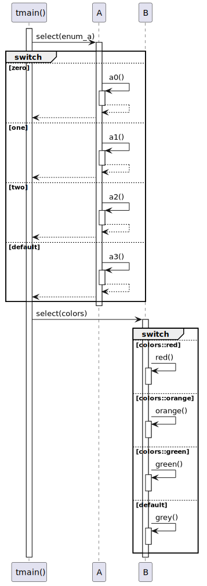
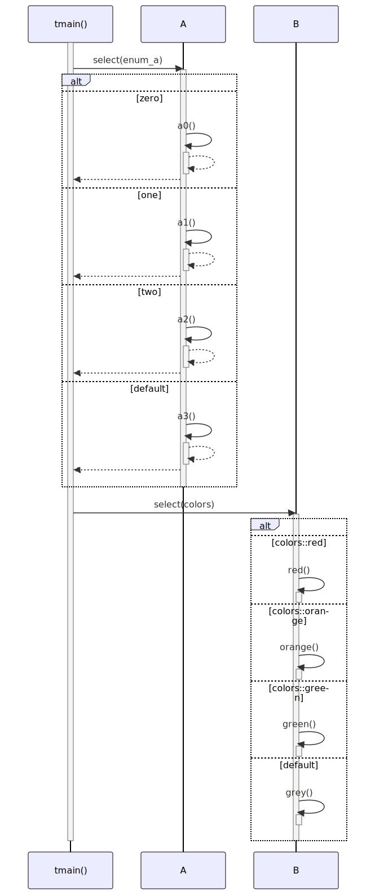

# t20024 - Switch statement sequence diagram test case
## Config
```yaml
diagrams:
  t20024_sequence:
    type: sequence
    glob:
      - t20024.cc
    include:
      namespaces:
        - clanguml::t20024
    using_namespace: clanguml::t20024
    from:
      - function: "clanguml::t20024::tmain()"
```
## Source code
File `tests/t20024/t20024.cc`
```cpp
namespace clanguml {
namespace t20024 {

enum enum_a { zero = 0, one = 1, two = 2, three = 3 };

enum class colors { red, orange, green };

struct A {
    int select(enum_a v)
    {
        switch (v) {
        case zero:
            return a0();
        case one:
            return a1();
        case two:
            return a2();
        default:
            return a3();
        }
    }

    int a0() { return 0; }
    int a1() { return 1; }
    int a2() { return 2; }
    int a3() { return 3; }
};

struct B {
    void select(colors c)
    {
        switch (c) {
        case colors::red:
            red();
            break;
        case colors::orange:
            orange();
            break;
        case colors::green:
            green();
            break;
        default:
            grey();
        }
    }

    void red() { }
    void orange() { }
    void green() { }
    void grey() { }
};

int tmain()
{
    A a;
    B b;

    a.select(enum_a::two);

    b.select(colors::green);

    return 0;
}
}
}
```
## Generated PlantUML diagrams

## Generated Mermaid diagrams

## Generated JSON models
```json
{
  "diagram_type": "sequence",
  "name": "t20024_sequence",
  "participants": [
    {
      "display_name": "tmain()",
      "full_name": "clanguml::t20024::tmain()",
      "id": "5953734351015738132",
      "name": "tmain",
      "namespace": "clanguml::t20024",
      "source_location": {
        "column": 5,
        "file": "t20024.cc",
        "line": 53,
        "translation_unit": "t20024.cc"
      },
      "type": "function"
    },
    {
      "activities": [
        {
          "display_name": "select(enum_a)",
          "full_name": "clanguml::t20024::A::select(enum_a)",
          "id": "9954367347628342017",
          "name": "select",
          "namespace": "clanguml::t20024",
          "source_location": {
            "column": 9,
            "file": "t20024.cc",
            "line": 9,
            "translation_unit": "t20024.cc"
          },
          "type": "method"
        },
        {
          "display_name": "a0()",
          "full_name": "clanguml::t20024::A::a0()",
          "id": "7439743779554870411",
          "name": "a0",
          "namespace": "clanguml::t20024",
          "source_location": {
            "column": 9,
            "file": "t20024.cc",
            "line": 23,
            "translation_unit": "t20024.cc"
          },
          "type": "method"
        },
        {
          "display_name": "a1()",
          "full_name": "clanguml::t20024::A::a1()",
          "id": "9283476861031477043",
          "name": "a1",
          "namespace": "clanguml::t20024",
          "source_location": {
            "column": 9,
            "file": "t20024.cc",
            "line": 24,
            "translation_unit": "t20024.cc"
          },
          "type": "method"
        },
        {
          "display_name": "a2()",
          "full_name": "clanguml::t20024::A::a2()",
          "id": "7653317150010276836",
          "name": "a2",
          "namespace": "clanguml::t20024",
          "source_location": {
            "column": 9,
            "file": "t20024.cc",
            "line": 25,
            "translation_unit": "t20024.cc"
          },
          "type": "method"
        },
        {
          "display_name": "a3()",
          "full_name": "clanguml::t20024::A::a3()",
          "id": "8889976019084614516",
          "name": "a3",
          "namespace": "clanguml::t20024",
          "source_location": {
            "column": 9,
            "file": "t20024.cc",
            "line": 26,
            "translation_unit": "t20024.cc"
          },
          "type": "method"
        }
      ],
      "display_name": "A",
      "full_name": "clanguml::t20024::A",
      "id": "15987694536780298857",
      "name": "A",
      "namespace": "clanguml::t20024",
      "source_location": {
        "column": 8,
        "file": "t20024.cc",
        "line": 8,
        "translation_unit": "t20024.cc"
      },
      "type": "class"
    },
    {
      "activities": [
        {
          "display_name": "select(colors)",
          "full_name": "clanguml::t20024::B::select(colors)",
          "id": "9089838434631665427",
          "name": "select",
          "namespace": "clanguml::t20024",
          "source_location": {
            "column": 10,
            "file": "t20024.cc",
            "line": 30,
            "translation_unit": "t20024.cc"
          },
          "type": "method"
        },
        {
          "display_name": "red()",
          "full_name": "clanguml::t20024::B::red()",
          "id": "16972767938444082246",
          "name": "red",
          "namespace": "clanguml::t20024",
          "source_location": {
            "column": 10,
            "file": "t20024.cc",
            "line": 47,
            "translation_unit": "t20024.cc"
          },
          "type": "method"
        },
        {
          "display_name": "orange()",
          "full_name": "clanguml::t20024::B::orange()",
          "id": "16112298655748629497",
          "name": "orange",
          "namespace": "clanguml::t20024",
          "source_location": {
            "column": 10,
            "file": "t20024.cc",
            "line": 48,
            "translation_unit": "t20024.cc"
          },
          "type": "method"
        },
        {
          "display_name": "green()",
          "full_name": "clanguml::t20024::B::green()",
          "id": "3634549879406515600",
          "name": "green",
          "namespace": "clanguml::t20024",
          "source_location": {
            "column": 10,
            "file": "t20024.cc",
            "line": 49,
            "translation_unit": "t20024.cc"
          },
          "type": "method"
        },
        {
          "display_name": "grey()",
          "full_name": "clanguml::t20024::B::grey()",
          "id": "5398023681219576667",
          "name": "grey",
          "namespace": "clanguml::t20024",
          "source_location": {
            "column": 10,
            "file": "t20024.cc",
            "line": 50,
            "translation_unit": "t20024.cc"
          },
          "type": "method"
        }
      ],
      "display_name": "B",
      "full_name": "clanguml::t20024::B",
      "id": "5804277848725383976",
      "name": "B",
      "namespace": "clanguml::t20024",
      "source_location": {
        "column": 8,
        "file": "t20024.cc",
        "line": 29,
        "translation_unit": "t20024.cc"
      },
      "type": "class"
    }
  ],
  "sequences": [
    {
      "from": {
        "id": "5953734351015738132",
        "location": "clanguml::t20024::tmain()"
      },
      "messages": [
        {
          "from": {
            "activity_id": "5953734351015738132",
            "participant_id": "5953734351015738132"
          },
          "name": "select(enum_a)",
          "return_type": "int",
          "scope": "normal",
          "source_location": {
            "column": 5,
            "file": "t20024.cc",
            "line": 58,
            "translation_unit": "t20024.cc"
          },
          "to": {
            "activity_id": "9954367347628342017",
            "participant_id": "15987694536780298857"
          },
          "type": "message"
        },
        {
          "activity_id": "9954367347628342017",
          "branches": [
            {
              "messages": [
                {
                  "from": {
                    "activity_id": "9954367347628342017",
                    "participant_id": "15987694536780298857"
                  },
                  "name": "a0()",
                  "return_type": "int",
                  "scope": "normal",
                  "source_location": {
                    "column": 20,
                    "file": "t20024.cc",
                    "line": 13,
                    "translation_unit": "t20024.cc"
                  },
                  "to": {
                    "activity_id": "7439743779554870411",
                    "participant_id": "15987694536780298857"
                  },
                  "type": "message"
                },
                {
                  "from": {
                    "activity_id": "7439743779554870411",
                    "participant_id": "15987694536780298857"
                  },
                  "name": "",
                  "return_type": "int",
                  "scope": "normal",
                  "source_location": {
                    "column": 16,
                    "file": "t20024.cc",
                    "line": 23,
                    "translation_unit": "t20024.cc"
                  },
                  "to": {
                    "activity_id": "9954367347628342017",
                    "participant_id": "15987694536780298857"
                  },
                  "type": "return"
                },
                {
                  "from": {
                    "activity_id": "9954367347628342017",
                    "participant_id": "15987694536780298857"
                  },
                  "name": "",
                  "return_type": "int",
                  "scope": "normal",
                  "source_location": {
                    "column": 13,
                    "file": "t20024.cc",
                    "line": 13,
                    "translation_unit": "t20024.cc"
                  },
                  "to": {
                    "activity_id": "5953734351015738132",
                    "participant_id": "5953734351015738132"
                  },
                  "type": "return"
                }
              ],
              "name": "zero",
              "type": "case"
            },
            {
              "messages": [
                {
                  "from": {
                    "activity_id": "9954367347628342017",
                    "participant_id": "15987694536780298857"
                  },
                  "name": "a1()",
                  "return_type": "int",
                  "scope": "normal",
                  "source_location": {
                    "column": 20,
                    "file": "t20024.cc",
                    "line": 15,
                    "translation_unit": "t20024.cc"
                  },
                  "to": {
                    "activity_id": "9283476861031477043",
                    "participant_id": "15987694536780298857"
                  },
                  "type": "message"
                },
                {
                  "from": {
                    "activity_id": "9283476861031477043",
                    "participant_id": "15987694536780298857"
                  },
                  "name": "",
                  "return_type": "int",
                  "scope": "normal",
                  "source_location": {
                    "column": 16,
                    "file": "t20024.cc",
                    "line": 24,
                    "translation_unit": "t20024.cc"
                  },
                  "to": {
                    "activity_id": "9954367347628342017",
                    "participant_id": "15987694536780298857"
                  },
                  "type": "return"
                },
                {
                  "from": {
                    "activity_id": "9954367347628342017",
                    "participant_id": "15987694536780298857"
                  },
                  "name": "",
                  "return_type": "int",
                  "scope": "normal",
                  "source_location": {
                    "column": 13,
                    "file": "t20024.cc",
                    "line": 15,
                    "translation_unit": "t20024.cc"
                  },
                  "to": {
                    "activity_id": "5953734351015738132",
                    "participant_id": "5953734351015738132"
                  },
                  "type": "return"
                }
              ],
              "name": "one",
              "type": "case"
            },
            {
              "messages": [
                {
                  "from": {
                    "activity_id": "9954367347628342017",
                    "participant_id": "15987694536780298857"
                  },
                  "name": "a2()",
                  "return_type": "int",
                  "scope": "normal",
                  "source_location": {
                    "column": 20,
                    "file": "t20024.cc",
                    "line": 17,
                    "translation_unit": "t20024.cc"
                  },
                  "to": {
                    "activity_id": "7653317150010276836",
                    "participant_id": "15987694536780298857"
                  },
                  "type": "message"
                },
                {
                  "from": {
                    "activity_id": "7653317150010276836",
                    "participant_id": "15987694536780298857"
                  },
                  "name": "",
                  "return_type": "int",
                  "scope": "normal",
                  "source_location": {
                    "column": 16,
                    "file": "t20024.cc",
                    "line": 25,
                    "translation_unit": "t20024.cc"
                  },
                  "to": {
                    "activity_id": "9954367347628342017",
                    "participant_id": "15987694536780298857"
                  },
                  "type": "return"
                },
                {
                  "from": {
                    "activity_id": "9954367347628342017",
                    "participant_id": "15987694536780298857"
                  },
                  "name": "",
                  "return_type": "int",
                  "scope": "normal",
                  "source_location": {
                    "column": 13,
                    "file": "t20024.cc",
                    "line": 17,
                    "translation_unit": "t20024.cc"
                  },
                  "to": {
                    "activity_id": "5953734351015738132",
                    "participant_id": "5953734351015738132"
                  },
                  "type": "return"
                }
              ],
              "name": "two",
              "type": "case"
            },
            {
              "messages": [
                {
                  "from": {
                    "activity_id": "9954367347628342017",
                    "participant_id": "15987694536780298857"
                  },
                  "name": "a3()",
                  "return_type": "int",
                  "scope": "normal",
                  "source_location": {
                    "column": 20,
                    "file": "t20024.cc",
                    "line": 19,
                    "translation_unit": "t20024.cc"
                  },
                  "to": {
                    "activity_id": "8889976019084614516",
                    "participant_id": "15987694536780298857"
                  },
                  "type": "message"
                },
                {
                  "from": {
                    "activity_id": "8889976019084614516",
                    "participant_id": "15987694536780298857"
                  },
                  "name": "",
                  "return_type": "int",
                  "scope": "normal",
                  "source_location": {
                    "column": 16,
                    "file": "t20024.cc",
                    "line": 26,
                    "translation_unit": "t20024.cc"
                  },
                  "to": {
                    "activity_id": "9954367347628342017",
                    "participant_id": "15987694536780298857"
                  },
                  "type": "return"
                },
                {
                  "from": {
                    "activity_id": "9954367347628342017",
                    "participant_id": "15987694536780298857"
                  },
                  "name": "",
                  "return_type": "int",
                  "scope": "normal",
                  "source_location": {
                    "column": 13,
                    "file": "t20024.cc",
                    "line": 19,
                    "translation_unit": "t20024.cc"
                  },
                  "to": {
                    "activity_id": "5953734351015738132",
                    "participant_id": "5953734351015738132"
                  },
                  "type": "return"
                }
              ],
              "name": "default",
              "type": "case"
            }
          ],
          "name": "switch",
          "type": "alt"
        },
        {
          "from": {
            "activity_id": "5953734351015738132",
            "participant_id": "5953734351015738132"
          },
          "name": "select(colors)",
          "return_type": "void",
          "scope": "normal",
          "source_location": {
            "column": 5,
            "file": "t20024.cc",
            "line": 60,
            "translation_unit": "t20024.cc"
          },
          "to": {
            "activity_id": "9089838434631665427",
            "participant_id": "5804277848725383976"
          },
          "type": "message"
        },
        {
          "activity_id": "9089838434631665427",
          "branches": [
            {
              "messages": [
                {
                  "from": {
                    "activity_id": "9089838434631665427",
                    "participant_id": "5804277848725383976"
                  },
                  "name": "red()",
                  "return_type": "void",
                  "scope": "normal",
                  "source_location": {
                    "column": 13,
                    "file": "t20024.cc",
                    "line": 34,
                    "translation_unit": "t20024.cc"
                  },
                  "to": {
                    "activity_id": "16972767938444082246",
                    "participant_id": "5804277848725383976"
                  },
                  "type": "message"
                }
              ],
              "name": "enum colors::red",
              "type": "case"
            },
            {
              "messages": [
                {
                  "from": {
                    "activity_id": "9089838434631665427",
                    "participant_id": "5804277848725383976"
                  },
                  "name": "orange()",
                  "return_type": "void",
                  "scope": "normal",
                  "source_location": {
                    "column": 13,
                    "file": "t20024.cc",
                    "line": 37,
                    "translation_unit": "t20024.cc"
                  },
                  "to": {
                    "activity_id": "16112298655748629497",
                    "participant_id": "5804277848725383976"
                  },
                  "type": "message"
                }
              ],
              "name": "enum colors::orange",
              "type": "case"
            },
            {
              "messages": [
                {
                  "from": {
                    "activity_id": "9089838434631665427",
                    "participant_id": "5804277848725383976"
                  },
                  "name": "green()",
                  "return_type": "void",
                  "scope": "normal",
                  "source_location": {
                    "column": 13,
                    "file": "t20024.cc",
                    "line": 40,
                    "translation_unit": "t20024.cc"
                  },
                  "to": {
                    "activity_id": "3634549879406515600",
                    "participant_id": "5804277848725383976"
                  },
                  "type": "message"
                }
              ],
              "name": "enum colors::green",
              "type": "case"
            },
            {
              "messages": [
                {
                  "from": {
                    "activity_id": "9089838434631665427",
                    "participant_id": "5804277848725383976"
                  },
                  "name": "grey()",
                  "return_type": "void",
                  "scope": "normal",
                  "source_location": {
                    "column": 13,
                    "file": "t20024.cc",
                    "line": 43,
                    "translation_unit": "t20024.cc"
                  },
                  "to": {
                    "activity_id": "5398023681219576667",
                    "participant_id": "5804277848725383976"
                  },
                  "type": "message"
                }
              ],
              "name": "default",
              "type": "case"
            }
          ],
          "name": "switch",
          "type": "alt"
        }
      ]
    }
  ],
  "using_namespace": "clanguml::t20024"
}
```
## Generated GraphML models
