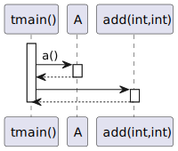
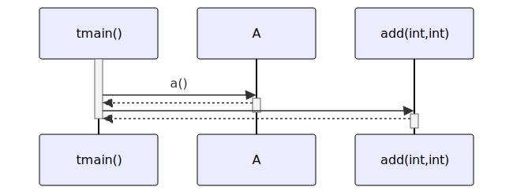

# t20025 - Skip decorator sequence diagram test case
## Config
```yaml
diagrams:
  t20025_sequence:
    type: sequence
    glob:
      - t20025.cc
    include:
      namespaces:
        - clanguml::t20025
    using_namespace: clanguml::t20025
    from:
      - function: "clanguml::t20025::tmain()"
```
## Source code
File `tests/t20025/t20025.cc`
```cpp
namespace clanguml {
namespace t20025 {

int add(int x, int y) { return x + y; }

/// Add 2 numbers
///
/// \param x
/// \param y
/// \return
/// \uml{skip}
int add2(int x, int y) { return x + x + y + y; }

struct A {
    int a()
    {
        /// TODO: this doesn't work yet...
        /// \uml{skip}
        a2();

        return a1();
    }

    /// \uml{skip}
    int a1() { return 1; }

    void a2() { }
};

int tmain()
{
    A a;

    int result{};

    result = a.a();

    result += add(1, 2);

    result += add2(2, 4);

    return result;
}
}
}
```
## Generated PlantUML diagrams

## Generated Mermaid diagrams

## Generated JSON models
```json
{
  "diagram_type": "sequence",
  "name": "t20025_sequence",
  "participants": [
    {
      "display_name": "tmain()",
      "full_name": "clanguml::t20025::tmain()",
      "id": "1268545806896171690",
      "name": "tmain",
      "namespace": "clanguml::t20025",
      "source_location": {
        "column": 5,
        "file": "t20025.cc",
        "line": 30,
        "translation_unit": "t20025.cc"
      },
      "type": "function"
    },
    {
      "activities": [
        {
          "display_name": "a()",
          "full_name": "clanguml::t20025::A::a()",
          "id": "1119830104994271584",
          "name": "a",
          "namespace": "",
          "source_location": {
            "column": 9,
            "file": "t20025.cc",
            "line": 15,
            "translation_unit": "t20025.cc"
          },
          "type": "method"
        }
      ],
      "display_name": "A",
      "full_name": "clanguml::t20025::A",
      "id": "2144852170258286289",
      "name": "A",
      "namespace": "clanguml::t20025",
      "source_location": {
        "column": 8,
        "file": "t20025.cc",
        "line": 14,
        "translation_unit": "t20025.cc"
      },
      "type": "class"
    },
    {
      "display_name": "add(int,int)",
      "full_name": "clanguml::t20025::add(int,int)",
      "id": "228843323046630374",
      "name": "add",
      "namespace": "clanguml::t20025",
      "source_location": {
        "column": 5,
        "file": "t20025.cc",
        "line": 4,
        "translation_unit": "t20025.cc"
      },
      "type": "function"
    }
  ],
  "sequences": [
    {
      "messages": [
        {
          "from": {
            "activity_id": "1268545806896171690",
            "participant_id": "1268545806896171690"
          },
          "name": "a()",
          "return_type": "int",
          "scope": "normal",
          "source_location": {
            "column": 14,
            "file": "t20025.cc",
            "line": 36,
            "translation_unit": "t20025.cc"
          },
          "to": {
            "activity_id": "1119830104994271584",
            "participant_id": "2144852170258286289"
          },
          "type": "message"
        },
        {
          "from": {
            "activity_id": "1268545806896171690",
            "participant_id": "1268545806896171690"
          },
          "name": "",
          "return_type": "int",
          "scope": "normal",
          "source_location": {
            "column": 15,
            "file": "t20025.cc",
            "line": 38,
            "translation_unit": "t20025.cc"
          },
          "to": {
            "activity_id": "228843323046630374",
            "participant_id": "228843323046630374"
          },
          "type": "message"
        }
      ],
      "start_from": {
        "id": 1268545806896171690,
        "location": "clanguml::t20025::tmain()"
      }
    }
  ],
  "using_namespace": "clanguml::t20025"
}
```
