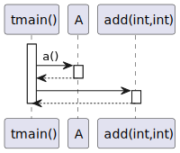

# t20025 - Skip decorator sequence diagram test case
## Config
```yaml
compilation_database_dir: ..
output_directory: puml
diagrams:
  t20025_sequence:
    type: sequence
    glob:
      - ../../tests/t20025/t20025.cc
    include:
      namespaces:
        - clanguml::t20025
    using_namespace:
      - clanguml::t20025
    start_from:
      - function: "clanguml::t20025::tmain()"
```
## Source code
File t20025.cc
```cpp
namespace clanguml {
namespace t20025 {

int add(int x, int y) { return x + y; }

/// Add 2 numbers
///
/// \param x
/// \param y
/// \return
/// \uml{skip}
int add2(int x, int y) { return x + x + y + y; }

struct A {
    int a()
    {
        /// TODO: this doesn't work yet...
        /// \uml{skip}
        a2();

        return a1();
    }

    /// \uml{skip}
    int a1() { return 1; }

    void a2() { }
};

int tmain()
{
    A a;

    int result{};

    result = a.a();

    result += add(1, 2);

    result += add2(2, 4);

    return result;
}
}
}
```
## Generated UML diagrams

