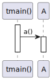
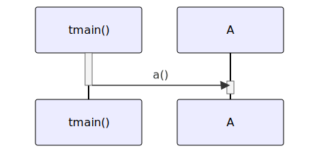

# t20026 - Virtual method call sequence diagram test case
## Config
```yaml
diagrams:
  t20026_sequence:
    type: sequence
    glob:
      - t20026.cc
    include:
      namespaces:
        - clanguml::t20026
    using_namespace: clanguml::t20026
    from:
      - function: "clanguml::t20026::tmain()"
```
## Source code
File `tests/t20026/t20026.cc`
```cpp
namespace clanguml {
namespace t20026 {

struct A {
    virtual void a() { }
};

struct B : public A {
    void a() override { }
};

struct C : public B {
    void a() override { }
};

int tmain()
{
    C *a{};

    dynamic_cast<A *>(a)->a();

    return 0;
}
}
}
```
## Generated PlantUML diagrams

## Generated Mermaid diagrams

## Generated JSON models
```json
{
  "diagram_type": "sequence",
  "name": "t20026_sequence",
  "participants": [
    {
      "display_name": "tmain()",
      "full_name": "clanguml::t20026::tmain()",
      "id": "2268697350307997040",
      "name": "tmain",
      "namespace": "clanguml::t20026",
      "source_location": {
        "column": 5,
        "file": "t20026.cc",
        "line": 16,
        "translation_unit": "t20026.cc"
      },
      "type": "function"
    },
    {
      "activities": [
        {
          "display_name": "a()",
          "full_name": "clanguml::t20026::A::a()",
          "id": "600590770418147864",
          "name": "a",
          "namespace": "",
          "source_location": {
            "column": 18,
            "file": "t20026.cc",
            "line": 5,
            "translation_unit": "t20026.cc"
          },
          "type": "method"
        }
      ],
      "display_name": "A",
      "full_name": "clanguml::t20026::A",
      "id": "1962121823853291899",
      "name": "A",
      "namespace": "clanguml::t20026",
      "source_location": {
        "column": 8,
        "file": "t20026.cc",
        "line": 4,
        "translation_unit": "t20026.cc"
      },
      "type": "class"
    }
  ],
  "sequences": [
    {
      "messages": [
        {
          "from": {
            "activity_id": "2268697350307997040",
            "participant_id": "2268697350307997040"
          },
          "name": "a()",
          "return_type": "void",
          "scope": "normal",
          "source_location": {
            "column": 5,
            "file": "t20026.cc",
            "line": 20,
            "translation_unit": "t20026.cc"
          },
          "to": {
            "activity_id": "600590770418147864",
            "participant_id": "1962121823853291899"
          },
          "type": "message"
        }
      ],
      "start_from": {
        "id": 2268697350307997040,
        "location": "clanguml::t20026::tmain()"
      }
    }
  ],
  "using_namespace": "clanguml::t20026"
}
```
