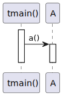
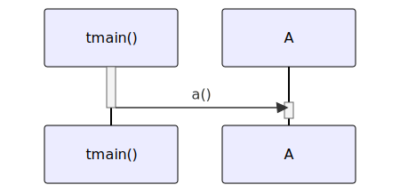

# t20027 - Filter call expressions based on access test case
## Config
```yaml
diagrams:
  t20027_sequence:
    type: sequence
    glob:
      - t20027.cc
    include:
      namespaces:
        - clanguml::t20027
      access:
        - public
    using_namespace: clanguml::t20027
    from:
      - function: "clanguml::t20027::tmain()"
```
## Source code
File `tests/t20027/t20027.cc`
```cpp
namespace clanguml {
namespace t20027 {

class A {
public:
    void a() { aa(); }

protected:
    void aa() { aaa(); }

private:
    void aaa() { }
};

void tmain()
{
    A a;

    a.a();
}
}
}
```
## Generated PlantUML diagrams

## Generated Mermaid diagrams

## Generated JSON models
```json
{
  "diagram_type": "sequence",
  "name": "t20027_sequence",
  "participants": [
    {
      "display_name": "tmain()",
      "full_name": "clanguml::t20027::tmain()",
      "id": "1581009482994430286",
      "name": "tmain",
      "namespace": "clanguml::t20027",
      "source_location": {
        "column": 6,
        "file": "t20027.cc",
        "line": 15,
        "translation_unit": "t20027.cc"
      },
      "type": "function"
    },
    {
      "activities": [
        {
          "display_name": "a()",
          "full_name": "clanguml::t20027::A::a()",
          "id": "910514967786202717",
          "name": "a",
          "namespace": "",
          "source_location": {
            "column": 10,
            "file": "t20027.cc",
            "line": 6,
            "translation_unit": "t20027.cc"
          },
          "type": "method"
        }
      ],
      "display_name": "A",
      "full_name": "clanguml::t20027::A",
      "id": "583525629936262089",
      "name": "A",
      "namespace": "clanguml::t20027",
      "source_location": {
        "column": 7,
        "file": "t20027.cc",
        "line": 4,
        "translation_unit": "t20027.cc"
      },
      "type": "class"
    }
  ],
  "sequences": [
    {
      "messages": [
        {
          "from": {
            "activity_id": "1581009482994430286",
            "participant_id": "1581009482994430286"
          },
          "name": "a()",
          "return_type": "void",
          "scope": "normal",
          "source_location": {
            "column": 5,
            "file": "t20027.cc",
            "line": 19,
            "translation_unit": "t20027.cc"
          },
          "to": {
            "activity_id": "910514967786202717",
            "participant_id": "583525629936262089"
          },
          "type": "message"
        }
      ],
      "start_from": {
        "id": 1581009482994430286,
        "location": "clanguml::t20027::tmain()"
      }
    }
  ],
  "using_namespace": "clanguml::t20027"
}
```
