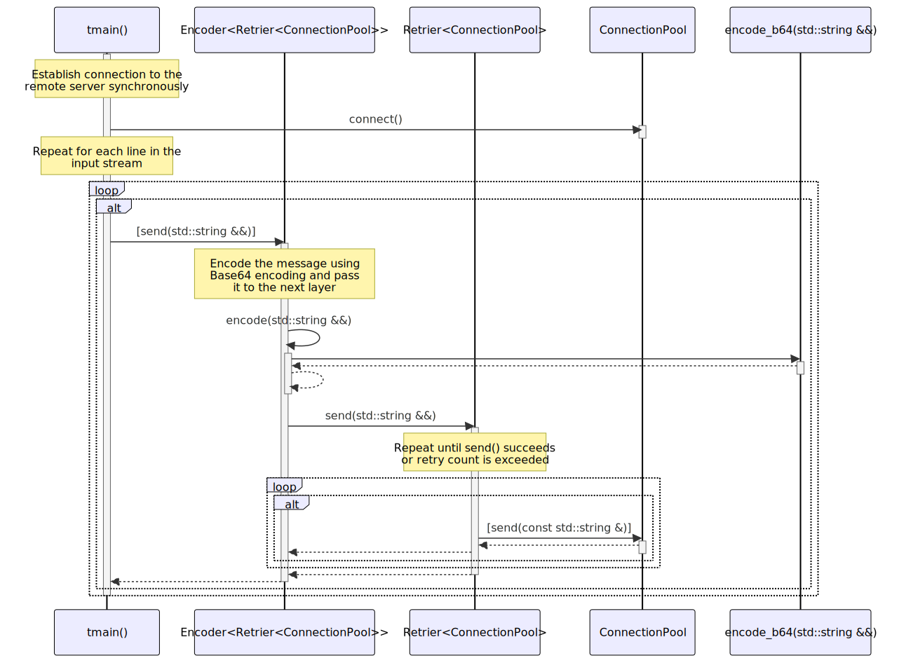

# t20029 - Combined feature sequence diagram test case
## Config
```yaml
add_compile_flags:
  - -fparse-all-comments
diagrams:
  t20029_sequence:
    type: sequence
    glob:
      - t20029.cc
    include:
      namespaces:
        - clanguml::t20029
    exclude:
      access:
        - private
    using_namespace: clanguml::t20029
    from:
      - function: clanguml::t20029::tmain()
    generate_message_comments: true
    participants_order:
      - clanguml::t20029::tmain()
      - clanguml::t20029::Encoder<clanguml::t20029::Retrier<clanguml::t20029::ConnectionPool>>
      - clanguml::t20029::Retrier<clanguml::t20029::ConnectionPool>
      - clanguml::t20029::ConnectionPool
      - clanguml::t20029::encode_b64(std::string &&)
```
## Source code
File `tests/t20029/t20029.cc`
```cpp
#include <atomic>
#include <functional>
#include <iostream>
#include <memory>
#include <string>

namespace clanguml {
namespace t20029 {
std::string encode_b64(std::string &&content) { return std::move(content); }

template <typename T> class Encoder : public T {
public:
    bool send(std::string &&msg)
    {
        return T::send(std::move(
            // Encode the message using Base64 encoding and pass it to the next
            // layer
            encode(std::move(msg))));
    }

protected:
    std::string encode(std::string &&msg) { return encode_b64(std::move(msg)); }
};

template <typename T> class Retrier : public T {
public:
    bool send(std::string &&msg)
    {
        std::string buffer{std::move(msg)};

        int retryCount = 5;

        // Repeat until send() succeeds or retry count is exceeded
        while (retryCount--) {
            if (T::send(buffer))
                return true;
        }

        return false;
    }
};

class ConnectionPool {
public:
    void connect()
    {
        if (!is_connected_.load())
            connect_impl();
    }

    bool send(const std::string &msg) { return true; }

private:
    void connect_impl() { is_connected_ = true; }

    std::atomic<bool> is_connected_;
};

int tmain()
{
    auto pool = std::make_shared<Encoder<Retrier<ConnectionPool>>>();

    // Establish connection to the remote server synchronously
    pool->connect();

    // Repeat for each line in the input stream
    for (std::string line; std::getline(std::cin, line);) {
        if (!pool->send(std::move(line)))
            break;
    }

    return 0;
}
}
}
```
## Generated PlantUML diagrams

## Generated Mermaid diagrams

## Generated JSON models
```json
{
  "diagram_type": "sequence",
  "name": "t20029_sequence",
  "participants": [
    {
      "display_name": "tmain()",
      "full_name": "clanguml::t20029::tmain()",
      "id": "2091374738808319642",
      "name": "tmain",
      "namespace": "clanguml::t20029",
      "source_location": {
        "column": 5,
        "file": "t20029.cc",
        "line": 59,
        "translation_unit": "t20029.cc"
      },
      "type": "function"
    },
    {
      "activities": [
        {
          "display_name": "send(std::string &&)",
          "full_name": "clanguml::t20029::Encoder<clanguml::t20029::Retrier<clanguml::t20029::ConnectionPool>>::send(std::string &&)",
          "id": "2026763864005979273",
          "name": "send",
          "namespace": "",
          "source_location": {
            "column": 10,
            "file": "t20029.cc",
            "line": 13,
            "translation_unit": "t20029.cc"
          },
          "type": "method"
        },
        {
          "display_name": "encode(std::string &&)",
          "full_name": "clanguml::t20029::Encoder<clanguml::t20029::Retrier<clanguml::t20029::ConnectionPool>>::encode(std::string &&)",
          "id": "1468258269466480773",
          "name": "encode",
          "namespace": "",
          "source_location": {
            "column": 17,
            "file": "t20029.cc",
            "line": 22,
            "translation_unit": "t20029.cc"
          },
          "type": "method"
        }
      ],
      "display_name": "Encoder<Retrier<ConnectionPool>>",
      "full_name": "clanguml::t20029::Encoder<clanguml::t20029::Retrier<clanguml::t20029::ConnectionPool>>",
      "id": "1673261195873192383",
      "name": "Encoder",
      "namespace": "clanguml::t20029",
      "source_location": {
        "column": 29,
        "file": "t20029.cc",
        "line": 11,
        "translation_unit": "t20029.cc"
      },
      "type": "class"
    },
    {
      "activities": [
        {
          "display_name": "send(std::string &&)",
          "full_name": "clanguml::t20029::Retrier<clanguml::t20029::ConnectionPool>::send(std::string &&)",
          "id": "30515971485361302",
          "name": "send",
          "namespace": "",
          "source_location": {
            "column": 10,
            "file": "t20029.cc",
            "line": 27,
            "translation_unit": "t20029.cc"
          },
          "type": "method"
        }
      ],
      "display_name": "Retrier<ConnectionPool>",
      "full_name": "clanguml::t20029::Retrier<clanguml::t20029::ConnectionPool>",
      "id": "658058855590948094",
      "name": "Retrier",
      "namespace": "clanguml::t20029",
      "source_location": {
        "column": 29,
        "file": "t20029.cc",
        "line": 25,
        "translation_unit": "t20029.cc"
      },
      "type": "class"
    },
    {
      "activities": [
        {
          "display_name": "connect()",
          "full_name": "clanguml::t20029::ConnectionPool::connect()",
          "id": "940428568182104530",
          "name": "connect",
          "namespace": "",
          "source_location": {
            "column": 10,
            "file": "t20029.cc",
            "line": 45,
            "translation_unit": "t20029.cc"
          },
          "type": "method"
        },
        {
          "display_name": "send(const std::string &)",
          "full_name": "clanguml::t20029::ConnectionPool::send(const std::string &)",
          "id": "972625940114169157",
          "name": "send",
          "namespace": "",
          "source_location": {
            "column": 10,
            "file": "t20029.cc",
            "line": 51,
            "translation_unit": "t20029.cc"
          },
          "type": "method"
        }
      ],
      "display_name": "ConnectionPool",
      "full_name": "clanguml::t20029::ConnectionPool",
      "id": "1896406205097618937",
      "name": "ConnectionPool",
      "namespace": "clanguml::t20029",
      "source_location": {
        "column": 7,
        "file": "t20029.cc",
        "line": 43,
        "translation_unit": "t20029.cc"
      },
      "type": "class"
    },
    {
      "display_name": "encode_b64(std::string &&)",
      "full_name": "clanguml::t20029::encode_b64(std::string &&)",
      "id": "1362646431260879440",
      "name": "encode_b64",
      "namespace": "clanguml::t20029",
      "source_location": {
        "column": 13,
        "file": "t20029.cc",
        "line": 9,
        "translation_unit": "t20029.cc"
      },
      "type": "function"
    }
  ],
  "sequences": [
    {
      "messages": [
        {
          "comment": "Establish connection to the remote server synchronously",
          "from": {
            "activity_id": "2091374738808319642",
            "participant_id": "2091374738808319642"
          },
          "name": "connect()",
          "return_type": "void",
          "scope": "normal",
          "source_location": {
            "column": 5,
            "file": "t20029.cc",
            "line": 64,
            "translation_unit": "t20029.cc"
          },
          "to": {
            "activity_id": "940428568182104530",
            "participant_id": "1896406205097618937"
          },
          "type": "message"
        },
        {
          "activity_id": "2091374738808319642",
          "messages": [
            {
              "activity_id": "2091374738808319642",
              "branches": [
                {
                  "messages": [
                    {
                      "from": {
                        "activity_id": "2091374738808319642",
                        "participant_id": "2091374738808319642"
                      },
                      "name": "send(std::string &&)",
                      "return_type": "bool",
                      "scope": "condition",
                      "source_location": {
                        "column": 14,
                        "file": "t20029.cc",
                        "line": 68,
                        "translation_unit": "t20029.cc"
                      },
                      "to": {
                        "activity_id": "2026763864005979273",
                        "participant_id": "1673261195873192383"
                      },
                      "type": "message"
                    },
                    {
                      "comment": "Encode the message using Base64 encoding and pass it to the next\nlayer",
                      "from": {
                        "activity_id": "2026763864005979273",
                        "participant_id": "1673261195873192383"
                      },
                      "name": "encode(std::string &&)",
                      "return_type": "std::string",
                      "scope": "normal",
                      "source_location": {
                        "column": 13,
                        "file": "t20029.cc",
                        "line": 18,
                        "translation_unit": "t20029.cc"
                      },
                      "to": {
                        "activity_id": "1468258269466480773",
                        "participant_id": "1673261195873192383"
                      },
                      "type": "message"
                    },
                    {
                      "from": {
                        "activity_id": "1468258269466480773",
                        "participant_id": "1673261195873192383"
                      },
                      "name": "",
                      "return_type": "std::string",
                      "scope": "normal",
                      "source_location": {
                        "column": 52,
                        "file": "t20029.cc",
                        "line": 22,
                        "translation_unit": "t20029.cc"
                      },
                      "to": {
                        "activity_id": "1362646431260879440",
                        "participant_id": "1362646431260879440"
                      },
                      "type": "message"
                    },
                    {
                      "from": {
                        "activity_id": "2026763864005979273",
                        "participant_id": "1673261195873192383"
                      },
                      "name": "send(std::string &&)",
                      "return_type": "bool",
                      "scope": "normal",
                      "source_location": {
                        "column": 16,
                        "file": "t20029.cc",
                        "line": 15,
                        "translation_unit": "t20029.cc"
                      },
                      "to": {
                        "activity_id": "30515971485361302",
                        "participant_id": "658058855590948094"
                      },
                      "type": "message"
                    },
                    {
                      "activity_id": "30515971485361302",
                      "messages": [
                        {
                          "activity_id": "30515971485361302",
                          "branches": [
                            {
                              "messages": [
                                {
                                  "from": {
                                    "activity_id": "30515971485361302",
                                    "participant_id": "658058855590948094"
                                  },
                                  "name": "send(const std::string &)",
                                  "return_type": "bool",
                                  "scope": "condition",
                                  "source_location": {
                                    "column": 17,
                                    "file": "t20029.cc",
                                    "line": 35,
                                    "translation_unit": "t20029.cc"
                                  },
                                  "to": {
                                    "activity_id": "972625940114169157",
                                    "participant_id": "1896406205097618937"
                                  },
                                  "type": "message"
                                }
                              ],
                              "type": "consequent"
                            }
                          ],
                          "name": "if",
                          "type": "alt"
                        }
                      ],
                      "name": "while",
                      "type": "loop"
                    }
                  ],
                  "type": "consequent"
                }
              ],
              "name": "if",
              "type": "alt"
            }
          ],
          "name": "for",
          "type": "loop"
        }
      ],
      "start_from": {
        "id": 2091374738808319642,
        "location": "clanguml::t20029::tmain()"
      }
    }
  ],
  "using_namespace": "clanguml::t20029"
}
```
