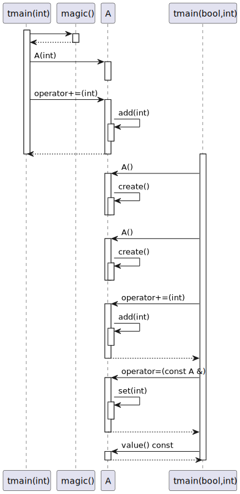
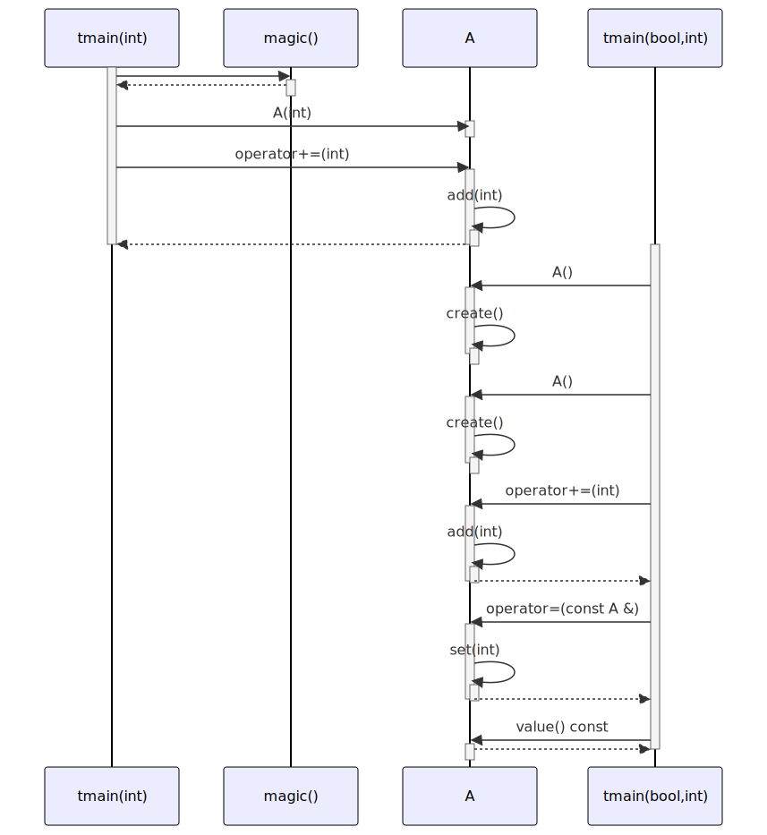

# t20030 - Constructor and operator call test case
## Config
```yaml
diagrams:
  t20030_sequence:
    type: sequence
    glob:
      - t20030.cc
    include:
      namespaces:
        - clanguml::t20030
    using_namespace: clanguml::t20030
    from:
      - function: "clanguml::t20030::tmain(int)"
      - function: "clanguml::t20030::tmain(bool,int)"
```
## Source code
File `tests/t20030/t20030.cc`
```cpp
namespace clanguml {
namespace t20030 {

int magic() { return 42; }

class A {
public:
    A() { create(); }

    A(int v) { a_ = v; }

    A &operator=(const A &a)
    {
        set(a.a_);
        return *this;
    }

    A &operator+=(int a)
    {
        add(a);
        return *this;
    }

    int value() const { return a_; }

private:
    void create() { a_ = 0; }

    void add(int a) { a_ += a; }
    void set(int a) { a_ = a; }

    int a_;
};

void tmain(int a)
{
    A an_a{magic()};
    an_a += 1;
}

int tmain(bool f, int a)
{
    auto an_a = A();
    auto an_b = A();
    an_a += 2;
    an_b = an_a;
    return an_b.value();
};

}
}
```
## Generated PlantUML diagrams

## Generated Mermaid diagrams

## Generated JSON models
```json
{
  "diagram_type": "sequence",
  "name": "t20030_sequence",
  "participants": [
    {
      "display_name": "tmain(int)",
      "full_name": "clanguml::t20030::tmain(int)",
      "id": "1264643561983920529",
      "name": "tmain",
      "namespace": "clanguml::t20030",
      "source_location": {
        "column": 6,
        "file": "t20030.cc",
        "line": 35,
        "translation_unit": "t20030.cc"
      },
      "type": "function"
    },
    {
      "display_name": "magic()",
      "full_name": "clanguml::t20030::magic()",
      "id": "1038740565367213967",
      "name": "magic",
      "namespace": "clanguml::t20030",
      "source_location": {
        "column": 5,
        "file": "t20030.cc",
        "line": 4,
        "translation_unit": "t20030.cc"
      },
      "type": "function"
    },
    {
      "activities": [
        {
          "display_name": "A(int)",
          "full_name": "clanguml::t20030::A::A(int)",
          "id": "2192298168642377389",
          "name": "A",
          "namespace": "",
          "source_location": {
            "column": 5,
            "file": "t20030.cc",
            "line": 10,
            "translation_unit": "t20030.cc"
          },
          "type": "method"
        },
        {
          "display_name": "operator+=(int)",
          "full_name": "clanguml::t20030::A::operator+=(int)",
          "id": "2032167997122548080",
          "name": "operator+=",
          "namespace": "",
          "source_location": {
            "column": 8,
            "file": "t20030.cc",
            "line": 18,
            "translation_unit": "t20030.cc"
          },
          "type": "method"
        },
        {
          "display_name": "add(int)",
          "full_name": "clanguml::t20030::A::add(int)",
          "id": "2174827432067616124",
          "name": "add",
          "namespace": "",
          "source_location": {
            "column": 10,
            "file": "t20030.cc",
            "line": 29,
            "translation_unit": "t20030.cc"
          },
          "type": "method"
        },
        {
          "display_name": "A()",
          "full_name": "clanguml::t20030::A::A()",
          "id": "32184916294885915",
          "name": "A",
          "namespace": "",
          "source_location": {
            "column": 5,
            "file": "t20030.cc",
            "line": 8,
            "translation_unit": "t20030.cc"
          },
          "type": "method"
        },
        {
          "display_name": "create()",
          "full_name": "clanguml::t20030::A::create()",
          "id": "890578100069139188",
          "name": "create",
          "namespace": "",
          "source_location": {
            "column": 10,
            "file": "t20030.cc",
            "line": 27,
            "translation_unit": "t20030.cc"
          },
          "type": "method"
        },
        {
          "display_name": "operator=(const A &)",
          "full_name": "clanguml::t20030::A::operator=(const A &)",
          "id": "1796303685088700396",
          "name": "operator=",
          "namespace": "",
          "source_location": {
            "column": 8,
            "file": "t20030.cc",
            "line": 12,
            "translation_unit": "t20030.cc"
          },
          "type": "method"
        },
        {
          "display_name": "set(int)",
          "full_name": "clanguml::t20030::A::set(int)",
          "id": "2212978510776223413",
          "name": "set",
          "namespace": "",
          "source_location": {
            "column": 10,
            "file": "t20030.cc",
            "line": 30,
            "translation_unit": "t20030.cc"
          },
          "type": "method"
        },
        {
          "display_name": "value() const",
          "full_name": "clanguml::t20030::A::value() const",
          "id": "1754957340376276968",
          "name": "value",
          "namespace": "",
          "source_location": {
            "column": 9,
            "file": "t20030.cc",
            "line": 24,
            "translation_unit": "t20030.cc"
          },
          "type": "method"
        }
      ],
      "display_name": "A",
      "full_name": "clanguml::t20030::A",
      "id": "1081707114848460702",
      "name": "A",
      "namespace": "clanguml::t20030",
      "source_location": {
        "column": 7,
        "file": "t20030.cc",
        "line": 6,
        "translation_unit": "t20030.cc"
      },
      "type": "class"
    },
    {
      "display_name": "tmain(bool,int)",
      "full_name": "clanguml::t20030::tmain(bool,int)",
      "id": "36090614888670483",
      "name": "tmain",
      "namespace": "clanguml::t20030",
      "source_location": {
        "column": 5,
        "file": "t20030.cc",
        "line": 41,
        "translation_unit": "t20030.cc"
      },
      "type": "function"
    }
  ],
  "sequences": [
    {
      "messages": [
        {
          "from": {
            "activity_id": "1264643561983920529",
            "participant_id": "1264643561983920529"
          },
          "name": "",
          "return_type": "int",
          "scope": "normal",
          "source_location": {
            "column": 12,
            "file": "t20030.cc",
            "line": 37,
            "translation_unit": "t20030.cc"
          },
          "to": {
            "activity_id": "1038740565367213967",
            "participant_id": "1038740565367213967"
          },
          "type": "message"
        },
        {
          "from": {
            "activity_id": "1264643561983920529",
            "participant_id": "1264643561983920529"
          },
          "name": "A(int)",
          "return_type": "void",
          "scope": "normal",
          "source_location": {
            "column": 7,
            "file": "t20030.cc",
            "line": 37,
            "translation_unit": "t20030.cc"
          },
          "to": {
            "activity_id": "2192298168642377389",
            "participant_id": "1081707114848460702"
          },
          "type": "message"
        },
        {
          "from": {
            "activity_id": "1264643561983920529",
            "participant_id": "1264643561983920529"
          },
          "name": "operator+=(int)",
          "return_type": "A &",
          "scope": "normal",
          "source_location": {
            "column": 5,
            "file": "t20030.cc",
            "line": 38,
            "translation_unit": "t20030.cc"
          },
          "to": {
            "activity_id": "2032167997122548080",
            "participant_id": "1081707114848460702"
          },
          "type": "message"
        },
        {
          "from": {
            "activity_id": "2032167997122548080",
            "participant_id": "1081707114848460702"
          },
          "name": "add(int)",
          "return_type": "void",
          "scope": "normal",
          "source_location": {
            "column": 9,
            "file": "t20030.cc",
            "line": 20,
            "translation_unit": "t20030.cc"
          },
          "to": {
            "activity_id": "2174827432067616124",
            "participant_id": "1081707114848460702"
          },
          "type": "message"
        }
      ],
      "start_from": {
        "id": 1264643561983920529,
        "location": "clanguml::t20030::tmain(int)"
      }
    },
    {
      "messages": [
        {
          "from": {
            "activity_id": "36090614888670483",
            "participant_id": "36090614888670483"
          },
          "name": "A()",
          "return_type": "void",
          "scope": "normal",
          "source_location": {
            "column": 17,
            "file": "t20030.cc",
            "line": 43,
            "translation_unit": "t20030.cc"
          },
          "to": {
            "activity_id": "32184916294885915",
            "participant_id": "1081707114848460702"
          },
          "type": "message"
        },
        {
          "from": {
            "activity_id": "32184916294885915",
            "participant_id": "1081707114848460702"
          },
          "name": "create()",
          "return_type": "void",
          "scope": "normal",
          "source_location": {
            "column": 11,
            "file": "t20030.cc",
            "line": 8,
            "translation_unit": "t20030.cc"
          },
          "to": {
            "activity_id": "890578100069139188",
            "participant_id": "1081707114848460702"
          },
          "type": "message"
        },
        {
          "from": {
            "activity_id": "36090614888670483",
            "participant_id": "36090614888670483"
          },
          "name": "A()",
          "return_type": "void",
          "scope": "normal",
          "source_location": {
            "column": 17,
            "file": "t20030.cc",
            "line": 44,
            "translation_unit": "t20030.cc"
          },
          "to": {
            "activity_id": "32184916294885915",
            "participant_id": "1081707114848460702"
          },
          "type": "message"
        },
        {
          "from": {
            "activity_id": "32184916294885915",
            "participant_id": "1081707114848460702"
          },
          "name": "create()",
          "return_type": "void",
          "scope": "normal",
          "source_location": {
            "column": 11,
            "file": "t20030.cc",
            "line": 8,
            "translation_unit": "t20030.cc"
          },
          "to": {
            "activity_id": "890578100069139188",
            "participant_id": "1081707114848460702"
          },
          "type": "message"
        },
        {
          "from": {
            "activity_id": "36090614888670483",
            "participant_id": "36090614888670483"
          },
          "name": "operator+=(int)",
          "return_type": "A &",
          "scope": "normal",
          "source_location": {
            "column": 5,
            "file": "t20030.cc",
            "line": 45,
            "translation_unit": "t20030.cc"
          },
          "to": {
            "activity_id": "2032167997122548080",
            "participant_id": "1081707114848460702"
          },
          "type": "message"
        },
        {
          "from": {
            "activity_id": "2032167997122548080",
            "participant_id": "1081707114848460702"
          },
          "name": "add(int)",
          "return_type": "void",
          "scope": "normal",
          "source_location": {
            "column": 9,
            "file": "t20030.cc",
            "line": 20,
            "translation_unit": "t20030.cc"
          },
          "to": {
            "activity_id": "2174827432067616124",
            "participant_id": "1081707114848460702"
          },
          "type": "message"
        },
        {
          "from": {
            "activity_id": "36090614888670483",
            "participant_id": "36090614888670483"
          },
          "name": "operator=(const A &)",
          "return_type": "A &",
          "scope": "normal",
          "source_location": {
            "column": 5,
            "file": "t20030.cc",
            "line": 46,
            "translation_unit": "t20030.cc"
          },
          "to": {
            "activity_id": "1796303685088700396",
            "participant_id": "1081707114848460702"
          },
          "type": "message"
        },
        {
          "from": {
            "activity_id": "1796303685088700396",
            "participant_id": "1081707114848460702"
          },
          "name": "set(int)",
          "return_type": "void",
          "scope": "normal",
          "source_location": {
            "column": 9,
            "file": "t20030.cc",
            "line": 14,
            "translation_unit": "t20030.cc"
          },
          "to": {
            "activity_id": "2212978510776223413",
            "participant_id": "1081707114848460702"
          },
          "type": "message"
        },
        {
          "from": {
            "activity_id": "36090614888670483",
            "participant_id": "36090614888670483"
          },
          "name": "value() const",
          "return_type": "int",
          "scope": "normal",
          "source_location": {
            "column": 12,
            "file": "t20030.cc",
            "line": 47,
            "translation_unit": "t20030.cc"
          },
          "to": {
            "activity_id": "1754957340376276968",
            "participant_id": "1081707114848460702"
          },
          "type": "message"
        }
      ],
      "start_from": {
        "id": 36090614888670483,
        "location": "clanguml::t20030::tmain(bool,int)"
      }
    }
  ],
  "using_namespace": "clanguml::t20030"
}
```
