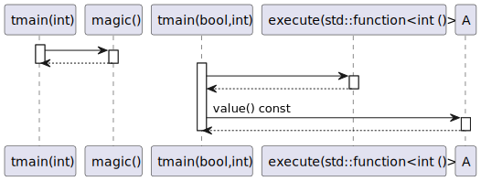
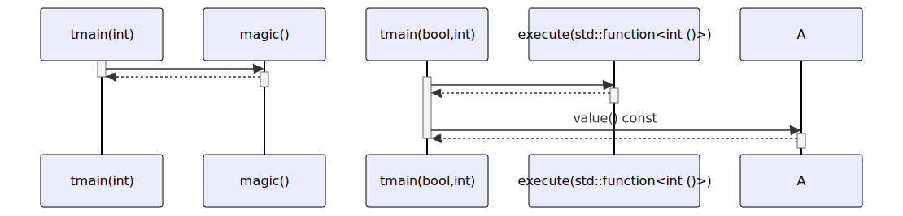

# t20031 - Callee type sequence diagram filter test case
## Config
```yaml
diagrams:
  t20031_sequence:
    type: sequence
    glob:
      - t20031.cc
    include:
      namespaces:
        - clanguml::t20031
    exclude:
      callee_types:
        - constructor
        - operator
        - lambda
    using_namespace: clanguml::t20031
    from:
      - function: "clanguml::t20031::tmain(int)"
      - function: "clanguml::t20031::tmain(bool,int)"
```
## Source code
File `tests/t20031/t20031.cc`
```cpp
#include <functional>

namespace clanguml {
namespace t20031 {
int magic() { return 42; }
int zero() { return 0; }
int one() { return 1; }
int execute(std::function<int()> f) { return f(); }

class A {
public:
    A() { create(); }

    A(int v) { a_ = v; }

    A &operator=(const A &a)
    {
        set(a.a_);
        return *this;
    }

    A &operator+=(int a)
    {
        add(a);
        return *this;
    }

    int value() const { return a_; }

private:
    void create() { a_ = 0; }

    void add(int a) { a_ += a; }
    void set(int a) { a_ = a; }

    int a_;
};

void tmain(int a)
{
    A an_a{magic()};
    an_a += 1;
}

int tmain(bool f, int a)
{
    auto generate_zero = []() { return zero(); };
    auto an_a = A();
    auto an_b = A();

    an_a += generate_zero();

    // @todo #168
    an_a += execute([]() { return one(); });

    an_b = an_a;

    return an_b.value();
};

}
}
```
## Generated PlantUML diagrams

## Generated Mermaid diagrams

## Generated JSON models
```json
{
  "diagram_type": "sequence",
  "name": "t20031_sequence",
  "participants": [
    {
      "display_name": "tmain(int)",
      "full_name": "clanguml::t20031::tmain(int)",
      "id": "1045973591033429178",
      "name": "tmain",
      "namespace": "clanguml::t20031",
      "source_location": {
        "column": 6,
        "file": "t20031.cc",
        "line": 39,
        "translation_unit": "t20031.cc"
      },
      "type": "function"
    },
    {
      "display_name": "magic()",
      "full_name": "clanguml::t20031::magic()",
      "id": "2265790048300959619",
      "name": "magic",
      "namespace": "clanguml::t20031",
      "source_location": {
        "column": 5,
        "file": "t20031.cc",
        "line": 5,
        "translation_unit": "t20031.cc"
      },
      "type": "function"
    },
    {
      "display_name": "tmain(bool,int)",
      "full_name": "clanguml::t20031::tmain(bool,int)",
      "id": "2189754495514350927",
      "name": "tmain",
      "namespace": "clanguml::t20031",
      "source_location": {
        "column": 5,
        "file": "t20031.cc",
        "line": 45,
        "translation_unit": "t20031.cc"
      },
      "type": "function"
    },
    {
      "display_name": "execute(std::function<int ()>)",
      "full_name": "clanguml::t20031::execute(std::function<int ()>)",
      "id": "2230160420908832598",
      "name": "execute",
      "namespace": "clanguml::t20031",
      "source_location": {
        "column": 5,
        "file": "t20031.cc",
        "line": 8,
        "translation_unit": "t20031.cc"
      },
      "type": "function"
    },
    {
      "activities": [
        {
          "display_name": "value() const",
          "full_name": "clanguml::t20031::A::value() const",
          "id": "1089278431155817348",
          "name": "value",
          "namespace": "",
          "source_location": {
            "column": 9,
            "file": "t20031.cc",
            "line": 28,
            "translation_unit": "t20031.cc"
          },
          "type": "method"
        }
      ],
      "display_name": "A",
      "full_name": "clanguml::t20031::A",
      "id": "1081580052625775404",
      "name": "A",
      "namespace": "clanguml::t20031",
      "source_location": {
        "column": 7,
        "file": "t20031.cc",
        "line": 10,
        "translation_unit": "t20031.cc"
      },
      "type": "class"
    }
  ],
  "sequences": [
    {
      "messages": [
        {
          "from": {
            "activity_id": "1045973591033429178",
            "participant_id": "1045973591033429178"
          },
          "name": "",
          "return_type": "int",
          "scope": "normal",
          "source_location": {
            "column": 12,
            "file": "t20031.cc",
            "line": 41,
            "translation_unit": "t20031.cc"
          },
          "to": {
            "activity_id": "2265790048300959619",
            "participant_id": "2265790048300959619"
          },
          "type": "message"
        }
      ],
      "start_from": {
        "id": 1045973591033429178,
        "location": "clanguml::t20031::tmain(int)"
      }
    },
    {
      "messages": [
        {
          "from": {
            "activity_id": "2189754495514350927",
            "participant_id": "2189754495514350927"
          },
          "name": "",
          "return_type": "int",
          "scope": "normal",
          "source_location": {
            "column": 13,
            "file": "t20031.cc",
            "line": 54,
            "translation_unit": "t20031.cc"
          },
          "to": {
            "activity_id": "2230160420908832598",
            "participant_id": "2230160420908832598"
          },
          "type": "message"
        },
        {
          "from": {
            "activity_id": "2189754495514350927",
            "participant_id": "2189754495514350927"
          },
          "name": "value() const",
          "return_type": "int",
          "scope": "normal",
          "source_location": {
            "column": 12,
            "file": "t20031.cc",
            "line": 58,
            "translation_unit": "t20031.cc"
          },
          "to": {
            "activity_id": "1089278431155817348",
            "participant_id": "1081580052625775404"
          },
          "type": "message"
        }
      ],
      "start_from": {
        "id": 2189754495514350927,
        "location": "clanguml::t20031::tmain(bool,int)"
      }
    }
  ],
  "using_namespace": "clanguml::t20031"
}
```
