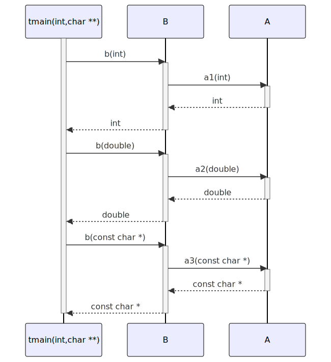

# t20032 - Return type generation option sequence diagram test case
## Config
```yaml
compilation_database_dir: ..
output_directory: diagrams
diagrams:
  t20032_sequence:
    type: sequence
    glob:
      - ../../tests/t20032/t20032.cc
    include:
      namespaces:
        - clanguml::t20032
    using_namespace:
      - clanguml::t20032
    generate_return_types: true
    from:
      - function: "clanguml::t20032::tmain(int,char **)"
```
## Source code
File t20032.cc
```cpp
namespace clanguml {
namespace t20032 {

struct A {
    int a1(int i) { return i; }
    double a2(double d) { return d; }
    const char *a3(const char *s) { return s; }
};

struct B {
    int b(int i) { return a.a1(i); }
    double b(double d) { return a.a2(d); }
    const char *b(const char *s) { return a.a3(s); }

    A a;
};

void tmain(int argc, char **argv)
{
    B b;

    b.b(1);
    b.b(2.0);
    b.b("three");
}
}
}
```
## Generated PlantUML diagrams

## Generated Mermaid diagrams

## Generated JSON models
```json
{
  "diagram_type": "sequence",
  "metadata": {
    "clang_uml_version": "0.4.0-28-g03ac212",
    "llvm_version": "Ubuntu clang version 16.0.6 (++20230710042027+7cbf1a259152-1~exp1~20230710162048.105)",
    "schema_version": 1
  },
  "name": "t20032_sequence",
  "participants": [
    {
      "id": "2159371207846335450",
      "name": "clanguml::t20032::tmain(int,char **)",
      "source_location": {
        "column": 6,
        "file": "../../tests/t20032/t20032.cc",
        "line": 18,
        "translation_unit": "../../tests/t20032/t20032.cc"
      },
      "type": "function"
    },
    {
      "id": "775765108342558014",
      "name": "clanguml::t20032::B",
      "source_location": {
        "column": 8,
        "file": "../../tests/t20032/t20032.cc",
        "line": 10,
        "translation_unit": "../../tests/t20032/t20032.cc"
      },
      "type": "class"
    },
    {
      "id": "1674177120713592616",
      "name": "clanguml::t20032::A",
      "source_location": {
        "column": 8,
        "file": "../../tests/t20032/t20032.cc",
        "line": 4,
        "translation_unit": "../../tests/t20032/t20032.cc"
      },
      "type": "class"
    }
  ],
  "sequences": [
    {
      "messages": [
        {
          "from": {
            "activity_id": "2159371207846335450",
            "activity_name": "clanguml::t20032::tmain(int,char **)",
            "participant_id": "2159371207846335450",
            "participant_name": "clanguml::t20032::tmain(int,char **)"
          },
          "name": "b(int)",
          "return_type": "int",
          "scope": "normal",
          "source_location": {
            "column": 5,
            "file": "../../tests/t20032/t20032.cc",
            "line": 22,
            "translation_unit": "../../tests/t20032/t20032.cc"
          },
          "to": {
            "activity_id": "1775727925274471949",
            "activity_name": "clanguml::t20032::B::b(int)",
            "participant_id": "775765108342558014"
          },
          "type": "message"
        },
        {
          "from": {
            "activity_id": "1775727925274471949",
            "activity_name": "clanguml::t20032::B::b(int)",
            "participant_id": "775765108342558014"
          },
          "name": "a1(int)",
          "return_type": "int",
          "scope": "normal",
          "source_location": {
            "column": 27,
            "file": "../../tests/t20032/t20032.cc",
            "line": 11,
            "translation_unit": "../../tests/t20032/t20032.cc"
          },
          "to": {
            "activity_id": "913842443932719355",
            "activity_name": "clanguml::t20032::A::a1(int)",
            "participant_id": "1674177120713592616"
          },
          "type": "message"
        },
        {
          "from": {
            "activity_id": "2159371207846335450",
            "activity_name": "clanguml::t20032::tmain(int,char **)",
            "participant_id": "2159371207846335450",
            "participant_name": "clanguml::t20032::tmain(int,char **)"
          },
          "name": "b(double)",
          "return_type": "double",
          "scope": "normal",
          "source_location": {
            "column": 5,
            "file": "../../tests/t20032/t20032.cc",
            "line": 23,
            "translation_unit": "../../tests/t20032/t20032.cc"
          },
          "to": {
            "activity_id": "404223226092650061",
            "activity_name": "clanguml::t20032::B::b(double)",
            "participant_id": "775765108342558014"
          },
          "type": "message"
        },
        {
          "from": {
            "activity_id": "404223226092650061",
            "activity_name": "clanguml::t20032::B::b(double)",
            "participant_id": "775765108342558014"
          },
          "name": "a2(double)",
          "return_type": "double",
          "scope": "normal",
          "source_location": {
            "column": 33,
            "file": "../../tests/t20032/t20032.cc",
            "line": 12,
            "translation_unit": "../../tests/t20032/t20032.cc"
          },
          "to": {
            "activity_id": "1293114170675037977",
            "activity_name": "clanguml::t20032::A::a2(double)",
            "participant_id": "1674177120713592616"
          },
          "type": "message"
        },
        {
          "from": {
            "activity_id": "2159371207846335450",
            "activity_name": "clanguml::t20032::tmain(int,char **)",
            "participant_id": "2159371207846335450",
            "participant_name": "clanguml::t20032::tmain(int,char **)"
          },
          "name": "b(const char *)",
          "return_type": "const char *",
          "scope": "normal",
          "source_location": {
            "column": 5,
            "file": "../../tests/t20032/t20032.cc",
            "line": 24,
            "translation_unit": "../../tests/t20032/t20032.cc"
          },
          "to": {
            "activity_id": "1676684483397143166",
            "activity_name": "clanguml::t20032::B::b(const char *)",
            "participant_id": "775765108342558014"
          },
          "type": "message"
        },
        {
          "from": {
            "activity_id": "1676684483397143166",
            "activity_name": "clanguml::t20032::B::b(const char *)",
            "participant_id": "775765108342558014"
          },
          "name": "a3(const char *)",
          "return_type": "const char *",
          "scope": "normal",
          "source_location": {
            "column": 43,
            "file": "../../tests/t20032/t20032.cc",
            "line": 13,
            "translation_unit": "../../tests/t20032/t20032.cc"
          },
          "to": {
            "activity_id": "2099821524363509275",
            "activity_name": "clanguml::t20032::A::a3(const char *)",
            "participant_id": "1674177120713592616"
          },
          "type": "message"
        }
      ],
      "start_from": {
        "id": 2159371207846335450,
        "location": "clanguml::t20032::tmain(int,char **)"
      }
    }
  ],
  "using_namespace": "clanguml::t20032"
}
```
