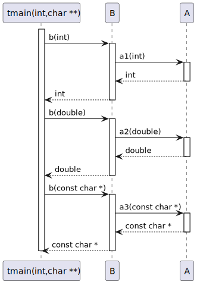
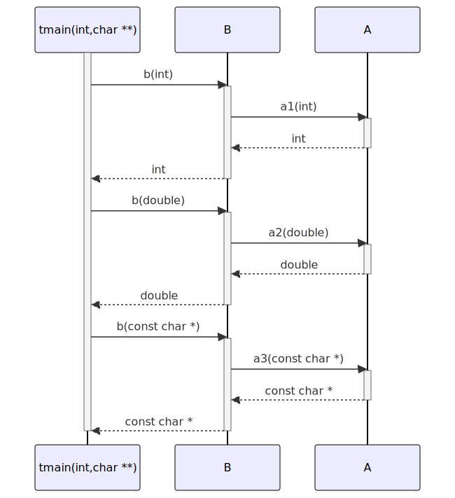

# t20032 - Return type generation option sequence diagram test case
## Config
```yaml
diagrams:
  t20032_sequence:
    type: sequence
    glob:
      - t20032.cc
    include:
      namespaces:
        - clanguml::t20032
    using_namespace: clanguml::t20032
    generate_return_types: true
    from:
      - function: "clanguml::t20032::tmain(int,char **)"
```
## Source code
File `tests/t20032/t20032.cc`
```cpp
namespace clanguml {
namespace t20032 {

struct A {
    int a1(int i) { return i; }
    double a2(double d) { return d; }
    const char *a3(const char *s) { return s; }
};

struct B {
    int b(int i) { return a.a1(i); }
    double b(double d) { return a.a2(d); }
    const char *b(const char *s) { return a.a3(s); }

    A a;
};

void tmain(int argc, char **argv)
{
    B b;

    b.b(1);
    b.b(2.0);
    b.b("three");
}
}
}
```
## Generated PlantUML diagrams

## Generated Mermaid diagrams

## Generated JSON models
```json
{
  "diagram_type": "sequence",
  "name": "t20032_sequence",
  "participants": [
    {
      "display_name": "tmain(int,char **)",
      "full_name": "clanguml::t20032::tmain(int,char **)",
      "id": "17309094319273295933",
      "name": "tmain",
      "namespace": "clanguml::t20032",
      "source_location": {
        "column": 6,
        "file": "t20032.cc",
        "line": 18,
        "translation_unit": "t20032.cc"
      },
      "type": "function"
    },
    {
      "activities": [
        {
          "display_name": "b(int)",
          "full_name": "clanguml::t20032::B::b(int)",
          "id": "17132103224869318909",
          "name": "b",
          "namespace": "clanguml::t20032",
          "source_location": {
            "column": 9,
            "file": "t20032.cc",
            "line": 11,
            "translation_unit": "t20032.cc"
          },
          "type": "method"
        },
        {
          "display_name": "b(double)",
          "full_name": "clanguml::t20032::B::b(double)",
          "id": "16534425686011910327",
          "name": "b",
          "namespace": "clanguml::t20032",
          "source_location": {
            "column": 12,
            "file": "t20032.cc",
            "line": 12,
            "translation_unit": "t20032.cc"
          },
          "type": "method"
        },
        {
          "display_name": "b(const char *)",
          "full_name": "clanguml::t20032::B::b(const char *)",
          "id": "8435717060072005424",
          "name": "b",
          "namespace": "clanguml::t20032",
          "source_location": {
            "column": 17,
            "file": "t20032.cc",
            "line": 13,
            "translation_unit": "t20032.cc"
          },
          "type": "method"
        }
      ],
      "display_name": "B",
      "full_name": "clanguml::t20032::B",
      "id": "14682459596650914866",
      "name": "B",
      "namespace": "clanguml::t20032",
      "source_location": {
        "column": 8,
        "file": "t20032.cc",
        "line": 10,
        "translation_unit": "t20032.cc"
      },
      "type": "class"
    },
    {
      "activities": [
        {
          "display_name": "a1(int)",
          "full_name": "clanguml::t20032::A::a1(int)",
          "id": "15898876775890521297",
          "name": "a1",
          "namespace": "clanguml::t20032",
          "source_location": {
            "column": 9,
            "file": "t20032.cc",
            "line": 5,
            "translation_unit": "t20032.cc"
          },
          "type": "method"
        },
        {
          "display_name": "a2(double)",
          "full_name": "clanguml::t20032::A::a2(double)",
          "id": "7775602060052936809",
          "name": "a2",
          "namespace": "clanguml::t20032",
          "source_location": {
            "column": 12,
            "file": "t20032.cc",
            "line": 6,
            "translation_unit": "t20032.cc"
          },
          "type": "method"
        },
        {
          "display_name": "a3(const char *)",
          "full_name": "clanguml::t20032::A::a3(const char *)",
          "id": "17831096055727349701",
          "name": "a3",
          "namespace": "clanguml::t20032",
          "source_location": {
            "column": 17,
            "file": "t20032.cc",
            "line": 7,
            "translation_unit": "t20032.cc"
          },
          "type": "method"
        }
      ],
      "display_name": "A",
      "full_name": "clanguml::t20032::A",
      "id": "7072192811234747835",
      "name": "A",
      "namespace": "clanguml::t20032",
      "source_location": {
        "column": 8,
        "file": "t20032.cc",
        "line": 4,
        "translation_unit": "t20032.cc"
      },
      "type": "class"
    }
  ],
  "sequences": [
    {
      "from": {
        "id": "17309094319273295933",
        "location": "clanguml::t20032::tmain(int,char **)"
      },
      "messages": [
        {
          "from": {
            "activity_id": "17309094319273295933",
            "participant_id": "17309094319273295933"
          },
          "name": "b(int)",
          "return_type": "int",
          "scope": "normal",
          "source_location": {
            "column": 5,
            "file": "t20032.cc",
            "line": 22,
            "translation_unit": "t20032.cc"
          },
          "to": {
            "activity_id": "17132103224869318909",
            "participant_id": "14682459596650914866"
          },
          "type": "message"
        },
        {
          "from": {
            "activity_id": "17132103224869318909",
            "participant_id": "14682459596650914866"
          },
          "name": "a1(int)",
          "return_type": "int",
          "scope": "normal",
          "source_location": {
            "column": 27,
            "file": "t20032.cc",
            "line": 11,
            "translation_unit": "t20032.cc"
          },
          "to": {
            "activity_id": "15898876775890521297",
            "participant_id": "7072192811234747835"
          },
          "type": "message"
        },
        {
          "from": {
            "activity_id": "15898876775890521297",
            "participant_id": "7072192811234747835"
          },
          "name": "int",
          "return_type": "int",
          "scope": "normal",
          "source_location": {
            "column": 21,
            "file": "t20032.cc",
            "line": 5,
            "translation_unit": "t20032.cc"
          },
          "to": {
            "activity_id": "17132103224869318909",
            "participant_id": "14682459596650914866"
          },
          "type": "return"
        },
        {
          "from": {
            "activity_id": "17132103224869318909",
            "participant_id": "14682459596650914866"
          },
          "name": "int",
          "return_type": "int",
          "scope": "normal",
          "source_location": {
            "column": 20,
            "file": "t20032.cc",
            "line": 11,
            "translation_unit": "t20032.cc"
          },
          "to": {
            "activity_id": "17309094319273295933",
            "participant_id": "17309094319273295933"
          },
          "type": "return"
        },
        {
          "from": {
            "activity_id": "17309094319273295933",
            "participant_id": "17309094319273295933"
          },
          "name": "b(double)",
          "return_type": "double",
          "scope": "normal",
          "source_location": {
            "column": 5,
            "file": "t20032.cc",
            "line": 23,
            "translation_unit": "t20032.cc"
          },
          "to": {
            "activity_id": "16534425686011910327",
            "participant_id": "14682459596650914866"
          },
          "type": "message"
        },
        {
          "from": {
            "activity_id": "16534425686011910327",
            "participant_id": "14682459596650914866"
          },
          "name": "a2(double)",
          "return_type": "double",
          "scope": "normal",
          "source_location": {
            "column": 33,
            "file": "t20032.cc",
            "line": 12,
            "translation_unit": "t20032.cc"
          },
          "to": {
            "activity_id": "7775602060052936809",
            "participant_id": "7072192811234747835"
          },
          "type": "message"
        },
        {
          "from": {
            "activity_id": "7775602060052936809",
            "participant_id": "7072192811234747835"
          },
          "name": "double",
          "return_type": "double",
          "scope": "normal",
          "source_location": {
            "column": 27,
            "file": "t20032.cc",
            "line": 6,
            "translation_unit": "t20032.cc"
          },
          "to": {
            "activity_id": "16534425686011910327",
            "participant_id": "14682459596650914866"
          },
          "type": "return"
        },
        {
          "from": {
            "activity_id": "16534425686011910327",
            "participant_id": "14682459596650914866"
          },
          "name": "double",
          "return_type": "double",
          "scope": "normal",
          "source_location": {
            "column": 26,
            "file": "t20032.cc",
            "line": 12,
            "translation_unit": "t20032.cc"
          },
          "to": {
            "activity_id": "17309094319273295933",
            "participant_id": "17309094319273295933"
          },
          "type": "return"
        },
        {
          "from": {
            "activity_id": "17309094319273295933",
            "participant_id": "17309094319273295933"
          },
          "name": "b(const char *)",
          "return_type": "const char *",
          "scope": "normal",
          "source_location": {
            "column": 5,
            "file": "t20032.cc",
            "line": 24,
            "translation_unit": "t20032.cc"
          },
          "to": {
            "activity_id": "8435717060072005424",
            "participant_id": "14682459596650914866"
          },
          "type": "message"
        },
        {
          "from": {
            "activity_id": "8435717060072005424",
            "participant_id": "14682459596650914866"
          },
          "name": "a3(const char *)",
          "return_type": "const char *",
          "scope": "normal",
          "source_location": {
            "column": 43,
            "file": "t20032.cc",
            "line": 13,
            "translation_unit": "t20032.cc"
          },
          "to": {
            "activity_id": "17831096055727349701",
            "participant_id": "7072192811234747835"
          },
          "type": "message"
        },
        {
          "from": {
            "activity_id": "17831096055727349701",
            "participant_id": "7072192811234747835"
          },
          "name": "const char *",
          "return_type": "const char *",
          "scope": "normal",
          "source_location": {
            "column": 37,
            "file": "t20032.cc",
            "line": 7,
            "translation_unit": "t20032.cc"
          },
          "to": {
            "activity_id": "8435717060072005424",
            "participant_id": "14682459596650914866"
          },
          "type": "return"
        },
        {
          "from": {
            "activity_id": "8435717060072005424",
            "participant_id": "14682459596650914866"
          },
          "name": "const char *",
          "return_type": "const char *",
          "scope": "normal",
          "source_location": {
            "column": 36,
            "file": "t20032.cc",
            "line": 13,
            "translation_unit": "t20032.cc"
          },
          "to": {
            "activity_id": "17309094319273295933",
            "participant_id": "17309094319273295933"
          },
          "type": "return"
        }
      ]
    }
  ],
  "using_namespace": "clanguml::t20032"
}
```
## Generated GraphML models
