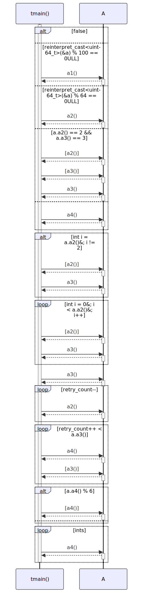

# t20033 - Control statement text in sequence diagram test case
## Config
```yaml
diagrams:
  t20033_sequence:
    type: sequence
    glob:
      - t20033.cc
    include:
      namespaces:
        - clanguml::t20033
    using_namespace: clanguml::t20033
    generate_condition_statements: true
    from:
      - function: "clanguml::t20033::tmain()"
```
## Source code
File `tests/t20033/t20033.cc`
```cpp
#include <cmath>
#include <cstdint>
#include <vector>

namespace clanguml {
namespace t20033 {
struct A {
    int a1() { return 0; }
    int a2() { return 1; }
    int a3() { return 2; }
    int a4() { return 3; }
};

int tmain()
{
    A a;

    int result{};
    // clang-format off
    if(false) {
        result = 0;
    }
    else if (reinterpret_cast<uint64_t>(&a) % 100 == 0ULL) {
        result = a.a1();
    }
    else if (reinterpret_cast<uint64_t>(&a) % 64 == 0ULL) {
        result = a.a2();
    }
    else if(a.a2() == 2 &&
            a.a3() == 3) {
        result = a.a3();
    }
    else {
        result = a.a4();
    }
    // clang-format on

    if (int i = a.a2(); i != 2) {
        result += a.a3();
    }

    for (int i = 0; i < a.a2(); i++) {
        result += i * a.a3();
    }

    int retry_count = a.a3();
    while (retry_count--) {
        result -= a.a2();
    }

    do {
        result += a.a4();
    } while (retry_count++ < a.a3());

    result = a.a4() % 6 ? result * 2 : result;

    std::vector<int> ints;
    for (auto i : ints) {
        result += a.a4();
    }

    return result;
}
}
}
```
## Generated PlantUML diagrams

## Generated Mermaid diagrams

## Generated JSON models
```json
{
  "diagram_type": "sequence",
  "name": "t20033_sequence",
  "participants": [
    {
      "display_name": "tmain()",
      "full_name": "clanguml::t20033::tmain()",
      "id": "2284981553733959328",
      "name": "tmain",
      "namespace": "clanguml::t20033",
      "source_location": {
        "column": 5,
        "file": "t20033.cc",
        "line": 14,
        "translation_unit": "t20033.cc"
      },
      "type": "function"
    },
    {
      "activities": [
        {
          "display_name": "a1()",
          "full_name": "clanguml::t20033::A::a1()",
          "id": "558885502745634115",
          "name": "a1",
          "namespace": "",
          "source_location": {
            "column": 9,
            "file": "t20033.cc",
            "line": 8,
            "translation_unit": "t20033.cc"
          },
          "type": "method"
        },
        {
          "display_name": "a2()",
          "full_name": "clanguml::t20033::A::a2()",
          "id": "748502947476611794",
          "name": "a2",
          "namespace": "",
          "source_location": {
            "column": 9,
            "file": "t20033.cc",
            "line": 9,
            "translation_unit": "t20033.cc"
          },
          "type": "method"
        },
        {
          "display_name": "a3()",
          "full_name": "clanguml::t20033::A::a3()",
          "id": "55903385814245839",
          "name": "a3",
          "namespace": "",
          "source_location": {
            "column": 9,
            "file": "t20033.cc",
            "line": 10,
            "translation_unit": "t20033.cc"
          },
          "type": "method"
        },
        {
          "display_name": "a4()",
          "full_name": "clanguml::t20033::A::a4()",
          "id": "1686426476339443579",
          "name": "a4",
          "namespace": "",
          "source_location": {
            "column": 9,
            "file": "t20033.cc",
            "line": 11,
            "translation_unit": "t20033.cc"
          },
          "type": "method"
        }
      ],
      "display_name": "A",
      "full_name": "clanguml::t20033::A",
      "id": "615995652843962691",
      "name": "A",
      "namespace": "clanguml::t20033",
      "source_location": {
        "column": 8,
        "file": "t20033.cc",
        "line": 7,
        "translation_unit": "t20033.cc"
      },
      "type": "class"
    }
  ],
  "sequences": [
    {
      "messages": [
        {
          "activity_id": "2284981553733959328",
          "branches": [
            {
              "type": "consequent"
            },
            {
              "messages": [
                {
                  "from": {
                    "activity_id": "2284981553733959328",
                    "participant_id": "2284981553733959328"
                  },
                  "name": "a1()",
                  "return_type": "int",
                  "scope": "normal",
                  "source_location": {
                    "column": 18,
                    "file": "t20033.cc",
                    "line": 24,
                    "translation_unit": "t20033.cc"
                  },
                  "to": {
                    "activity_id": "558885502745634115",
                    "participant_id": "615995652843962691"
                  },
                  "type": "message"
                }
              ],
              "type": "alternative"
            },
            {
              "messages": [
                {
                  "from": {
                    "activity_id": "2284981553733959328",
                    "participant_id": "2284981553733959328"
                  },
                  "name": "a2()",
                  "return_type": "int",
                  "scope": "normal",
                  "source_location": {
                    "column": 18,
                    "file": "t20033.cc",
                    "line": 27,
                    "translation_unit": "t20033.cc"
                  },
                  "to": {
                    "activity_id": "748502947476611794",
                    "participant_id": "615995652843962691"
                  },
                  "type": "message"
                }
              ],
              "type": "alternative"
            },
            {
              "messages": [
                {
                  "from": {
                    "activity_id": "2284981553733959328",
                    "participant_id": "2284981553733959328"
                  },
                  "name": "a2()",
                  "return_type": "int",
                  "scope": "condition",
                  "source_location": {
                    "column": 13,
                    "file": "t20033.cc",
                    "line": 29,
                    "translation_unit": "t20033.cc"
                  },
                  "to": {
                    "activity_id": "748502947476611794",
                    "participant_id": "615995652843962691"
                  },
                  "type": "message"
                },
                {
                  "from": {
                    "activity_id": "2284981553733959328",
                    "participant_id": "2284981553733959328"
                  },
                  "name": "a3()",
                  "return_type": "int",
                  "scope": "condition",
                  "source_location": {
                    "column": 13,
                    "file": "t20033.cc",
                    "line": 30,
                    "translation_unit": "t20033.cc"
                  },
                  "to": {
                    "activity_id": "55903385814245839",
                    "participant_id": "615995652843962691"
                  },
                  "type": "message"
                },
                {
                  "from": {
                    "activity_id": "2284981553733959328",
                    "participant_id": "2284981553733959328"
                  },
                  "name": "a3()",
                  "return_type": "int",
                  "scope": "normal",
                  "source_location": {
                    "column": 18,
                    "file": "t20033.cc",
                    "line": 31,
                    "translation_unit": "t20033.cc"
                  },
                  "to": {
                    "activity_id": "55903385814245839",
                    "participant_id": "615995652843962691"
                  },
                  "type": "message"
                }
              ],
              "type": "alternative"
            },
            {
              "messages": [
                {
                  "from": {
                    "activity_id": "2284981553733959328",
                    "participant_id": "2284981553733959328"
                  },
                  "name": "a4()",
                  "return_type": "int",
                  "scope": "normal",
                  "source_location": {
                    "column": 18,
                    "file": "t20033.cc",
                    "line": 34,
                    "translation_unit": "t20033.cc"
                  },
                  "to": {
                    "activity_id": "1686426476339443579",
                    "participant_id": "615995652843962691"
                  },
                  "type": "message"
                }
              ],
              "type": "alternative"
            }
          ],
          "condition_text": "false",
          "name": "if",
          "type": "alt"
        },
        {
          "activity_id": "2284981553733959328",
          "branches": [
            {
              "messages": [
                {
                  "from": {
                    "activity_id": "2284981553733959328",
                    "participant_id": "2284981553733959328"
                  },
                  "name": "a2()",
                  "return_type": "int",
                  "scope": "condition",
                  "source_location": {
                    "column": 17,
                    "file": "t20033.cc",
                    "line": 38,
                    "translation_unit": "t20033.cc"
                  },
                  "to": {
                    "activity_id": "748502947476611794",
                    "participant_id": "615995652843962691"
                  },
                  "type": "message"
                },
                {
                  "from": {
                    "activity_id": "2284981553733959328",
                    "participant_id": "2284981553733959328"
                  },
                  "name": "a3()",
                  "return_type": "int",
                  "scope": "normal",
                  "source_location": {
                    "column": 19,
                    "file": "t20033.cc",
                    "line": 39,
                    "translation_unit": "t20033.cc"
                  },
                  "to": {
                    "activity_id": "55903385814245839",
                    "participant_id": "615995652843962691"
                  },
                  "type": "message"
                }
              ],
              "type": "consequent"
            }
          ],
          "condition_text": "int i = a.a2(); i != 2",
          "name": "if",
          "type": "alt"
        },
        {
          "activity_id": "2284981553733959328",
          "condition_text": "int i = 0; i < a.a2(); i++",
          "messages": [
            {
              "from": {
                "activity_id": "2284981553733959328",
                "participant_id": "2284981553733959328"
              },
              "name": "a2()",
              "return_type": "int",
              "scope": "condition",
              "source_location": {
                "column": 25,
                "file": "t20033.cc",
                "line": 42,
                "translation_unit": "t20033.cc"
              },
              "to": {
                "activity_id": "748502947476611794",
                "participant_id": "615995652843962691"
              },
              "type": "message"
            },
            {
              "from": {
                "activity_id": "2284981553733959328",
                "participant_id": "2284981553733959328"
              },
              "name": "a3()",
              "return_type": "int",
              "scope": "normal",
              "source_location": {
                "column": 23,
                "file": "t20033.cc",
                "line": 43,
                "translation_unit": "t20033.cc"
              },
              "to": {
                "activity_id": "55903385814245839",
                "participant_id": "615995652843962691"
              },
              "type": "message"
            }
          ],
          "name": "for",
          "type": "loop"
        },
        {
          "from": {
            "activity_id": "2284981553733959328",
            "participant_id": "2284981553733959328"
          },
          "name": "a3()",
          "return_type": "int",
          "scope": "normal",
          "source_location": {
            "column": 23,
            "file": "t20033.cc",
            "line": 46,
            "translation_unit": "t20033.cc"
          },
          "to": {
            "activity_id": "55903385814245839",
            "participant_id": "615995652843962691"
          },
          "type": "message"
        },
        {
          "activity_id": "2284981553733959328",
          "condition_text": "retry_count--",
          "messages": [
            {
              "from": {
                "activity_id": "2284981553733959328",
                "participant_id": "2284981553733959328"
              },
              "name": "a2()",
              "return_type": "int",
              "scope": "normal",
              "source_location": {
                "column": 19,
                "file": "t20033.cc",
                "line": 48,
                "translation_unit": "t20033.cc"
              },
              "to": {
                "activity_id": "748502947476611794",
                "participant_id": "615995652843962691"
              },
              "type": "message"
            }
          ],
          "name": "while",
          "type": "loop"
        },
        {
          "activity_id": "2284981553733959328",
          "condition_text": "retry_count++ < a.a3()",
          "messages": [
            {
              "from": {
                "activity_id": "2284981553733959328",
                "participant_id": "2284981553733959328"
              },
              "name": "a4()",
              "return_type": "int",
              "scope": "normal",
              "source_location": {
                "column": 19,
                "file": "t20033.cc",
                "line": 52,
                "translation_unit": "t20033.cc"
              },
              "to": {
                "activity_id": "1686426476339443579",
                "participant_id": "615995652843962691"
              },
              "type": "message"
            },
            {
              "from": {
                "activity_id": "2284981553733959328",
                "participant_id": "2284981553733959328"
              },
              "name": "a3()",
              "return_type": "int",
              "scope": "condition",
              "source_location": {
                "column": 30,
                "file": "t20033.cc",
                "line": 53,
                "translation_unit": "t20033.cc"
              },
              "to": {
                "activity_id": "55903385814245839",
                "participant_id": "615995652843962691"
              },
              "type": "message"
            }
          ],
          "name": "do",
          "type": "loop"
        },
        {
          "activity_id": "2284981553733959328",
          "branches": [
            {
              "messages": [
                {
                  "from": {
                    "activity_id": "2284981553733959328",
                    "participant_id": "2284981553733959328"
                  },
                  "name": "a4()",
                  "return_type": "int",
                  "scope": "condition",
                  "source_location": {
                    "column": 14,
                    "file": "t20033.cc",
                    "line": 55,
                    "translation_unit": "t20033.cc"
                  },
                  "to": {
                    "activity_id": "1686426476339443579",
                    "participant_id": "615995652843962691"
                  },
                  "type": "message"
                }
              ],
              "type": "consequent"
            },
            {
              "type": "alternative"
            }
          ],
          "condition_text": "a.a4() % 6",
          "name": "conditional",
          "type": "alt"
        },
        {
          "activity_id": "2284981553733959328",
          "condition_text": "ints",
          "messages": [
            {
              "from": {
                "activity_id": "2284981553733959328",
                "participant_id": "2284981553733959328"
              },
              "name": "a4()",
              "return_type": "int",
              "scope": "normal",
              "source_location": {
                "column": 19,
                "file": "t20033.cc",
                "line": 59,
                "translation_unit": "t20033.cc"
              },
              "to": {
                "activity_id": "1686426476339443579",
                "participant_id": "615995652843962691"
              },
              "type": "message"
            }
          ],
          "name": "for",
          "type": "loop"
        }
      ],
      "start_from": {
        "id": 2284981553733959328,
        "location": "clanguml::t20033::tmain()"
      }
    }
  ],
  "using_namespace": "clanguml::t20033"
}
```
