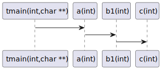
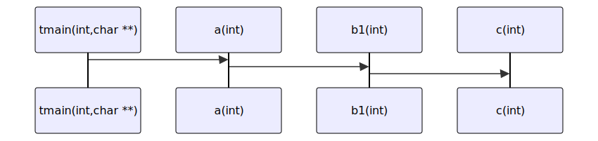

# t20035 - from_to sequence diagram test case with free functions
## Config
```yaml
diagrams:
  t20035_sequence:
    type: sequence
    glob:
      - t20035.cc
    include:
      namespaces:
        - clanguml::t20035
    using_namespace: clanguml::t20035
    from_to:
      - [function: "clanguml::t20035::tmain(int,char **)",
         function: "clanguml::t20035::c(int)"]
```
## Source code
File `tests/t20035/t20035.cc`
```cpp
namespace clanguml {
namespace t20035 {

int c(int arg) { return arg; }

int b1(int arg) { return c(arg); }

int b2(int arg) { return c(arg); }

int a(int arg) { return b1(arg); }

int tmain(int argc, char **argv) { return a(argc); }
}
}
```
## Generated PlantUML diagrams

## Generated Mermaid diagrams

## Generated JSON models
```json
{
  "diagram_type": "sequence",
  "name": "t20035_sequence",
  "participants": [
    {
      "display_name": "tmain(int,char **)",
      "full_name": "clanguml::t20035::tmain(int,char **)",
      "id": "1380099746477810520",
      "name": "tmain",
      "namespace": "clanguml::t20035",
      "source_location": {
        "column": 5,
        "file": "t20035.cc",
        "line": 12,
        "translation_unit": "t20035.cc"
      },
      "type": "function"
    },
    {
      "display_name": "a(int)",
      "full_name": "clanguml::t20035::a(int)",
      "id": "1503144831959453736",
      "name": "a",
      "namespace": "clanguml::t20035",
      "source_location": {
        "column": 5,
        "file": "t20035.cc",
        "line": 10,
        "translation_unit": "t20035.cc"
      },
      "type": "function"
    },
    {
      "display_name": "b1(int)",
      "full_name": "clanguml::t20035::b1(int)",
      "id": "440199113909747659",
      "name": "b1",
      "namespace": "clanguml::t20035",
      "source_location": {
        "column": 5,
        "file": "t20035.cc",
        "line": 6,
        "translation_unit": "t20035.cc"
      },
      "type": "function"
    },
    {
      "display_name": "c(int)",
      "full_name": "clanguml::t20035::c(int)",
      "id": "709102392181022891",
      "name": "c",
      "namespace": "clanguml::t20035",
      "source_location": {
        "column": 5,
        "file": "t20035.cc",
        "line": 4,
        "translation_unit": "t20035.cc"
      },
      "type": "function"
    }
  ],
  "sequences": [
    {
      "from_to": {
        "from": {
          "id": 1380099746477810520,
          "location": "clanguml::t20035::tmain(int,char **)"
        },
        "to": {
          "id": 709102392181022891,
          "location": "clanguml::t20035::c(int)"
        }
      },
      "message_chains": [
        {
          "messages": [
            {
              "from": {
                "activity_id": "1380099746477810520",
                "participant_id": "1380099746477810520"
              },
              "name": "",
              "return_type": "int",
              "scope": "normal",
              "source_location": {
                "column": 43,
                "file": "t20035.cc",
                "line": 12,
                "translation_unit": "t20035.cc"
              },
              "to": {
                "activity_id": "1503144831959453736",
                "participant_id": "1503144831959453736"
              },
              "type": "message"
            },
            {
              "from": {
                "activity_id": "1503144831959453736",
                "participant_id": "1503144831959453736"
              },
              "name": "",
              "return_type": "int",
              "scope": "normal",
              "source_location": {
                "column": 25,
                "file": "t20035.cc",
                "line": 10,
                "translation_unit": "t20035.cc"
              },
              "to": {
                "activity_id": "440199113909747659",
                "participant_id": "440199113909747659"
              },
              "type": "message"
            },
            {
              "from": {
                "activity_id": "440199113909747659",
                "participant_id": "440199113909747659"
              },
              "name": "",
              "return_type": "int",
              "scope": "normal",
              "source_location": {
                "column": 26,
                "file": "t20035.cc",
                "line": 6,
                "translation_unit": "t20035.cc"
              },
              "to": {
                "activity_id": "709102392181022891",
                "participant_id": "709102392181022891"
              },
              "type": "message"
            }
          ]
        }
      ]
    }
  ],
  "using_namespace": "clanguml::t20035"
}
```
