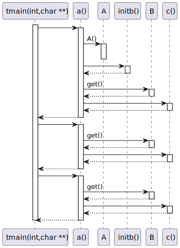
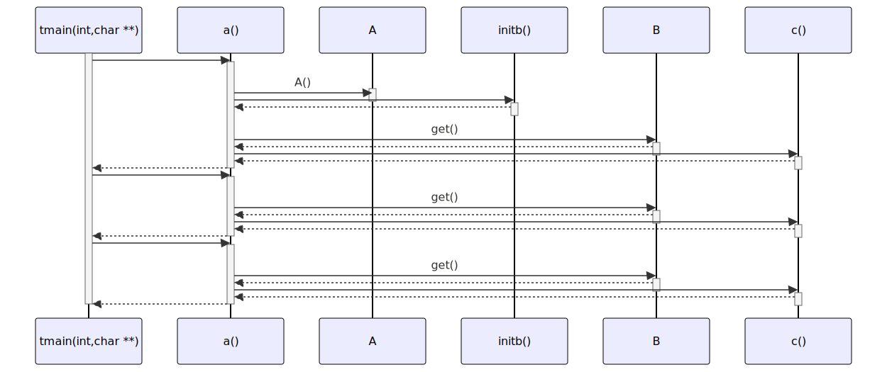

# t20037 - Test case checking if activities in static variable declarations appear only once
## Config
```yaml
diagrams:
  t20037_sequence:
    type: sequence
    glob:
      - t20037.cc
    include:
      namespaces:
        - clanguml::t20037
    using_namespace: clanguml::t20037
    from:
      - function: "clanguml::t20037::tmain(int,char **)"
```
## Source code
File `tests/t20037/t20037.cc`
```cpp
namespace clanguml {
namespace t20037 {

struct A {
    A()
        : a{100}
    {
    }

    int a;
};

struct B {
    int get() { return b; }

    int b{100};
};

B initb() { return B{}; }

int c() { return 1; }

int a()
{
    static A a;
    static B b = initb();

    return a.a + b.get() + c();
}

void tmain(int argc, char **argv)
{
    auto a1 = a();
    auto a2 = a();
    auto a3 = a();
}
}
}
```
## Generated PlantUML diagrams

## Generated Mermaid diagrams

## Generated JSON models
```json
{
  "diagram_type": "sequence",
  "name": "t20037_sequence",
  "participants": [
    {
      "display_name": "tmain(int,char **)",
      "full_name": "clanguml::t20037::tmain(int,char **)",
      "id": "1676651465274088148",
      "name": "tmain",
      "namespace": "clanguml::t20037",
      "source_location": {
        "column": 6,
        "file": "t20037.cc",
        "line": 31,
        "translation_unit": "t20037.cc"
      },
      "type": "function"
    },
    {
      "display_name": "a()",
      "full_name": "clanguml::t20037::a()",
      "id": "150460916850164805",
      "name": "a",
      "namespace": "clanguml::t20037",
      "source_location": {
        "column": 5,
        "file": "t20037.cc",
        "line": 23,
        "translation_unit": "t20037.cc"
      },
      "type": "function"
    },
    {
      "activities": [
        {
          "display_name": "A()",
          "full_name": "clanguml::t20037::A::A()",
          "id": "1135451191676888496",
          "name": "A",
          "namespace": "",
          "source_location": {
            "column": 5,
            "file": "t20037.cc",
            "line": 5,
            "translation_unit": "t20037.cc"
          },
          "type": "method"
        }
      ],
      "display_name": "A",
      "full_name": "clanguml::t20037::A",
      "id": "1329920824155530080",
      "name": "A",
      "namespace": "clanguml::t20037",
      "source_location": {
        "column": 8,
        "file": "t20037.cc",
        "line": 4,
        "translation_unit": "t20037.cc"
      },
      "type": "class"
    },
    {
      "display_name": "initb()",
      "full_name": "clanguml::t20037::initb()",
      "id": "1303264946914255327",
      "name": "initb",
      "namespace": "clanguml::t20037",
      "source_location": {
        "column": 3,
        "file": "t20037.cc",
        "line": 19,
        "translation_unit": "t20037.cc"
      },
      "type": "function"
    },
    {
      "activities": [
        {
          "display_name": "get()",
          "full_name": "clanguml::t20037::B::get()",
          "id": "107877908217538137",
          "name": "get",
          "namespace": "",
          "source_location": {
            "column": 9,
            "file": "t20037.cc",
            "line": 14,
            "translation_unit": "t20037.cc"
          },
          "type": "method"
        }
      ],
      "display_name": "B",
      "full_name": "clanguml::t20037::B",
      "id": "1746900845528413124",
      "name": "B",
      "namespace": "clanguml::t20037",
      "source_location": {
        "column": 8,
        "file": "t20037.cc",
        "line": 13,
        "translation_unit": "t20037.cc"
      },
      "type": "class"
    },
    {
      "display_name": "c()",
      "full_name": "clanguml::t20037::c()",
      "id": "1349992361928784583",
      "name": "c",
      "namespace": "clanguml::t20037",
      "source_location": {
        "column": 5,
        "file": "t20037.cc",
        "line": 21,
        "translation_unit": "t20037.cc"
      },
      "type": "function"
    }
  ],
  "sequences": [
    {
      "messages": [
        {
          "from": {
            "activity_id": "1676651465274088148",
            "participant_id": "1676651465274088148"
          },
          "name": "",
          "return_type": "int",
          "scope": "normal",
          "source_location": {
            "column": 15,
            "file": "t20037.cc",
            "line": 33,
            "translation_unit": "t20037.cc"
          },
          "to": {
            "activity_id": "150460916850164805",
            "participant_id": "150460916850164805"
          },
          "type": "message"
        },
        {
          "from": {
            "activity_id": "150460916850164805",
            "participant_id": "150460916850164805"
          },
          "name": "A()",
          "return_type": "void",
          "scope": "normal",
          "source_location": {
            "column": 14,
            "file": "t20037.cc",
            "line": 25,
            "translation_unit": "t20037.cc"
          },
          "to": {
            "activity_id": "1135451191676888496",
            "participant_id": "1329920824155530080"
          },
          "type": "message"
        },
        {
          "from": {
            "activity_id": "150460916850164805",
            "participant_id": "150460916850164805"
          },
          "name": "",
          "return_type": "B",
          "scope": "normal",
          "source_location": {
            "column": 18,
            "file": "t20037.cc",
            "line": 26,
            "translation_unit": "t20037.cc"
          },
          "to": {
            "activity_id": "1303264946914255327",
            "participant_id": "1303264946914255327"
          },
          "type": "message"
        },
        {
          "from": {
            "activity_id": "150460916850164805",
            "participant_id": "150460916850164805"
          },
          "name": "get()",
          "return_type": "int",
          "scope": "normal",
          "source_location": {
            "column": 18,
            "file": "t20037.cc",
            "line": 28,
            "translation_unit": "t20037.cc"
          },
          "to": {
            "activity_id": "107877908217538137",
            "participant_id": "1746900845528413124"
          },
          "type": "message"
        },
        {
          "from": {
            "activity_id": "150460916850164805",
            "participant_id": "150460916850164805"
          },
          "name": "",
          "return_type": "int",
          "scope": "normal",
          "source_location": {
            "column": 28,
            "file": "t20037.cc",
            "line": 28,
            "translation_unit": "t20037.cc"
          },
          "to": {
            "activity_id": "1349992361928784583",
            "participant_id": "1349992361928784583"
          },
          "type": "message"
        },
        {
          "from": {
            "activity_id": "1676651465274088148",
            "participant_id": "1676651465274088148"
          },
          "name": "",
          "return_type": "int",
          "scope": "normal",
          "source_location": {
            "column": 15,
            "file": "t20037.cc",
            "line": 34,
            "translation_unit": "t20037.cc"
          },
          "to": {
            "activity_id": "150460916850164805",
            "participant_id": "150460916850164805"
          },
          "type": "message"
        },
        {
          "from": {
            "activity_id": "150460916850164805",
            "participant_id": "150460916850164805"
          },
          "name": "get()",
          "return_type": "int",
          "scope": "normal",
          "source_location": {
            "column": 18,
            "file": "t20037.cc",
            "line": 28,
            "translation_unit": "t20037.cc"
          },
          "to": {
            "activity_id": "107877908217538137",
            "participant_id": "1746900845528413124"
          },
          "type": "message"
        },
        {
          "from": {
            "activity_id": "150460916850164805",
            "participant_id": "150460916850164805"
          },
          "name": "",
          "return_type": "int",
          "scope": "normal",
          "source_location": {
            "column": 28,
            "file": "t20037.cc",
            "line": 28,
            "translation_unit": "t20037.cc"
          },
          "to": {
            "activity_id": "1349992361928784583",
            "participant_id": "1349992361928784583"
          },
          "type": "message"
        },
        {
          "from": {
            "activity_id": "1676651465274088148",
            "participant_id": "1676651465274088148"
          },
          "name": "",
          "return_type": "int",
          "scope": "normal",
          "source_location": {
            "column": 15,
            "file": "t20037.cc",
            "line": 35,
            "translation_unit": "t20037.cc"
          },
          "to": {
            "activity_id": "150460916850164805",
            "participant_id": "150460916850164805"
          },
          "type": "message"
        },
        {
          "from": {
            "activity_id": "150460916850164805",
            "participant_id": "150460916850164805"
          },
          "name": "get()",
          "return_type": "int",
          "scope": "normal",
          "source_location": {
            "column": 18,
            "file": "t20037.cc",
            "line": 28,
            "translation_unit": "t20037.cc"
          },
          "to": {
            "activity_id": "107877908217538137",
            "participant_id": "1746900845528413124"
          },
          "type": "message"
        },
        {
          "from": {
            "activity_id": "150460916850164805",
            "participant_id": "150460916850164805"
          },
          "name": "",
          "return_type": "int",
          "scope": "normal",
          "source_location": {
            "column": 28,
            "file": "t20037.cc",
            "line": 28,
            "translation_unit": "t20037.cc"
          },
          "to": {
            "activity_id": "1349992361928784583",
            "participant_id": "1349992361928784583"
          },
          "type": "message"
        }
      ],
      "start_from": {
        "id": 1676651465274088148,
        "location": "clanguml::t20037::tmain(int,char **)"
      }
    }
  ],
  "using_namespace": "clanguml::t20037"
}
```
