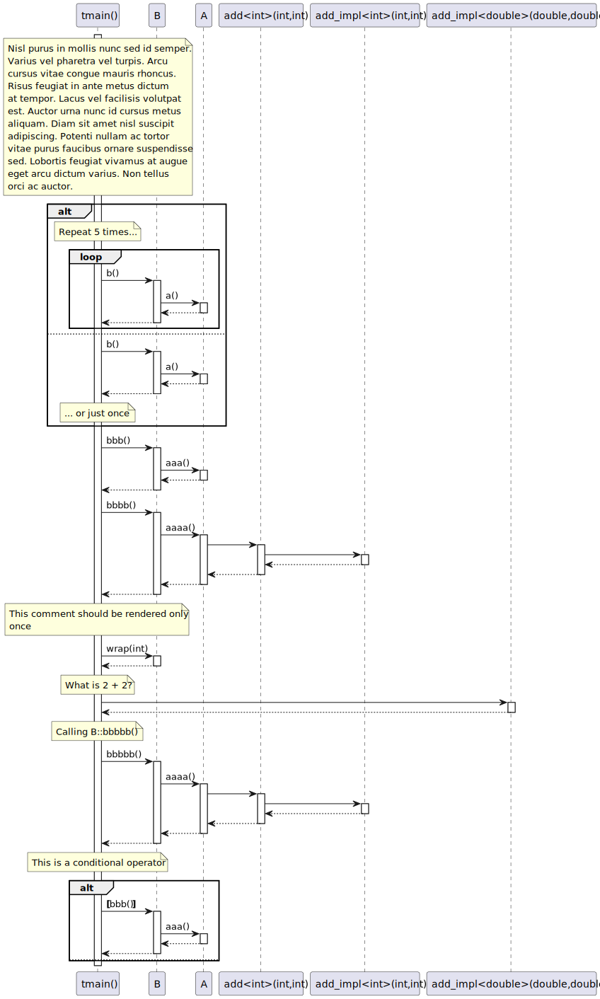
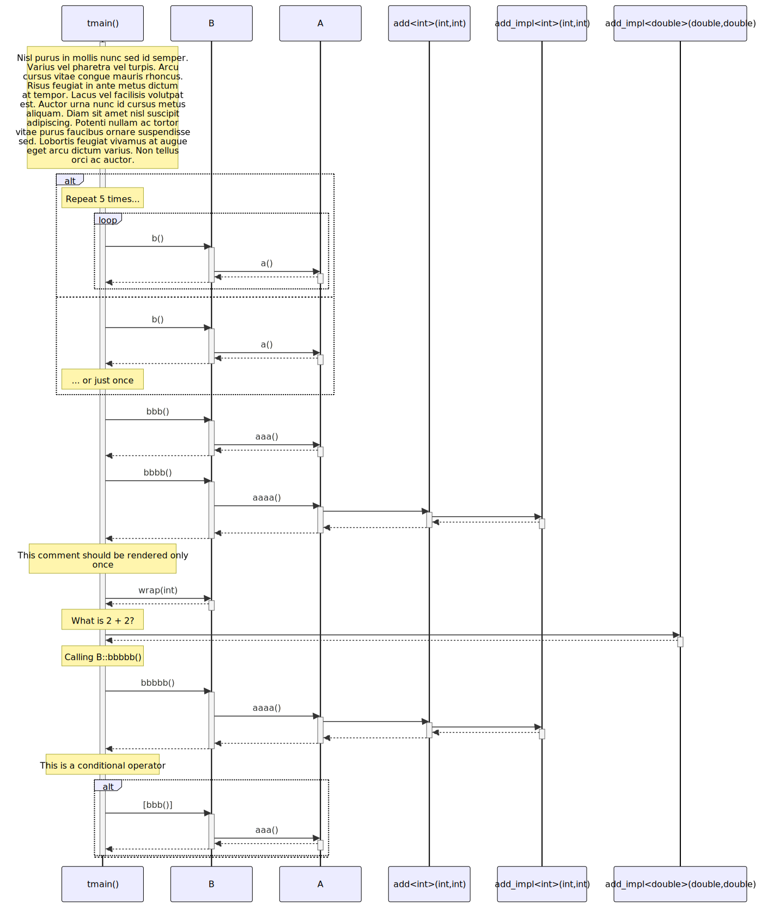

# t20038 - Sequence diagram comment decorator test case
## Config
```yaml
add_compile_flags:
  - -fparse-all-comments
diagrams:
  t20038_sequence:
    type: sequence
    glob:
      - t20038.cc
    include:
      namespaces:
        - clanguml::t20038
    from:
      - function: clanguml::t20038::tmain()
    generate_message_comments: true
    message_comment_width: 35
    using_namespace: clanguml::t20038
```
## Source code
File `tests/t20038/t20038.cc`
```cpp
#include <future>

#include "include/t20038.h"

namespace clanguml {
namespace t20038 {

struct A {
    int a() { return 1; }

    int aa()
    {
        int i;
        // Repeat 10 times
        for (i = 0; i < 10;) {
            i += a();
        }
        return i;
    }

    int aaa() { return 3; }

    int aaaa() { return add(4, 4); }

    int aaaaa() { return 5; }
};

struct B {
    int b() { return a.a(); }

    int bb() { return a.aa(); }

    int bbb() { return a.aaa(); }

    int bbbb() { return a.aaaa(); }

    int bbbbb() { return a.aaaa(); }

    int wrap(int b) { return b; }

    A a;
};

int tmain()
{
    B b;

    // Nisl purus in mollis nunc sed id semper. Varius vel pharetra vel
    // turpis. Arcu cursus vitae congue mauris rhoncus. Risus feugiat in
    // ante metus dictum at tempor. Lacus vel facilisis volutpat est. Auctor
    // urna nunc id cursus metus aliquam. Diam sit amet nisl suscipit
    // adipiscing. Potenti nullam ac tortor vitae purus faucibus ornare
    // suspendisse sed. Lobortis feugiat vivamus at augue eget arcu dictum
    // varius. Non tellus orci ac auctor.
    if (true) {
        auto r = 0;
        // Repeat 5 times...
        while (r < 5) {
            r += b.b();
        }
        return r;
    }
    else {
        // ... or just once
        return 2 * b.b();
    }

    // \uml{skip}
    b.bb();

    // \uml{call clanguml::t20038::B::bbb()}
    auto bbb_future = std::async(std::launch::deferred, &B::bbb, b);

    bbb_future.wait();

    // This comment should be rendered only once
    b.wrap(b.bbbb());

    add_impl<double>(2, 2); // What is 2 + 2?

    // This is a generic comment about calling bbbbb()
    //
    // \uml{note:some_other_diagram[] This is specific for some_other_diagram}
    // \uml{note:t20038_sequence[] Calling B::bbbbb()}
    b.bbbbb();

    // This is a conditional operator
    return b.bbb() > 5 ? 0 : 1;
}
}
}
```
File `tests/t20038/include/t20038.h`
```cpp
#pragma once

namespace clanguml {
namespace t20038 {

template <typename T> T add_impl(T a, T b) { return a + b; };

template <typename T> T add(T a, T b)
{
    // Invoke 'add' implementation
    return add_impl(a, b);
};
}
}
```
## Generated PlantUML diagrams

## Generated Mermaid diagrams

## Generated JSON models
```json
{
  "diagram_type": "sequence",
  "name": "t20038_sequence",
  "participants": [
    {
      "display_name": "tmain()",
      "full_name": "clanguml::t20038::tmain()",
      "id": "1013610625329227974",
      "name": "tmain",
      "namespace": "clanguml::t20038",
      "source_location": {
        "column": 5,
        "file": "t20038.cc",
        "line": 44,
        "translation_unit": "t20038.cc"
      },
      "type": "function"
    },
    {
      "activities": [
        {
          "display_name": "b()",
          "full_name": "clanguml::t20038::B::b()",
          "id": "690314603725772987",
          "name": "b",
          "namespace": "",
          "source_location": {
            "column": 9,
            "file": "t20038.cc",
            "line": 29,
            "translation_unit": "t20038.cc"
          },
          "type": "method"
        },
        {
          "display_name": "bbb()",
          "full_name": "clanguml::t20038::B::bbb()",
          "id": "1902331999195245434",
          "name": "bbb",
          "namespace": "",
          "source_location": {
            "column": 9,
            "file": "t20038.cc",
            "line": 33,
            "translation_unit": "t20038.cc"
          },
          "type": "method"
        },
        {
          "display_name": "bbbb()",
          "full_name": "clanguml::t20038::B::bbbb()",
          "id": "57189865474209187",
          "name": "bbbb",
          "namespace": "",
          "source_location": {
            "column": 9,
            "file": "t20038.cc",
            "line": 35,
            "translation_unit": "t20038.cc"
          },
          "type": "method"
        },
        {
          "display_name": "wrap(int)",
          "full_name": "clanguml::t20038::B::wrap(int)",
          "id": "732774941205637034",
          "name": "wrap",
          "namespace": "",
          "source_location": {
            "column": 9,
            "file": "t20038.cc",
            "line": 39,
            "translation_unit": "t20038.cc"
          },
          "type": "method"
        },
        {
          "display_name": "bbbbb()",
          "full_name": "clanguml::t20038::B::bbbbb()",
          "id": "726295067786650864",
          "name": "bbbbb",
          "namespace": "",
          "source_location": {
            "column": 9,
            "file": "t20038.cc",
            "line": 37,
            "translation_unit": "t20038.cc"
          },
          "type": "method"
        }
      ],
      "display_name": "B",
      "full_name": "clanguml::t20038::B",
      "id": "1040787777721396414",
      "name": "B",
      "namespace": "clanguml::t20038",
      "source_location": {
        "column": 8,
        "file": "t20038.cc",
        "line": 28,
        "translation_unit": "t20038.cc"
      },
      "type": "class"
    },
    {
      "activities": [
        {
          "display_name": "a()",
          "full_name": "clanguml::t20038::A::a()",
          "id": "1311298747919334371",
          "name": "a",
          "namespace": "",
          "source_location": {
            "column": 9,
            "file": "t20038.cc",
            "line": 9,
            "translation_unit": "t20038.cc"
          },
          "type": "method"
        },
        {
          "display_name": "aaa()",
          "full_name": "clanguml::t20038::A::aaa()",
          "id": "2157208254318041144",
          "name": "aaa",
          "namespace": "",
          "source_location": {
            "column": 9,
            "file": "t20038.cc",
            "line": 21,
            "translation_unit": "t20038.cc"
          },
          "type": "method"
        },
        {
          "display_name": "aaaa()",
          "full_name": "clanguml::t20038::A::aaaa()",
          "id": "1370854824770046153",
          "name": "aaaa",
          "namespace": "",
          "source_location": {
            "column": 9,
            "file": "t20038.cc",
            "line": 23,
            "translation_unit": "t20038.cc"
          },
          "type": "method"
        }
      ],
      "display_name": "A",
      "full_name": "clanguml::t20038::A",
      "id": "2022724814881480995",
      "name": "A",
      "namespace": "clanguml::t20038",
      "source_location": {
        "column": 8,
        "file": "t20038.cc",
        "line": 8,
        "translation_unit": "t20038.cc"
      },
      "type": "class"
    },
    {
      "display_name": "add<int>(int,int)",
      "full_name": "clanguml::t20038::add<int>(int,int)",
      "id": "2008308445790932614",
      "name": "add",
      "namespace": "clanguml::t20038",
      "source_location": {
        "column": 25,
        "file": "include/t20038.h",
        "line": 8,
        "translation_unit": "t20038.cc"
      },
      "type": "function_template"
    },
    {
      "display_name": "add_impl<int>(int,int)",
      "full_name": "clanguml::t20038::add_impl<int>(int,int)",
      "id": "1863007445376981099",
      "name": "add_impl",
      "namespace": "clanguml::t20038",
      "source_location": {
        "column": 25,
        "file": "include/t20038.h",
        "line": 6,
        "translation_unit": "t20038.cc"
      },
      "type": "function_template"
    },
    {
      "display_name": "add_impl<double>(double,double)",
      "full_name": "clanguml::t20038::add_impl<double>(double,double)",
      "id": "1722521509166427875",
      "name": "add_impl",
      "namespace": "clanguml::t20038",
      "source_location": {
        "column": 25,
        "file": "include/t20038.h",
        "line": 6,
        "translation_unit": "t20038.cc"
      },
      "type": "function_template"
    }
  ],
  "sequences": [
    {
      "messages": [
        {
          "activity_id": "1013610625329227974",
          "branches": [
            {
              "messages": [
                {
                  "activity_id": "1013610625329227974",
                  "messages": [
                    {
                      "from": {
                        "activity_id": "1013610625329227974",
                        "participant_id": "1013610625329227974"
                      },
                      "name": "b()",
                      "return_type": "int",
                      "scope": "normal",
                      "source_location": {
                        "column": 18,
                        "file": "t20038.cc",
                        "line": 59,
                        "translation_unit": "t20038.cc"
                      },
                      "to": {
                        "activity_id": "690314603725772987",
                        "participant_id": "1040787777721396414"
                      },
                      "type": "message"
                    },
                    {
                      "from": {
                        "activity_id": "690314603725772987",
                        "participant_id": "1040787777721396414"
                      },
                      "name": "a()",
                      "return_type": "int",
                      "scope": "normal",
                      "source_location": {
                        "column": 22,
                        "file": "t20038.cc",
                        "line": 29,
                        "translation_unit": "t20038.cc"
                      },
                      "to": {
                        "activity_id": "1311298747919334371",
                        "participant_id": "2022724814881480995"
                      },
                      "type": "message"
                    }
                  ],
                  "name": "while",
                  "type": "loop"
                }
              ],
              "type": "consequent"
            },
            {
              "messages": [
                {
                  "comment": "... or just once",
                  "from": {
                    "activity_id": "1013610625329227974",
                    "participant_id": "1013610625329227974"
                  },
                  "name": "b()",
                  "return_type": "int",
                  "scope": "normal",
                  "source_location": {
                    "column": 20,
                    "file": "t20038.cc",
                    "line": 65,
                    "translation_unit": "t20038.cc"
                  },
                  "to": {
                    "activity_id": "690314603725772987",
                    "participant_id": "1040787777721396414"
                  },
                  "type": "message"
                },
                {
                  "from": {
                    "activity_id": "690314603725772987",
                    "participant_id": "1040787777721396414"
                  },
                  "name": "a()",
                  "return_type": "int",
                  "scope": "normal",
                  "source_location": {
                    "column": 22,
                    "file": "t20038.cc",
                    "line": 29,
                    "translation_unit": "t20038.cc"
                  },
                  "to": {
                    "activity_id": "1311298747919334371",
                    "participant_id": "2022724814881480995"
                  },
                  "type": "message"
                }
              ],
              "type": "alternative"
            }
          ],
          "name": "if",
          "type": "alt"
        },
        {
          "from": {
            "activity_id": "1013610625329227974",
            "participant_id": "1013610625329227974"
          },
          "name": "bbb()",
          "return_type": "int",
          "scope": "normal",
          "source_location": {
            "column": 23,
            "file": "t20038.cc",
            "line": 72,
            "translation_unit": "t20038.cc"
          },
          "to": {
            "activity_id": "1902331999195245434",
            "participant_id": "1040787777721396414"
          },
          "type": "message"
        },
        {
          "from": {
            "activity_id": "1902331999195245434",
            "participant_id": "1040787777721396414"
          },
          "name": "aaa()",
          "return_type": "int",
          "scope": "normal",
          "source_location": {
            "column": 24,
            "file": "t20038.cc",
            "line": 33,
            "translation_unit": "t20038.cc"
          },
          "to": {
            "activity_id": "2157208254318041144",
            "participant_id": "2022724814881480995"
          },
          "type": "message"
        },
        {
          "from": {
            "activity_id": "1013610625329227974",
            "participant_id": "1013610625329227974"
          },
          "name": "bbbb()",
          "return_type": "int",
          "scope": "normal",
          "source_location": {
            "column": 12,
            "file": "t20038.cc",
            "line": 77,
            "translation_unit": "t20038.cc"
          },
          "to": {
            "activity_id": "57189865474209187",
            "participant_id": "1040787777721396414"
          },
          "type": "message"
        },
        {
          "from": {
            "activity_id": "57189865474209187",
            "participant_id": "1040787777721396414"
          },
          "name": "aaaa()",
          "return_type": "int",
          "scope": "normal",
          "source_location": {
            "column": 25,
            "file": "t20038.cc",
            "line": 35,
            "translation_unit": "t20038.cc"
          },
          "to": {
            "activity_id": "1370854824770046153",
            "participant_id": "2022724814881480995"
          },
          "type": "message"
        },
        {
          "from": {
            "activity_id": "1370854824770046153",
            "participant_id": "2022724814881480995"
          },
          "name": "",
          "return_type": "",
          "scope": "normal",
          "source_location": {
            "column": 25,
            "file": "t20038.cc",
            "line": 23,
            "translation_unit": "t20038.cc"
          },
          "to": {
            "activity_id": "2008308445790932614",
            "participant_id": "2008308445790932614"
          },
          "type": "message"
        },
        {
          "from": {
            "activity_id": "2008308445790932614",
            "participant_id": "2008308445790932614"
          },
          "name": "",
          "return_type": "",
          "scope": "normal",
          "source_location": {
            "column": 12,
            "file": "include/t20038.h",
            "line": 11,
            "translation_unit": "t20038.cc"
          },
          "to": {
            "activity_id": "1863007445376981099",
            "participant_id": "1863007445376981099"
          },
          "type": "message"
        },
        {
          "comment": "This comment should be rendered only once",
          "from": {
            "activity_id": "1013610625329227974",
            "participant_id": "1013610625329227974"
          },
          "name": "wrap(int)",
          "return_type": "int",
          "scope": "normal",
          "source_location": {
            "column": 5,
            "file": "t20038.cc",
            "line": 77,
            "translation_unit": "t20038.cc"
          },
          "to": {
            "activity_id": "732774941205637034",
            "participant_id": "1040787777721396414"
          },
          "type": "message"
        },
        {
          "comment": "What is 2 + 2?",
          "from": {
            "activity_id": "1013610625329227974",
            "participant_id": "1013610625329227974"
          },
          "name": "",
          "return_type": "",
          "scope": "normal",
          "source_location": {
            "column": 5,
            "file": "t20038.cc",
            "line": 79,
            "translation_unit": "t20038.cc"
          },
          "to": {
            "activity_id": "1722521509166427875",
            "participant_id": "1722521509166427875"
          },
          "type": "message"
        },
        {
          "comment": "This is a generic comment about calling bbbbb()",
          "from": {
            "activity_id": "1013610625329227974",
            "participant_id": "1013610625329227974"
          },
          "name": "bbbbb()",
          "return_type": "int",
          "scope": "normal",
          "source_location": {
            "column": 5,
            "file": "t20038.cc",
            "line": 85,
            "translation_unit": "t20038.cc"
          },
          "to": {
            "activity_id": "726295067786650864",
            "participant_id": "1040787777721396414"
          },
          "type": "message"
        },
        {
          "from": {
            "activity_id": "726295067786650864",
            "participant_id": "1040787777721396414"
          },
          "name": "aaaa()",
          "return_type": "int",
          "scope": "normal",
          "source_location": {
            "column": 26,
            "file": "t20038.cc",
            "line": 37,
            "translation_unit": "t20038.cc"
          },
          "to": {
            "activity_id": "1370854824770046153",
            "participant_id": "2022724814881480995"
          },
          "type": "message"
        },
        {
          "from": {
            "activity_id": "1370854824770046153",
            "participant_id": "2022724814881480995"
          },
          "name": "",
          "return_type": "",
          "scope": "normal",
          "source_location": {
            "column": 25,
            "file": "t20038.cc",
            "line": 23,
            "translation_unit": "t20038.cc"
          },
          "to": {
            "activity_id": "2008308445790932614",
            "participant_id": "2008308445790932614"
          },
          "type": "message"
        },
        {
          "from": {
            "activity_id": "2008308445790932614",
            "participant_id": "2008308445790932614"
          },
          "name": "",
          "return_type": "",
          "scope": "normal",
          "source_location": {
            "column": 12,
            "file": "include/t20038.h",
            "line": 11,
            "translation_unit": "t20038.cc"
          },
          "to": {
            "activity_id": "1863007445376981099",
            "participant_id": "1863007445376981099"
          },
          "type": "message"
        },
        {
          "activity_id": "1013610625329227974",
          "branches": [
            {
              "messages": [
                {
                  "comment": "This is a conditional operator",
                  "from": {
                    "activity_id": "1013610625329227974",
                    "participant_id": "1013610625329227974"
                  },
                  "name": "bbb()",
                  "return_type": "int",
                  "scope": "condition",
                  "source_location": {
                    "column": 12,
                    "file": "t20038.cc",
                    "line": 88,
                    "translation_unit": "t20038.cc"
                  },
                  "to": {
                    "activity_id": "1902331999195245434",
                    "participant_id": "1040787777721396414"
                  },
                  "type": "message"
                },
                {
                  "from": {
                    "activity_id": "1902331999195245434",
                    "participant_id": "1040787777721396414"
                  },
                  "name": "aaa()",
                  "return_type": "int",
                  "scope": "normal",
                  "source_location": {
                    "column": 24,
                    "file": "t20038.cc",
                    "line": 33,
                    "translation_unit": "t20038.cc"
                  },
                  "to": {
                    "activity_id": "2157208254318041144",
                    "participant_id": "2022724814881480995"
                  },
                  "type": "message"
                }
              ],
              "type": "consequent"
            },
            {
              "type": "alternative"
            }
          ],
          "name": "conditional",
          "type": "alt"
        }
      ],
      "start_from": {
        "id": 1013610625329227974,
        "location": "clanguml::t20038::tmain()"
      }
    }
  ],
  "using_namespace": "clanguml::t20038"
}
```
