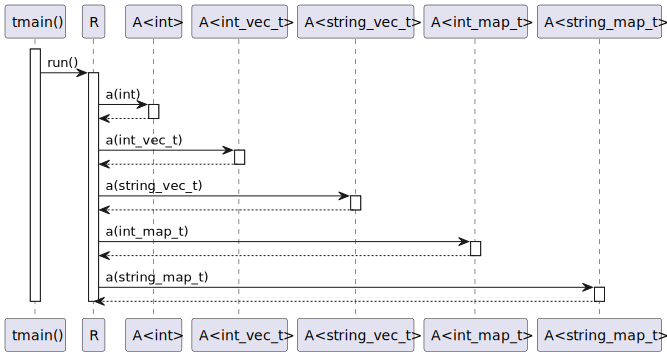
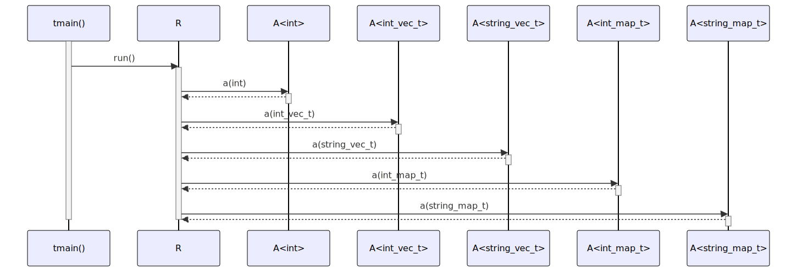

# t20039 - Test case for type aliases config option in sequence diagrams
## Config
```yaml
diagrams:
  t20039_sequence:
    type: sequence
    glob:
      - t20039.cc
    include:
      namespaces:
        - clanguml::t20039
    using_namespace: clanguml::t20039
    type_aliases:
      "std::vector<int>": int_vec_t
      "std::vector<std::string>": string_vec_t
      "std::map<int,int>": int_map_t
      "std::map<std::string,std::string>": string_map_t
    from:
      - function: "clanguml::t20039::tmain()"
```
## Source code
File `tests/t20039/t20039.cc`
```cpp
#include <map>
#include <string>
#include <vector>

namespace clanguml {
namespace t20039 {

template <typename T> struct A {
    std::vector<std::vector<T>> a(T p) { return {}; }
};

struct R {
    A<int> a_int;
    A<std::vector<int>> a_intvec;
    A<std::vector<std::string>> a_stringvec;
    A<std::map<int, int>> a_intmap;
    A<std::map<std::string, std::string>> a_stringmap;

    void run()
    {
        a_int.a({});
        a_intvec.a({});
        a_stringvec.a({});
        a_intmap.a({});
        a_stringmap.a({});
    }
};

int tmain()
{
    R r;

    r.run();

    return 0;
}
}
}
```
## Generated PlantUML diagrams

## Generated Mermaid diagrams

## Generated JSON models
```json
{
  "diagram_type": "sequence",
  "name": "t20039_sequence",
  "participants": [
    {
      "display_name": "tmain()",
      "full_name": "clanguml::t20039::tmain()",
      "id": "2148451609276010605",
      "name": "tmain",
      "namespace": "clanguml::t20039",
      "source_location": {
        "column": 5,
        "file": "t20039.cc",
        "line": 29,
        "translation_unit": "t20039.cc"
      },
      "type": "function"
    },
    {
      "activities": [
        {
          "display_name": "run()",
          "full_name": "clanguml::t20039::R::run()",
          "id": "743095879760855186",
          "name": "run",
          "namespace": "",
          "source_location": {
            "column": 10,
            "file": "t20039.cc",
            "line": 19,
            "translation_unit": "t20039.cc"
          },
          "type": "method"
        }
      ],
      "display_name": "R",
      "full_name": "clanguml::t20039::R",
      "id": "911510236910860394",
      "name": "R",
      "namespace": "clanguml::t20039",
      "source_location": {
        "column": 8,
        "file": "t20039.cc",
        "line": 12,
        "translation_unit": "t20039.cc"
      },
      "type": "class"
    },
    {
      "activities": [
        {
          "display_name": "a(int)",
          "full_name": "clanguml::t20039::A<int>::a(int)",
          "id": "1669283381205253105",
          "name": "a",
          "namespace": "",
          "source_location": {
            "column": 33,
            "file": "t20039.cc",
            "line": 9,
            "translation_unit": "t20039.cc"
          },
          "type": "method"
        }
      ],
      "display_name": "A<int>",
      "full_name": "clanguml::t20039::A<int>",
      "id": "1909240382008619079",
      "name": "A",
      "namespace": "clanguml::t20039",
      "source_location": {
        "column": 30,
        "file": "t20039.cc",
        "line": 8,
        "translation_unit": "t20039.cc"
      },
      "type": "class"
    },
    {
      "activities": [
        {
          "display_name": "a(int_vec_t)",
          "full_name": "clanguml::t20039::A<int_vec_t>::a(int_vec_t)",
          "id": "102043386959871430",
          "name": "a",
          "namespace": "",
          "source_location": {
            "column": 33,
            "file": "t20039.cc",
            "line": 9,
            "translation_unit": "t20039.cc"
          },
          "type": "method"
        }
      ],
      "display_name": "A<int_vec_t>",
      "full_name": "clanguml::t20039::A<int_vec_t>",
      "id": "2044714081517303079",
      "name": "A",
      "namespace": "clanguml::t20039",
      "source_location": {
        "column": 30,
        "file": "t20039.cc",
        "line": 8,
        "translation_unit": "t20039.cc"
      },
      "type": "class"
    },
    {
      "activities": [
        {
          "display_name": "a(string_vec_t)",
          "full_name": "clanguml::t20039::A<string_vec_t>::a(string_vec_t)",
          "id": "877375915521239216",
          "name": "a",
          "namespace": "",
          "source_location": {
            "column": 33,
            "file": "t20039.cc",
            "line": 9,
            "translation_unit": "t20039.cc"
          },
          "type": "method"
        }
      ],
      "display_name": "A<string_vec_t>",
      "full_name": "clanguml::t20039::A<string_vec_t>",
      "id": "985421674263139595",
      "name": "A",
      "namespace": "clanguml::t20039",
      "source_location": {
        "column": 30,
        "file": "t20039.cc",
        "line": 8,
        "translation_unit": "t20039.cc"
      },
      "type": "class"
    },
    {
      "activities": [
        {
          "display_name": "a(int_map_t)",
          "full_name": "clanguml::t20039::A<int_map_t>::a(int_map_t)",
          "id": "720393008985738554",
          "name": "a",
          "namespace": "",
          "source_location": {
            "column": 33,
            "file": "t20039.cc",
            "line": 9,
            "translation_unit": "t20039.cc"
          },
          "type": "method"
        }
      ],
      "display_name": "A<int_map_t>",
      "full_name": "clanguml::t20039::A<int_map_t>",
      "id": "1577435969137543418",
      "name": "A",
      "namespace": "clanguml::t20039",
      "source_location": {
        "column": 30,
        "file": "t20039.cc",
        "line": 8,
        "translation_unit": "t20039.cc"
      },
      "type": "class"
    },
    {
      "activities": [
        {
          "display_name": "a(string_map_t)",
          "full_name": "clanguml::t20039::A<string_map_t>::a(string_map_t)",
          "id": "1228686762653429102",
          "name": "a",
          "namespace": "",
          "source_location": {
            "column": 33,
            "file": "t20039.cc",
            "line": 9,
            "translation_unit": "t20039.cc"
          },
          "type": "method"
        }
      ],
      "display_name": "A<string_map_t>",
      "full_name": "clanguml::t20039::A<string_map_t>",
      "id": "1410668113085504962",
      "name": "A",
      "namespace": "clanguml::t20039",
      "source_location": {
        "column": 30,
        "file": "t20039.cc",
        "line": 8,
        "translation_unit": "t20039.cc"
      },
      "type": "class"
    }
  ],
  "sequences": [
    {
      "messages": [
        {
          "from": {
            "activity_id": "2148451609276010605",
            "participant_id": "2148451609276010605"
          },
          "name": "run()",
          "return_type": "void",
          "scope": "normal",
          "source_location": {
            "column": 5,
            "file": "t20039.cc",
            "line": 33,
            "translation_unit": "t20039.cc"
          },
          "to": {
            "activity_id": "743095879760855186",
            "participant_id": "911510236910860394"
          },
          "type": "message"
        },
        {
          "from": {
            "activity_id": "743095879760855186",
            "participant_id": "911510236910860394"
          },
          "name": "a(int)",
          "return_type": "std::vector<int_vec_t>",
          "scope": "normal",
          "source_location": {
            "column": 9,
            "file": "t20039.cc",
            "line": 21,
            "translation_unit": "t20039.cc"
          },
          "to": {
            "activity_id": "1669283381205253105",
            "participant_id": "1909240382008619079"
          },
          "type": "message"
        },
        {
          "from": {
            "activity_id": "743095879760855186",
            "participant_id": "911510236910860394"
          },
          "name": "a(int_vec_t)",
          "return_type": "std::vector<std::vector<vector<int,allocator<int>>>>",
          "scope": "normal",
          "source_location": {
            "column": 9,
            "file": "t20039.cc",
            "line": 22,
            "translation_unit": "t20039.cc"
          },
          "to": {
            "activity_id": "102043386959871430",
            "participant_id": "2044714081517303079"
          },
          "type": "message"
        },
        {
          "from": {
            "activity_id": "743095879760855186",
            "participant_id": "911510236910860394"
          },
          "name": "a(string_vec_t)",
          "return_type": "std::vector<std::vector<vector<basic_string<char,char_traits<char>,allocator<char>>,allocator<basic_string<char,char_traits<char>,allocator<char>>>>>>",
          "scope": "normal",
          "source_location": {
            "column": 9,
            "file": "t20039.cc",
            "line": 23,
            "translation_unit": "t20039.cc"
          },
          "to": {
            "activity_id": "877375915521239216",
            "participant_id": "985421674263139595"
          },
          "type": "message"
        },
        {
          "from": {
            "activity_id": "743095879760855186",
            "participant_id": "911510236910860394"
          },
          "name": "a(int_map_t)",
          "return_type": "std::vector<std::vector<map<int,int,less<int>,allocator<pair<const int,int>>>>>",
          "scope": "normal",
          "source_location": {
            "column": 9,
            "file": "t20039.cc",
            "line": 24,
            "translation_unit": "t20039.cc"
          },
          "to": {
            "activity_id": "720393008985738554",
            "participant_id": "1577435969137543418"
          },
          "type": "message"
        },
        {
          "from": {
            "activity_id": "743095879760855186",
            "participant_id": "911510236910860394"
          },
          "name": "a(string_map_t)",
          "return_type": "std::vector<std::vector<map<basic_string<char,char_traits<char>,allocator<char>>,basic_string<char,char_traits<char>,allocator<char>>,less<basic_string<char,char_traits<char>,allocator<char>>>,allocator<pair<const basic_string<char,char_traits<char>,allocator<char>>,basic_string<char,char_traits<char>,allocator<char>>>>>>>",
          "scope": "normal",
          "source_location": {
            "column": 9,
            "file": "t20039.cc",
            "line": 25,
            "translation_unit": "t20039.cc"
          },
          "to": {
            "activity_id": "1228686762653429102",
            "participant_id": "1410668113085504962"
          },
          "type": "message"
        }
      ],
      "start_from": {
        "id": 2148451609276010605,
        "location": "clanguml::t20039::tmain()"
      }
    }
  ],
  "using_namespace": "clanguml::t20039"
}
```
