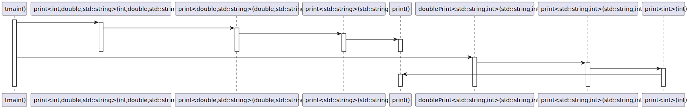
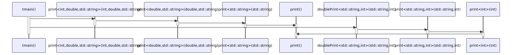

# t20040 - Test case for recursive variadic template function call
## Config
```yaml
diagrams:
  t20040_sequence:
    type: sequence
    glob:
      - t20040.cc
    include:
      namespaces:
        - clanguml::t20040
    using_namespace: clanguml::t20040
    from:
      - function: "clanguml::t20040::tmain()"
```
## Source code
File `tests/t20040/t20040.cc`
```cpp
#include <iostream>
#include <string>

namespace clanguml {
namespace t20040 {
void print() { }

template <typename T, typename... Ts> void print(T head, Ts... tail)
{
    std::cout << head << std::endl;
    print(tail...);
}

template <typename... Ts> void doublePrint(Ts... args)
{
    print(args + args...);
}

void tmain()
{
    using namespace std::literals::string_literals;

    print(1, 3.14, "test"s);

    doublePrint("test"s, 2024 / 2);
}
}
}
```
## Generated PlantUML diagrams

## Generated Mermaid diagrams

## Generated JSON models
```json
{
  "diagram_type": "sequence",
  "name": "t20040_sequence",
  "participants": [
    {
      "display_name": "tmain()",
      "full_name": "clanguml::t20040::tmain()",
      "id": "998622560147459663",
      "name": "tmain",
      "namespace": "clanguml::t20040",
      "source_location": {
        "column": 6,
        "file": "t20040.cc",
        "line": 19,
        "translation_unit": "t20040.cc"
      },
      "type": "function"
    },
    {
      "display_name": "print<int,double,std::string>(int,double,std::string)",
      "full_name": "clanguml::t20040::print<int,double,std::string>(int,double,std::basic_string<char>)",
      "id": "466846361794024298",
      "name": "print",
      "namespace": "clanguml::t20040",
      "source_location": {
        "column": 44,
        "file": "t20040.cc",
        "line": 8,
        "translation_unit": "t20040.cc"
      },
      "type": "function_template"
    },
    {
      "display_name": "print<double,std::string>(double,std::string)",
      "full_name": "clanguml::t20040::print<double,std::string>(double,std::basic_string<char>)",
      "id": "1387681712381484036",
      "name": "print",
      "namespace": "clanguml::t20040",
      "source_location": {
        "column": 44,
        "file": "t20040.cc",
        "line": 8,
        "translation_unit": "t20040.cc"
      },
      "type": "function_template"
    },
    {
      "display_name": "print<std::string>(std::string)",
      "full_name": "clanguml::t20040::print<std::string>(std::basic_string<char>)",
      "id": "1353926867284821849",
      "name": "print",
      "namespace": "clanguml::t20040",
      "source_location": {
        "column": 44,
        "file": "t20040.cc",
        "line": 8,
        "translation_unit": "t20040.cc"
      },
      "type": "function_template"
    },
    {
      "display_name": "print()",
      "full_name": "clanguml::t20040::print()",
      "id": "245418438894072749",
      "name": "print",
      "namespace": "clanguml::t20040",
      "source_location": {
        "column": 6,
        "file": "t20040.cc",
        "line": 6,
        "translation_unit": "t20040.cc"
      },
      "type": "function"
    },
    {
      "display_name": "doublePrint<std::string,int>(std::string,int)",
      "full_name": "clanguml::t20040::doublePrint<std::string,int>(std::basic_string<char>,int)",
      "id": "2024126405552345351",
      "name": "doublePrint",
      "namespace": "clanguml::t20040",
      "source_location": {
        "column": 32,
        "file": "t20040.cc",
        "line": 14,
        "translation_unit": "t20040.cc"
      },
      "type": "function_template"
    },
    {
      "display_name": "print<std::string,int>(std::string,int)",
      "full_name": "clanguml::t20040::print<std::string,int>(std::basic_string<char>,int)",
      "id": "1349996183789322606",
      "name": "print",
      "namespace": "clanguml::t20040",
      "source_location": {
        "column": 44,
        "file": "t20040.cc",
        "line": 8,
        "translation_unit": "t20040.cc"
      },
      "type": "function_template"
    },
    {
      "display_name": "print<int>(int)",
      "full_name": "clanguml::t20040::print<int>(int)",
      "id": "1189427464789523930",
      "name": "print",
      "namespace": "clanguml::t20040",
      "source_location": {
        "column": 44,
        "file": "t20040.cc",
        "line": 8,
        "translation_unit": "t20040.cc"
      },
      "type": "function_template"
    }
  ],
  "sequences": [
    {
      "messages": [
        {
          "from": {
            "activity_id": "998622560147459663",
            "participant_id": "998622560147459663"
          },
          "name": "",
          "return_type": "",
          "scope": "normal",
          "source_location": {
            "column": 5,
            "file": "t20040.cc",
            "line": 23,
            "translation_unit": "t20040.cc"
          },
          "to": {
            "activity_id": "466846361794024298",
            "participant_id": "466846361794024298"
          },
          "type": "message"
        },
        {
          "from": {
            "activity_id": "466846361794024298",
            "participant_id": "466846361794024298"
          },
          "name": "",
          "return_type": "",
          "scope": "normal",
          "source_location": {
            "column": 5,
            "file": "t20040.cc",
            "line": 11,
            "translation_unit": "t20040.cc"
          },
          "to": {
            "activity_id": "1387681712381484036",
            "participant_id": "1387681712381484036"
          },
          "type": "message"
        },
        {
          "from": {
            "activity_id": "1387681712381484036",
            "participant_id": "1387681712381484036"
          },
          "name": "",
          "return_type": "",
          "scope": "normal",
          "source_location": {
            "column": 5,
            "file": "t20040.cc",
            "line": 11,
            "translation_unit": "t20040.cc"
          },
          "to": {
            "activity_id": "1353926867284821849",
            "participant_id": "1353926867284821849"
          },
          "type": "message"
        },
        {
          "from": {
            "activity_id": "1353926867284821849",
            "participant_id": "1353926867284821849"
          },
          "name": "",
          "return_type": "void",
          "scope": "normal",
          "source_location": {
            "column": 5,
            "file": "t20040.cc",
            "line": 11,
            "translation_unit": "t20040.cc"
          },
          "to": {
            "activity_id": "245418438894072749",
            "participant_id": "245418438894072749"
          },
          "type": "message"
        },
        {
          "from": {
            "activity_id": "998622560147459663",
            "participant_id": "998622560147459663"
          },
          "name": "",
          "return_type": "",
          "scope": "normal",
          "source_location": {
            "column": 5,
            "file": "t20040.cc",
            "line": 25,
            "translation_unit": "t20040.cc"
          },
          "to": {
            "activity_id": "2024126405552345351",
            "participant_id": "2024126405552345351"
          },
          "type": "message"
        },
        {
          "from": {
            "activity_id": "2024126405552345351",
            "participant_id": "2024126405552345351"
          },
          "name": "",
          "return_type": "",
          "scope": "normal",
          "source_location": {
            "column": 5,
            "file": "t20040.cc",
            "line": 16,
            "translation_unit": "t20040.cc"
          },
          "to": {
            "activity_id": "1349996183789322606",
            "participant_id": "1349996183789322606"
          },
          "type": "message"
        },
        {
          "from": {
            "activity_id": "1349996183789322606",
            "participant_id": "1349996183789322606"
          },
          "name": "",
          "return_type": "",
          "scope": "normal",
          "source_location": {
            "column": 5,
            "file": "t20040.cc",
            "line": 11,
            "translation_unit": "t20040.cc"
          },
          "to": {
            "activity_id": "1189427464789523930",
            "participant_id": "1189427464789523930"
          },
          "type": "message"
        },
        {
          "from": {
            "activity_id": "1189427464789523930",
            "participant_id": "1189427464789523930"
          },
          "name": "",
          "return_type": "void",
          "scope": "normal",
          "source_location": {
            "column": 5,
            "file": "t20040.cc",
            "line": 11,
            "translation_unit": "t20040.cc"
          },
          "to": {
            "activity_id": "245418438894072749",
            "participant_id": "245418438894072749"
          },
          "type": "message"
        }
      ],
      "start_from": {
        "id": 998622560147459663,
        "location": "clanguml::t20040::tmain()"
      }
    }
  ],
  "using_namespace": "clanguml::t20040"
}
```
