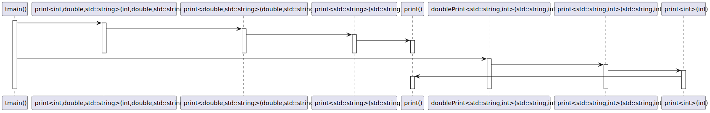
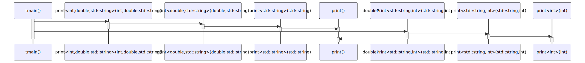

# t20040 - Test case for recursive variadic template function call
## Config
```yaml
diagrams:
  t20040_sequence:
    type: sequence
    glob:
      - t20040.cc
    include:
      namespaces:
        - clanguml::t20040
    using_namespace: clanguml::t20040
    from:
      - function: "clanguml::t20040::tmain()"
```
## Source code
File `tests/t20040/t20040.cc`
```cpp
#include <iostream>
#include <string>

namespace clanguml {
namespace t20040 {
void print() { }

template <typename T, typename... Ts> void print(T head, Ts... tail)
{
    std::cout << head << std::endl;
    print(tail...);
}

template <typename... Ts> void doublePrint(Ts... args)
{
    print(args + args...);
}

void tmain()
{
    using namespace std::literals::string_literals;

    print(1, 3.14, "test"s);

    doublePrint("test"s, 2024 / 2);
}
}
}
```
## Generated PlantUML diagrams

## Generated Mermaid diagrams

## Generated JSON models
```json
{
  "diagram_type": "sequence",
  "name": "t20040_sequence",
  "participants": [
    {
      "display_name": "tmain()",
      "full_name": "clanguml::t20040::tmain()",
      "id": "17258782324274606830",
      "name": "tmain",
      "namespace": "clanguml::t20040",
      "source_location": {
        "column": 6,
        "file": "t20040.cc",
        "line": 19,
        "translation_unit": "t20040.cc"
      },
      "type": "function"
    },
    {
      "display_name": "print<int,double,std::string>(int,double,std::string)",
      "full_name": "clanguml::t20040::print<int,double,std::string>(int,double,std::string)",
      "id": "5572672734869600001",
      "name": "print",
      "namespace": "clanguml::t20040",
      "source_location": {
        "column": 44,
        "file": "t20040.cc",
        "line": 8,
        "translation_unit": "t20040.cc"
      },
      "type": "function_template"
    },
    {
      "display_name": "print<double,std::string>(double,std::string)",
      "full_name": "clanguml::t20040::print<double,std::string>(double,std::string)",
      "id": "17318799317227951141",
      "name": "print",
      "namespace": "clanguml::t20040",
      "source_location": {
        "column": 44,
        "file": "t20040.cc",
        "line": 8,
        "translation_unit": "t20040.cc"
      },
      "type": "function_template"
    },
    {
      "display_name": "print<std::string>(std::string)",
      "full_name": "clanguml::t20040::print<std::string>(std::string)",
      "id": "12796036417128306404",
      "name": "print",
      "namespace": "clanguml::t20040",
      "source_location": {
        "column": 44,
        "file": "t20040.cc",
        "line": 8,
        "translation_unit": "t20040.cc"
      },
      "type": "function_template"
    },
    {
      "display_name": "print()",
      "full_name": "clanguml::t20040::print()",
      "id": "36564587615642195",
      "name": "print",
      "namespace": "clanguml::t20040",
      "source_location": {
        "column": 6,
        "file": "t20040.cc",
        "line": 6,
        "translation_unit": "t20040.cc"
      },
      "type": "function"
    },
    {
      "display_name": "doublePrint<std::string,int>(std::string,int)",
      "full_name": "clanguml::t20040::doublePrint<std::string,int>(std::string,int)",
      "id": "9895554453892218318",
      "name": "doublePrint",
      "namespace": "clanguml::t20040",
      "source_location": {
        "column": 32,
        "file": "t20040.cc",
        "line": 14,
        "translation_unit": "t20040.cc"
      },
      "type": "function_template"
    },
    {
      "display_name": "print<std::string,int>(std::string,int)",
      "full_name": "clanguml::t20040::print<std::string,int>(std::string,int)",
      "id": "12988781042859786885",
      "name": "print",
      "namespace": "clanguml::t20040",
      "source_location": {
        "column": 44,
        "file": "t20040.cc",
        "line": 8,
        "translation_unit": "t20040.cc"
      },
      "type": "function_template"
    },
    {
      "display_name": "print<int>(int)",
      "full_name": "clanguml::t20040::print<int>(int)",
      "id": "15875279041411961055",
      "name": "print",
      "namespace": "clanguml::t20040",
      "source_location": {
        "column": 44,
        "file": "t20040.cc",
        "line": 8,
        "translation_unit": "t20040.cc"
      },
      "type": "function_template"
    }
  ],
  "sequences": [
    {
      "from": {
        "id": "17258782324274606830",
        "location": "clanguml::t20040::tmain()"
      },
      "messages": [
        {
          "from": {
            "activity_id": "17258782324274606830",
            "participant_id": "17258782324274606830"
          },
          "name": "",
          "return_type": "",
          "scope": "normal",
          "source_location": {
            "column": 5,
            "file": "t20040.cc",
            "line": 23,
            "translation_unit": "t20040.cc"
          },
          "to": {
            "activity_id": "5572672734869600001",
            "participant_id": "5572672734869600001"
          },
          "type": "message"
        },
        {
          "from": {
            "activity_id": "5572672734869600001",
            "participant_id": "5572672734869600001"
          },
          "name": "",
          "return_type": "",
          "scope": "normal",
          "source_location": {
            "column": 5,
            "file": "t20040.cc",
            "line": 11,
            "translation_unit": "t20040.cc"
          },
          "to": {
            "activity_id": "17318799317227951141",
            "participant_id": "17318799317227951141"
          },
          "type": "message"
        },
        {
          "from": {
            "activity_id": "17318799317227951141",
            "participant_id": "17318799317227951141"
          },
          "name": "",
          "return_type": "",
          "scope": "normal",
          "source_location": {
            "column": 5,
            "file": "t20040.cc",
            "line": 11,
            "translation_unit": "t20040.cc"
          },
          "to": {
            "activity_id": "12796036417128306404",
            "participant_id": "12796036417128306404"
          },
          "type": "message"
        },
        {
          "from": {
            "activity_id": "12796036417128306404",
            "participant_id": "12796036417128306404"
          },
          "name": "",
          "return_type": "void",
          "scope": "normal",
          "source_location": {
            "column": 5,
            "file": "t20040.cc",
            "line": 11,
            "translation_unit": "t20040.cc"
          },
          "to": {
            "activity_id": "36564587615642195",
            "participant_id": "36564587615642195"
          },
          "type": "message"
        },
        {
          "from": {
            "activity_id": "17258782324274606830",
            "participant_id": "17258782324274606830"
          },
          "name": "",
          "return_type": "",
          "scope": "normal",
          "source_location": {
            "column": 5,
            "file": "t20040.cc",
            "line": 25,
            "translation_unit": "t20040.cc"
          },
          "to": {
            "activity_id": "9895554453892218318",
            "participant_id": "9895554453892218318"
          },
          "type": "message"
        },
        {
          "from": {
            "activity_id": "9895554453892218318",
            "participant_id": "9895554453892218318"
          },
          "name": "",
          "return_type": "",
          "scope": "normal",
          "source_location": {
            "column": 5,
            "file": "t20040.cc",
            "line": 16,
            "translation_unit": "t20040.cc"
          },
          "to": {
            "activity_id": "12988781042859786885",
            "participant_id": "12988781042859786885"
          },
          "type": "message"
        },
        {
          "from": {
            "activity_id": "12988781042859786885",
            "participant_id": "12988781042859786885"
          },
          "name": "",
          "return_type": "",
          "scope": "normal",
          "source_location": {
            "column": 5,
            "file": "t20040.cc",
            "line": 11,
            "translation_unit": "t20040.cc"
          },
          "to": {
            "activity_id": "15875279041411961055",
            "participant_id": "15875279041411961055"
          },
          "type": "message"
        },
        {
          "from": {
            "activity_id": "15875279041411961055",
            "participant_id": "15875279041411961055"
          },
          "name": "",
          "return_type": "void",
          "scope": "normal",
          "source_location": {
            "column": 5,
            "file": "t20040.cc",
            "line": 11,
            "translation_unit": "t20040.cc"
          },
          "to": {
            "activity_id": "36564587615642195",
            "participant_id": "36564587615642195"
          },
          "type": "message"
        }
      ]
    }
  ],
  "using_namespace": "clanguml::t20040"
}
```
## Generated GraphML models
