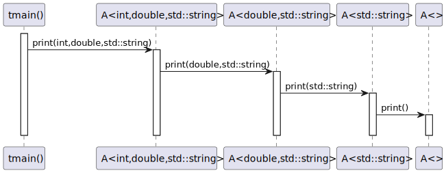
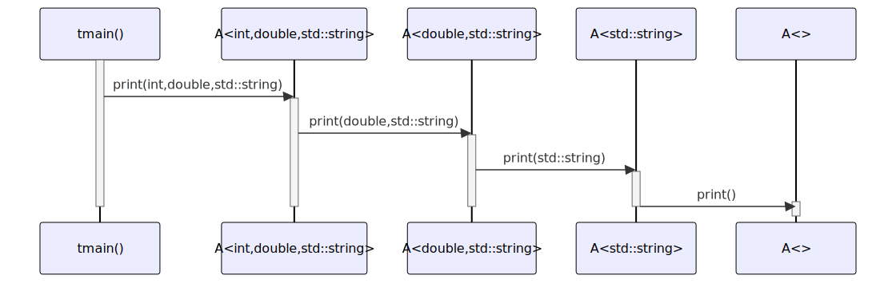

# t20041 - Test case for recursive variadic template class call
## Config
```yaml
diagrams:
  t20041_sequence:
    type: sequence
    glob:
      - t20041.cc
    include:
      namespaces:
        - clanguml::t20041
    using_namespace: clanguml::t20041
    from:
      - function: "clanguml::t20041::tmain()"
```
## Source code
File `tests/t20041/t20041.cc`
```cpp
#include <iostream>
#include <string>

namespace clanguml {
namespace t20041 {

template <typename... Args> struct A;

template <typename First, typename... Rest> struct A<First, Rest...> {
    void print(First first, Rest... rest)
    {
        std::cout << first << std::endl;

        A<Rest...> a;
        a.print(rest...);
    }
};

template <> struct A<> {
    void print() { }
};

void tmain()
{
    using namespace std::literals::string_literals;

    A<int, double, std::string> a;
    a.print(1, 3.14, "test"s);
}
}
}
```
## Generated PlantUML diagrams

## Generated Mermaid diagrams

## Generated JSON models
```json
{
  "diagram_type": "sequence",
  "name": "t20041_sequence",
  "participants": [
    {
      "display_name": "tmain()",
      "full_name": "clanguml::t20041::tmain()",
      "id": "11116531200661362065",
      "name": "tmain",
      "namespace": "clanguml::t20041",
      "source_location": {
        "column": 6,
        "file": "t20041.cc",
        "line": 23,
        "translation_unit": "t20041.cc"
      },
      "type": "function"
    },
    {
      "activities": [
        {
          "display_name": "print(int,double,std::string)",
          "full_name": "clanguml::t20041::A<int,double,std::string>::print(int,double,std::string)",
          "id": "4256000304507433832",
          "name": "print",
          "namespace": "clanguml::t20041::A<int, double, std",
          "source_location": {
            "column": 10,
            "file": "t20041.cc",
            "line": 10,
            "translation_unit": "t20041.cc"
          },
          "type": "method"
        }
      ],
      "display_name": "A<int,double,std::string>",
      "full_name": "clanguml::t20041::A<int,double,std::string>",
      "id": "6661430002529167748",
      "name": "A",
      "namespace": "clanguml::t20041",
      "source_location": {
        "column": 52,
        "file": "t20041.cc",
        "line": 9,
        "translation_unit": "t20041.cc"
      },
      "type": "class"
    },
    {
      "activities": [
        {
          "display_name": "print(double,std::string)",
          "full_name": "clanguml::t20041::A<double,std::string>::print(double,std::string)",
          "id": "11231699227660181036",
          "name": "print",
          "namespace": "clanguml::t20041::A<double, std",
          "source_location": {
            "column": 10,
            "file": "t20041.cc",
            "line": 10,
            "translation_unit": "t20041.cc"
          },
          "type": "method"
        }
      ],
      "display_name": "A<double,std::string>",
      "full_name": "clanguml::t20041::A<double,std::string>",
      "id": "7539195724072353305",
      "name": "A",
      "namespace": "clanguml::t20041",
      "source_location": {
        "column": 52,
        "file": "t20041.cc",
        "line": 9,
        "translation_unit": "t20041.cc"
      },
      "type": "class"
    },
    {
      "activities": [
        {
          "display_name": "print(std::string)",
          "full_name": "clanguml::t20041::A<std::string>::print(std::string)",
          "id": "13267835320386864470",
          "name": "print",
          "namespace": "clanguml::t20041::A<std",
          "source_location": {
            "column": 10,
            "file": "t20041.cc",
            "line": 10,
            "translation_unit": "t20041.cc"
          },
          "type": "method"
        }
      ],
      "display_name": "A<std::string>",
      "full_name": "clanguml::t20041::A<std::string>",
      "id": "11127726784601808651",
      "name": "A",
      "namespace": "clanguml::t20041",
      "source_location": {
        "column": 52,
        "file": "t20041.cc",
        "line": 9,
        "translation_unit": "t20041.cc"
      },
      "type": "class"
    },
    {
      "activities": [
        {
          "display_name": "print()",
          "full_name": "clanguml::t20041::A::print()",
          "id": "10361139950145713778",
          "name": "print",
          "namespace": "clanguml::t20041",
          "source_location": {
            "column": 10,
            "file": "t20041.cc",
            "line": 20,
            "translation_unit": "t20041.cc"
          },
          "type": "method"
        }
      ],
      "display_name": "A",
      "full_name": "clanguml::t20041::A",
      "id": "8416870265977144249",
      "name": "A",
      "namespace": "clanguml::t20041",
      "source_location": {
        "column": 52,
        "file": "t20041.cc",
        "line": 9,
        "translation_unit": "t20041.cc"
      },
      "type": "class"
    }
  ],
  "sequences": [
    {
      "messages": [
        {
          "from": {
            "activity_id": "11116531200661362065",
            "participant_id": "11116531200661362065"
          },
          "name": "print(int,double,std::string)",
          "return_type": "void",
          "scope": "normal",
          "source_location": {
            "column": 5,
            "file": "t20041.cc",
            "line": 28,
            "translation_unit": "t20041.cc"
          },
          "to": {
            "activity_id": "4256000304507433832",
            "participant_id": "6661430002529167748"
          },
          "type": "message"
        },
        {
          "from": {
            "activity_id": "4256000304507433832",
            "participant_id": "6661430002529167748"
          },
          "name": "print(double,std::string)",
          "return_type": "void",
          "scope": "normal",
          "source_location": {
            "column": 9,
            "file": "t20041.cc",
            "line": 15,
            "translation_unit": "t20041.cc"
          },
          "to": {
            "activity_id": "11231699227660181036",
            "participant_id": "7539195724072353305"
          },
          "type": "message"
        },
        {
          "from": {
            "activity_id": "11231699227660181036",
            "participant_id": "7539195724072353305"
          },
          "name": "print(std::string)",
          "return_type": "void",
          "scope": "normal",
          "source_location": {
            "column": 9,
            "file": "t20041.cc",
            "line": 15,
            "translation_unit": "t20041.cc"
          },
          "to": {
            "activity_id": "13267835320386864470",
            "participant_id": "11127726784601808651"
          },
          "type": "message"
        },
        {
          "from": {
            "activity_id": "13267835320386864470",
            "participant_id": "11127726784601808651"
          },
          "name": "print()",
          "return_type": "void",
          "scope": "normal",
          "source_location": {
            "column": 9,
            "file": "t20041.cc",
            "line": 15,
            "translation_unit": "t20041.cc"
          },
          "to": {
            "activity_id": "10361139950145713778",
            "participant_id": "8416870265977144249"
          },
          "type": "message"
        }
      ],
      "start_from": {
        "id": "11116531200661362065",
        "location": "clanguml::t20041::tmain()"
      }
    }
  ],
  "using_namespace": "clanguml::t20041"
}
```
