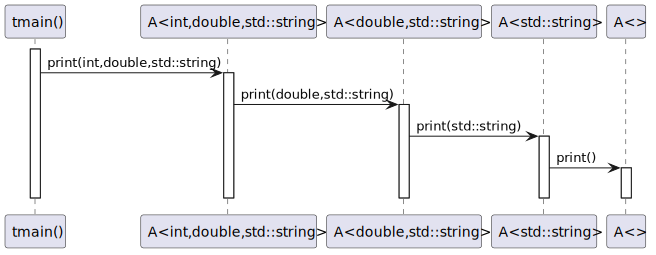
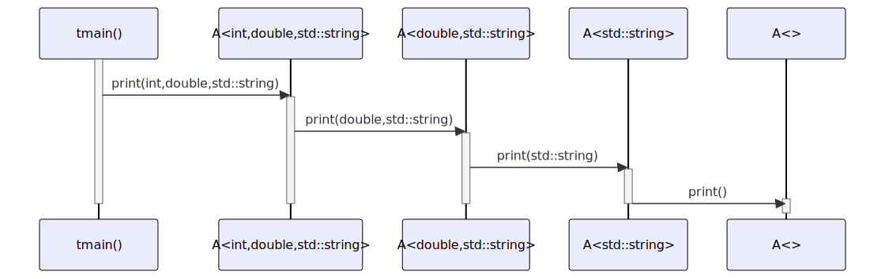

# t20041 - Test case for recursive variadic template class call
## Config
```yaml
diagrams:
  t20041_sequence:
    type: sequence
    glob:
      - t20041.cc
    include:
      namespaces:
        - clanguml::t20041
    using_namespace: clanguml::t20041
    from:
      - function: "clanguml::t20041::tmain()"
```
## Source code
File `tests/t20041/t20041.cc`
```cpp
#include <iostream>
#include <string>

namespace clanguml {
namespace t20041 {

template <typename... Args> struct A;

template <typename First, typename... Rest> struct A<First, Rest...> {
    void print(First first, Rest... rest)
    {
        std::cout << first << std::endl;

        A<Rest...> a;
        a.print(rest...);
    }
};

template <> struct A<> {
    void print() { }
};

void tmain()
{
    using namespace std::literals::string_literals;

    A<int, double, std::string> a;
    a.print(1, 3.14, "test"s);
}
}
}
```
## Generated PlantUML diagrams

## Generated Mermaid diagrams

## Generated JSON models
```json
{
  "diagram_type": "sequence",
  "name": "t20041_sequence",
  "participants": [
    {
      "display_name": "tmain()",
      "full_name": "clanguml::t20041::tmain()",
      "id": "1951824226953769322",
      "name": "tmain",
      "namespace": "clanguml::t20041",
      "source_location": {
        "column": 6,
        "file": "t20041.cc",
        "line": 23,
        "translation_unit": "t20041.cc"
      },
      "type": "function"
    },
    {
      "activities": [
        {
          "display_name": "print(int,double,std::string)",
          "full_name": "clanguml::t20041::A<int,double,std::string>::print(int,double,std::string)",
          "id": "16909660814487670086",
          "name": "print",
          "namespace": "clanguml::t20041::A<int, double, std",
          "source_location": {
            "column": 10,
            "file": "t20041.cc",
            "line": 10,
            "translation_unit": "t20041.cc"
          },
          "type": "method"
        }
      ],
      "display_name": "A<int,double,std::string>",
      "full_name": "clanguml::t20041::A<int,double,std::string>",
      "id": "14194360260218719657",
      "name": "A",
      "namespace": "clanguml::t20041",
      "source_location": {
        "column": 52,
        "file": "t20041.cc",
        "line": 9,
        "translation_unit": "t20041.cc"
      },
      "type": "class"
    },
    {
      "activities": [
        {
          "display_name": "print(double,std::string)",
          "full_name": "clanguml::t20041::A<double,std::string>::print(double,std::string)",
          "id": "9783138838207014490",
          "name": "print",
          "namespace": "clanguml::t20041::A<double, std",
          "source_location": {
            "column": 10,
            "file": "t20041.cc",
            "line": 10,
            "translation_unit": "t20041.cc"
          },
          "type": "method"
        }
      ],
      "display_name": "A<double,std::string>",
      "full_name": "clanguml::t20041::A<double,std::string>",
      "id": "9365247843424346275",
      "name": "A",
      "namespace": "clanguml::t20041",
      "source_location": {
        "column": 52,
        "file": "t20041.cc",
        "line": 9,
        "translation_unit": "t20041.cc"
      },
      "type": "class"
    },
    {
      "activities": [
        {
          "display_name": "print(std::string)",
          "full_name": "clanguml::t20041::A<std::string>::print(std::string)",
          "id": "1882276742459576837",
          "name": "print",
          "namespace": "clanguml::t20041::A<std",
          "source_location": {
            "column": 10,
            "file": "t20041.cc",
            "line": 10,
            "translation_unit": "t20041.cc"
          },
          "type": "method"
        }
      ],
      "display_name": "A<std::string>",
      "full_name": "clanguml::t20041::A<std::string>",
      "id": "15976841429263400421",
      "name": "A",
      "namespace": "clanguml::t20041",
      "source_location": {
        "column": 52,
        "file": "t20041.cc",
        "line": 9,
        "translation_unit": "t20041.cc"
      },
      "type": "class"
    },
    {
      "activities": [
        {
          "display_name": "print()",
          "full_name": "clanguml::t20041::A<>::print()",
          "id": "16805559397567621661",
          "name": "print",
          "namespace": "clanguml::t20041",
          "source_location": {
            "column": 10,
            "file": "t20041.cc",
            "line": 20,
            "translation_unit": "t20041.cc"
          },
          "type": "method"
        }
      ],
      "display_name": "A<>",
      "full_name": "clanguml::t20041::A<>",
      "id": "317550450223726414",
      "name": "A",
      "namespace": "clanguml::t20041",
      "source_location": {
        "column": 20,
        "file": "t20041.cc",
        "line": 19,
        "translation_unit": "t20041.cc"
      },
      "type": "class"
    }
  ],
  "sequences": [
    {
      "from": {
        "id": "1951824226953769322",
        "location": "clanguml::t20041::tmain()"
      },
      "messages": [
        {
          "from": {
            "activity_id": "1951824226953769322",
            "participant_id": "1951824226953769322"
          },
          "name": "print(int,double,std::string)",
          "return_type": "void",
          "scope": "normal",
          "source_location": {
            "column": 5,
            "file": "t20041.cc",
            "line": 28,
            "translation_unit": "t20041.cc"
          },
          "to": {
            "activity_id": "16909660814487670086",
            "participant_id": "14194360260218719657"
          },
          "type": "message"
        },
        {
          "from": {
            "activity_id": "16909660814487670086",
            "participant_id": "14194360260218719657"
          },
          "name": "print(double,std::string)",
          "return_type": "void",
          "scope": "normal",
          "source_location": {
            "column": 9,
            "file": "t20041.cc",
            "line": 15,
            "translation_unit": "t20041.cc"
          },
          "to": {
            "activity_id": "9783138838207014490",
            "participant_id": "9365247843424346275"
          },
          "type": "message"
        },
        {
          "from": {
            "activity_id": "9783138838207014490",
            "participant_id": "9365247843424346275"
          },
          "name": "print(std::string)",
          "return_type": "void",
          "scope": "normal",
          "source_location": {
            "column": 9,
            "file": "t20041.cc",
            "line": 15,
            "translation_unit": "t20041.cc"
          },
          "to": {
            "activity_id": "1882276742459576837",
            "participant_id": "15976841429263400421"
          },
          "type": "message"
        },
        {
          "from": {
            "activity_id": "1882276742459576837",
            "participant_id": "15976841429263400421"
          },
          "name": "print()",
          "return_type": "void",
          "scope": "normal",
          "source_location": {
            "column": 9,
            "file": "t20041.cc",
            "line": 15,
            "translation_unit": "t20041.cc"
          },
          "to": {
            "activity_id": "16805559397567621661",
            "participant_id": "317550450223726414"
          },
          "type": "message"
        }
      ]
    }
  ],
  "using_namespace": "clanguml::t20041"
}
```
## Generated GraphML models
