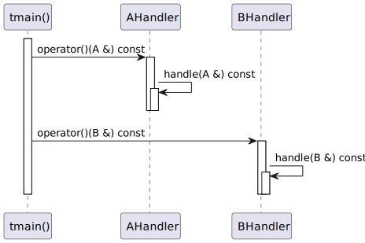

# t20042 - Test case for template overload pattern
## Config
```yaml
diagrams:
  t20042_sequence:
    type: sequence
    glob:
      - t20042.cc
    include:
      namespaces:
        - clanguml::t20042
    using_namespace: clanguml::t20042
    from:
      - function: "clanguml::t20042::tmain()"
```
## Source code
File `tests/t20042/t20042.cc`
```cpp
namespace clanguml {
namespace t20042 {
struct A { };
struct AHandler {
    void handle(A &a) const { }
    void operator()(A &a) const { handle(a); }
};

struct B { };
struct BHandler {
    void handle(B &b) const { }
    void operator()(B &b) const { handle(b); }
};

template <typename... Bases> struct Overload : public Bases... {
    using Bases::operator()...;
};
template <typename... Bases> Overload(Bases...) -> Overload<Bases...>;

void tmain()
{
    Overload<AHandler, BHandler> dispatch;
    A a;
    B b;

    dispatch(a);
    dispatch(b);
}
}
}
```
## Generated PlantUML diagrams

## Generated Mermaid diagrams

## Generated JSON models
```json
{
  "diagram_type": "sequence",
  "name": "t20042_sequence",
  "participants": [
    {
      "display_name": "tmain()",
      "full_name": "clanguml::t20042::tmain()",
      "id": "609011973422503266",
      "name": "tmain",
      "namespace": "clanguml::t20042",
      "source_location": {
        "column": 6,
        "file": "t20042.cc",
        "line": 20,
        "translation_unit": "t20042.cc"
      },
      "type": "function"
    },
    {
      "activities": [
        {
          "display_name": "operator()(A &) const",
          "full_name": "clanguml::t20042::AHandler::operator()(A &) const",
          "id": "1803150869170812951",
          "name": "operator()",
          "namespace": "",
          "source_location": {
            "column": 10,
            "file": "t20042.cc",
            "line": 6,
            "translation_unit": "t20042.cc"
          },
          "type": "method"
        },
        {
          "display_name": "handle(A &) const",
          "full_name": "clanguml::t20042::AHandler::handle(A &) const",
          "id": "505918958102707204",
          "name": "handle",
          "namespace": "",
          "source_location": {
            "column": 10,
            "file": "t20042.cc",
            "line": 5,
            "translation_unit": "t20042.cc"
          },
          "type": "method"
        }
      ],
      "display_name": "AHandler",
      "full_name": "clanguml::t20042::AHandler",
      "id": "169029708750481998",
      "name": "AHandler",
      "namespace": "clanguml::t20042",
      "source_location": {
        "column": 8,
        "file": "t20042.cc",
        "line": 4,
        "translation_unit": "t20042.cc"
      },
      "type": "class"
    },
    {
      "activities": [
        {
          "display_name": "operator()(B &) const",
          "full_name": "clanguml::t20042::BHandler::operator()(B &) const",
          "id": "1635511505447928279",
          "name": "operator()",
          "namespace": "",
          "source_location": {
            "column": 10,
            "file": "t20042.cc",
            "line": 12,
            "translation_unit": "t20042.cc"
          },
          "type": "method"
        },
        {
          "display_name": "handle(B &) const",
          "full_name": "clanguml::t20042::BHandler::handle(B &) const",
          "id": "869419286648646110",
          "name": "handle",
          "namespace": "",
          "source_location": {
            "column": 10,
            "file": "t20042.cc",
            "line": 11,
            "translation_unit": "t20042.cc"
          },
          "type": "method"
        }
      ],
      "display_name": "BHandler",
      "full_name": "clanguml::t20042::BHandler",
      "id": "1969158228859108037",
      "name": "BHandler",
      "namespace": "clanguml::t20042",
      "source_location": {
        "column": 8,
        "file": "t20042.cc",
        "line": 10,
        "translation_unit": "t20042.cc"
      },
      "type": "class"
    }
  ],
  "sequences": [
    {
      "messages": [
        {
          "from": {
            "activity_id": "609011973422503266",
            "participant_id": "609011973422503266"
          },
          "name": "operator()(A &) const",
          "return_type": "void",
          "scope": "normal",
          "source_location": {
            "column": 5,
            "file": "t20042.cc",
            "line": 26,
            "translation_unit": "t20042.cc"
          },
          "to": {
            "activity_id": "1803150869170812951",
            "participant_id": "169029708750481998"
          },
          "type": "message"
        },
        {
          "from": {
            "activity_id": "1803150869170812951",
            "participant_id": "169029708750481998"
          },
          "name": "handle(A &) const",
          "return_type": "void",
          "scope": "normal",
          "source_location": {
            "column": 35,
            "file": "t20042.cc",
            "line": 6,
            "translation_unit": "t20042.cc"
          },
          "to": {
            "activity_id": "505918958102707204",
            "participant_id": "169029708750481998"
          },
          "type": "message"
        },
        {
          "from": {
            "activity_id": "609011973422503266",
            "participant_id": "609011973422503266"
          },
          "name": "operator()(B &) const",
          "return_type": "void",
          "scope": "normal",
          "source_location": {
            "column": 5,
            "file": "t20042.cc",
            "line": 27,
            "translation_unit": "t20042.cc"
          },
          "to": {
            "activity_id": "1635511505447928279",
            "participant_id": "1969158228859108037"
          },
          "type": "message"
        },
        {
          "from": {
            "activity_id": "1635511505447928279",
            "participant_id": "1969158228859108037"
          },
          "name": "handle(B &) const",
          "return_type": "void",
          "scope": "normal",
          "source_location": {
            "column": 35,
            "file": "t20042.cc",
            "line": 12,
            "translation_unit": "t20042.cc"
          },
          "to": {
            "activity_id": "869419286648646110",
            "participant_id": "1969158228859108037"
          },
          "type": "message"
        }
      ],
      "start_from": {
        "id": 609011973422503266,
        "location": "clanguml::t20042::tmain()"
      }
    }
  ],
  "using_namespace": "clanguml::t20042"
}
```
