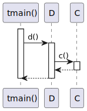
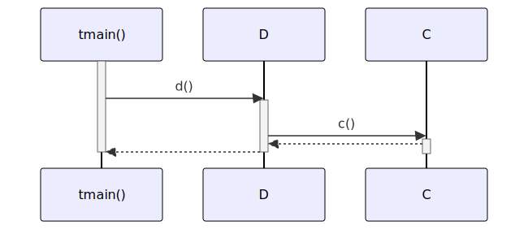

# t20043 - Test case for elements diagram filter in sequence diagrams
## Config
```yaml
diagrams:
  t20043_sequence:
    type: sequence
    glob:
      - t20043.cc
    include:
      namespaces:
        - clanguml::t20043
    exclude:
      elements:
        - clanguml::t20043::B
        - clanguml::t20043::F
      namespaces:
        - clanguml::t20043::detail
    using_namespace: clanguml::t20043
    from:
      - function: "clanguml::t20043::tmain()"

```
## Source code
File `tests/t20043/t20043.cc`
```cpp
namespace clanguml {
namespace t20043 {
struct A {
    int a() { return 1; }
};

struct B {
    A a;
    int b() { return a.a(); }
};

struct C {
    B b;
    int c() { return b.b(); }
};

namespace detail {
struct E {
    void e() { }
};
} // namespace detail

struct D {
    C c;
    detail::E e;
    int d()
    {
        e.e();
        return c.c();
    }
};

struct F {
    void f() { }
};

int tmain()
{
    D d;
    F f;

    f.f();

    return d.d();
}
}
}
```
## Generated PlantUML diagrams

## Generated Mermaid diagrams

## Generated JSON models
```json
{
  "diagram_type": "sequence",
  "name": "t20043_sequence",
  "participants": [
    {
      "display_name": "tmain()",
      "full_name": "clanguml::t20043::tmain()",
      "id": "1396184337601679046",
      "name": "tmain",
      "namespace": "clanguml::t20043",
      "source_location": {
        "column": 5,
        "file": "t20043.cc",
        "line": 37,
        "translation_unit": "t20043.cc"
      },
      "type": "function"
    },
    {
      "activities": [
        {
          "display_name": "d()",
          "full_name": "clanguml::t20043::D::d()",
          "id": "60379393461478854",
          "name": "d",
          "namespace": "",
          "source_location": {
            "column": 9,
            "file": "t20043.cc",
            "line": 26,
            "translation_unit": "t20043.cc"
          },
          "type": "method"
        }
      ],
      "display_name": "D",
      "full_name": "clanguml::t20043::D",
      "id": "1632049250551188852",
      "name": "D",
      "namespace": "clanguml::t20043",
      "source_location": {
        "column": 8,
        "file": "t20043.cc",
        "line": 23,
        "translation_unit": "t20043.cc"
      },
      "type": "class"
    },
    {
      "activities": [
        {
          "display_name": "c()",
          "full_name": "clanguml::t20043::C::c()",
          "id": "998868776840486830",
          "name": "c",
          "namespace": "",
          "source_location": {
            "column": 9,
            "file": "t20043.cc",
            "line": 14,
            "translation_unit": "t20043.cc"
          },
          "type": "method"
        }
      ],
      "display_name": "C",
      "full_name": "clanguml::t20043::C",
      "id": "605388621050971304",
      "name": "C",
      "namespace": "clanguml::t20043",
      "source_location": {
        "column": 8,
        "file": "t20043.cc",
        "line": 12,
        "translation_unit": "t20043.cc"
      },
      "type": "class"
    }
  ],
  "sequences": [
    {
      "messages": [
        {
          "from": {
            "activity_id": "1396184337601679046",
            "participant_id": "1396184337601679046"
          },
          "name": "d()",
          "return_type": "int",
          "scope": "normal",
          "source_location": {
            "column": 12,
            "file": "t20043.cc",
            "line": 44,
            "translation_unit": "t20043.cc"
          },
          "to": {
            "activity_id": "60379393461478854",
            "participant_id": "1632049250551188852"
          },
          "type": "message"
        },
        {
          "from": {
            "activity_id": "60379393461478854",
            "participant_id": "1632049250551188852"
          },
          "name": "c()",
          "return_type": "int",
          "scope": "normal",
          "source_location": {
            "column": 16,
            "file": "t20043.cc",
            "line": 29,
            "translation_unit": "t20043.cc"
          },
          "to": {
            "activity_id": "998868776840486830",
            "participant_id": "605388621050971304"
          },
          "type": "message"
        }
      ],
      "start_from": {
        "id": 1396184337601679046,
        "location": "clanguml::t20043::tmain()"
      }
    }
  ],
  "using_namespace": "clanguml::t20043"
}
```
