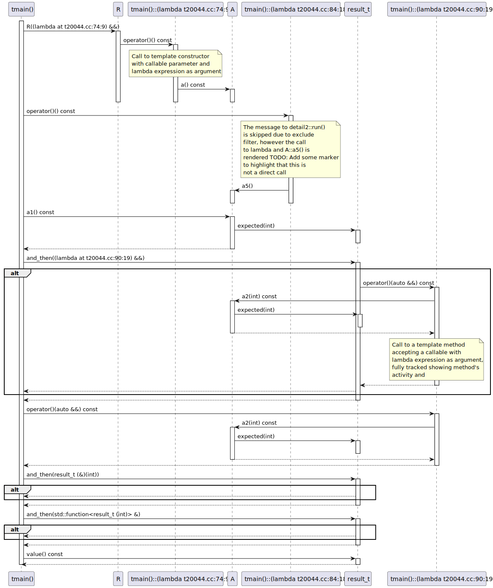
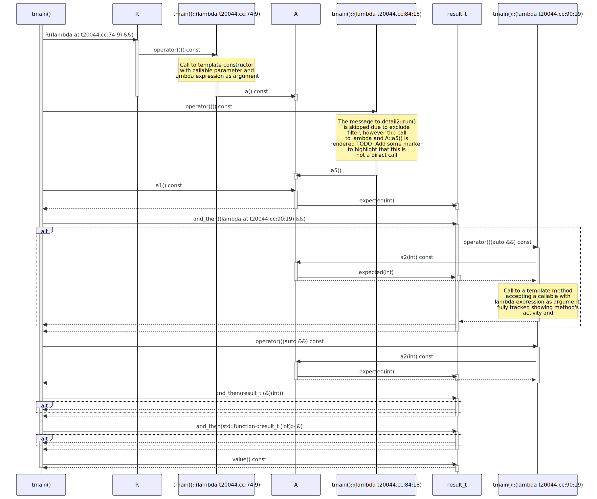

# t20044 - Test case for template method call expressions with callables
## Config
```yaml
add_compile_flags:
  - -fparse-all-comments
diagrams:
  t20044_sequence:
    type: sequence
    glob:
      - t20044.cc
    type_aliases:
      "clanguml::t20044::detail::expected<int,clanguml::t20044::error>": result_t
    generate_message_comments: true
    include:
      namespaces:
        - clanguml::t20044
    exclude:
      namespaces:
        - clanguml::t20044::detail2
    using_namespace: clanguml::t20044
    from:
      - function: "clanguml::t20044::tmain()"
```
## Source code
File `tests/t20044/t20044.cc`
```cpp
// #include "include/expected.hpp"

#include <functional>
#include <optional>
#include <thread>

namespace clanguml {
namespace t20044 {

enum class error { OK, FAIL };

namespace detail {
// Trivial std::expected mock-up just for testing calls through lambda
// expressions passed as arguments to methods
template <typename V, typename E> class expected {
private:
    std::optional<V> value_;
    std::optional<E> error_;

public:
    explicit expected(V v)
        : value_{std::move(v)}
    {
    }
    explicit expected(E e)
        : error_{std::move(e)}
    {
    }

    const auto &value() const { return *value_; }

    const auto &error() const { return *error_; }

    template <class F> auto and_then(F &&f) &&
    {
        if (value_)
            return f(*value_);

        return *this;
    }
};
} // namespace detail

namespace detail2 {
template <typename F> void run(F &&f) { f(); }
} // namespace detail2

using result_t = detail::expected<int, error>;

struct A {
    auto a() const { }

    auto a1() const { return result_t{10}; }

    auto a2(int arg) const { return result_t{arg + 1}; }

    auto a4(int arg) const { return result_t{arg + 1}; }

    void a5() { }
};

auto a3(int arg) { return result_t{arg + 1}; }

struct R {
    template <typename F> R(F &&f) { f(); }
};

int tmain()
{
    A a;

    // Call to template constructor with callable parameter and lambda
    // expression as argument
    R r([&a]() { a.a(); });

    std::function<result_t(const A &, int)> a4_wrapper = &A::a4;

    std::function<result_t(int)> a4_wrapper_to_a =
        std::bind(a4_wrapper, a, std::placeholders::_1);

    // The message to detail2::run() is skipped due to exclude filter, however
    // the call to lambda and A::a5() is rendered
    // TODO: Add some marker to highlight that this is not a direct call
    detail2::run([&]() { a.a5(); });

    return a
        .a1()
        // Call to a template method accepting a callable with lambda expression
        // as argument, fully tracked showing method's activity and
        .and_then([&](auto &&arg) { return a.a2(arg); })
        // TODO: Call to a method accepting a callable with function pointer
        //       as argument
        .and_then(a3)
        // TODO: Call to a method accepting a callable with std::function as
        //       argument
        .and_then(a4_wrapper_to_a)
        .value();
}
}
}
```
## Generated PlantUML diagrams

## Generated Mermaid diagrams

## Generated JSON models
```json
{
  "diagram_type": "sequence",
  "name": "t20044_sequence",
  "participants": [
    {
      "display_name": "tmain()",
      "full_name": "clanguml::t20044::tmain()",
      "id": "252888248193934644",
      "name": "tmain",
      "namespace": "clanguml::t20044",
      "source_location": {
        "column": 5,
        "file": "t20044.cc",
        "line": 68,
        "translation_unit": "t20044.cc"
      },
      "type": "function"
    },
    {
      "activities": [
        {
          "display_name": "R((lambda at t20044.cc:74:9) &&)",
          "full_name": "clanguml::t20044::R::R((lambda at t20044.cc:74:9) &&)",
          "id": "2121949343931231437",
          "name": "R",
          "namespace": "",
          "source_location": {
            "column": 27,
            "file": "t20044.cc",
            "line": 65,
            "translation_unit": "t20044.cc"
          },
          "type": "method"
        }
      ],
      "display_name": "R",
      "full_name": "clanguml::t20044::R",
      "id": "1556111147598935846",
      "name": "R",
      "namespace": "clanguml::t20044",
      "source_location": {
        "column": 8,
        "file": "t20044.cc",
        "line": 64,
        "translation_unit": "t20044.cc"
      },
      "type": "class"
    },
    {
      "activities": [
        {
          "display_name": "operator()() const",
          "full_name": "clanguml::t20044::tmain()::(lambda t20044.cc:74:9)::operator()() const",
          "id": "818357152220364831",
          "name": "operator()",
          "namespace": "",
          "type": "method"
        }
      ],
      "display_name": "tmain()::(lambda t20044.cc:74:9)",
      "full_name": "clanguml::t20044::tmain()::(lambda t20044.cc:74:9)",
      "id": "731168008522991712",
      "name": "tmain()::(lambda t20044.cc:74:9)",
      "namespace": "clanguml::t20044",
      "source_location": {
        "column": 9,
        "file": "t20044.cc",
        "line": 74,
        "translation_unit": "t20044.cc"
      },
      "type": "lambda"
    },
    {
      "activities": [
        {
          "display_name": "a() const",
          "full_name": "clanguml::t20044::A::a() const",
          "id": "853950074322224524",
          "name": "a",
          "namespace": "",
          "source_location": {
            "column": 10,
            "file": "t20044.cc",
            "line": 51,
            "translation_unit": "t20044.cc"
          },
          "type": "method"
        },
        {
          "display_name": "a5()",
          "full_name": "clanguml::t20044::A::a5()",
          "id": "1743691164520385657",
          "name": "a5",
          "namespace": "",
          "source_location": {
            "column": 10,
            "file": "t20044.cc",
            "line": 59,
            "translation_unit": "t20044.cc"
          },
          "type": "method"
        },
        {
          "display_name": "a1() const",
          "full_name": "clanguml::t20044::A::a1() const",
          "id": "701399225037526851",
          "name": "a1",
          "namespace": "",
          "source_location": {
            "column": 10,
            "file": "t20044.cc",
            "line": 53,
            "translation_unit": "t20044.cc"
          },
          "type": "method"
        },
        {
          "display_name": "a2(int) const",
          "full_name": "clanguml::t20044::A::a2(int) const",
          "id": "85144570008244024",
          "name": "a2",
          "namespace": "",
          "source_location": {
            "column": 10,
            "file": "t20044.cc",
            "line": 55,
            "translation_unit": "t20044.cc"
          },
          "type": "method"
        }
      ],
      "display_name": "A",
      "full_name": "clanguml::t20044::A",
      "id": "1026615617828083132",
      "name": "A",
      "namespace": "clanguml::t20044",
      "source_location": {
        "column": 8,
        "file": "t20044.cc",
        "line": 50,
        "translation_unit": "t20044.cc"
      },
      "type": "class"
    },
    {
      "activities": [
        {
          "display_name": "operator()() const",
          "full_name": "clanguml::t20044::tmain()::(lambda t20044.cc:84:18)::operator()() const",
          "id": "436096372302626180",
          "name": "operator()",
          "namespace": "",
          "type": "method"
        }
      ],
      "display_name": "tmain()::(lambda t20044.cc:84:18)",
      "full_name": "clanguml::t20044::tmain()::(lambda t20044.cc:84:18)",
      "id": "1462639563075674191",
      "name": "tmain()::(lambda t20044.cc:84:18)",
      "namespace": "clanguml::t20044",
      "source_location": {
        "column": 18,
        "file": "t20044.cc",
        "line": 84,
        "translation_unit": "t20044.cc"
      },
      "type": "lambda"
    },
    {
      "activities": [
        {
          "display_name": "expected(int)",
          "full_name": "clanguml::t20044::detail::expected<int,clanguml::t20044::error>::expected(int)",
          "id": "1539466150622485129",
          "name": "expected",
          "namespace": "",
          "source_location": {
            "column": 14,
            "file": "t20044.cc",
            "line": 21,
            "translation_unit": "t20044.cc"
          },
          "type": "method"
        },
        {
          "display_name": "and_then((lambda at t20044.cc:90:19) &&)",
          "full_name": "clanguml::t20044::detail::expected<int,clanguml::t20044::error>::and_then((lambda at t20044.cc:90:19) &&)",
          "id": "377073498530267347",
          "name": "and_then",
          "namespace": "",
          "source_location": {
            "column": 29,
            "file": "t20044.cc",
            "line": 34,
            "translation_unit": "t20044.cc"
          },
          "type": "method"
        },
        {
          "display_name": "and_then(result_t (&)(int))",
          "full_name": "clanguml::t20044::detail::expected<int,clanguml::t20044::error>::and_then(result_t (&)(int))",
          "id": "1974891758151777473",
          "name": "and_then",
          "namespace": "",
          "source_location": {
            "column": 29,
            "file": "t20044.cc",
            "line": 34,
            "translation_unit": "t20044.cc"
          },
          "type": "method"
        },
        {
          "display_name": "and_then(std::function<result_t (int)> &)",
          "full_name": "clanguml::t20044::detail::expected<int,clanguml::t20044::error>::and_then(std::function<result_t (int)> &)",
          "id": "1228620055083656606",
          "name": "and_then",
          "namespace": "",
          "source_location": {
            "column": 29,
            "file": "t20044.cc",
            "line": 34,
            "translation_unit": "t20044.cc"
          },
          "type": "method"
        },
        {
          "display_name": "value() const",
          "full_name": "clanguml::t20044::detail::expected<int,clanguml::t20044::error>::value() const",
          "id": "954804726969205606",
          "name": "value",
          "namespace": "",
          "source_location": {
            "column": 17,
            "file": "t20044.cc",
            "line": 30,
            "translation_unit": "t20044.cc"
          },
          "type": "method"
        }
      ],
      "display_name": "result_t",
      "full_name": "clanguml::t20044::detail::expected<int,clanguml::t20044::error>",
      "id": "109801426773060225",
      "name": "expected",
      "namespace": "clanguml::t20044::detail",
      "source_location": {
        "column": 41,
        "file": "t20044.cc",
        "line": 15,
        "translation_unit": "t20044.cc"
      },
      "type": "class"
    },
    {
      "activities": [
        {
          "display_name": "operator()(auto &&) const",
          "full_name": "clanguml::t20044::tmain()::(lambda t20044.cc:90:19)::operator()(auto &&) const",
          "id": "1768106129901104346",
          "name": "operator()",
          "namespace": "",
          "type": "method"
        }
      ],
      "display_name": "tmain()::(lambda t20044.cc:90:19)",
      "full_name": "clanguml::t20044::tmain()::(lambda t20044.cc:90:19)",
      "id": "929315761786829928",
      "name": "tmain()::(lambda t20044.cc:90:19)",
      "namespace": "clanguml::t20044",
      "source_location": {
        "column": 19,
        "file": "t20044.cc",
        "line": 90,
        "translation_unit": "t20044.cc"
      },
      "type": "lambda"
    }
  ],
  "sequences": [
    {
      "messages": [
        {
          "from": {
            "activity_id": "252888248193934644",
            "participant_id": "252888248193934644"
          },
          "name": "R((lambda at t20044.cc:74:9) &&)",
          "return_type": "void",
          "scope": "normal",
          "source_location": {
            "column": 7,
            "file": "t20044.cc",
            "line": 74,
            "translation_unit": "t20044.cc"
          },
          "to": {
            "activity_id": "2121949343931231437",
            "participant_id": "1556111147598935846"
          },
          "type": "message"
        },
        {
          "from": {
            "activity_id": "2121949343931231437",
            "participant_id": "1556111147598935846"
          },
          "name": "operator()() const",
          "return_type": "void",
          "scope": "normal",
          "source_location": {
            "column": 38,
            "file": "t20044.cc",
            "line": 65,
            "translation_unit": "t20044.cc"
          },
          "to": {
            "activity_id": "818357152220364831",
            "participant_id": "731168008522991712"
          },
          "type": "message"
        },
        {
          "comment": "Call to template constructor with callable parameter and lambda\nexpression as argument",
          "from": {
            "activity_id": "818357152220364831",
            "participant_id": "731168008522991712"
          },
          "name": "a() const",
          "return_type": "void",
          "scope": "normal",
          "source_location": {
            "column": 18,
            "file": "t20044.cc",
            "line": 74,
            "translation_unit": "t20044.cc"
          },
          "to": {
            "activity_id": "853950074322224524",
            "participant_id": "1026615617828083132"
          },
          "type": "message"
        },
        {
          "from": {
            "activity_id": "252888248193934644",
            "participant_id": "252888248193934644"
          },
          "name": "operator()() const",
          "return_type": "void",
          "scope": "normal",
          "source_location": {
            "column": 18,
            "file": "t20044.cc",
            "line": 84,
            "translation_unit": "t20044.cc"
          },
          "to": {
            "activity_id": "436096372302626180",
            "participant_id": "1462639563075674191"
          },
          "type": "message"
        },
        {
          "comment": "The message to detail2::run() is skipped due to exclude filter, however\nthe call to lambda and A::a5() is rendered\nTODO: Add some marker to highlight that this is not a direct call",
          "from": {
            "activity_id": "436096372302626180",
            "participant_id": "1462639563075674191"
          },
          "name": "a5()",
          "return_type": "void",
          "scope": "normal",
          "source_location": {
            "column": 26,
            "file": "t20044.cc",
            "line": 84,
            "translation_unit": "t20044.cc"
          },
          "to": {
            "activity_id": "1743691164520385657",
            "participant_id": "1026615617828083132"
          },
          "type": "message"
        },
        {
          "from": {
            "activity_id": "252888248193934644",
            "participant_id": "252888248193934644"
          },
          "name": "a1() const",
          "return_type": "result_t",
          "scope": "normal",
          "source_location": {
            "column": 12,
            "file": "t20044.cc",
            "line": 86,
            "translation_unit": "t20044.cc"
          },
          "to": {
            "activity_id": "701399225037526851",
            "participant_id": "1026615617828083132"
          },
          "type": "message"
        },
        {
          "from": {
            "activity_id": "701399225037526851",
            "participant_id": "1026615617828083132"
          },
          "name": "expected(int)",
          "return_type": "void",
          "scope": "normal",
          "source_location": {
            "column": 30,
            "file": "t20044.cc",
            "line": 53,
            "translation_unit": "t20044.cc"
          },
          "to": {
            "activity_id": "1539466150622485129",
            "participant_id": "109801426773060225"
          },
          "type": "message"
        },
        {
          "from": {
            "activity_id": "252888248193934644",
            "participant_id": "252888248193934644"
          },
          "name": "and_then((lambda at t20044.cc:90:19) &&)",
          "return_type": "result_t",
          "scope": "normal",
          "source_location": {
            "column": 12,
            "file": "t20044.cc",
            "line": 86,
            "translation_unit": "t20044.cc"
          },
          "to": {
            "activity_id": "377073498530267347",
            "participant_id": "109801426773060225"
          },
          "type": "message"
        },
        {
          "activity_id": "377073498530267347",
          "branches": [
            {
              "messages": [
                {
                  "from": {
                    "activity_id": "377073498530267347",
                    "participant_id": "109801426773060225"
                  },
                  "name": "operator()(auto &&) const",
                  "return_type": "auto",
                  "scope": "normal",
                  "source_location": {
                    "column": 20,
                    "file": "t20044.cc",
                    "line": 37,
                    "translation_unit": "t20044.cc"
                  },
                  "to": {
                    "activity_id": "1768106129901104346",
                    "participant_id": "929315761786829928"
                  },
                  "type": "message"
                },
                {
                  "comment": "Call to a template method accepting a callable with lambda expression\nas argument, fully tracked showing method's activity and",
                  "from": {
                    "activity_id": "1768106129901104346",
                    "participant_id": "929315761786829928"
                  },
                  "name": "a2(int) const",
                  "return_type": "result_t",
                  "scope": "normal",
                  "source_location": {
                    "column": 44,
                    "file": "t20044.cc",
                    "line": 90,
                    "translation_unit": "t20044.cc"
                  },
                  "to": {
                    "activity_id": "85144570008244024",
                    "participant_id": "1026615617828083132"
                  },
                  "type": "message"
                },
                {
                  "from": {
                    "activity_id": "85144570008244024",
                    "participant_id": "1026615617828083132"
                  },
                  "name": "expected(int)",
                  "return_type": "void",
                  "scope": "normal",
                  "source_location": {
                    "column": 37,
                    "file": "t20044.cc",
                    "line": 55,
                    "translation_unit": "t20044.cc"
                  },
                  "to": {
                    "activity_id": "1539466150622485129",
                    "participant_id": "109801426773060225"
                  },
                  "type": "message"
                }
              ],
              "type": "consequent"
            }
          ],
          "name": "if",
          "type": "alt"
        },
        {
          "from": {
            "activity_id": "252888248193934644",
            "participant_id": "252888248193934644"
          },
          "name": "and_then(result_t (&)(int))",
          "return_type": "result_t",
          "scope": "normal",
          "source_location": {
            "column": 12,
            "file": "t20044.cc",
            "line": 86,
            "translation_unit": "t20044.cc"
          },
          "to": {
            "activity_id": "1974891758151777473",
            "participant_id": "109801426773060225"
          },
          "type": "message"
        },
        {
          "from": {
            "activity_id": "252888248193934644",
            "participant_id": "252888248193934644"
          },
          "name": "and_then(std::function<result_t (int)> &)",
          "return_type": "result_t",
          "scope": "normal",
          "source_location": {
            "column": 12,
            "file": "t20044.cc",
            "line": 86,
            "translation_unit": "t20044.cc"
          },
          "to": {
            "activity_id": "1228620055083656606",
            "participant_id": "109801426773060225"
          },
          "type": "message"
        },
        {
          "from": {
            "activity_id": "252888248193934644",
            "participant_id": "252888248193934644"
          },
          "name": "value() const",
          "return_type": "int const &",
          "scope": "normal",
          "source_location": {
            "column": 12,
            "file": "t20044.cc",
            "line": 86,
            "translation_unit": "t20044.cc"
          },
          "to": {
            "activity_id": "954804726969205606",
            "participant_id": "109801426773060225"
          },
          "type": "message"
        }
      ],
      "start_from": {
        "id": 252888248193934644,
        "location": "clanguml::t20044::tmain()"
      }
    }
  ],
  "using_namespace": "clanguml::t20044"
}
```
