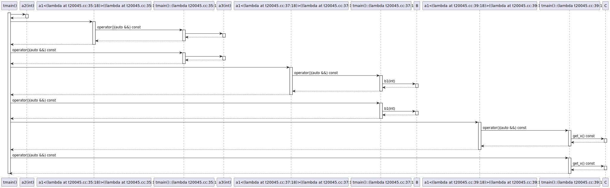
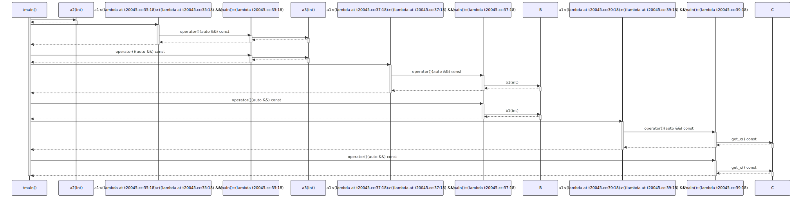

# t20045 - Test case for template function call expressions with callables
## Config
```yaml
add_compile_flags:
  - -fparse-all-comments
diagrams:
  t20045_sequence:
    type: sequence
    glob:
      - t20045.cc
    include:
      namespaces:
        - clanguml::t20045
    using_namespace: clanguml::t20045
    from:
      - function: "clanguml::t20045::tmain()"
```
## Source code
File `tests/t20045/t20045.cc`
```cpp
namespace clanguml {
namespace t20045 {

template <typename F> int a1(F &&f) { return f(42); }

int a2(int x) { return 2; }

int a3(int x) { return 3; }

struct B {
    int b1(int x) { return x + 1; }
    int b2(int x) { return x + 2; }
};

class C {
public:
    explicit C(int x)
        : x_{x}
    {
    }

    int get_x() const { return x_; }

private:
    int x_;
};

int tmain()
{
    B b;

    // \uml{call clanguml::t20045::a2(int)}
    auto v1 = a1(a2);

    auto v2 = a1([](auto &&arg) { return a3(arg); });

    auto v3 = a1([&](auto &&arg) { return b.b1(arg); });

    auto v4 = a1([](auto &&arg) {
        C c(arg);
        return c.get_x();
    });

    return 0;
}
}
}
```
## Generated PlantUML diagrams

## Generated Mermaid diagrams

## Generated JSON models
```json
{
  "diagram_type": "sequence",
  "name": "t20045_sequence",
  "participants": [
    {
      "display_name": "tmain()",
      "full_name": "clanguml::t20045::tmain()",
      "id": "2117440102058621189",
      "name": "tmain",
      "namespace": "clanguml::t20045",
      "source_location": {
        "column": 5,
        "file": "t20045.cc",
        "line": 28,
        "translation_unit": "t20045.cc"
      },
      "type": "function"
    },
    {
      "display_name": "a2(int)",
      "full_name": "clanguml::t20045::a2(int)",
      "id": "422137031007650421",
      "name": "a2",
      "namespace": "clanguml::t20045",
      "source_location": {
        "column": 5,
        "file": "t20045.cc",
        "line": 6,
        "translation_unit": "t20045.cc"
      },
      "type": "function"
    },
    {
      "display_name": "a1<(lambda at t20045.cc:35:18)>((lambda at t20045.cc:35:18) &&)",
      "full_name": "clanguml::t20045::a1<(lambda at t20045.cc:35:18)>((lambda at /home/bartek/devel/clang-uml/tests/t20045/t20045.cc:35:18) &&)",
      "id": "771242326042389239",
      "name": "a1",
      "namespace": "clanguml::t20045",
      "source_location": {
        "column": 27,
        "file": "t20045.cc",
        "line": 4,
        "translation_unit": "t20045.cc"
      },
      "type": "function_template"
    },
    {
      "activities": [
        {
          "display_name": "operator()(auto &&) const",
          "full_name": "clanguml::t20045::tmain()::(lambda t20045.cc:35:18)::operator()(auto &&) const",
          "id": "1420491111902448188",
          "name": "operator()",
          "namespace": "",
          "type": "method"
        }
      ],
      "display_name": "tmain()::(lambda t20045.cc:35:18)",
      "full_name": "clanguml::t20045::tmain()::(lambda t20045.cc:35:18)",
      "id": "36644484176793235",
      "name": "tmain()::(lambda t20045.cc:35:18)",
      "namespace": "clanguml::t20045",
      "source_location": {
        "column": 18,
        "file": "t20045.cc",
        "line": 35,
        "translation_unit": "t20045.cc"
      },
      "type": "lambda"
    },
    {
      "display_name": "a3(int)",
      "full_name": "clanguml::t20045::a3(int)",
      "id": "399307921304660486",
      "name": "a3",
      "namespace": "clanguml::t20045",
      "source_location": {
        "column": 5,
        "file": "t20045.cc",
        "line": 8,
        "translation_unit": "t20045.cc"
      },
      "type": "function"
    },
    {
      "display_name": "a1<(lambda at t20045.cc:37:18)>((lambda at t20045.cc:37:18) &&)",
      "full_name": "clanguml::t20045::a1<(lambda at t20045.cc:37:18)>((lambda at /home/bartek/devel/clang-uml/tests/t20045/t20045.cc:37:18) &&)",
      "id": "708264873048728082",
      "name": "a1",
      "namespace": "clanguml::t20045",
      "source_location": {
        "column": 27,
        "file": "t20045.cc",
        "line": 4,
        "translation_unit": "t20045.cc"
      },
      "type": "function_template"
    },
    {
      "activities": [
        {
          "display_name": "operator()(auto &&) const",
          "full_name": "clanguml::t20045::tmain()::(lambda t20045.cc:37:18)::operator()(auto &&) const",
          "id": "1995217387134011144",
          "name": "operator()",
          "namespace": "",
          "type": "method"
        }
      ],
      "display_name": "tmain()::(lambda t20045.cc:37:18)",
      "full_name": "clanguml::t20045::tmain()::(lambda t20045.cc:37:18)",
      "id": "1556269922572504148",
      "name": "tmain()::(lambda t20045.cc:37:18)",
      "namespace": "clanguml::t20045",
      "source_location": {
        "column": 18,
        "file": "t20045.cc",
        "line": 37,
        "translation_unit": "t20045.cc"
      },
      "type": "lambda"
    },
    {
      "activities": [
        {
          "display_name": "b1(int)",
          "full_name": "clanguml::t20045::B::b1(int)",
          "id": "820437645998690739",
          "name": "b1",
          "namespace": "",
          "source_location": {
            "column": 9,
            "file": "t20045.cc",
            "line": 11,
            "translation_unit": "t20045.cc"
          },
          "type": "method"
        }
      ],
      "display_name": "B",
      "full_name": "clanguml::t20045::B",
      "id": "1737887355752592935",
      "name": "B",
      "namespace": "clanguml::t20045",
      "source_location": {
        "column": 8,
        "file": "t20045.cc",
        "line": 10,
        "translation_unit": "t20045.cc"
      },
      "type": "class"
    },
    {
      "display_name": "a1<(lambda at t20045.cc:39:18)>((lambda at t20045.cc:39:18) &&)",
      "full_name": "clanguml::t20045::a1<(lambda at t20045.cc:39:18)>((lambda at /home/bartek/devel/clang-uml/tests/t20045/t20045.cc:39:18) &&)",
      "id": "1935046237572139126",
      "name": "a1",
      "namespace": "clanguml::t20045",
      "source_location": {
        "column": 27,
        "file": "t20045.cc",
        "line": 4,
        "translation_unit": "t20045.cc"
      },
      "type": "function_template"
    },
    {
      "activities": [
        {
          "display_name": "operator()(auto &&) const",
          "full_name": "clanguml::t20045::tmain()::(lambda t20045.cc:39:18)::operator()(auto &&) const",
          "id": "786866346046560964",
          "name": "operator()",
          "namespace": "",
          "type": "method"
        }
      ],
      "display_name": "tmain()::(lambda t20045.cc:39:18)",
      "full_name": "clanguml::t20045::tmain()::(lambda t20045.cc:39:18)",
      "id": "132403781431240789",
      "name": "tmain()::(lambda t20045.cc:39:18)",
      "namespace": "clanguml::t20045",
      "source_location": {
        "column": 18,
        "file": "t20045.cc",
        "line": 39,
        "translation_unit": "t20045.cc"
      },
      "type": "lambda"
    },
    {
      "activities": [
        {
          "display_name": "get_x() const",
          "full_name": "clanguml::t20045::C::get_x() const",
          "id": "570815384165305751",
          "name": "get_x",
          "namespace": "",
          "source_location": {
            "column": 9,
            "file": "t20045.cc",
            "line": 22,
            "translation_unit": "t20045.cc"
          },
          "type": "method"
        }
      ],
      "display_name": "C",
      "full_name": "clanguml::t20045::C",
      "id": "1812199014066862625",
      "name": "C",
      "namespace": "clanguml::t20045",
      "source_location": {
        "column": 7,
        "file": "t20045.cc",
        "line": 15,
        "translation_unit": "t20045.cc"
      },
      "type": "class"
    }
  ],
  "sequences": [
    {
      "messages": [
        {
          "from": {
            "activity_id": "2117440102058621189",
            "participant_id": "2117440102058621189"
          },
          "name": "",
          "return_type": "int",
          "scope": "normal",
          "source_location": {
            "column": 15,
            "file": "t20045.cc",
            "line": 33,
            "translation_unit": "t20045.cc"
          },
          "to": {
            "activity_id": "422137031007650421",
            "participant_id": "422137031007650421"
          },
          "type": "message"
        },
        {
          "from": {
            "activity_id": "2117440102058621189",
            "participant_id": "2117440102058621189"
          },
          "name": "",
          "return_type": "",
          "scope": "normal",
          "source_location": {
            "column": 15,
            "file": "t20045.cc",
            "line": 35,
            "translation_unit": "t20045.cc"
          },
          "to": {
            "activity_id": "771242326042389239",
            "participant_id": "771242326042389239"
          },
          "type": "message"
        },
        {
          "from": {
            "activity_id": "771242326042389239",
            "participant_id": "771242326042389239"
          },
          "name": "operator()(auto &&) const",
          "return_type": "auto",
          "scope": "normal",
          "source_location": {
            "column": 46,
            "file": "t20045.cc",
            "line": 4,
            "translation_unit": "t20045.cc"
          },
          "to": {
            "activity_id": "1420491111902448188",
            "participant_id": "36644484176793235"
          },
          "type": "message"
        },
        {
          "from": {
            "activity_id": "1420491111902448188",
            "participant_id": "36644484176793235"
          },
          "name": "",
          "return_type": "int",
          "scope": "normal",
          "source_location": {
            "column": 42,
            "file": "t20045.cc",
            "line": 35,
            "translation_unit": "t20045.cc"
          },
          "to": {
            "activity_id": "399307921304660486",
            "participant_id": "399307921304660486"
          },
          "type": "message"
        },
        {
          "from": {
            "activity_id": "2117440102058621189",
            "participant_id": "2117440102058621189"
          },
          "name": "",
          "return_type": "",
          "scope": "normal",
          "source_location": {
            "column": 15,
            "file": "t20045.cc",
            "line": 37,
            "translation_unit": "t20045.cc"
          },
          "to": {
            "activity_id": "708264873048728082",
            "participant_id": "708264873048728082"
          },
          "type": "message"
        },
        {
          "from": {
            "activity_id": "708264873048728082",
            "participant_id": "708264873048728082"
          },
          "name": "operator()(auto &&) const",
          "return_type": "auto",
          "scope": "normal",
          "source_location": {
            "column": 46,
            "file": "t20045.cc",
            "line": 4,
            "translation_unit": "t20045.cc"
          },
          "to": {
            "activity_id": "1995217387134011144",
            "participant_id": "1556269922572504148"
          },
          "type": "message"
        },
        {
          "from": {
            "activity_id": "1995217387134011144",
            "participant_id": "1556269922572504148"
          },
          "name": "b1(int)",
          "return_type": "int",
          "scope": "normal",
          "source_location": {
            "column": 43,
            "file": "t20045.cc",
            "line": 37,
            "translation_unit": "t20045.cc"
          },
          "to": {
            "activity_id": "820437645998690739",
            "participant_id": "1737887355752592935"
          },
          "type": "message"
        },
        {
          "from": {
            "activity_id": "2117440102058621189",
            "participant_id": "2117440102058621189"
          },
          "name": "",
          "return_type": "",
          "scope": "normal",
          "source_location": {
            "column": 15,
            "file": "t20045.cc",
            "line": 39,
            "translation_unit": "t20045.cc"
          },
          "to": {
            "activity_id": "1935046237572139126",
            "participant_id": "1935046237572139126"
          },
          "type": "message"
        },
        {
          "from": {
            "activity_id": "1935046237572139126",
            "participant_id": "1935046237572139126"
          },
          "name": "operator()(auto &&) const",
          "return_type": "auto",
          "scope": "normal",
          "source_location": {
            "column": 46,
            "file": "t20045.cc",
            "line": 4,
            "translation_unit": "t20045.cc"
          },
          "to": {
            "activity_id": "786866346046560964",
            "participant_id": "132403781431240789"
          },
          "type": "message"
        },
        {
          "from": {
            "activity_id": "786866346046560964",
            "participant_id": "132403781431240789"
          },
          "name": "get_x() const",
          "return_type": "int",
          "scope": "normal",
          "source_location": {
            "column": 16,
            "file": "t20045.cc",
            "line": 41,
            "translation_unit": "t20045.cc"
          },
          "to": {
            "activity_id": "570815384165305751",
            "participant_id": "1812199014066862625"
          },
          "type": "message"
        }
      ],
      "start_from": {
        "id": 2117440102058621189,
        "location": "clanguml::t20045::tmain()"
      }
    }
  ],
  "using_namespace": "clanguml::t20045"
}
```
