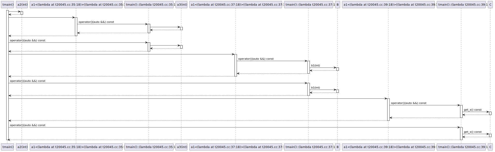
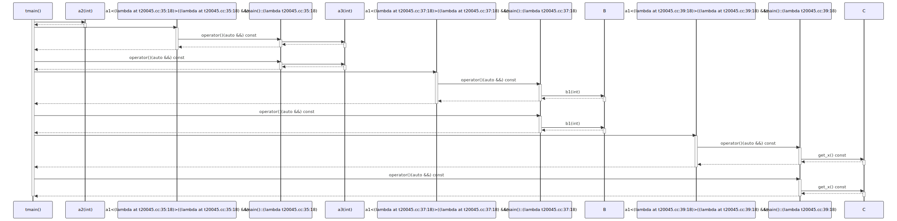

# t20045 - Test case for template function call expressions with callables
## Config
```yaml
add_compile_flags:
  - -fparse-all-comments
diagrams:
  t20045_sequence:
    type: sequence
    glob:
      - t20045.cc
    include:
      namespaces:
        - clanguml::t20045
    using_namespace: clanguml::t20045
    from:
      - function: "clanguml::t20045::tmain()"
```
## Source code
File `tests/t20045/t20045.cc`
```cpp
namespace clanguml {
namespace t20045 {

template <typename F> int a1(F &&f) { return f(42); }

int a2(int x) { return 2; }

int a3(int x) { return 3; }

struct B {
    int b1(int x) { return x + 1; }
    int b2(int x) { return x + 2; }
};

class C {
public:
    explicit C(int x)
        : x_{x}
    {
    }

    int get_x() const { return x_; }

private:
    int x_;
};

int tmain()
{
    B b;

    // \uml{call clanguml::t20045::a2(int)}
    auto v1 = a1(a2);

    auto v2 = a1([](auto &&arg) { return a3(arg); });

    auto v3 = a1([&](auto &&arg) { return b.b1(arg); });

    auto v4 = a1([](auto &&arg) {
        C c(arg);
        return c.get_x();
    });

    return 0;
}
}
}
```
## Generated PlantUML diagrams

## Generated Mermaid diagrams

## Generated JSON models
```json
{
  "diagram_type": "sequence",
  "name": "t20045_sequence",
  "participants": [
    {
      "display_name": "tmain()",
      "full_name": "clanguml::t20045::tmain()",
      "id": "5899263847001893206",
      "name": "tmain",
      "namespace": "clanguml::t20045",
      "source_location": {
        "column": 5,
        "file": "t20045.cc",
        "line": 28,
        "translation_unit": "t20045.cc"
      },
      "type": "function"
    },
    {
      "display_name": "a2(int)",
      "full_name": "clanguml::t20045::a2(int)",
      "id": "9304830249701956817",
      "name": "a2",
      "namespace": "clanguml::t20045",
      "source_location": {
        "column": 5,
        "file": "t20045.cc",
        "line": 6,
        "translation_unit": "t20045.cc"
      },
      "type": "function"
    },
    {
      "display_name": "a1<(lambda at t20045.cc:35:18)>((lambda at t20045.cc:35:18) &&)",
      "full_name": "clanguml::t20045::a1<(lambda at t20045.cc:35:18)>((lambda at t20045.cc:35:18) &&)",
      "id": "3867228883337946902",
      "name": "a1",
      "namespace": "clanguml::t20045",
      "source_location": {
        "column": 27,
        "file": "t20045.cc",
        "line": 4,
        "translation_unit": "t20045.cc"
      },
      "type": "function_template"
    },
    {
      "activities": [
        {
          "display_name": "operator()(auto &&) const",
          "full_name": "clanguml::t20045::tmain()::(lambda t20045.cc:35:18)::operator()(auto &&) const",
          "id": "9619003968490669909",
          "name": "operator()",
          "namespace": "clanguml::t20045::tmain()",
          "type": "method"
        }
      ],
      "display_name": "tmain()::(lambda t20045.cc:35:18)",
      "full_name": "clanguml::t20045::tmain()::(lambda t20045.cc:35:18)",
      "id": "7059439438638452638",
      "name": "tmain()##(lambda t20045.cc:35:18)",
      "namespace": "clanguml::t20045",
      "source_location": {
        "column": 18,
        "file": "t20045.cc",
        "line": 35,
        "translation_unit": "t20045.cc"
      },
      "type": "lambda"
    },
    {
      "display_name": "a3(int)",
      "full_name": "clanguml::t20045::a3(int)",
      "id": "4752909365167912094",
      "name": "a3",
      "namespace": "clanguml::t20045",
      "source_location": {
        "column": 5,
        "file": "t20045.cc",
        "line": 8,
        "translation_unit": "t20045.cc"
      },
      "type": "function"
    },
    {
      "display_name": "a1<(lambda at t20045.cc:37:18)>((lambda at t20045.cc:37:18) &&)",
      "full_name": "clanguml::t20045::a1<(lambda at t20045.cc:37:18)>((lambda at t20045.cc:37:18) &&)",
      "id": "3086341821339916140",
      "name": "a1",
      "namespace": "clanguml::t20045",
      "source_location": {
        "column": 27,
        "file": "t20045.cc",
        "line": 4,
        "translation_unit": "t20045.cc"
      },
      "type": "function_template"
    },
    {
      "activities": [
        {
          "display_name": "operator()(auto &&) const",
          "full_name": "clanguml::t20045::tmain()::(lambda t20045.cc:37:18)::operator()(auto &&) const",
          "id": "15455156992752299397",
          "name": "operator()",
          "namespace": "clanguml::t20045::tmain()",
          "type": "method"
        }
      ],
      "display_name": "tmain()::(lambda t20045.cc:37:18)",
      "full_name": "clanguml::t20045::tmain()::(lambda t20045.cc:37:18)",
      "id": "498940131815812490",
      "name": "tmain()##(lambda t20045.cc:37:18)",
      "namespace": "clanguml::t20045",
      "source_location": {
        "column": 18,
        "file": "t20045.cc",
        "line": 37,
        "translation_unit": "t20045.cc"
      },
      "type": "lambda"
    },
    {
      "activities": [
        {
          "display_name": "b1(int)",
          "full_name": "clanguml::t20045::B::b1(int)",
          "id": "11348206019006198593",
          "name": "b1",
          "namespace": "clanguml::t20045",
          "source_location": {
            "column": 9,
            "file": "t20045.cc",
            "line": 11,
            "translation_unit": "t20045.cc"
          },
          "type": "method"
        }
      ],
      "display_name": "B",
      "full_name": "clanguml::t20045::B",
      "id": "17475743350619849576",
      "name": "B",
      "namespace": "clanguml::t20045",
      "source_location": {
        "column": 8,
        "file": "t20045.cc",
        "line": 10,
        "translation_unit": "t20045.cc"
      },
      "type": "class"
    },
    {
      "display_name": "a1<(lambda at t20045.cc:39:18)>((lambda at t20045.cc:39:18) &&)",
      "full_name": "clanguml::t20045::a1<(lambda at t20045.cc:39:18)>((lambda at t20045.cc:39:18) &&)",
      "id": "7098670237421277801",
      "name": "a1",
      "namespace": "clanguml::t20045",
      "source_location": {
        "column": 27,
        "file": "t20045.cc",
        "line": 4,
        "translation_unit": "t20045.cc"
      },
      "type": "function_template"
    },
    {
      "activities": [
        {
          "display_name": "operator()(auto &&) const",
          "full_name": "clanguml::t20045::tmain()::(lambda t20045.cc:39:18)::operator()(auto &&) const",
          "id": "17231070364550379304",
          "name": "operator()",
          "namespace": "clanguml::t20045::tmain()",
          "type": "method"
        }
      ],
      "display_name": "tmain()::(lambda t20045.cc:39:18)",
      "full_name": "clanguml::t20045::tmain()::(lambda t20045.cc:39:18)",
      "id": "16886381916632047050",
      "name": "tmain()##(lambda t20045.cc:39:18)",
      "namespace": "clanguml::t20045",
      "source_location": {
        "column": 18,
        "file": "t20045.cc",
        "line": 39,
        "translation_unit": "t20045.cc"
      },
      "type": "lambda"
    },
    {
      "activities": [
        {
          "display_name": "get_x() const",
          "full_name": "clanguml::t20045::C::get_x() const",
          "id": "706447936968794299",
          "name": "get_x",
          "namespace": "clanguml::t20045",
          "source_location": {
            "column": 9,
            "file": "t20045.cc",
            "line": 22,
            "translation_unit": "t20045.cc"
          },
          "type": "method"
        }
      ],
      "display_name": "C",
      "full_name": "clanguml::t20045::C",
      "id": "15494513298424501320",
      "name": "C",
      "namespace": "clanguml::t20045",
      "source_location": {
        "column": 7,
        "file": "t20045.cc",
        "line": 15,
        "translation_unit": "t20045.cc"
      },
      "type": "class"
    }
  ],
  "sequences": [
    {
      "from": {
        "id": "5899263847001893206",
        "location": "clanguml::t20045::tmain()"
      },
      "messages": [
        {
          "from": {
            "activity_id": "5899263847001893206",
            "participant_id": "5899263847001893206"
          },
          "name": "",
          "return_type": "int",
          "scope": "normal",
          "source_location": {
            "column": 15,
            "file": "t20045.cc",
            "line": 33,
            "translation_unit": "t20045.cc"
          },
          "to": {
            "activity_id": "9304830249701956817",
            "participant_id": "9304830249701956817"
          },
          "type": "message"
        },
        {
          "from": {
            "activity_id": "9304830249701956817",
            "participant_id": "9304830249701956817"
          },
          "name": "",
          "return_type": "int",
          "scope": "normal",
          "source_location": {
            "column": 17,
            "file": "t20045.cc",
            "line": 6,
            "translation_unit": "t20045.cc"
          },
          "to": {
            "activity_id": "5899263847001893206",
            "participant_id": "5899263847001893206"
          },
          "type": "return"
        },
        {
          "from": {
            "activity_id": "5899263847001893206",
            "participant_id": "5899263847001893206"
          },
          "name": "",
          "return_type": "",
          "scope": "normal",
          "source_location": {
            "column": 15,
            "file": "t20045.cc",
            "line": 35,
            "translation_unit": "t20045.cc"
          },
          "to": {
            "activity_id": "3867228883337946902",
            "participant_id": "3867228883337946902"
          },
          "type": "message"
        },
        {
          "from": {
            "activity_id": "3867228883337946902",
            "participant_id": "3867228883337946902"
          },
          "name": "operator()(auto &&) const",
          "return_type": "auto",
          "scope": "normal",
          "source_location": {
            "column": 46,
            "file": "t20045.cc",
            "line": 4,
            "translation_unit": "t20045.cc"
          },
          "to": {
            "activity_id": "9619003968490669909",
            "participant_id": "7059439438638452638"
          },
          "type": "message"
        },
        {
          "from": {
            "activity_id": "9619003968490669909",
            "participant_id": "7059439438638452638"
          },
          "name": "",
          "return_type": "int",
          "scope": "normal",
          "source_location": {
            "column": 42,
            "file": "t20045.cc",
            "line": 35,
            "translation_unit": "t20045.cc"
          },
          "to": {
            "activity_id": "4752909365167912094",
            "participant_id": "4752909365167912094"
          },
          "type": "message"
        },
        {
          "from": {
            "activity_id": "4752909365167912094",
            "participant_id": "4752909365167912094"
          },
          "name": "",
          "return_type": "int",
          "scope": "normal",
          "source_location": {
            "column": 17,
            "file": "t20045.cc",
            "line": 8,
            "translation_unit": "t20045.cc"
          },
          "to": {
            "activity_id": "9619003968490669909",
            "participant_id": "7059439438638452638"
          },
          "type": "return"
        },
        {
          "from": {
            "activity_id": "9619003968490669909",
            "participant_id": "7059439438638452638"
          },
          "name": "",
          "return_type": "auto",
          "scope": "normal",
          "source_location": {
            "column": 35,
            "file": "t20045.cc",
            "line": 35,
            "translation_unit": "t20045.cc"
          },
          "to": {
            "activity_id": "3867228883337946902",
            "participant_id": "3867228883337946902"
          },
          "type": "return"
        },
        {
          "from": {
            "activity_id": "3867228883337946902",
            "participant_id": "3867228883337946902"
          },
          "name": "",
          "return_type": "int",
          "scope": "normal",
          "source_location": {
            "column": 39,
            "file": "t20045.cc",
            "line": 4,
            "translation_unit": "t20045.cc"
          },
          "to": {
            "activity_id": "5899263847001893206",
            "participant_id": "5899263847001893206"
          },
          "type": "return"
        },
        {
          "from": {
            "activity_id": "5899263847001893206",
            "participant_id": "5899263847001893206"
          },
          "name": "operator()(auto &&) const",
          "return_type": "auto",
          "scope": "normal",
          "source_location": {
            "column": 18,
            "file": "t20045.cc",
            "line": 35,
            "translation_unit": "t20045.cc"
          },
          "to": {
            "activity_id": "9619003968490669909",
            "participant_id": "7059439438638452638"
          },
          "type": "message"
        },
        {
          "from": {
            "activity_id": "9619003968490669909",
            "participant_id": "7059439438638452638"
          },
          "name": "",
          "return_type": "int",
          "scope": "normal",
          "source_location": {
            "column": 42,
            "file": "t20045.cc",
            "line": 35,
            "translation_unit": "t20045.cc"
          },
          "to": {
            "activity_id": "4752909365167912094",
            "participant_id": "4752909365167912094"
          },
          "type": "message"
        },
        {
          "from": {
            "activity_id": "4752909365167912094",
            "participant_id": "4752909365167912094"
          },
          "name": "",
          "return_type": "int",
          "scope": "normal",
          "source_location": {
            "column": 17,
            "file": "t20045.cc",
            "line": 8,
            "translation_unit": "t20045.cc"
          },
          "to": {
            "activity_id": "9619003968490669909",
            "participant_id": "7059439438638452638"
          },
          "type": "return"
        },
        {
          "from": {
            "activity_id": "9619003968490669909",
            "participant_id": "7059439438638452638"
          },
          "name": "",
          "return_type": "auto",
          "scope": "normal",
          "source_location": {
            "column": 35,
            "file": "t20045.cc",
            "line": 35,
            "translation_unit": "t20045.cc"
          },
          "to": {
            "activity_id": "5899263847001893206",
            "participant_id": "5899263847001893206"
          },
          "type": "return"
        },
        {
          "from": {
            "activity_id": "5899263847001893206",
            "participant_id": "5899263847001893206"
          },
          "name": "",
          "return_type": "",
          "scope": "normal",
          "source_location": {
            "column": 15,
            "file": "t20045.cc",
            "line": 37,
            "translation_unit": "t20045.cc"
          },
          "to": {
            "activity_id": "3086341821339916140",
            "participant_id": "3086341821339916140"
          },
          "type": "message"
        },
        {
          "from": {
            "activity_id": "3086341821339916140",
            "participant_id": "3086341821339916140"
          },
          "name": "operator()(auto &&) const",
          "return_type": "auto",
          "scope": "normal",
          "source_location": {
            "column": 46,
            "file": "t20045.cc",
            "line": 4,
            "translation_unit": "t20045.cc"
          },
          "to": {
            "activity_id": "15455156992752299397",
            "participant_id": "498940131815812490"
          },
          "type": "message"
        },
        {
          "from": {
            "activity_id": "15455156992752299397",
            "participant_id": "498940131815812490"
          },
          "name": "b1(int)",
          "return_type": "int",
          "scope": "normal",
          "source_location": {
            "column": 43,
            "file": "t20045.cc",
            "line": 37,
            "translation_unit": "t20045.cc"
          },
          "to": {
            "activity_id": "11348206019006198593",
            "participant_id": "17475743350619849576"
          },
          "type": "message"
        },
        {
          "from": {
            "activity_id": "11348206019006198593",
            "participant_id": "17475743350619849576"
          },
          "name": "",
          "return_type": "int",
          "scope": "normal",
          "source_location": {
            "column": 21,
            "file": "t20045.cc",
            "line": 11,
            "translation_unit": "t20045.cc"
          },
          "to": {
            "activity_id": "15455156992752299397",
            "participant_id": "498940131815812490"
          },
          "type": "return"
        },
        {
          "from": {
            "activity_id": "15455156992752299397",
            "participant_id": "498940131815812490"
          },
          "name": "",
          "return_type": "auto",
          "scope": "normal",
          "source_location": {
            "column": 36,
            "file": "t20045.cc",
            "line": 37,
            "translation_unit": "t20045.cc"
          },
          "to": {
            "activity_id": "3086341821339916140",
            "participant_id": "3086341821339916140"
          },
          "type": "return"
        },
        {
          "from": {
            "activity_id": "3086341821339916140",
            "participant_id": "3086341821339916140"
          },
          "name": "",
          "return_type": "int",
          "scope": "normal",
          "source_location": {
            "column": 39,
            "file": "t20045.cc",
            "line": 4,
            "translation_unit": "t20045.cc"
          },
          "to": {
            "activity_id": "5899263847001893206",
            "participant_id": "5899263847001893206"
          },
          "type": "return"
        },
        {
          "from": {
            "activity_id": "5899263847001893206",
            "participant_id": "5899263847001893206"
          },
          "name": "operator()(auto &&) const",
          "return_type": "auto",
          "scope": "normal",
          "source_location": {
            "column": 18,
            "file": "t20045.cc",
            "line": 37,
            "translation_unit": "t20045.cc"
          },
          "to": {
            "activity_id": "15455156992752299397",
            "participant_id": "498940131815812490"
          },
          "type": "message"
        },
        {
          "from": {
            "activity_id": "15455156992752299397",
            "participant_id": "498940131815812490"
          },
          "name": "b1(int)",
          "return_type": "int",
          "scope": "normal",
          "source_location": {
            "column": 43,
            "file": "t20045.cc",
            "line": 37,
            "translation_unit": "t20045.cc"
          },
          "to": {
            "activity_id": "11348206019006198593",
            "participant_id": "17475743350619849576"
          },
          "type": "message"
        },
        {
          "from": {
            "activity_id": "11348206019006198593",
            "participant_id": "17475743350619849576"
          },
          "name": "",
          "return_type": "int",
          "scope": "normal",
          "source_location": {
            "column": 21,
            "file": "t20045.cc",
            "line": 11,
            "translation_unit": "t20045.cc"
          },
          "to": {
            "activity_id": "15455156992752299397",
            "participant_id": "498940131815812490"
          },
          "type": "return"
        },
        {
          "from": {
            "activity_id": "15455156992752299397",
            "participant_id": "498940131815812490"
          },
          "name": "",
          "return_type": "auto",
          "scope": "normal",
          "source_location": {
            "column": 36,
            "file": "t20045.cc",
            "line": 37,
            "translation_unit": "t20045.cc"
          },
          "to": {
            "activity_id": "5899263847001893206",
            "participant_id": "5899263847001893206"
          },
          "type": "return"
        },
        {
          "from": {
            "activity_id": "5899263847001893206",
            "participant_id": "5899263847001893206"
          },
          "name": "",
          "return_type": "",
          "scope": "normal",
          "source_location": {
            "column": 15,
            "file": "t20045.cc",
            "line": 39,
            "translation_unit": "t20045.cc"
          },
          "to": {
            "activity_id": "7098670237421277801",
            "participant_id": "7098670237421277801"
          },
          "type": "message"
        },
        {
          "from": {
            "activity_id": "7098670237421277801",
            "participant_id": "7098670237421277801"
          },
          "name": "operator()(auto &&) const",
          "return_type": "auto",
          "scope": "normal",
          "source_location": {
            "column": 46,
            "file": "t20045.cc",
            "line": 4,
            "translation_unit": "t20045.cc"
          },
          "to": {
            "activity_id": "17231070364550379304",
            "participant_id": "16886381916632047050"
          },
          "type": "message"
        },
        {
          "from": {
            "activity_id": "17231070364550379304",
            "participant_id": "16886381916632047050"
          },
          "name": "get_x() const",
          "return_type": "int",
          "scope": "normal",
          "source_location": {
            "column": 16,
            "file": "t20045.cc",
            "line": 41,
            "translation_unit": "t20045.cc"
          },
          "to": {
            "activity_id": "706447936968794299",
            "participant_id": "15494513298424501320"
          },
          "type": "message"
        },
        {
          "from": {
            "activity_id": "706447936968794299",
            "participant_id": "15494513298424501320"
          },
          "name": "",
          "return_type": "int",
          "scope": "normal",
          "source_location": {
            "column": 25,
            "file": "t20045.cc",
            "line": 22,
            "translation_unit": "t20045.cc"
          },
          "to": {
            "activity_id": "17231070364550379304",
            "participant_id": "16886381916632047050"
          },
          "type": "return"
        },
        {
          "from": {
            "activity_id": "17231070364550379304",
            "participant_id": "16886381916632047050"
          },
          "name": "",
          "return_type": "auto",
          "scope": "normal",
          "source_location": {
            "column": 9,
            "file": "t20045.cc",
            "line": 41,
            "translation_unit": "t20045.cc"
          },
          "to": {
            "activity_id": "7098670237421277801",
            "participant_id": "7098670237421277801"
          },
          "type": "return"
        },
        {
          "from": {
            "activity_id": "7098670237421277801",
            "participant_id": "7098670237421277801"
          },
          "name": "",
          "return_type": "int",
          "scope": "normal",
          "source_location": {
            "column": 39,
            "file": "t20045.cc",
            "line": 4,
            "translation_unit": "t20045.cc"
          },
          "to": {
            "activity_id": "5899263847001893206",
            "participant_id": "5899263847001893206"
          },
          "type": "return"
        },
        {
          "from": {
            "activity_id": "5899263847001893206",
            "participant_id": "5899263847001893206"
          },
          "name": "operator()(auto &&) const",
          "return_type": "auto",
          "scope": "normal",
          "source_location": {
            "column": 18,
            "file": "t20045.cc",
            "line": 39,
            "translation_unit": "t20045.cc"
          },
          "to": {
            "activity_id": "17231070364550379304",
            "participant_id": "16886381916632047050"
          },
          "type": "message"
        },
        {
          "from": {
            "activity_id": "17231070364550379304",
            "participant_id": "16886381916632047050"
          },
          "name": "get_x() const",
          "return_type": "int",
          "scope": "normal",
          "source_location": {
            "column": 16,
            "file": "t20045.cc",
            "line": 41,
            "translation_unit": "t20045.cc"
          },
          "to": {
            "activity_id": "706447936968794299",
            "participant_id": "15494513298424501320"
          },
          "type": "message"
        },
        {
          "from": {
            "activity_id": "706447936968794299",
            "participant_id": "15494513298424501320"
          },
          "name": "",
          "return_type": "int",
          "scope": "normal",
          "source_location": {
            "column": 25,
            "file": "t20045.cc",
            "line": 22,
            "translation_unit": "t20045.cc"
          },
          "to": {
            "activity_id": "17231070364550379304",
            "participant_id": "16886381916632047050"
          },
          "type": "return"
        },
        {
          "from": {
            "activity_id": "17231070364550379304",
            "participant_id": "16886381916632047050"
          },
          "name": "",
          "return_type": "auto",
          "scope": "normal",
          "source_location": {
            "column": 9,
            "file": "t20045.cc",
            "line": 41,
            "translation_unit": "t20045.cc"
          },
          "to": {
            "activity_id": "5899263847001893206",
            "participant_id": "5899263847001893206"
          },
          "type": "return"
        }
      ]
    }
  ],
  "using_namespace": "clanguml::t20045"
}
```
## Generated GraphML models
