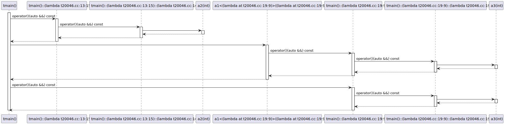
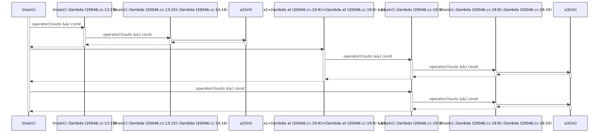

# t20046 - Test case for call expressions in nested lambdas
## Config
```yaml
add_compile_flags:
  - -fparse-all-comments
diagrams:
  t20046_sequence:
    type: sequence
    glob:
      - t20046.cc
    include:
      namespaces:
        - clanguml::t20046
    using_namespace: clanguml::t20046
    from:
      - function: "clanguml::t20046::tmain()"
```
## Source code
File `tests/t20046/t20046.cc`
```cpp
namespace clanguml {
namespace t20046 {

template <typename F> int a1(F &&f) { return f(42); }

int a2(int x) { return 2; }

int a3(int x) { return 3; }

int tmain()
{
    // Call expression in a nested lambda
    auto v1 = [](auto &&arg1) {
        return [](auto &&arg2) { return a2(arg2); }(arg1);
    }(0);

    // Call expression in a nested lambda in call expression
    auto v4 = a1(
        [](auto &&arg1) { return [](auto &&arg2) { return a3(arg2); }(arg1); });

    return 0;
}
}
}
```
## Generated PlantUML diagrams

## Generated Mermaid diagrams

## Generated JSON models
```json
{
  "diagram_type": "sequence",
  "name": "t20046_sequence",
  "participants": [
    {
      "display_name": "tmain()",
      "full_name": "clanguml::t20046::tmain()",
      "id": "2349602679889926542",
      "name": "tmain",
      "namespace": "clanguml::t20046",
      "source_location": {
        "column": 5,
        "file": "t20046.cc",
        "line": 10,
        "translation_unit": "t20046.cc"
      },
      "type": "function"
    },
    {
      "activities": [
        {
          "display_name": "operator()(auto &&) const",
          "full_name": "clanguml::t20046::tmain()::(lambda t20046.cc:13:15)::operator()(auto &&) const",
          "id": "14980572348247913967",
          "name": "operator()",
          "namespace": "clanguml::t20046::tmain()",
          "type": "method"
        }
      ],
      "display_name": "tmain()::(lambda t20046.cc:13:15)",
      "full_name": "clanguml::t20046::tmain()::(lambda t20046.cc:13:15)",
      "id": "17981489729788883412",
      "name": "tmain()##(lambda t20046.cc:13:15)",
      "namespace": "clanguml::t20046",
      "source_location": {
        "column": 15,
        "file": "t20046.cc",
        "line": 13,
        "translation_unit": "t20046.cc"
      },
      "type": "lambda"
    },
    {
      "activities": [
        {
          "display_name": "operator()(auto &&) const",
          "full_name": "clanguml::t20046::clanguml::t20046::tmain()::(lambda t20046.cc:13:15)::(lambda t20046.cc:14:16)::operator()(auto &&) const",
          "id": "3879778242711761533",
          "name": "operator()",
          "namespace": "clanguml::t20046::tmain()::(anonymous class)::operator()(auto &&)",
          "type": "method"
        }
      ],
      "display_name": "tmain()::(lambda t20046.cc:13:15)::(lambda t20046.cc:14:16)",
      "full_name": "clanguml::t20046::clanguml::t20046::tmain()::(lambda t20046.cc:13:15)::(lambda t20046.cc:14:16)",
      "id": "11377931848423226091",
      "name": "clanguml::t20046::tmain()##(lambda t20046.cc:13:15)##(lambda t20046.cc:14:16)",
      "namespace": "clanguml::t20046",
      "source_location": {
        "column": 16,
        "file": "t20046.cc",
        "line": 14,
        "translation_unit": "t20046.cc"
      },
      "type": "lambda"
    },
    {
      "display_name": "a2(int)",
      "full_name": "clanguml::t20046::a2(int)",
      "id": "6089445510459407778",
      "name": "a2",
      "namespace": "clanguml::t20046",
      "source_location": {
        "column": 5,
        "file": "t20046.cc",
        "line": 6,
        "translation_unit": "t20046.cc"
      },
      "type": "function"
    },
    {
      "display_name": "a1<(lambda at t20046.cc:19:9)>((lambda at t20046.cc:19:9) &&)",
      "full_name": "clanguml::t20046::a1<(lambda at t20046.cc:19:9)>((lambda at t20046.cc:19:9) &&)",
      "id": "10259157824952684678",
      "name": "a1",
      "namespace": "clanguml::t20046",
      "source_location": {
        "column": 27,
        "file": "t20046.cc",
        "line": 4,
        "translation_unit": "t20046.cc"
      },
      "type": "function_template"
    },
    {
      "activities": [
        {
          "display_name": "operator()(auto &&) const",
          "full_name": "clanguml::t20046::tmain()::(lambda t20046.cc:19:9)::operator()(auto &&) const",
          "id": "3689118889016926070",
          "name": "operator()",
          "namespace": "clanguml::t20046::tmain()",
          "type": "method"
        }
      ],
      "display_name": "tmain()::(lambda t20046.cc:19:9)",
      "full_name": "clanguml::t20046::tmain()::(lambda t20046.cc:19:9)",
      "id": "6830572900416452326",
      "name": "tmain()##(lambda t20046.cc:19:9)",
      "namespace": "clanguml::t20046",
      "source_location": {
        "column": 9,
        "file": "t20046.cc",
        "line": 19,
        "translation_unit": "t20046.cc"
      },
      "type": "lambda"
    },
    {
      "activities": [
        {
          "display_name": "operator()(auto &&) const",
          "full_name": "clanguml::t20046::clanguml::t20046::tmain()::(lambda t20046.cc:19:9)::(lambda t20046.cc:19:34)::operator()(auto &&) const",
          "id": "1922537343985303907",
          "name": "operator()",
          "namespace": "clanguml::t20046::tmain()::(anonymous class)::operator()(auto &&)",
          "type": "method"
        }
      ],
      "display_name": "tmain()::(lambda t20046.cc:19:9)::(lambda t20046.cc:19:34)",
      "full_name": "clanguml::t20046::clanguml::t20046::tmain()::(lambda t20046.cc:19:9)::(lambda t20046.cc:19:34)",
      "id": "4244992850250494482",
      "name": "clanguml::t20046::tmain()##(lambda t20046.cc:19:9)##(lambda t20046.cc:19:34)",
      "namespace": "clanguml::t20046",
      "source_location": {
        "column": 34,
        "file": "t20046.cc",
        "line": 19,
        "translation_unit": "t20046.cc"
      },
      "type": "lambda"
    },
    {
      "display_name": "a3(int)",
      "full_name": "clanguml::t20046::a3(int)",
      "id": "5509393947209862105",
      "name": "a3",
      "namespace": "clanguml::t20046",
      "source_location": {
        "column": 5,
        "file": "t20046.cc",
        "line": 8,
        "translation_unit": "t20046.cc"
      },
      "type": "function"
    }
  ],
  "sequences": [
    {
      "from": {
        "id": "2349602679889926542",
        "location": "clanguml::t20046::tmain()"
      },
      "messages": [
        {
          "comment": "Call expression in a nested lambda",
          "from": {
            "activity_id": "2349602679889926542",
            "participant_id": "2349602679889926542"
          },
          "name": "operator()(auto &&) const",
          "return_type": "auto",
          "scope": "normal",
          "source_location": {
            "column": 15,
            "file": "t20046.cc",
            "line": 13,
            "translation_unit": "t20046.cc"
          },
          "to": {
            "activity_id": "14980572348247913967",
            "participant_id": "17981489729788883412"
          },
          "type": "message"
        },
        {
          "from": {
            "activity_id": "14980572348247913967",
            "participant_id": "17981489729788883412"
          },
          "name": "operator()(auto &&) const",
          "return_type": "auto",
          "scope": "normal",
          "source_location": {
            "column": 16,
            "file": "t20046.cc",
            "line": 14,
            "translation_unit": "t20046.cc"
          },
          "to": {
            "activity_id": "3879778242711761533",
            "participant_id": "11377931848423226091"
          },
          "type": "message"
        },
        {
          "from": {
            "activity_id": "3879778242711761533",
            "participant_id": "11377931848423226091"
          },
          "name": "",
          "return_type": "int",
          "scope": "normal",
          "source_location": {
            "column": 41,
            "file": "t20046.cc",
            "line": 14,
            "translation_unit": "t20046.cc"
          },
          "to": {
            "activity_id": "6089445510459407778",
            "participant_id": "6089445510459407778"
          },
          "type": "message"
        },
        {
          "from": {
            "activity_id": "6089445510459407778",
            "participant_id": "6089445510459407778"
          },
          "name": "",
          "return_type": "int",
          "scope": "normal",
          "source_location": {
            "column": 17,
            "file": "t20046.cc",
            "line": 6,
            "translation_unit": "t20046.cc"
          },
          "to": {
            "activity_id": "3879778242711761533",
            "participant_id": "11377931848423226091"
          },
          "type": "return"
        },
        {
          "from": {
            "activity_id": "3879778242711761533",
            "participant_id": "11377931848423226091"
          },
          "name": "",
          "return_type": "auto",
          "scope": "normal",
          "source_location": {
            "column": 34,
            "file": "t20046.cc",
            "line": 14,
            "translation_unit": "t20046.cc"
          },
          "to": {
            "activity_id": "14980572348247913967",
            "participant_id": "17981489729788883412"
          },
          "type": "return"
        },
        {
          "from": {
            "activity_id": "14980572348247913967",
            "participant_id": "17981489729788883412"
          },
          "name": "",
          "return_type": "auto",
          "scope": "normal",
          "source_location": {
            "column": 9,
            "file": "t20046.cc",
            "line": 14,
            "translation_unit": "t20046.cc"
          },
          "to": {
            "activity_id": "2349602679889926542",
            "participant_id": "2349602679889926542"
          },
          "type": "return"
        },
        {
          "comment": "Call expression in a nested lambda in call expression",
          "from": {
            "activity_id": "2349602679889926542",
            "participant_id": "2349602679889926542"
          },
          "name": "",
          "return_type": "",
          "scope": "normal",
          "source_location": {
            "column": 15,
            "file": "t20046.cc",
            "line": 18,
            "translation_unit": "t20046.cc"
          },
          "to": {
            "activity_id": "10259157824952684678",
            "participant_id": "10259157824952684678"
          },
          "type": "message"
        },
        {
          "from": {
            "activity_id": "10259157824952684678",
            "participant_id": "10259157824952684678"
          },
          "name": "operator()(auto &&) const",
          "return_type": "auto",
          "scope": "normal",
          "source_location": {
            "column": 46,
            "file": "t20046.cc",
            "line": 4,
            "translation_unit": "t20046.cc"
          },
          "to": {
            "activity_id": "3689118889016926070",
            "participant_id": "6830572900416452326"
          },
          "type": "message"
        },
        {
          "from": {
            "activity_id": "3689118889016926070",
            "participant_id": "6830572900416452326"
          },
          "name": "operator()(auto &&) const",
          "return_type": "auto",
          "scope": "normal",
          "source_location": {
            "column": 34,
            "file": "t20046.cc",
            "line": 19,
            "translation_unit": "t20046.cc"
          },
          "to": {
            "activity_id": "1922537343985303907",
            "participant_id": "4244992850250494482"
          },
          "type": "message"
        },
        {
          "from": {
            "activity_id": "1922537343985303907",
            "participant_id": "4244992850250494482"
          },
          "name": "",
          "return_type": "int",
          "scope": "normal",
          "source_location": {
            "column": 59,
            "file": "t20046.cc",
            "line": 19,
            "translation_unit": "t20046.cc"
          },
          "to": {
            "activity_id": "5509393947209862105",
            "participant_id": "5509393947209862105"
          },
          "type": "message"
        },
        {
          "from": {
            "activity_id": "5509393947209862105",
            "participant_id": "5509393947209862105"
          },
          "name": "",
          "return_type": "int",
          "scope": "normal",
          "source_location": {
            "column": 17,
            "file": "t20046.cc",
            "line": 8,
            "translation_unit": "t20046.cc"
          },
          "to": {
            "activity_id": "1922537343985303907",
            "participant_id": "4244992850250494482"
          },
          "type": "return"
        },
        {
          "from": {
            "activity_id": "1922537343985303907",
            "participant_id": "4244992850250494482"
          },
          "name": "",
          "return_type": "auto",
          "scope": "normal",
          "source_location": {
            "column": 52,
            "file": "t20046.cc",
            "line": 19,
            "translation_unit": "t20046.cc"
          },
          "to": {
            "activity_id": "3689118889016926070",
            "participant_id": "6830572900416452326"
          },
          "type": "return"
        },
        {
          "from": {
            "activity_id": "3689118889016926070",
            "participant_id": "6830572900416452326"
          },
          "name": "",
          "return_type": "auto",
          "scope": "normal",
          "source_location": {
            "column": 27,
            "file": "t20046.cc",
            "line": 19,
            "translation_unit": "t20046.cc"
          },
          "to": {
            "activity_id": "10259157824952684678",
            "participant_id": "10259157824952684678"
          },
          "type": "return"
        },
        {
          "from": {
            "activity_id": "10259157824952684678",
            "participant_id": "10259157824952684678"
          },
          "name": "",
          "return_type": "int",
          "scope": "normal",
          "source_location": {
            "column": 39,
            "file": "t20046.cc",
            "line": 4,
            "translation_unit": "t20046.cc"
          },
          "to": {
            "activity_id": "2349602679889926542",
            "participant_id": "2349602679889926542"
          },
          "type": "return"
        },
        {
          "from": {
            "activity_id": "2349602679889926542",
            "participant_id": "2349602679889926542"
          },
          "name": "operator()(auto &&) const",
          "return_type": "auto",
          "scope": "normal",
          "source_location": {
            "column": 9,
            "file": "t20046.cc",
            "line": 19,
            "translation_unit": "t20046.cc"
          },
          "to": {
            "activity_id": "3689118889016926070",
            "participant_id": "6830572900416452326"
          },
          "type": "message"
        },
        {
          "from": {
            "activity_id": "3689118889016926070",
            "participant_id": "6830572900416452326"
          },
          "name": "operator()(auto &&) const",
          "return_type": "auto",
          "scope": "normal",
          "source_location": {
            "column": 34,
            "file": "t20046.cc",
            "line": 19,
            "translation_unit": "t20046.cc"
          },
          "to": {
            "activity_id": "1922537343985303907",
            "participant_id": "4244992850250494482"
          },
          "type": "message"
        },
        {
          "from": {
            "activity_id": "1922537343985303907",
            "participant_id": "4244992850250494482"
          },
          "name": "",
          "return_type": "int",
          "scope": "normal",
          "source_location": {
            "column": 59,
            "file": "t20046.cc",
            "line": 19,
            "translation_unit": "t20046.cc"
          },
          "to": {
            "activity_id": "5509393947209862105",
            "participant_id": "5509393947209862105"
          },
          "type": "message"
        },
        {
          "from": {
            "activity_id": "5509393947209862105",
            "participant_id": "5509393947209862105"
          },
          "name": "",
          "return_type": "int",
          "scope": "normal",
          "source_location": {
            "column": 17,
            "file": "t20046.cc",
            "line": 8,
            "translation_unit": "t20046.cc"
          },
          "to": {
            "activity_id": "1922537343985303907",
            "participant_id": "4244992850250494482"
          },
          "type": "return"
        },
        {
          "from": {
            "activity_id": "1922537343985303907",
            "participant_id": "4244992850250494482"
          },
          "name": "",
          "return_type": "auto",
          "scope": "normal",
          "source_location": {
            "column": 52,
            "file": "t20046.cc",
            "line": 19,
            "translation_unit": "t20046.cc"
          },
          "to": {
            "activity_id": "3689118889016926070",
            "participant_id": "6830572900416452326"
          },
          "type": "return"
        },
        {
          "from": {
            "activity_id": "3689118889016926070",
            "participant_id": "6830572900416452326"
          },
          "name": "",
          "return_type": "auto",
          "scope": "normal",
          "source_location": {
            "column": 27,
            "file": "t20046.cc",
            "line": 19,
            "translation_unit": "t20046.cc"
          },
          "to": {
            "activity_id": "2349602679889926542",
            "participant_id": "2349602679889926542"
          },
          "type": "return"
        }
      ]
    }
  ],
  "using_namespace": "clanguml::t20046"
}
```
## Generated GraphML models
