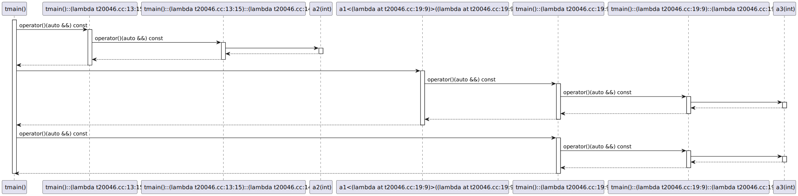

# t20046 - Test case for call expressions in nested lambdas
## Config
```yaml
add_compile_flags:
  - -fparse-all-comments
diagrams:
  t20046_sequence:
    type: sequence
    glob:
      - t20046.cc
    include:
      namespaces:
        - clanguml::t20046
    using_namespace: clanguml::t20046
    from:
      - function: "clanguml::t20046::tmain()"
```
## Source code
File `tests/t20046/t20046.cc`
```cpp
namespace clanguml {
namespace t20046 {

template <typename F> int a1(F &&f) { return f(42); }

int a2(int x) { return 2; }

int a3(int x) { return 3; }

int tmain()
{
    // Call expression in a nested lambda
    auto v1 = [](auto &&arg1) {
        return [](auto &&arg2) { return a2(arg2); }(arg1);
    }(0);

    // Call expression in a nested lambda in call expression
    auto v4 = a1(
        [](auto &&arg1) { return [](auto &&arg2) { return a3(arg2); }(arg1); });

    return 0;
}
}
}
```
## Generated PlantUML diagrams

## Generated Mermaid diagrams

## Generated JSON models
```json
{
  "diagram_type": "sequence",
  "name": "t20046_sequence",
  "participants": [
    {
      "display_name": "tmain()",
      "full_name": "clanguml::t20046::tmain()",
      "id": "1092597347191364515",
      "name": "tmain",
      "namespace": "clanguml::t20046",
      "source_location": {
        "column": 5,
        "file": "t20046.cc",
        "line": 10,
        "translation_unit": "t20046.cc"
      },
      "type": "function"
    },
    {
      "activities": [
        {
          "display_name": "operator()(auto &&) const",
          "full_name": "clanguml::t20046::tmain()::(lambda t20046.cc:13:15)::operator()(auto &&) const",
          "id": "174997669781821772",
          "name": "operator()",
          "namespace": "",
          "type": "method"
        }
      ],
      "display_name": "tmain()::(lambda t20046.cc:13:15)",
      "full_name": "clanguml::t20046::tmain()::(lambda t20046.cc:13:15)",
      "id": "1868201491114557068",
      "name": "tmain()::(lambda t20046.cc:13:15)",
      "namespace": "clanguml::t20046",
      "source_location": {
        "column": 15,
        "file": "t20046.cc",
        "line": 13,
        "translation_unit": "t20046.cc"
      },
      "type": "lambda"
    },
    {
      "activities": [
        {
          "display_name": "operator()(auto &&) const",
          "full_name": "clanguml::t20046::clanguml::t20046::tmain()::(lambda t20046.cc:13:15)::(lambda t20046.cc:14:16)::operator()(auto &&) const",
          "id": "771372907204554082",
          "name": "operator()",
          "namespace": "",
          "type": "method"
        }
      ],
      "display_name": "tmain()::(lambda t20046.cc:13:15)::(lambda t20046.cc:14:16)",
      "full_name": "clanguml::t20046::clanguml::t20046::tmain()::(lambda t20046.cc:13:15)::(lambda t20046.cc:14:16)",
      "id": "163480314503646451",
      "name": "clanguml::t20046::tmain()::(lambda t20046.cc:13:15)::(lambda t20046.cc:14:16)",
      "namespace": "clanguml::t20046",
      "source_location": {
        "column": 16,
        "file": "t20046.cc",
        "line": 14,
        "translation_unit": "t20046.cc"
      },
      "type": "lambda"
    },
    {
      "display_name": "a2(int)",
      "full_name": "clanguml::t20046::a2(int)",
      "id": "267222823829967475",
      "name": "a2",
      "namespace": "clanguml::t20046",
      "source_location": {
        "column": 5,
        "file": "t20046.cc",
        "line": 6,
        "translation_unit": "t20046.cc"
      },
      "type": "function"
    },
    {
      "display_name": "a1<(lambda at t20046.cc:19:9)>((lambda at t20046.cc:19:9) &&)",
      "full_name": "clanguml::t20046::a1<(lambda at t20046.cc:19:9)>((lambda at /home/bartek/devel/clang-uml/tests/t20046/t20046.cc:19:9) &&)",
      "id": "404852580994337987",
      "name": "a1",
      "namespace": "clanguml::t20046",
      "source_location": {
        "column": 27,
        "file": "t20046.cc",
        "line": 4,
        "translation_unit": "t20046.cc"
      },
      "type": "function_template"
    },
    {
      "activities": [
        {
          "display_name": "operator()(auto &&) const",
          "full_name": "clanguml::t20046::tmain()::(lambda t20046.cc:19:9)::operator()(auto &&) const",
          "id": "326496579896748789",
          "name": "operator()",
          "namespace": "",
          "type": "method"
        }
      ],
      "display_name": "tmain()::(lambda t20046.cc:19:9)",
      "full_name": "clanguml::t20046::tmain()::(lambda t20046.cc:19:9)",
      "id": "1833526997995356163",
      "name": "tmain()::(lambda t20046.cc:19:9)",
      "namespace": "clanguml::t20046",
      "source_location": {
        "column": 9,
        "file": "t20046.cc",
        "line": 19,
        "translation_unit": "t20046.cc"
      },
      "type": "lambda"
    },
    {
      "activities": [
        {
          "display_name": "operator()(auto &&) const",
          "full_name": "clanguml::t20046::clanguml::t20046::tmain()::(lambda t20046.cc:19:9)::(lambda t20046.cc:19:34)::operator()(auto &&) const",
          "id": "1093593470536515636",
          "name": "operator()",
          "namespace": "",
          "type": "method"
        }
      ],
      "display_name": "tmain()::(lambda t20046.cc:19:9)::(lambda t20046.cc:19:34)",
      "full_name": "clanguml::t20046::clanguml::t20046::tmain()::(lambda t20046.cc:19:9)::(lambda t20046.cc:19:34)",
      "id": "2177951153338850159",
      "name": "clanguml::t20046::tmain()::(lambda t20046.cc:19:9)::(lambda t20046.cc:19:34)",
      "namespace": "clanguml::t20046",
      "source_location": {
        "column": 34,
        "file": "t20046.cc",
        "line": 19,
        "translation_unit": "t20046.cc"
      },
      "type": "lambda"
    },
    {
      "display_name": "a3(int)",
      "full_name": "clanguml::t20046::a3(int)",
      "id": "1043774975066033521",
      "name": "a3",
      "namespace": "clanguml::t20046",
      "source_location": {
        "column": 5,
        "file": "t20046.cc",
        "line": 8,
        "translation_unit": "t20046.cc"
      },
      "type": "function"
    }
  ],
  "sequences": [
    {
      "messages": [
        {
          "comment": "Call expression in a nested lambda",
          "from": {
            "activity_id": "1092597347191364515",
            "participant_id": "1092597347191364515"
          },
          "name": "operator()(auto &&) const",
          "return_type": "auto",
          "scope": "normal",
          "source_location": {
            "column": 15,
            "file": "t20046.cc",
            "line": 13,
            "translation_unit": "t20046.cc"
          },
          "to": {
            "activity_id": "174997669781821772",
            "participant_id": "1868201491114557068"
          },
          "type": "message"
        },
        {
          "from": {
            "activity_id": "174997669781821772",
            "participant_id": "1868201491114557068"
          },
          "name": "operator()(auto &&) const",
          "return_type": "auto",
          "scope": "normal",
          "source_location": {
            "column": 16,
            "file": "t20046.cc",
            "line": 14,
            "translation_unit": "t20046.cc"
          },
          "to": {
            "activity_id": "771372907204554082",
            "participant_id": "163480314503646451"
          },
          "type": "message"
        },
        {
          "from": {
            "activity_id": "771372907204554082",
            "participant_id": "163480314503646451"
          },
          "name": "",
          "return_type": "int",
          "scope": "normal",
          "source_location": {
            "column": 41,
            "file": "t20046.cc",
            "line": 14,
            "translation_unit": "t20046.cc"
          },
          "to": {
            "activity_id": "267222823829967475",
            "participant_id": "267222823829967475"
          },
          "type": "message"
        },
        {
          "comment": "Call expression in a nested lambda in call expression",
          "from": {
            "activity_id": "1092597347191364515",
            "participant_id": "1092597347191364515"
          },
          "name": "",
          "return_type": "",
          "scope": "normal",
          "source_location": {
            "column": 15,
            "file": "t20046.cc",
            "line": 18,
            "translation_unit": "t20046.cc"
          },
          "to": {
            "activity_id": "404852580994337987",
            "participant_id": "404852580994337987"
          },
          "type": "message"
        },
        {
          "from": {
            "activity_id": "404852580994337987",
            "participant_id": "404852580994337987"
          },
          "name": "operator()(auto &&) const",
          "return_type": "auto",
          "scope": "normal",
          "source_location": {
            "column": 46,
            "file": "t20046.cc",
            "line": 4,
            "translation_unit": "t20046.cc"
          },
          "to": {
            "activity_id": "326496579896748789",
            "participant_id": "1833526997995356163"
          },
          "type": "message"
        },
        {
          "from": {
            "activity_id": "326496579896748789",
            "participant_id": "1833526997995356163"
          },
          "name": "operator()(auto &&) const",
          "return_type": "auto",
          "scope": "normal",
          "source_location": {
            "column": 34,
            "file": "t20046.cc",
            "line": 19,
            "translation_unit": "t20046.cc"
          },
          "to": {
            "activity_id": "1093593470536515636",
            "participant_id": "2177951153338850159"
          },
          "type": "message"
        },
        {
          "from": {
            "activity_id": "1093593470536515636",
            "participant_id": "2177951153338850159"
          },
          "name": "",
          "return_type": "int",
          "scope": "normal",
          "source_location": {
            "column": 59,
            "file": "t20046.cc",
            "line": 19,
            "translation_unit": "t20046.cc"
          },
          "to": {
            "activity_id": "1043774975066033521",
            "participant_id": "1043774975066033521"
          },
          "type": "message"
        }
      ],
      "start_from": {
        "id": 1092597347191364515,
        "location": "clanguml::t20046::tmain()"
      }
    }
  ],
  "using_namespace": "clanguml::t20046"
}
```
