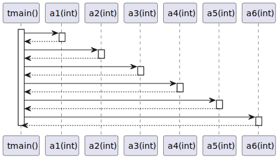
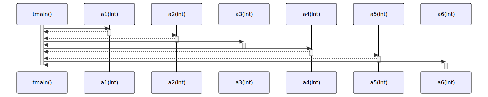

# t20047 - Test case for 'call' comment directive
## Config
```yaml
add_compile_flags:
  - -fparse-all-comments
diagrams:
  t20047_sequence:
    type: sequence
    glob:
      - t20047.cc
    include:
      namespaces:
        - clanguml::t20047
    using_namespace: clanguml::t20047
    from:
      - function: "clanguml::t20047::tmain()"
```
## Source code
File `tests/t20047/t20047.cc`
```cpp
#include <future>

namespace clanguml {
namespace t20047 {

int a1(int x) { return x + 1; }

int a2(int x) { return x + 2; }

int a3(int x) { return x + 3; }

int a4(int x) { return x + 4; }

int a5(int x) { return x + 5; }

int a6(int x) { return x + 6; }

int run(int (*f)(int), int arg) { return f(arg); }

int tmain()
{
    auto res =
        // \uml{call clanguml::t20047::a1(int)}
        run(a1, 0);

    res = a3(
        // \uml{call clanguml::t20047::a2(int)}
        run(a2, 0));

    // \uml{call clanguml::t20047::a4(int)}
    res = [](auto &&x) { return a4(x); }(0);

    // \uml{call clanguml::t20047::a5(int)}
    res = std::async(a5, 10).get();

    // \uml{call clanguml::t20047::a6(int)}
    res = [](auto &&x) { return std::async(run, a6, x).get(); }(1);

    return res;
}
}
}
```
## Generated PlantUML diagrams

## Generated Mermaid diagrams

## Generated JSON models
```json
{
  "diagram_type": "sequence",
  "name": "t20047_sequence",
  "participants": [
    {
      "display_name": "tmain()",
      "full_name": "clanguml::t20047::tmain()",
      "id": "395335809944376006",
      "name": "tmain",
      "namespace": "clanguml::t20047",
      "source_location": {
        "column": 5,
        "file": "t20047.cc",
        "line": 20,
        "translation_unit": "t20047.cc"
      },
      "type": "function"
    },
    {
      "display_name": "a1(int)",
      "full_name": "clanguml::t20047::a1(int)",
      "id": "1143426315383292679",
      "name": "a1",
      "namespace": "clanguml::t20047",
      "source_location": {
        "column": 5,
        "file": "t20047.cc",
        "line": 6,
        "translation_unit": "t20047.cc"
      },
      "type": "function"
    },
    {
      "display_name": "a2(int)",
      "full_name": "clanguml::t20047::a2(int)",
      "id": "642420844675776100",
      "name": "a2",
      "namespace": "clanguml::t20047",
      "source_location": {
        "column": 5,
        "file": "t20047.cc",
        "line": 8,
        "translation_unit": "t20047.cc"
      },
      "type": "function"
    },
    {
      "display_name": "a3(int)",
      "full_name": "clanguml::t20047::a3(int)",
      "id": "270462331062298387",
      "name": "a3",
      "namespace": "clanguml::t20047",
      "source_location": {
        "column": 5,
        "file": "t20047.cc",
        "line": 10,
        "translation_unit": "t20047.cc"
      },
      "type": "function"
    },
    {
      "display_name": "a4(int)",
      "full_name": "clanguml::t20047::a4(int)",
      "id": "128784832900379603",
      "name": "a4",
      "namespace": "clanguml::t20047",
      "source_location": {
        "column": 5,
        "file": "t20047.cc",
        "line": 12,
        "translation_unit": "t20047.cc"
      },
      "type": "function"
    },
    {
      "display_name": "a5(int)",
      "full_name": "clanguml::t20047::a5(int)",
      "id": "2182660880755444870",
      "name": "a5",
      "namespace": "clanguml::t20047",
      "source_location": {
        "column": 5,
        "file": "t20047.cc",
        "line": 14,
        "translation_unit": "t20047.cc"
      },
      "type": "function"
    },
    {
      "display_name": "a6(int)",
      "full_name": "clanguml::t20047::a6(int)",
      "id": "1272350614275781124",
      "name": "a6",
      "namespace": "clanguml::t20047",
      "source_location": {
        "column": 5,
        "file": "t20047.cc",
        "line": 16,
        "translation_unit": "t20047.cc"
      },
      "type": "function"
    }
  ],
  "sequences": [
    {
      "messages": [
        {
          "from": {
            "activity_id": "395335809944376006",
            "participant_id": "395335809944376006"
          },
          "name": "",
          "return_type": "int",
          "scope": "normal",
          "source_location": {
            "column": 9,
            "file": "t20047.cc",
            "line": 24,
            "translation_unit": "t20047.cc"
          },
          "to": {
            "activity_id": "1143426315383292679",
            "participant_id": "1143426315383292679"
          },
          "type": "message"
        },
        {
          "from": {
            "activity_id": "395335809944376006",
            "participant_id": "395335809944376006"
          },
          "name": "",
          "return_type": "int",
          "scope": "normal",
          "source_location": {
            "column": 9,
            "file": "t20047.cc",
            "line": 28,
            "translation_unit": "t20047.cc"
          },
          "to": {
            "activity_id": "642420844675776100",
            "participant_id": "642420844675776100"
          },
          "type": "message"
        },
        {
          "from": {
            "activity_id": "395335809944376006",
            "participant_id": "395335809944376006"
          },
          "name": "",
          "return_type": "int",
          "scope": "normal",
          "source_location": {
            "column": 11,
            "file": "t20047.cc",
            "line": 26,
            "translation_unit": "t20047.cc"
          },
          "to": {
            "activity_id": "270462331062298387",
            "participant_id": "270462331062298387"
          },
          "type": "message"
        },
        {
          "from": {
            "activity_id": "395335809944376006",
            "participant_id": "395335809944376006"
          },
          "name": "",
          "return_type": "int",
          "scope": "normal",
          "source_location": {
            "column": 11,
            "file": "t20047.cc",
            "line": 31,
            "translation_unit": "t20047.cc"
          },
          "to": {
            "activity_id": "128784832900379603",
            "participant_id": "128784832900379603"
          },
          "type": "message"
        },
        {
          "from": {
            "activity_id": "395335809944376006",
            "participant_id": "395335809944376006"
          },
          "name": "",
          "return_type": "int",
          "scope": "normal",
          "source_location": {
            "column": 11,
            "file": "t20047.cc",
            "line": 34,
            "translation_unit": "t20047.cc"
          },
          "to": {
            "activity_id": "2182660880755444870",
            "participant_id": "2182660880755444870"
          },
          "type": "message"
        },
        {
          "from": {
            "activity_id": "395335809944376006",
            "participant_id": "395335809944376006"
          },
          "name": "",
          "return_type": "int",
          "scope": "normal",
          "source_location": {
            "column": 11,
            "file": "t20047.cc",
            "line": 37,
            "translation_unit": "t20047.cc"
          },
          "to": {
            "activity_id": "1272350614275781124",
            "participant_id": "1272350614275781124"
          },
          "type": "message"
        }
      ],
      "start_from": {
        "id": 395335809944376006,
        "location": "clanguml::t20047::tmain()"
      }
    }
  ],
  "using_namespace": "clanguml::t20047"
}
```
