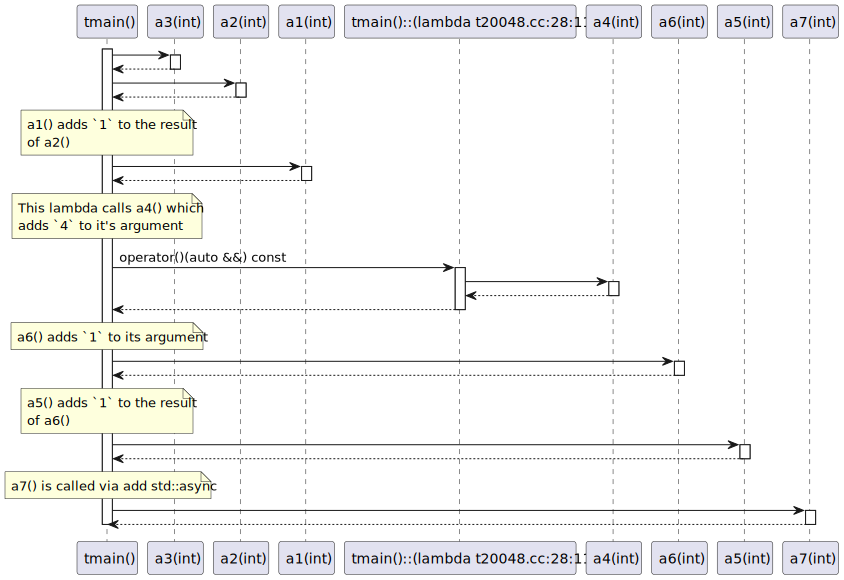
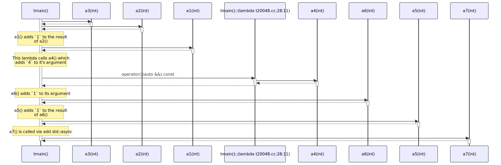

# t20048 - Test case for message comments
## Config
```yaml
add_compile_flags:
  - -fparse-all-comments
diagrams:
  t20048_sequence:
    type: sequence
    glob:
      - t20048.cc
    generate_message_comments: true
    include:
      namespaces:
        - clanguml::t20048
    using_namespace: clanguml::t20048
    from:
      - function: "clanguml::t20048::tmain()"
```
## Source code
File `tests/t20048/t20048.cc`
```cpp
#include <future>

namespace clanguml {
namespace t20048 {

int a1(int x) { return x + 1; }

int a2(int x) { return x + 2; }

int a3(int x) { return x + 3; }

int a4(int x) { return x + 4; }

int a5(int x) { return x + 5; }

int a6(int x) { return x + 6; }

int a7(int x) { return x + 7; }

int tmain()
{
    // a1() adds `1` to the result of a2()
    auto res = a1(a2(a3(0)));

    // This lambda calls a4() which adds `4` to it's argument
    res = [](auto &&x) { return a4(x); }(0);

    // a5() adds `1` to the result of a6()
    res = a5(
        // a6() adds `1` to its argument
        a6(0));

    // a7() is called via add std::async
    // \uml{call clanguml::t20048::a7(int)}
    res = std::async(a7, 10).get();

    return 0;
}
}
}
```
## Generated PlantUML diagrams

## Generated Mermaid diagrams

## Generated JSON models
```json
{
  "diagram_type": "sequence",
  "name": "t20048_sequence",
  "participants": [
    {
      "display_name": "tmain()",
      "full_name": "clanguml::t20048::tmain()",
      "id": "1438172520221545830",
      "name": "tmain",
      "namespace": "clanguml::t20048",
      "source_location": {
        "column": 5,
        "file": "t20048.cc",
        "line": 20,
        "translation_unit": "t20048.cc"
      },
      "type": "function"
    },
    {
      "display_name": "a3(int)",
      "full_name": "clanguml::t20048::a3(int)",
      "id": "1592723040639512239",
      "name": "a3",
      "namespace": "clanguml::t20048",
      "source_location": {
        "column": 5,
        "file": "t20048.cc",
        "line": 10,
        "translation_unit": "t20048.cc"
      },
      "type": "function"
    },
    {
      "display_name": "a2(int)",
      "full_name": "clanguml::t20048::a2(int)",
      "id": "1494883525267049301",
      "name": "a2",
      "namespace": "clanguml::t20048",
      "source_location": {
        "column": 5,
        "file": "t20048.cc",
        "line": 8,
        "translation_unit": "t20048.cc"
      },
      "type": "function"
    },
    {
      "display_name": "a1(int)",
      "full_name": "clanguml::t20048::a1(int)",
      "id": "1139681416936587734",
      "name": "a1",
      "namespace": "clanguml::t20048",
      "source_location": {
        "column": 5,
        "file": "t20048.cc",
        "line": 6,
        "translation_unit": "t20048.cc"
      },
      "type": "function"
    },
    {
      "activities": [
        {
          "display_name": "operator()(auto &&) const",
          "full_name": "clanguml::t20048::tmain()::(lambda t20048.cc:26:11)::operator()(auto &&) const",
          "id": "1272214062049882942",
          "name": "operator()",
          "namespace": "",
          "type": "method"
        }
      ],
      "display_name": "tmain()::(lambda t20048.cc:26:11)",
      "full_name": "clanguml::t20048::tmain()::(lambda t20048.cc:26:11)",
      "id": "794500632550538124",
      "name": "tmain()::(lambda t20048.cc:26:11)",
      "namespace": "clanguml::t20048",
      "source_location": {
        "column": 11,
        "file": "t20048.cc",
        "line": 26,
        "translation_unit": "t20048.cc"
      },
      "type": "lambda"
    },
    {
      "display_name": "a4(int)",
      "full_name": "clanguml::t20048::a4(int)",
      "id": "986710377344543262",
      "name": "a4",
      "namespace": "clanguml::t20048",
      "source_location": {
        "column": 5,
        "file": "t20048.cc",
        "line": 12,
        "translation_unit": "t20048.cc"
      },
      "type": "function"
    },
    {
      "display_name": "a6(int)",
      "full_name": "clanguml::t20048::a6(int)",
      "id": "372194568810958399",
      "name": "a6",
      "namespace": "clanguml::t20048",
      "source_location": {
        "column": 5,
        "file": "t20048.cc",
        "line": 16,
        "translation_unit": "t20048.cc"
      },
      "type": "function"
    },
    {
      "display_name": "a5(int)",
      "full_name": "clanguml::t20048::a5(int)",
      "id": "473170110460301705",
      "name": "a5",
      "namespace": "clanguml::t20048",
      "source_location": {
        "column": 5,
        "file": "t20048.cc",
        "line": 14,
        "translation_unit": "t20048.cc"
      },
      "type": "function"
    },
    {
      "display_name": "a7(int)",
      "full_name": "clanguml::t20048::a7(int)",
      "id": "156504678810211848",
      "name": "a7",
      "namespace": "clanguml::t20048",
      "source_location": {
        "column": 5,
        "file": "t20048.cc",
        "line": 18,
        "translation_unit": "t20048.cc"
      },
      "type": "function"
    }
  ],
  "sequences": [
    {
      "messages": [
        {
          "from": {
            "activity_id": "1438172520221545830",
            "participant_id": "1438172520221545830"
          },
          "name": "",
          "return_type": "int",
          "scope": "normal",
          "source_location": {
            "column": 22,
            "file": "t20048.cc",
            "line": 23,
            "translation_unit": "t20048.cc"
          },
          "to": {
            "activity_id": "1592723040639512239",
            "participant_id": "1592723040639512239"
          },
          "type": "message"
        },
        {
          "from": {
            "activity_id": "1438172520221545830",
            "participant_id": "1438172520221545830"
          },
          "name": "",
          "return_type": "int",
          "scope": "normal",
          "source_location": {
            "column": 19,
            "file": "t20048.cc",
            "line": 23,
            "translation_unit": "t20048.cc"
          },
          "to": {
            "activity_id": "1494883525267049301",
            "participant_id": "1494883525267049301"
          },
          "type": "message"
        },
        {
          "comment": "a1() adds `1` to the result of a2()",
          "from": {
            "activity_id": "1438172520221545830",
            "participant_id": "1438172520221545830"
          },
          "name": "",
          "return_type": "int",
          "scope": "normal",
          "source_location": {
            "column": 16,
            "file": "t20048.cc",
            "line": 23,
            "translation_unit": "t20048.cc"
          },
          "to": {
            "activity_id": "1139681416936587734",
            "participant_id": "1139681416936587734"
          },
          "type": "message"
        },
        {
          "comment": "This lambda calls a4() which adds `4` to it's argument",
          "from": {
            "activity_id": "1438172520221545830",
            "participant_id": "1438172520221545830"
          },
          "name": "operator()(auto &&) const",
          "return_type": "auto",
          "scope": "normal",
          "source_location": {
            "column": 11,
            "file": "t20048.cc",
            "line": 26,
            "translation_unit": "t20048.cc"
          },
          "to": {
            "activity_id": "1272214062049882942",
            "participant_id": "794500632550538124"
          },
          "type": "message"
        },
        {
          "from": {
            "activity_id": "1272214062049882942",
            "participant_id": "794500632550538124"
          },
          "name": "",
          "return_type": "int",
          "scope": "normal",
          "source_location": {
            "column": 33,
            "file": "t20048.cc",
            "line": 26,
            "translation_unit": "t20048.cc"
          },
          "to": {
            "activity_id": "986710377344543262",
            "participant_id": "986710377344543262"
          },
          "type": "message"
        },
        {
          "comment": "a6() adds `1` to its argument",
          "from": {
            "activity_id": "1438172520221545830",
            "participant_id": "1438172520221545830"
          },
          "name": "",
          "return_type": "int",
          "scope": "normal",
          "source_location": {
            "column": 9,
            "file": "t20048.cc",
            "line": 31,
            "translation_unit": "t20048.cc"
          },
          "to": {
            "activity_id": "372194568810958399",
            "participant_id": "372194568810958399"
          },
          "type": "message"
        },
        {
          "comment": "a5() adds `1` to the result of a6()",
          "from": {
            "activity_id": "1438172520221545830",
            "participant_id": "1438172520221545830"
          },
          "name": "",
          "return_type": "int",
          "scope": "normal",
          "source_location": {
            "column": 11,
            "file": "t20048.cc",
            "line": 29,
            "translation_unit": "t20048.cc"
          },
          "to": {
            "activity_id": "473170110460301705",
            "participant_id": "473170110460301705"
          },
          "type": "message"
        },
        {
          "comment": "a7() is called via add std::async",
          "from": {
            "activity_id": "1438172520221545830",
            "participant_id": "1438172520221545830"
          },
          "name": "",
          "return_type": "int",
          "scope": "normal",
          "source_location": {
            "column": 11,
            "file": "t20048.cc",
            "line": 35,
            "translation_unit": "t20048.cc"
          },
          "to": {
            "activity_id": "156504678810211848",
            "participant_id": "156504678810211848"
          },
          "type": "message"
        }
      ],
      "start_from": {
        "id": 1438172520221545830,
        "location": "clanguml::t20048::tmain()"
      }
    }
  ],
  "using_namespace": "clanguml::t20048"
}
```
