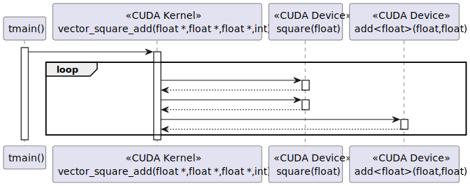
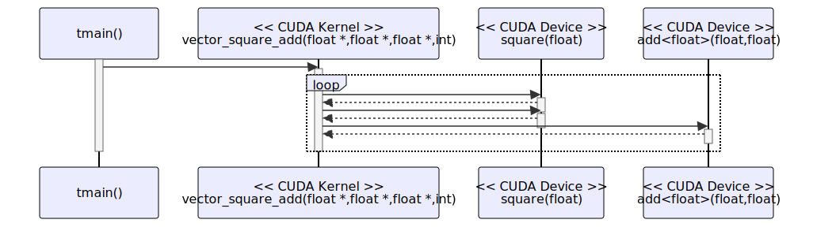

# t20049 - Test case for CUDA kernel calls
## Config
```yaml
diagrams:
  t20049_sequence:
    type: sequence
    glob:
      - t20049.cu
    include:
      namespaces:
        - clanguml::t20049
    using_namespace: clanguml::t20049
    from:
      - function: "clanguml::t20049::tmain()"

```
## Source code
File `tests/t20049/t20049.cuh`
```cpp
namespace clanguml {
namespace t20049 {

template <typename T> __device__ T add(T a, T b) { return a + b; }

__device__ float square(float a);

__global__ void vector_square_add(float *out, float *a, float *b, int n);

}
}
```
File `tests/t20049/t20049.cu`
```cpp
#include "t20049.cuh"

namespace clanguml {
namespace t20049 {

constexpr unsigned long N{1000};

__device__ float square(float a) { return a * a; }

__global__ void vector_square_add(float *out, float *a, float *b, int n)
{
    for (int i = 0; i < n; i++) {
        out[i] = add(square(a[i]), square(b[i]));
    }
}

int tmain()
{
    float *a, *b, *out;

    a = (float *)malloc(sizeof(float) * N);
    b = (float *)malloc(sizeof(float) * N);
    out = (float *)malloc(sizeof(float) * N);

    for (int i = 0; i < N; i++) {
        a[i] = 1.0f;
        b[i] = 2.0f;
    }

    vector_square_add<<<1, 1>>>(out, a, b, N);

    return 0;
}

}
}
```
## Generated PlantUML diagrams

## Generated Mermaid diagrams

## Generated JSON models
```json
{
  "diagram_type": "sequence",
  "name": "t20049_sequence",
  "participants": [
    {
      "display_name": "tmain()",
      "full_name": "clanguml::t20049::tmain()",
      "id": "1498198764898287853",
      "name": "tmain",
      "namespace": "clanguml::t20049",
      "source_location": {
        "column": 5,
        "file": "t20049.cu",
        "line": 17,
        "translation_unit": "t20049.cu"
      },
      "type": "function"
    },
    {
      "display_name": "vector_square_add(float *,float *,float *,int)",
      "full_name": "clanguml::t20049::vector_square_add(float *,float *,float *,int)",
      "id": "1998596618150288680",
      "is_cuda_kernel": true,
      "name": "vector_square_add",
      "namespace": "clanguml::t20049",
      "source_location": {
        "column": 17,
        "file": "t20049.cu",
        "line": 10,
        "translation_unit": "t20049.cu"
      },
      "type": "function"
    },
    {
      "display_name": "square(float)",
      "full_name": "clanguml::t20049::square(float)",
      "id": "817124001270348685",
      "is_cuda_device": true,
      "name": "square",
      "namespace": "clanguml::t20049",
      "source_location": {
        "column": 18,
        "file": "t20049.cu",
        "line": 8,
        "translation_unit": "t20049.cu"
      },
      "type": "function"
    },
    {
      "display_name": "add<float>(float,float)",
      "full_name": "clanguml::t20049::add<float>(float,float)",
      "id": "1897367040611447556",
      "is_cuda_device": true,
      "name": "add",
      "namespace": "clanguml::t20049",
      "source_location": {
        "column": 36,
        "file": "t20049.cuh",
        "line": 4,
        "translation_unit": "t20049.cu"
      },
      "type": "function_template"
    }
  ],
  "sequences": [
    {
      "messages": [
        {
          "from": {
            "activity_id": "1498198764898287853",
            "participant_id": "1498198764898287853"
          },
          "name": "",
          "return_type": "void",
          "scope": "normal",
          "source_location": {
            "column": 5,
            "file": "t20049.cu",
            "line": 30,
            "translation_unit": "t20049.cu"
          },
          "to": {
            "activity_id": "1998596618150288680",
            "participant_id": "1998596618150288680"
          },
          "type": "message"
        },
        {
          "activity_id": "1998596618150288680",
          "messages": [
            {
              "from": {
                "activity_id": "1998596618150288680",
                "participant_id": "1998596618150288680"
              },
              "name": "",
              "return_type": "float",
              "scope": "normal",
              "source_location": {
                "column": 22,
                "file": "t20049.cu",
                "line": 13,
                "translation_unit": "t20049.cu"
              },
              "to": {
                "activity_id": "817124001270348685",
                "participant_id": "817124001270348685"
              },
              "type": "message"
            },
            {
              "from": {
                "activity_id": "1998596618150288680",
                "participant_id": "1998596618150288680"
              },
              "name": "",
              "return_type": "float",
              "scope": "normal",
              "source_location": {
                "column": 36,
                "file": "t20049.cu",
                "line": 13,
                "translation_unit": "t20049.cu"
              },
              "to": {
                "activity_id": "817124001270348685",
                "participant_id": "817124001270348685"
              },
              "type": "message"
            },
            {
              "from": {
                "activity_id": "1998596618150288680",
                "participant_id": "1998596618150288680"
              },
              "name": "",
              "return_type": "",
              "scope": "normal",
              "source_location": {
                "column": 18,
                "file": "t20049.cu",
                "line": 13,
                "translation_unit": "t20049.cu"
              },
              "to": {
                "activity_id": "1897367040611447556",
                "participant_id": "1897367040611447556"
              },
              "type": "message"
            }
          ],
          "name": "for",
          "type": "loop"
        }
      ],
      "start_from": {
        "id": 1498198764898287853,
        "location": "clanguml::t20049::tmain()"
      }
    }
  ],
  "using_namespace": "clanguml::t20049"
}
```
