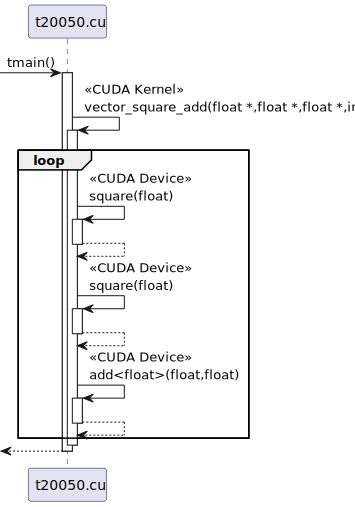

# t20050 - Test case for CUDA kernel calls with participants combined to file
## Config
```yaml
diagrams:
  t20050_sequence:
    type: sequence
    glob:
      - t20050.cu
    include:
      namespaces:
        - clanguml::t20050
    using_namespace: clanguml::t20050
    combine_free_functions_into_file_participants: true
    from:
      - function: "clanguml::t20050::tmain()"
```
## Source code
File `tests/t20050/t20050.cuh`
```cpp
namespace clanguml {
namespace t20050 {

__device__ float square(float a);

__global__ void vector_square_add(float *out, float *a, float *b, int n);

}
}
```
File `tests/t20050/t20050.cu`
```cpp
#include "t20050.cuh"

namespace clanguml {
namespace t20050 {

constexpr unsigned long N{1000};

template <typename T> __device__ T add(T a, T b) { return a + b; }

__device__ float square(float a) { return a * a; }

__global__ void vector_square_add(float *out, float *a, float *b, int n)
{
    for (int i = 0; i < n; i++) {
        out[i] = add(square(a[i]), square(b[i]));
    }
}

int tmain()
{
    float *a, *b, *out;

    a = (float *)malloc(sizeof(float) * N);
    b = (float *)malloc(sizeof(float) * N);
    out = (float *)malloc(sizeof(float) * N);

    for (int i = 0; i < N; i++) {
        a[i] = 1.0f;
        b[i] = 2.0f;
    }

    vector_square_add<<<1, 1>>>(out, a, b, N);

    return 0;
}

}
}
```
## Generated PlantUML diagrams

## Generated Mermaid diagrams

## Generated JSON models
```json
{
  "diagram_type": "sequence",
  "name": "t20050_sequence",
  "participants": [
    {
      "activities": [
        {
          "display_name": "tmain()",
          "full_name": "clanguml::t20050::tmain()",
          "id": "8382678280304095716",
          "name": "tmain",
          "namespace": "clanguml::t20050",
          "source_location": {
            "column": 5,
            "file": "t20050.cu",
            "line": 19,
            "translation_unit": "t20050.cu"
          },
          "type": "function"
        },
        {
          "display_name": "vector_square_add(float *,float *,float *,int)",
          "full_name": "clanguml::t20050::vector_square_add(float *,float *,float *,int)",
          "id": "804362129286968876",
          "is_cuda_kernel": true,
          "name": "vector_square_add",
          "namespace": "clanguml::t20050",
          "source_location": {
            "column": 17,
            "file": "t20050.cu",
            "line": 12,
            "translation_unit": "t20050.cu"
          },
          "type": "function"
        },
        {
          "display_name": "square(float)",
          "full_name": "clanguml::t20050::square(float)",
          "id": "1546104389729982271",
          "is_cuda_device": true,
          "name": "square",
          "namespace": "clanguml::t20050",
          "source_location": {
            "column": 18,
            "file": "t20050.cu",
            "line": 10,
            "translation_unit": "t20050.cu"
          },
          "type": "function"
        },
        {
          "display_name": "add<float>(float,float)",
          "full_name": "clanguml::t20050::add<float>(float,float)",
          "id": "482759276104854199",
          "is_cuda_device": true,
          "name": "add",
          "namespace": "clanguml::t20050",
          "source_location": {
            "column": 36,
            "file": "t20050.cu",
            "line": 8,
            "translation_unit": "t20050.cu"
          },
          "type": "function_template"
        }
      ],
      "display_name": "t20050.cu",
      "full_name": "clanguml::t20050::tmain()",
      "id": "4411786721090846451",
      "name": "t20050.cu",
      "namespace": "clanguml::t20050",
      "type": "file"
    }
  ],
  "sequences": [
    {
      "messages": [
        {
          "from": {
            "activity_id": "8382678280304095716",
            "participant_id": "4411786721090846451"
          },
          "name": "vector_square_add(float *,float *,float *,int)",
          "return_type": "void",
          "scope": "normal",
          "source_location": {
            "column": 5,
            "file": "t20050.cu",
            "line": 32,
            "translation_unit": "t20050.cu"
          },
          "to": {
            "activity_id": "804362129286968876",
            "participant_id": "4411786721090846451"
          },
          "type": "message"
        },
        {
          "activity_id": "804362129286968876",
          "messages": [
            {
              "from": {
                "activity_id": "804362129286968876",
                "participant_id": "4411786721090846451"
              },
              "name": "square(float)",
              "return_type": "float",
              "scope": "normal",
              "source_location": {
                "column": 22,
                "file": "t20050.cu",
                "line": 15,
                "translation_unit": "t20050.cu"
              },
              "to": {
                "activity_id": "1546104389729982271",
                "participant_id": "4411786721090846451"
              },
              "type": "message"
            },
            {
              "from": {
                "activity_id": "804362129286968876",
                "participant_id": "4411786721090846451"
              },
              "name": "square(float)",
              "return_type": "float",
              "scope": "normal",
              "source_location": {
                "column": 36,
                "file": "t20050.cu",
                "line": 15,
                "translation_unit": "t20050.cu"
              },
              "to": {
                "activity_id": "1546104389729982271",
                "participant_id": "4411786721090846451"
              },
              "type": "message"
            },
            {
              "from": {
                "activity_id": "804362129286968876",
                "participant_id": "4411786721090846451"
              },
              "name": "add<float>(float,float)",
              "return_type": "",
              "scope": "normal",
              "source_location": {
                "column": 18,
                "file": "t20050.cu",
                "line": 15,
                "translation_unit": "t20050.cu"
              },
              "to": {
                "activity_id": "482759276104854199",
                "participant_id": "4411786721090846451"
              },
              "type": "message"
            }
          ],
          "name": "for",
          "type": "loop"
        }
      ],
      "return_type": "int",
      "start_from": {
        "id": "8382678280304095716",
        "location": "clanguml::t20050::tmain()"
      }
    }
  ],
  "using_namespace": "clanguml::t20050"
}
```
