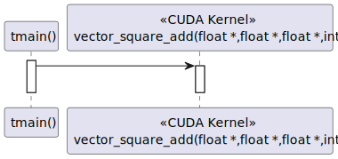
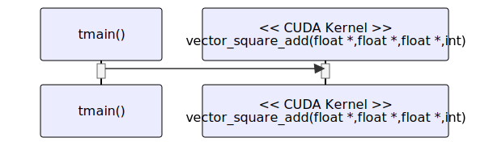

# t20051 - Test case for CUDA calls callee_type filter
## Config
```yaml
diagrams:
  t20051_sequence:
    type: sequence
    glob:
      - t20051.cu
    include:
      namespaces:
        - clanguml::t20051
    exclude:
      callee_types:
        - cuda_device
    using_namespace: clanguml::t20051
    from:
      - function: "clanguml::t20051::tmain()"
```
## Source code
File `tests/t20051/t20051.cu`
```cpp
#include "t20051.cuh"

namespace clanguml {
namespace t20051 {

constexpr unsigned long N{1000};

template <typename T> __device__ T add(T a, T b) { return a + b; }

__device__ float square(float a) { return a * a; }

__global__ void vector_square_add(float *out, float *a, float *b, int n)
{
    for (int i = 0; i < n; i++) {
        out[i] = add(square(a[i]), square(b[i]));
    }
}

int tmain()
{
    float *a, *b, *out;

    a = (float *)malloc(sizeof(float) * N);
    b = (float *)malloc(sizeof(float) * N);
    out = (float *)malloc(sizeof(float) * N);

    for (int i = 0; i < N; i++) {
        a[i] = 1.0f;
        b[i] = 2.0f;
    }

    vector_square_add<<<1, 1>>>(out, a, b, N);

    return 0;
}

}
}
```
File `tests/t20051/t20051.cuh`
```cpp
namespace clanguml {
namespace t20051 {

__device__ float square(float a);

__global__ void vector_square_add(float *out, float *a, float *b, int n);

}
}
```
## Generated PlantUML diagrams

## Generated Mermaid diagrams

## Generated JSON models
```json
{
  "diagram_type": "sequence",
  "name": "t20051_sequence",
  "participants": [
    {
      "display_name": "tmain()",
      "full_name": "clanguml::t20051::tmain()",
      "id": "33004218577871304",
      "name": "tmain",
      "namespace": "clanguml::t20051",
      "source_location": {
        "column": 5,
        "file": "t20051.cu",
        "line": 19,
        "translation_unit": "t20051.cu"
      },
      "type": "function"
    },
    {
      "display_name": "vector_square_add(float *,float *,float *,int)",
      "full_name": "clanguml::t20051::vector_square_add(float *,float *,float *,int)",
      "id": "1972238512532321229",
      "is_cuda_kernel": true,
      "name": "vector_square_add",
      "namespace": "clanguml::t20051",
      "source_location": {
        "column": 17,
        "file": "t20051.cu",
        "line": 12,
        "translation_unit": "t20051.cu"
      },
      "type": "function"
    }
  ],
  "sequences": [
    {
      "messages": [
        {
          "from": {
            "activity_id": "33004218577871304",
            "participant_id": "33004218577871304"
          },
          "name": "",
          "return_type": "void",
          "scope": "normal",
          "source_location": {
            "column": 5,
            "file": "t20051.cu",
            "line": 32,
            "translation_unit": "t20051.cu"
          },
          "to": {
            "activity_id": "1972238512532321229",
            "participant_id": "1972238512532321229"
          },
          "type": "message"
        }
      ],
      "start_from": {
        "id": 33004218577871304,
        "location": "clanguml::t20051::tmain()"
      }
    }
  ],
  "using_namespace": "clanguml::t20051"
}
```
