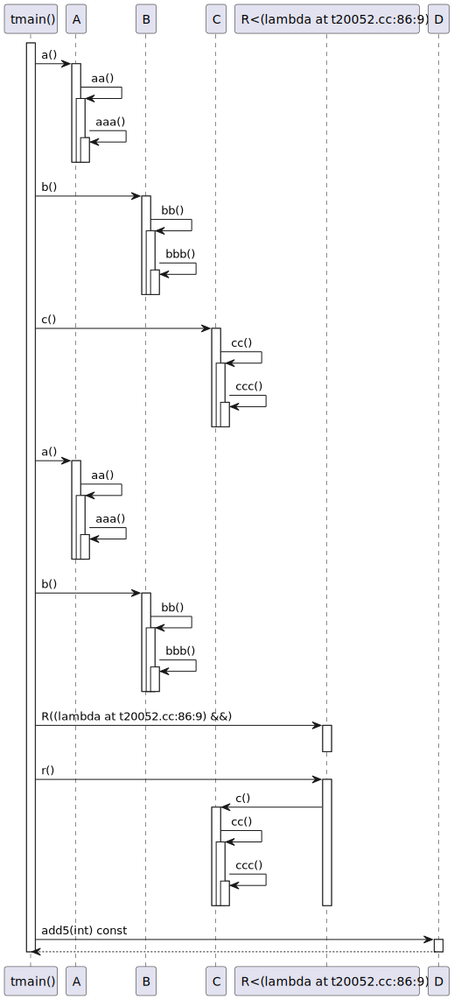
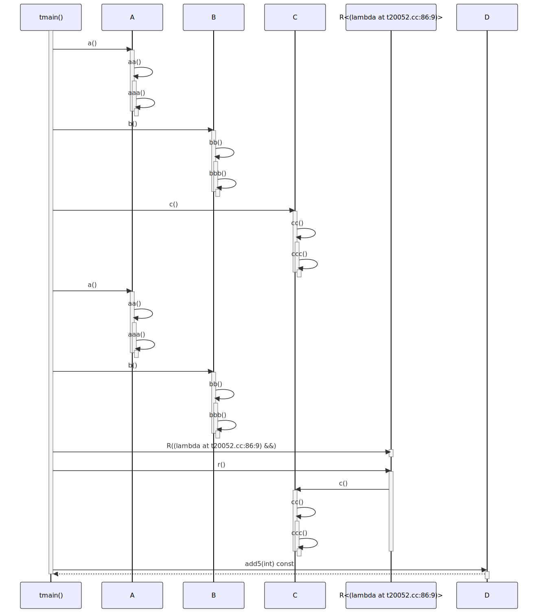

# t20052 - Test case for inlining lambda operator calls
## Config
```yaml
diagrams:
  t20052_sequence:
    type: sequence
    glob:
      - t20052.cc
    include:
      namespaces:
        - clanguml::t20052
    using_namespace: clanguml::t20052
    inline_lambda_messages: true
    from:
      - function: "clanguml::t20052::tmain()"
```
## Source code
File `tests/t20052/t20052.cc`
```cpp
#include <algorithm>
#include <functional>
#include <memory>
#include <optional>
#include <utility>
#include <vector>

namespace clanguml {
namespace t20052 {
struct A {
    void a() { aa(); }

    void aa() { aaa(); }

    void aaa() { }
};

struct B {
    void b() { bb(); }

    void bb() { bbb(); }

    void bbb() { }

    void eb() { }
};

struct C {
    void c() { cc(); }

    void cc() { ccc(); }

    void ccc() { }
};

struct D {
    int add5(int arg) const { return arg + 5; }
};

class E {
    std::optional<std::shared_ptr<B>> maybe_b;
    std::shared_ptr<A> a;

public:
    template <typename F> void setup(F &&f) { f(maybe_b); }
};

template <typename F> struct R {
    R(F &&f)
        : f_{std::move(f)}
    {
    }

    void r() { f_(); }

    F f_;
};

void tmain()
{
    A a;
    B b;
    C c;

    // The activity shouldn't be marked at the lambda definition, but
    // wherever it is actually called...
    auto alambda = [&a, &b]() {
        a.a();
        b.b();
    };

    // ...like here
    alambda();

    // There should be no call to B in the sequence diagram as the blambda
    // is never called
    [[maybe_unused]] auto blambda = [&b]() { b.b(); };

    // Nested lambdas should also work
    auto clambda = [alambda, &c]() {
        c.c();
        alambda();
    };
    clambda();

    R r{[&c]() { c.c(); }};

    r.r();

    D d;

    std::vector<int> ints{0, 1, 2, 3, 4};
    std::transform(ints.begin(), ints.end(), ints.begin(),
        [&d](auto i) { return d.add5(i); });

    // TODO: Fix naming function call arguments which are lambdas
    //    E e;
    //
    //    e.setup([](auto &&arg) mutable {
    //        // We cannot know here what 'arg' might be
    //        arg.value()->eb();
    //    });
}
}
}
```
## Generated PlantUML diagrams

## Generated Mermaid diagrams

## Generated JSON models
```json
{
  "diagram_type": "sequence",
  "name": "t20052_sequence",
  "participants": [
    {
      "display_name": "tmain()",
      "full_name": "clanguml::t20052::tmain()",
      "id": "1863374927109937538",
      "name": "tmain",
      "namespace": "clanguml::t20052",
      "source_location": {
        "column": 6,
        "file": "t20052.cc",
        "line": 59,
        "translation_unit": "t20052.cc"
      },
      "type": "function"
    },
    {
      "activities": [
        {
          "display_name": "a()",
          "full_name": "clanguml::t20052::A::a()",
          "id": "1226536010860143477",
          "name": "a",
          "namespace": "",
          "source_location": {
            "column": 10,
            "file": "t20052.cc",
            "line": 11,
            "translation_unit": "t20052.cc"
          },
          "type": "method"
        },
        {
          "display_name": "aa()",
          "full_name": "clanguml::t20052::A::aa()",
          "id": "152397826074008213",
          "name": "aa",
          "namespace": "",
          "source_location": {
            "column": 10,
            "file": "t20052.cc",
            "line": 13,
            "translation_unit": "t20052.cc"
          },
          "type": "method"
        },
        {
          "display_name": "aaa()",
          "full_name": "clanguml::t20052::A::aaa()",
          "id": "1337804153305761200",
          "name": "aaa",
          "namespace": "",
          "source_location": {
            "column": 10,
            "file": "t20052.cc",
            "line": 15,
            "translation_unit": "t20052.cc"
          },
          "type": "method"
        }
      ],
      "display_name": "A",
      "full_name": "clanguml::t20052::A",
      "id": "1703104288786661165",
      "name": "A",
      "namespace": "clanguml::t20052",
      "source_location": {
        "column": 8,
        "file": "t20052.cc",
        "line": 10,
        "translation_unit": "t20052.cc"
      },
      "type": "class"
    },
    {
      "activities": [
        {
          "display_name": "b()",
          "full_name": "clanguml::t20052::B::b()",
          "id": "319515743780574134",
          "name": "b",
          "namespace": "",
          "source_location": {
            "column": 10,
            "file": "t20052.cc",
            "line": 19,
            "translation_unit": "t20052.cc"
          },
          "type": "method"
        },
        {
          "display_name": "bb()",
          "full_name": "clanguml::t20052::B::bb()",
          "id": "647068274411777494",
          "name": "bb",
          "namespace": "",
          "source_location": {
            "column": 10,
            "file": "t20052.cc",
            "line": 21,
            "translation_unit": "t20052.cc"
          },
          "type": "method"
        },
        {
          "display_name": "bbb()",
          "full_name": "clanguml::t20052::B::bbb()",
          "id": "849373810301162421",
          "name": "bbb",
          "namespace": "",
          "source_location": {
            "column": 10,
            "file": "t20052.cc",
            "line": 23,
            "translation_unit": "t20052.cc"
          },
          "type": "method"
        }
      ],
      "display_name": "B",
      "full_name": "clanguml::t20052::B",
      "id": "1858368487431426893",
      "name": "B",
      "namespace": "clanguml::t20052",
      "source_location": {
        "column": 8,
        "file": "t20052.cc",
        "line": 18,
        "translation_unit": "t20052.cc"
      },
      "type": "class"
    },
    {
      "activities": [
        {
          "display_name": "c()",
          "full_name": "clanguml::t20052::C::c()",
          "id": "286735272236693235",
          "name": "c",
          "namespace": "",
          "source_location": {
            "column": 10,
            "file": "t20052.cc",
            "line": 29,
            "translation_unit": "t20052.cc"
          },
          "type": "method"
        },
        {
          "display_name": "cc()",
          "full_name": "clanguml::t20052::C::cc()",
          "id": "927328030188215717",
          "name": "cc",
          "namespace": "",
          "source_location": {
            "column": 10,
            "file": "t20052.cc",
            "line": 31,
            "translation_unit": "t20052.cc"
          },
          "type": "method"
        },
        {
          "display_name": "ccc()",
          "full_name": "clanguml::t20052::C::ccc()",
          "id": "733299138189220355",
          "name": "ccc",
          "namespace": "",
          "source_location": {
            "column": 10,
            "file": "t20052.cc",
            "line": 33,
            "translation_unit": "t20052.cc"
          },
          "type": "method"
        }
      ],
      "display_name": "C",
      "full_name": "clanguml::t20052::C",
      "id": "695917114097253548",
      "name": "C",
      "namespace": "clanguml::t20052",
      "source_location": {
        "column": 8,
        "file": "t20052.cc",
        "line": 28,
        "translation_unit": "t20052.cc"
      },
      "type": "class"
    },
    {
      "activities": [
        {
          "display_name": "R((lambda at t20052.cc:86:9) &&)",
          "full_name": "clanguml::t20052::R<(lambda at t20052.cc:86:9)>::R((lambda at t20052.cc:86:9) &&)",
          "id": "1771911385519841377",
          "name": "R",
          "namespace": "",
          "source_location": {
            "column": 5,
            "file": "t20052.cc",
            "line": 49,
            "translation_unit": "t20052.cc"
          },
          "type": "method"
        },
        {
          "display_name": "r()",
          "full_name": "clanguml::t20052::R<(lambda at t20052.cc:86:9)>::r()",
          "id": "1643468997390681958",
          "name": "r",
          "namespace": "",
          "source_location": {
            "column": 10,
            "file": "t20052.cc",
            "line": 54,
            "translation_unit": "t20052.cc"
          },
          "type": "method"
        }
      ],
      "display_name": "R<(lambda at t20052.cc:86:9)>",
      "full_name": "clanguml::t20052::R<(lambda at t20052.cc:86:9)>",
      "id": "548336024237507357",
      "name": "R",
      "namespace": "clanguml::t20052",
      "source_location": {
        "column": 30,
        "file": "t20052.cc",
        "line": 48,
        "translation_unit": "t20052.cc"
      },
      "type": "class"
    },
    {
      "activities": [
        {
          "display_name": "add5(int) const",
          "full_name": "clanguml::t20052::D::add5(int) const",
          "id": "2099569549236534730",
          "name": "add5",
          "namespace": "",
          "source_location": {
            "column": 9,
            "file": "t20052.cc",
            "line": 37,
            "translation_unit": "t20052.cc"
          },
          "type": "method"
        }
      ],
      "display_name": "D",
      "full_name": "clanguml::t20052::D",
      "id": "1091266475405978871",
      "name": "D",
      "namespace": "clanguml::t20052",
      "source_location": {
        "column": 8,
        "file": "t20052.cc",
        "line": 36,
        "translation_unit": "t20052.cc"
      },
      "type": "class"
    }
  ],
  "sequences": [
    {
      "messages": [
        {
          "from": {
            "activity_id": "1863374927109937538",
            "participant_id": "1863374927109937538"
          },
          "name": "a()",
          "return_type": "void",
          "scope": "normal",
          "source_location": {
            "column": 9,
            "file": "t20052.cc",
            "line": 68,
            "translation_unit": "t20052.cc"
          },
          "to": {
            "activity_id": "1226536010860143477",
            "participant_id": "1703104288786661165"
          },
          "type": "message"
        },
        {
          "from": {
            "activity_id": "1226536010860143477",
            "participant_id": "1703104288786661165"
          },
          "name": "aa()",
          "return_type": "void",
          "scope": "normal",
          "source_location": {
            "column": 16,
            "file": "t20052.cc",
            "line": 11,
            "translation_unit": "t20052.cc"
          },
          "to": {
            "activity_id": "152397826074008213",
            "participant_id": "1703104288786661165"
          },
          "type": "message"
        },
        {
          "from": {
            "activity_id": "152397826074008213",
            "participant_id": "1703104288786661165"
          },
          "name": "aaa()",
          "return_type": "void",
          "scope": "normal",
          "source_location": {
            "column": 17,
            "file": "t20052.cc",
            "line": 13,
            "translation_unit": "t20052.cc"
          },
          "to": {
            "activity_id": "1337804153305761200",
            "participant_id": "1703104288786661165"
          },
          "type": "message"
        },
        {
          "from": {
            "activity_id": "1863374927109937538",
            "participant_id": "1863374927109937538"
          },
          "name": "b()",
          "return_type": "void",
          "scope": "normal",
          "source_location": {
            "column": 9,
            "file": "t20052.cc",
            "line": 69,
            "translation_unit": "t20052.cc"
          },
          "to": {
            "activity_id": "319515743780574134",
            "participant_id": "1858368487431426893"
          },
          "type": "message"
        },
        {
          "from": {
            "activity_id": "319515743780574134",
            "participant_id": "1858368487431426893"
          },
          "name": "bb()",
          "return_type": "void",
          "scope": "normal",
          "source_location": {
            "column": 16,
            "file": "t20052.cc",
            "line": 19,
            "translation_unit": "t20052.cc"
          },
          "to": {
            "activity_id": "647068274411777494",
            "participant_id": "1858368487431426893"
          },
          "type": "message"
        },
        {
          "from": {
            "activity_id": "647068274411777494",
            "participant_id": "1858368487431426893"
          },
          "name": "bbb()",
          "return_type": "void",
          "scope": "normal",
          "source_location": {
            "column": 17,
            "file": "t20052.cc",
            "line": 21,
            "translation_unit": "t20052.cc"
          },
          "to": {
            "activity_id": "849373810301162421",
            "participant_id": "1858368487431426893"
          },
          "type": "message"
        },
        {
          "from": {
            "activity_id": "1863374927109937538",
            "participant_id": "1863374927109937538"
          },
          "name": "c()",
          "return_type": "void",
          "scope": "normal",
          "source_location": {
            "column": 9,
            "file": "t20052.cc",
            "line": 81,
            "translation_unit": "t20052.cc"
          },
          "to": {
            "activity_id": "286735272236693235",
            "participant_id": "695917114097253548"
          },
          "type": "message"
        },
        {
          "from": {
            "activity_id": "286735272236693235",
            "participant_id": "695917114097253548"
          },
          "name": "cc()",
          "return_type": "void",
          "scope": "normal",
          "source_location": {
            "column": 16,
            "file": "t20052.cc",
            "line": 29,
            "translation_unit": "t20052.cc"
          },
          "to": {
            "activity_id": "927328030188215717",
            "participant_id": "695917114097253548"
          },
          "type": "message"
        },
        {
          "from": {
            "activity_id": "927328030188215717",
            "participant_id": "695917114097253548"
          },
          "name": "ccc()",
          "return_type": "void",
          "scope": "normal",
          "source_location": {
            "column": 17,
            "file": "t20052.cc",
            "line": 31,
            "translation_unit": "t20052.cc"
          },
          "to": {
            "activity_id": "733299138189220355",
            "participant_id": "695917114097253548"
          },
          "type": "message"
        },
        {
          "from": {
            "activity_id": "1863374927109937538",
            "participant_id": "1863374927109937538"
          },
          "name": "a()",
          "return_type": "void",
          "scope": "normal",
          "source_location": {
            "column": 9,
            "file": "t20052.cc",
            "line": 68,
            "translation_unit": "t20052.cc"
          },
          "to": {
            "activity_id": "1226536010860143477",
            "participant_id": "1703104288786661165"
          },
          "type": "message"
        },
        {
          "from": {
            "activity_id": "1226536010860143477",
            "participant_id": "1703104288786661165"
          },
          "name": "aa()",
          "return_type": "void",
          "scope": "normal",
          "source_location": {
            "column": 16,
            "file": "t20052.cc",
            "line": 11,
            "translation_unit": "t20052.cc"
          },
          "to": {
            "activity_id": "152397826074008213",
            "participant_id": "1703104288786661165"
          },
          "type": "message"
        },
        {
          "from": {
            "activity_id": "152397826074008213",
            "participant_id": "1703104288786661165"
          },
          "name": "aaa()",
          "return_type": "void",
          "scope": "normal",
          "source_location": {
            "column": 17,
            "file": "t20052.cc",
            "line": 13,
            "translation_unit": "t20052.cc"
          },
          "to": {
            "activity_id": "1337804153305761200",
            "participant_id": "1703104288786661165"
          },
          "type": "message"
        },
        {
          "from": {
            "activity_id": "1863374927109937538",
            "participant_id": "1863374927109937538"
          },
          "name": "b()",
          "return_type": "void",
          "scope": "normal",
          "source_location": {
            "column": 9,
            "file": "t20052.cc",
            "line": 69,
            "translation_unit": "t20052.cc"
          },
          "to": {
            "activity_id": "319515743780574134",
            "participant_id": "1858368487431426893"
          },
          "type": "message"
        },
        {
          "from": {
            "activity_id": "319515743780574134",
            "participant_id": "1858368487431426893"
          },
          "name": "bb()",
          "return_type": "void",
          "scope": "normal",
          "source_location": {
            "column": 16,
            "file": "t20052.cc",
            "line": 19,
            "translation_unit": "t20052.cc"
          },
          "to": {
            "activity_id": "647068274411777494",
            "participant_id": "1858368487431426893"
          },
          "type": "message"
        },
        {
          "from": {
            "activity_id": "647068274411777494",
            "participant_id": "1858368487431426893"
          },
          "name": "bbb()",
          "return_type": "void",
          "scope": "normal",
          "source_location": {
            "column": 17,
            "file": "t20052.cc",
            "line": 21,
            "translation_unit": "t20052.cc"
          },
          "to": {
            "activity_id": "849373810301162421",
            "participant_id": "1858368487431426893"
          },
          "type": "message"
        },
        {
          "from": {
            "activity_id": "1863374927109937538",
            "participant_id": "1863374927109937538"
          },
          "name": "R((lambda at t20052.cc:86:9) &&)",
          "return_type": "void",
          "scope": "normal",
          "source_location": {
            "column": 7,
            "file": "t20052.cc",
            "line": 86,
            "translation_unit": "t20052.cc"
          },
          "to": {
            "activity_id": "1771911385519841377",
            "participant_id": "548336024237507357"
          },
          "type": "message"
        },
        {
          "from": {
            "activity_id": "1863374927109937538",
            "participant_id": "1863374927109937538"
          },
          "name": "r()",
          "return_type": "void",
          "scope": "normal",
          "source_location": {
            "column": 5,
            "file": "t20052.cc",
            "line": 88,
            "translation_unit": "t20052.cc"
          },
          "to": {
            "activity_id": "1643468997390681958",
            "participant_id": "548336024237507357"
          },
          "type": "message"
        },
        {
          "from": {
            "activity_id": "1643468997390681958",
            "participant_id": "548336024237507357"
          },
          "name": "c()",
          "return_type": "void",
          "scope": "normal",
          "source_location": {
            "column": 18,
            "file": "t20052.cc",
            "line": 86,
            "translation_unit": "t20052.cc"
          },
          "to": {
            "activity_id": "286735272236693235",
            "participant_id": "695917114097253548"
          },
          "type": "message"
        },
        {
          "from": {
            "activity_id": "286735272236693235",
            "participant_id": "695917114097253548"
          },
          "name": "cc()",
          "return_type": "void",
          "scope": "normal",
          "source_location": {
            "column": 16,
            "file": "t20052.cc",
            "line": 29,
            "translation_unit": "t20052.cc"
          },
          "to": {
            "activity_id": "927328030188215717",
            "participant_id": "695917114097253548"
          },
          "type": "message"
        },
        {
          "from": {
            "activity_id": "927328030188215717",
            "participant_id": "695917114097253548"
          },
          "name": "ccc()",
          "return_type": "void",
          "scope": "normal",
          "source_location": {
            "column": 17,
            "file": "t20052.cc",
            "line": 31,
            "translation_unit": "t20052.cc"
          },
          "to": {
            "activity_id": "733299138189220355",
            "participant_id": "695917114097253548"
          },
          "type": "message"
        },
        {
          "from": {
            "activity_id": "1863374927109937538",
            "participant_id": "1863374927109937538"
          },
          "name": "add5(int) const",
          "return_type": "int",
          "scope": "normal",
          "source_location": {
            "column": 31,
            "file": "t20052.cc",
            "line": 94,
            "translation_unit": "t20052.cc"
          },
          "to": {
            "activity_id": "2099569549236534730",
            "participant_id": "1091266475405978871"
          },
          "type": "message"
        }
      ],
      "start_from": {
        "id": 1863374927109937538,
        "location": "clanguml::t20052::tmain()"
      }
    }
  ],
  "using_namespace": "clanguml::t20052"
}
```
