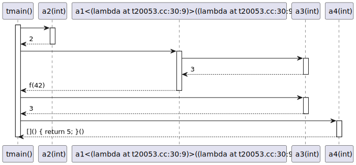
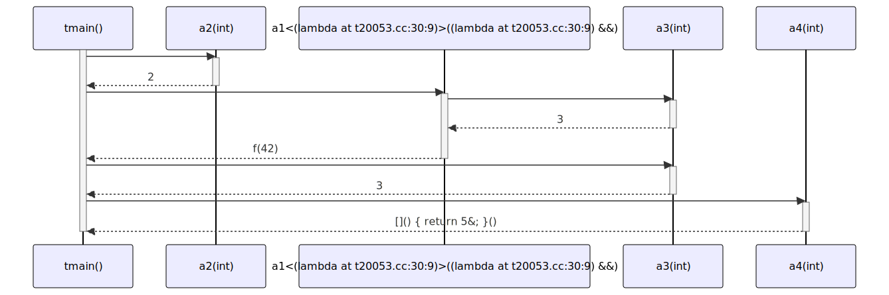

# t20053 - Test case for inlining nested lambda operator calls
## Config
```yaml
diagrams:
  t20053_sequence:
    type: sequence
    glob:
      - t20053.cc
    include:
      namespaces:
        - clanguml::t20053
    using_namespace: clanguml::t20053
    inline_lambda_messages: true
    from:
      - function: "clanguml::t20053::tmain()"
```
## Source code
File `tests/t20053/t20053.cc`
```cpp
namespace clanguml {
namespace t20053 {
template <typename F> int a1(F &&f) { return f(42); }

int a2(int x) { return 2; }

int a3(int x) { return 3; }

int tmain()
{
    // Call expression in a nested lambda
    auto v1 = [](auto &&arg1) {
        return [](auto &&arg2) { return a2(arg2); }(arg1);
    }(0);

    // Nested lambda call without any actual calls
    auto v2 = [](auto &&arg1) {
        return [](auto &&arg2) { return arg2 + 2; }(arg1);
    }(0);

    // Call expression in a nested lambda in call expression
    auto v4 = a1(
        [](auto &&arg1) { return [](auto &&arg2) { return a3(arg2); }(arg1); });

    return 0;
}
}
}
```
## Generated PlantUML diagrams

## Generated Mermaid diagrams

## Generated JSON models
```json
{
  "diagram_type": "sequence",
  "name": "t20053_sequence",
  "participants": [
    {
      "display_name": "tmain()",
      "full_name": "clanguml::t20053::tmain()",
      "id": "1989009774042525491",
      "name": "tmain",
      "namespace": "clanguml::t20053",
      "source_location": {
        "column": 5,
        "file": "t20053.cc",
        "line": 9,
        "translation_unit": "t20053.cc"
      },
      "type": "function"
    },
    {
      "display_name": "a2(int)",
      "full_name": "clanguml::t20053::a2(int)",
      "id": "670119640253232066",
      "name": "a2",
      "namespace": "clanguml::t20053",
      "source_location": {
        "column": 5,
        "file": "t20053.cc",
        "line": 5,
        "translation_unit": "t20053.cc"
      },
      "type": "function"
    },
    {
      "display_name": "a1<(lambda at t20053.cc:23:9)>((lambda at t20053.cc:23:9) &&)",
      "full_name": "clanguml::t20053::a1<(lambda at t20053.cc:23:9)>((lambda at /home/bartek/devel/clang-uml/tests/t20053/t20053.cc:23:9) &&)",
      "id": "967684327663938310",
      "name": "a1",
      "namespace": "clanguml::t20053",
      "source_location": {
        "column": 27,
        "file": "t20053.cc",
        "line": 3,
        "translation_unit": "t20053.cc"
      },
      "type": "function_template"
    },
    {
      "display_name": "a3(int)",
      "full_name": "clanguml::t20053::a3(int)",
      "id": "1586707721117132930",
      "name": "a3",
      "namespace": "clanguml::t20053",
      "source_location": {
        "column": 5,
        "file": "t20053.cc",
        "line": 7,
        "translation_unit": "t20053.cc"
      },
      "type": "function"
    }
  ],
  "sequences": [
    {
      "messages": [
        {
          "from": {
            "activity_id": "1989009774042525491",
            "participant_id": "1989009774042525491"
          },
          "name": "",
          "return_type": "int",
          "scope": "normal",
          "source_location": {
            "column": 41,
            "file": "t20053.cc",
            "line": 13,
            "translation_unit": "t20053.cc"
          },
          "to": {
            "activity_id": "670119640253232066",
            "participant_id": "670119640253232066"
          },
          "type": "message"
        },
        {
          "from": {
            "activity_id": "1989009774042525491",
            "participant_id": "1989009774042525491"
          },
          "name": "",
          "return_type": "",
          "scope": "normal",
          "source_location": {
            "column": 15,
            "file": "t20053.cc",
            "line": 22,
            "translation_unit": "t20053.cc"
          },
          "to": {
            "activity_id": "967684327663938310",
            "participant_id": "967684327663938310"
          },
          "type": "message"
        },
        {
          "from": {
            "activity_id": "967684327663938310",
            "participant_id": "967684327663938310"
          },
          "name": "",
          "return_type": "int",
          "scope": "normal",
          "source_location": {
            "column": 59,
            "file": "t20053.cc",
            "line": 23,
            "translation_unit": "t20053.cc"
          },
          "to": {
            "activity_id": "1586707721117132930",
            "participant_id": "1586707721117132930"
          },
          "type": "message"
        }
      ],
      "start_from": {
        "id": 1989009774042525491,
        "location": "clanguml::t20053::tmain()"
      }
    }
  ],
  "using_namespace": "clanguml::t20053"
}
```
