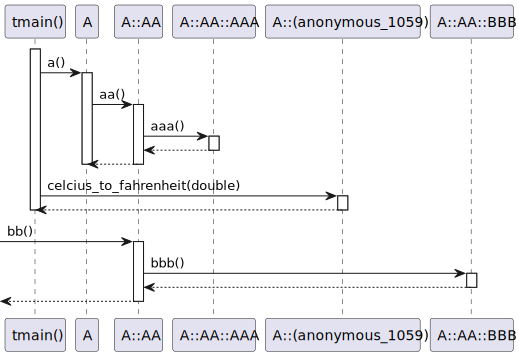
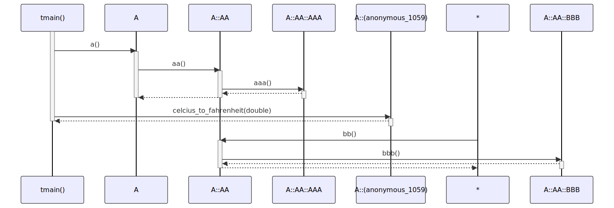

# t20054 - Test case for sequence diagram with nested classes
## Config
```yaml
diagrams:
  t20054_sequence:
    type: sequence
    glob:
      - t20054.cc
    include:
      namespaces:
        - clanguml::t20054
    using_namespace: clanguml::t20054
    from:
      - function: "clanguml::t20054::tmain()"
      - function: "clanguml::t20054::A::AA::bb()"
```
## Source code
File `tests/t20054/t20054.cc`
```cpp
namespace clanguml {
namespace t20054 {

struct A {
    struct AA {
        struct AAA {
            int aaa() { return 3; }
        };

        struct BBB {
            int bbb() { return 4; }
        };

        int aa() { return aaa.aaa(); }

        int bb() { return bbb.bbb(); }

        AAA aaa;
        BBB bbb;
    };

    struct {
        double c{1.0};
        double h{1.0};

        double celcius_to_fahrenheit(double cel) { return (9 * cel) / 5 + 32; }

    } units;

    void a() { aa.aa(); }

    AA aa;
};

void tmain()
{
    A a;

    a.a();
    a.units.celcius_to_fahrenheit(100);
}

} // namespace t20054
} // namespace clanguml
```
## Generated PlantUML diagrams

## Generated Mermaid diagrams

## Generated JSON models
```json
{
  "diagram_type": "sequence",
  "name": "t20054_sequence",
  "participants": [
    {
      "display_name": "tmain()",
      "full_name": "clanguml::t20054::tmain()",
      "id": "10803568768958466513",
      "name": "tmain",
      "namespace": "clanguml::t20054",
      "source_location": {
        "column": 6,
        "file": "t20054.cc",
        "line": 35,
        "translation_unit": "t20054.cc"
      },
      "type": "function"
    },
    {
      "activities": [
        {
          "display_name": "a()",
          "full_name": "clanguml::t20054::A::a()",
          "id": "1698987340403449834",
          "name": "a",
          "namespace": "clanguml::t20054",
          "source_location": {
            "column": 10,
            "file": "t20054.cc",
            "line": 30,
            "translation_unit": "t20054.cc"
          },
          "type": "method"
        }
      ],
      "display_name": "A",
      "full_name": "clanguml::t20054::A",
      "id": "10637501985902225285",
      "name": "A",
      "namespace": "clanguml::t20054",
      "source_location": {
        "column": 8,
        "file": "t20054.cc",
        "line": 4,
        "translation_unit": "t20054.cc"
      },
      "type": "class"
    },
    {
      "activities": [
        {
          "display_name": "aa()",
          "full_name": "clanguml::t20054::A::AA::aa()",
          "id": "2773833107878981483",
          "name": "aa",
          "namespace": "clanguml::t20054::A",
          "source_location": {
            "column": 13,
            "file": "t20054.cc",
            "line": 14,
            "translation_unit": "t20054.cc"
          },
          "type": "method"
        },
        {
          "display_name": "bb()",
          "full_name": "clanguml::t20054::A::AA::bb()",
          "id": "11517263835285279",
          "name": "bb",
          "namespace": "clanguml::t20054::A",
          "source_location": {
            "column": 13,
            "file": "t20054.cc",
            "line": 16,
            "translation_unit": "t20054.cc"
          },
          "type": "method"
        }
      ],
      "display_name": "A::AA",
      "full_name": "clanguml::t20054::A::AA",
      "id": "12335963931754675068",
      "name": "A::AA",
      "namespace": "clanguml::t20054",
      "source_location": {
        "column": 12,
        "file": "t20054.cc",
        "line": 5,
        "translation_unit": "t20054.cc"
      },
      "type": "class"
    },
    {
      "activities": [
        {
          "display_name": "aaa()",
          "full_name": "clanguml::t20054::A::AA::AAA::aaa()",
          "id": "18440523953211239190",
          "name": "aaa",
          "namespace": "clanguml::t20054::A::AA",
          "source_location": {
            "column": 17,
            "file": "t20054.cc",
            "line": 7,
            "translation_unit": "t20054.cc"
          },
          "type": "method"
        }
      ],
      "display_name": "A::AA::AAA",
      "full_name": "clanguml::t20054::A::AA::AAA",
      "id": "3657855768627469326",
      "name": "A::AA::AAA",
      "namespace": "clanguml::t20054",
      "source_location": {
        "column": 16,
        "file": "t20054.cc",
        "line": 6,
        "translation_unit": "t20054.cc"
      },
      "type": "class"
    },
    {
      "activities": [
        {
          "display_name": "celcius_to_fahrenheit(double)",
          "full_name": "clanguml::t20054::A::(anonymous_1047)::celcius_to_fahrenheit(double)",
          "id": "6722035453884988272",
          "name": "celcius_to_fahrenheit",
          "namespace": "clanguml::t20054::A",
          "source_location": {
            "column": 16,
            "file": "t20054.cc",
            "line": 26,
            "translation_unit": "t20054.cc"
          },
          "type": "method"
        }
      ],
      "display_name": "A::(anonymous_1047)",
      "full_name": "clanguml::t20054::A::(anonymous_1047)",
      "id": "2069963993878881292",
      "name": "A::(anonymous_1047)",
      "namespace": "clanguml::t20054",
      "source_location": {
        "column": 5,
        "file": "t20054.cc",
        "line": 22,
        "translation_unit": "t20054.cc"
      },
      "type": "class"
    },
    {
      "activities": [
        {
          "display_name": "bbb()",
          "full_name": "clanguml::t20054::A::AA::BBB::bbb()",
          "id": "14647351109927833443",
          "name": "bbb",
          "namespace": "clanguml::t20054::A::AA",
          "source_location": {
            "column": 17,
            "file": "t20054.cc",
            "line": 11,
            "translation_unit": "t20054.cc"
          },
          "type": "method"
        }
      ],
      "display_name": "A::AA::BBB",
      "full_name": "clanguml::t20054::A::AA::BBB",
      "id": "14233611940581501088",
      "name": "A::AA::BBB",
      "namespace": "clanguml::t20054",
      "source_location": {
        "column": 16,
        "file": "t20054.cc",
        "line": 10,
        "translation_unit": "t20054.cc"
      },
      "type": "class"
    }
  ],
  "sequences": [
    {
      "from": {
        "id": "10803568768958466513",
        "location": "clanguml::t20054::tmain()"
      },
      "messages": [
        {
          "from": {
            "activity_id": "10803568768958466513",
            "participant_id": "10803568768958466513"
          },
          "name": "a()",
          "return_type": "void",
          "scope": "normal",
          "source_location": {
            "column": 5,
            "file": "t20054.cc",
            "line": 39,
            "translation_unit": "t20054.cc"
          },
          "to": {
            "activity_id": "1698987340403449834",
            "participant_id": "10637501985902225285"
          },
          "type": "message"
        },
        {
          "from": {
            "activity_id": "1698987340403449834",
            "participant_id": "10637501985902225285"
          },
          "name": "aa()",
          "return_type": "int",
          "scope": "normal",
          "source_location": {
            "column": 16,
            "file": "t20054.cc",
            "line": 30,
            "translation_unit": "t20054.cc"
          },
          "to": {
            "activity_id": "2773833107878981483",
            "participant_id": "12335963931754675068"
          },
          "type": "message"
        },
        {
          "from": {
            "activity_id": "2773833107878981483",
            "participant_id": "12335963931754675068"
          },
          "name": "aaa()",
          "return_type": "int",
          "scope": "normal",
          "source_location": {
            "column": 27,
            "file": "t20054.cc",
            "line": 14,
            "translation_unit": "t20054.cc"
          },
          "to": {
            "activity_id": "18440523953211239190",
            "participant_id": "3657855768627469326"
          },
          "type": "message"
        },
        {
          "from": {
            "activity_id": "18440523953211239190",
            "participant_id": "3657855768627469326"
          },
          "name": "",
          "return_type": "int",
          "scope": "normal",
          "source_location": {
            "column": 25,
            "file": "t20054.cc",
            "line": 7,
            "translation_unit": "t20054.cc"
          },
          "to": {
            "activity_id": "2773833107878981483",
            "participant_id": "12335963931754675068"
          },
          "type": "return"
        },
        {
          "from": {
            "activity_id": "2773833107878981483",
            "participant_id": "12335963931754675068"
          },
          "name": "",
          "return_type": "int",
          "scope": "normal",
          "source_location": {
            "column": 20,
            "file": "t20054.cc",
            "line": 14,
            "translation_unit": "t20054.cc"
          },
          "to": {
            "activity_id": "1698987340403449834",
            "participant_id": "10637501985902225285"
          },
          "type": "return"
        },
        {
          "from": {
            "activity_id": "10803568768958466513",
            "participant_id": "10803568768958466513"
          },
          "name": "celcius_to_fahrenheit(double)",
          "return_type": "double",
          "scope": "normal",
          "source_location": {
            "column": 5,
            "file": "t20054.cc",
            "line": 40,
            "translation_unit": "t20054.cc"
          },
          "to": {
            "activity_id": "6722035453884988272",
            "participant_id": "2069963993878881292"
          },
          "type": "message"
        },
        {
          "from": {
            "activity_id": "6722035453884988272",
            "participant_id": "2069963993878881292"
          },
          "name": "",
          "return_type": "double",
          "scope": "normal",
          "source_location": {
            "column": 52,
            "file": "t20054.cc",
            "line": 26,
            "translation_unit": "t20054.cc"
          },
          "to": {
            "activity_id": "10803568768958466513",
            "participant_id": "10803568768958466513"
          },
          "type": "return"
        }
      ]
    },
    {
      "from": {
        "id": "11517263835285279",
        "location": "clanguml::t20054::A::AA::bb()"
      },
      "messages": [
        {
          "from": {
            "activity_id": "11517263835285279",
            "participant_id": "12335963931754675068"
          },
          "name": "bbb()",
          "return_type": "int",
          "scope": "normal",
          "source_location": {
            "column": 27,
            "file": "t20054.cc",
            "line": 16,
            "translation_unit": "t20054.cc"
          },
          "to": {
            "activity_id": "14647351109927833443",
            "participant_id": "14233611940581501088"
          },
          "type": "message"
        },
        {
          "from": {
            "activity_id": "14647351109927833443",
            "participant_id": "14233611940581501088"
          },
          "name": "",
          "return_type": "int",
          "scope": "normal",
          "source_location": {
            "column": 25,
            "file": "t20054.cc",
            "line": 11,
            "translation_unit": "t20054.cc"
          },
          "to": {
            "activity_id": "11517263835285279",
            "participant_id": "12335963931754675068"
          },
          "type": "return"
        }
      ],
      "return_type": "int"
    }
  ],
  "using_namespace": "clanguml::t20054"
}
```
## Generated GraphML models
